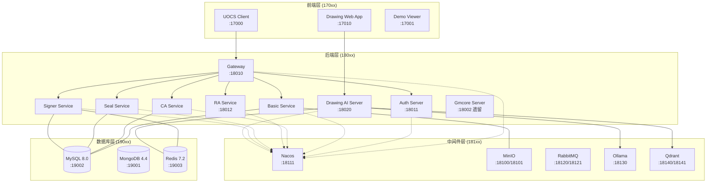

# Docker 部署架构

> 面向开发者的部署教学。读完本文你将理解：服务怎么编排的、端口为什么这样分配、如何在本地启动开发环境。

## 为什么用 Docker Compose？

UOCS 有 20+ 个服务（前端、后端、中间件、数据库），如果手动安装配置每个服务，新人入职可能要花一周搭环境。Docker Compose 的价值：

1. **一条命令启动全部** — `docker compose up -d`
2. **环境一致性** — 开发机和测试服务器用同一套配置
3. **依赖隔离** — MySQL、Redis、Nacos 等中间件不用污染宿主机

## 服务拓扑



## 端口分配设计

端口不是随便选的。团队约定了一个分类规则，看到端口号就知道是什么类型的：

```
170xx → 前端服务    — 用户浏览器直接访问
180xx → 后端服务    — API 请求、Gateway 路由
181xx → 中间件服务  — 配置中心、对象存储、消息队列
190xx → 数据库服务  — 持久化存储
```

### 为什么不直接用原始端口？

容器内部端口是固定的（比如 MySQL 永远是 3306），但宿主机端口会按约定映射：

| 容器内 | 宿主机 | 映射关系 |
|--------|--------|----------|
| MySQL 3306 | 19002 | `190xx` = 数据库 |
| Redis 6379 | 19003 | `190xx` = 数据库 |
| Nacos 8848 | 18111 | `181xx` = 中间件 |
| Gateway 8201 | 18010 | `180xx` = 后端 |

### 容器间通信

容器之间用**容器名:内部端口**通信，不走宿主机端口：

```yaml
# 例如 Basic Service 连接 MySQL，用容器名
spring:
  datasource:
    url: jdbc:mysql://mysql:3306/uocs-basic
```

这比 `localhost:19002` 更快也更可靠——流量不经过宿主机网络栈。

### 新增服务时怎么分配端口？

1. 确定服务类别（前端/后端/中间件/数据库）
2. 在对应范围找下一个未使用的端口
3. 在 `compose.yaml` 中添加映射

## 完整端口清单

### 前端 (170xx)

| 容器 | 宿主机端口 | 说明 |
|------|-----------|------|
| uocs-client | 17000 | UOCS 主前端 |
| uocs-demo-viewer | 17001 | 文档预览演示 |
| drawing-web-app | 17010 | Web CAD + AI 审图前端 |

### 后端 (180xx)

| 容器 | 宿主机端口 | 容器端口 | 说明 |
|------|-----------|---------|------|
| server-gateway | 18010 | 8201 | API 网关 |
| server-auth | 18011 | 8209 | OAuth2 授权 |
| server-ra | 18012 | 8207 | RA 证书代理 |
| drawing-ai-server | 18020 | 3001 | AI 审图后端 |

### 中间件 (181xx)

| 容器 | 宿主机端口 | 说明 |
|------|-----------|------|
| minio | 18100/18101 | S3 API / 管理控制台 |
| nacos | 18111/18110 | 配置+注册中心 |
| rabbit-mq | 18120/18121 | AMQP / 管理控制台 |
| ollama | 18130 | Embedding 模型 |
| qdrant | 18140/18141 | 向量数据库 |

### 数据库 (190xx)

| 容器 | 宿主机端口 | 说明 |
|------|-----------|------|
| mongo | 19001 | MongoDB 4.4 |
| mysql | 19002 | MySQL 8.0 |
| redis | 19003 | Redis 7.2 |

## 本地开发部署

### 前提条件

- Docker Desktop（或 Docker Engine）已安装并运行
- `upda-code/docker-compose/uocs-app/` 目录存在
- `compose.yaml` 中的镜像已构建或可拉取

### 启动服务

```bash
# 进入部署目录
cd E:\OpenCloud24.10\upda-code\docker-compose\uocs-app

# 启动所有服务（后台运行）
docker compose up -d

# 查看运行状态
docker compose ps

# 查看某个服务的日志
docker compose logs -f drawing-ai-server
```

### 只启动部分服务

测试服务器当前只启动了 **infra + drawing-cad** 模块（10 个容器）。本地开发时也可以这样做：

```bash
# 只启动基础设施（数据库 + 中间件）
docker compose up -d uocs-mysql uocs-redis uocs-mongo uocs-nacos uocs-minio

# 再加上 AI 审图
docker compose up -d uocs-ollama uocs-qdrant drawing-ai-server drawing-web-app
```

后端微服务通常在 IDE 中本地运行（方便调试），不通过 Docker 启动。

### 配置管理

本地开发时，微服务通过 Nacos 获取配置。Nacos 的地址配置在 `application.yml` 中：

```yaml
# 本地 application.yml 只保留连接信息
spring:
  cloud:
    nacos:
      server-addr: localhost:18111
```

业务配置（数据库连接、第三方 API key 等）都在 Nacos 中管理，不在本地 `application.yml` 里。

## 已知的坑

| 问题 | 原因 | 解决方案 |
|------|------|---------|
| AI Server 启动失败 | Spring AI 要求 API key 非空 | `.env` 设 `DRAWING_AI_API_KEY=sk-placeholder-for-startup` |
| AI Server 启动慢 | 冷启动需 2-3 分钟 | `start_period: 180s`，耐心等待 |
| Nginx 返回 octet-stream | 自定义 `types {}` 覆盖了默认 MIME | 删除自定义 types 块 |
| .env CRLF 行尾 | Windows SVN checkout 保留 CRLF | 服务器端用 SFTP 二进制修改 |

## 测试服务器同步

本地修改 Docker 配置后，通过 SVN 同步到测试服务器（192.168.3.228）：


**重要**：AI 协作保护规则禁止未经用户明确指令就更新测试服务器。详见 [[运维规范]] 中的 "AI 协作保护规则"。

## 下一步

- 查看完整端口清单：[[服务端口清单]]
- 了解运维规则和配置管理：[[运维规范]]
- 测试服务器操作细节：[[测试服务器]]
