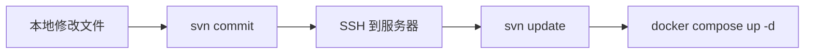

# 测试服务器

## 基本信息

| 项目 | 值 |
|------|-----|
| **IP** | 192.168.3.228 |
| **用户名** | root |
| **密码** | Upda123! |
| **主机名** | upda-A520M-DS3H |
| **系统** | Ubuntu Linux 6.17.0（x86_64） |
| **内存** | 30GB |
| **磁盘** | 457GB（/ 分区） |

## SSH 连接方式

使用专用部署密钥（ed25519，无密码）免密 SSH：

```bash
# 单条命令
ssh -i ~/.ssh/id_ed25519_uocs_deploy -o StrictHostKeyChecking=no root@192.168.3.228 'command'

# 多条命令（引号内用分号或 && 连接）
ssh -i ~/.ssh/id_ed25519_uocs_deploy -o StrictHostKeyChecking=no root@192.168.3.228 'svn update --username root --password Upda123! && docker compose up -d --build'
```

> **密钥位置**：`~/.ssh/id_ed25519_uocs_deploy`（本地开发机），`~/.ssh/authorized_keys`（服务器端）

> **注意**：执行 `docker compose up` 等耗时操作时必须用 `nohup ... &` 放入后台，避免 SSH 超时中断。

<details>
<summary>备选方案：Python paramiko（适合需要密码认证的复杂交互场景）</summary>

```python
import paramiko
c = paramiko.SSHClient()
c.set_missing_host_key_policy(paramiko.AutoAddPolicy())
c.connect('192.168.3.228', username='root', password='Upda123!', timeout=10)
stdin, stdout, stderr = c.exec_command('your command here')
print(stdout.read().decode())
c.close()
```

</details>

## SVN 服务

`docker-compose/uocs-app/` 通过 SVN 在本地开发机与测试服务器之间同步。

| 项目 | 值 |
|------|-----|
| **SVN 服务端** | svnserve 1.14.5，运行在测试服务器 |
| **裸仓库路径** | `/root/svn-uocs`（服务器本地） |
| **SVN 协议端口** | 3690 |
| **SVN URL（内网）** | `svn://192.168.3.228/<仓库>`（3690） |
| **SVN URL（公网）** | `svn://106.14.254.175:19999/<仓库>`（frp 内网穿透，明文，仅用于测试图纸等非涉密场景） |
| **SVN URL（服务器本地）** | `svn://localhost/<仓库>` |
| **认证** | `--username root --password Upda123!`（与 SSH 相同） |
| **用户列表** | root、luguosong、zhoufengsheng、guanyu、xuaidong、quzhen、liushuai、yangzhengliang、dongdelin（均属 admins 组，rw 权限，所有仓库共享） |
| **svnserve 仓库根** | `/root/`（systemd 启动参数 `-r /root`，新增仓库放此目录即自动生效） |

### 现有仓库

| 仓库名 | 裸仓库路径 | 访问 URL | 用途 |
|--------|-----------|----------|------|
| svn-uocs | `/root/svn-uocs` | `svn://192.168.3.228/svn-uocs/trunk/uocs-app` | UOCS 部署配置（docker-compose） |
| test-drawings | `/root/test-drawings` | `svn://192.168.3.228/test-drawings` | 测试图纸样本（CAD/PDF/OFD） |
| **Web 管理界面** | `http://192.168.3.228:18150`（SVNAdmin2，默认账号 admin/admin） |

SVNAdmin2 作为独立 Docker 容器运行（不在 compose.yaml 中），用于 Web 管理 SVN 用户、分组、权限。登录时角色选择"管理人员"，验证码已关闭。

| **SVN 历史查看器** | `http://192.168.3.228:18153/scm/`（SCM-Manager 3.11.8，现代 Web UI） |

SCM-Manager 作为独立 Docker 容器运行（不在 compose.yaml 中），替代 ViewVC，提供现代化 SVN 仓库浏览界面。支持代码语法高亮、side-by-side diff、blame、全文搜索、提交历史时间线等功能。

### 公网访问（frp 内网穿透）

通过 `/root/frp_0.68.1_linux_amd64/frpc.toml` 暴露到公网（frps 服务器 `106.14.254.175`）。

**优先使用内网 IP**：公司内网直接用 `192.168.3.228` 访问（低延迟）；外网通过 FRP 公网地址 `106.14.254.175` + 对应端口访问。

| 项目 | 值 |
|------|-----|
| frpc 服务 | `systemctl status frpc`（systemd，自启） |
| 配置文件 | `/root/frp_0.68.1_linux_amd64/frpc.toml` |
| frps 服务器 | `106.14.254.175:7000`，token 见服务器配置文件 |
| 公网端口范围 | 17000–19999 |

**当前穿透规则**：

| proxy 名称 | 本地端口 | 公网端口 | 用途 |
|-----------|---------|---------|------|
| `ssh-228` | `127.0.0.1:22` | `106.14.254.175:17022` | SSH 远程管理 |
| `mysql-228` | `127.0.0.1:19002` | `106.14.254.175:19002` | MySQL 数据库 |
| `redis-228` | `127.0.0.1:19003` | `106.14.254.175:19003` | Redis 缓存 |
| `web-cad-228` | `127.0.0.1:17010` | `106.14.254.175:17010` | Web CAD 前端 |
| `svn-228` | `127.0.0.1:3690` | `106.14.254.175:19999` | SVN（明文，仅非涉密场景） |
| `drawing-ai-228` | `127.0.0.1:18020` | `106.14.254.175:18020` | Drawing AI 审图后端 |

**访问方式对照**：

| 服务 | 内网（公司） | 外网（FRP） |
|------|------------|------------|
| SSH | `ssh root@192.168.3.228` | `ssh -p 17022 root@106.14.254.175` |
| MySQL | `192.168.3.228:19002` | `106.14.254.175:19002` |
| Redis | `192.168.3.228:19003` | `106.14.254.175:19003` |
| SVN | `svn://192.168.3.228/<repo>` | `svn://106.14.254.175:19999/<repo>` |
| Web CAD | `http://192.168.3.228:17010` | `http://106.14.254.175:17010` |
| AI Server | `http://192.168.3.228:18020` | `http://106.14.254.175:18020` |

> ⚠️ svn:// 为明文协议，仅用于测试图纸等非涉密场景。MySQL/Redis 暴露公网需确保强密码。修改 frpc.toml 后执行 `systemctl restart frpc` 生效。

- **管理员账号**：admin/Upda123!
- **匿名访问**：已开启只读匿名访问，浏览仓库无需登录
- **语言**：英文界面（SCM-Manager 仅内置 en/de/es，无中文翻译包）

> 旧方案 ViewVC（18152 端口）已停用。

```bash
# SVNAdmin2 容器管理（独立于 compose，手动管理）
docker run -d --name svnadmin2 --restart unless-stopped \
  -p 18150:80 -p 18151:3690 --privileged \
  -v /root:/home/svnadmin/svnrepos \
  witersencom/svnadmin:2.5.10
```

```bash
# SCM-Manager 容器管理（独立于 compose，手动管理）
docker run -d --name scm-manager --restart unless-stopped \
  -p 18153:8080 \
  -v /root/scm-manager-data:/var/lib/scm \
  -v /root:/svn-repos:ro \
  -e TZ=Asia/Shanghai \
  scmmanager/scm-manager:latest
```

**SVNAdmin2 重建容器后必须执行的恢复步骤**（容器无持久化卷，重建后内部数据会丢失）：

```bash
# 创建软链接让 SVNAdmin2 识别仓库（每个仓库一条，新增仓库后要补一条）
docker exec svnadmin2 ln -sf /home/svnadmin/svnrepos/svn-uocs /home/svnadmin/rep/svn-uocs
docker exec svnadmin2 ln -sf /home/svnadmin/svnrepos/test-drawings /home/svnadmin/rep/test-drawings

# 同步 passwd 和 authz（从仓库 conf/ 复制到 SVNAdmin2 全局配置）
docker cp /root/svn-uocs/conf/passwd svnadmin2:/home/svnadmin/passwd
# authz 需要包含 [svn-uocs:/] section，通过 stdin 写入：
docker exec -i svnadmin2 tee /home/svnadmin/authz <<'EOF'
[aliases]

[groups]
admins = root, luguosong, zhoufengsheng

[/]
@admins = rw

[svn-uocs:/]
@admins = rw

[test-drawings:/]
@admins = rw
EOF
docker exec svnadmin2 chown apache:apache /home/svnadmin/passwd /home/svnadmin/authz

# 关闭验证码（通过 sqlite3 修改 options 表）
docker exec -i svnadmin2 sqlite3 /home/svnadmin/svnadmin.db <<'SQL'
UPDATE options SET option_value='a:1:{i:0;a:3:{s:4:"name";s:17:"login_verify_code";s:4:"note";s:15:"登录验证码";s:6:"enable";b:0;}}' WHERE option_name='safe_config';
SQL

# Web UI 登录后点击"同步仓库列表"和"同步列表"按钮
```

**本地工作副本**：

```
E:\OpenCloud24.10\upda-code\docker-compose\uocs-app\    ← SVN 工作副本
├── .svn/                                               ← SVN 元数据
├── compose.yaml                                        ← 主入口
└── ...
```

**服务器工作副本**：`/root/uocs-deploy/uocs-app/`

## 同步工作流

本地修改 Docker 配置后，通过以下流程同步到测试服务器：



**操作命令**：

```bash
# 本地：提交修改
cd E:\OpenCloud24.10\upda-code\docker-compose\uocs-app
svn commit -m "描述" --username root --password Upda123!

# 服务器：更新并重启（通过 paramiko SSH）
cd /root/uocs-deploy/uocs-app
svn update --username root --password Upda123!
docker compose up -d --build
```

> **⚠️ .env 注意事项**：`.env` 纳入 SVN 版本控制。服务器端 `.env` 中 `DRAWING_AI_API_KEY` 必须设为非空值（如 `sk-placeholder-for-startup`），否则 AI Server 启动失败。每次 `svn update` 后需检查此值是否被覆盖为空。

## 服务器部署目录

| 路径 | 说明 |
|------|------|
| `/root/uocs-deploy/uocs-app/` | 当前部署目录（SVN checkout） |
| `/root/svn-uocs/` | SVN 裸仓库（svnserve 服务数据） |
| `/root/scm-manager-data/` | SCM-Manager 持久化数据目录（uid 1000） |

## 当前部署状态

测试服务器当前仅启动 **infra + drawing-cad** 模块（10 个容器）：

| 容器名 | 宿主机端口 | 说明 |
|--------|-----------|------|
| uocs-mysql | 19002 | MySQL 8.0 |
| uocs-mongo | 19001 | MongoDB 4.4 |
| uocs-redis | 19003 | Redis 7.2 |
| uocs-nacos | 18110/18111 | Nacos 3.1 配置中心 |
| uocs-minio | 18100/18101 | MinIO 对象存储 |
| uocs-rabbit-mq | 18120/18121 | RabbitMQ |
| uocs-ollama | 18130 | Ollama Embedding（bge-m3） |
| uocs-qdrant | 18140/18141 | Qdrant 向量数据库 |
| drawing-ai-server | 18020 | Drawing AI 审图后端 |
| drawing-web-app | 17010 | Web CAD 前端 |

**DevOps 工具容器**（独立于 compose.yaml，手动管理）：

| 容器名 | 宿主机端口 | 说明 |
|--------|-----------|------|
| svnadmin2 | 18150/18151 | SVNAdmin2 SVN 管理界面 |
| scm-manager | 18153 | SCM-Manager SVN 仓库浏览 |

`compose.yaml` 中 upda-cloud、drawing-uocs、drawing-pdf、drawing-ofd 模块的 include 已注释。

## 已知部署注意事项

| 问题 | 原因 | 解决方案 |
|------|------|---------|
| Ollama 健康检查失败 | 容器内无 `curl` / `wget` | 健康检查用 `["CMD", "ollama", "list"]` |
| AI Server 启动失败（API key） | `OpenAiAudioSpeechAutoConfiguration` 强制要求非空 key | `.env` 设 `DRAWING_AI_API_KEY=sk-placeholder-for-startup` |
| AI Server 健康检查失败 | 无 Spring Boot Actuator 依赖，`/actuator/health` 返回 404 | 用 TCP 连通检查 `curl -s -o /dev/null http://localhost:3001/` |
| AI Server 启动超时 | Spring Boot + Spring AI 冷启动约 2-3 分钟 | `start_period: 180s` |
| Nginx 返回 `application/octet-stream` | `types {}` 块覆盖全局 MIME 类型 | 删除自定义 `types {}` 块，nginx 1.27 默认含 wasm |
| Chrome DevTools 无法导航页面 | COOP/COEP 头（WASM SharedArrayBuffer 需要） | 预期行为，用 `Invoke-WebRequest` 或直接浏览器验证 |
| `.env` 中 CRLF 行尾 | Windows SVN checkout 保留 CRLF | 服务器端 sed 替换需注意 `\r`，推荐 SFTP 二进制方式修改 |
| Docker pull 失败 403 | 旧 `daemon.json` registry-mirrors 已失效 | 已清空 mirrors，通过 Docker proxy（mihomo 7897）直连 Docker Hub |
