# DWG Skill 深度重构优化记录

> 记录时间：2026-04  
> 参考设计：Anthropic PDF Skill + Office Skills 设计哲学  
> 核心理念：**"DWG 是结构化数据库，让 AI 操作结构化数据"**

## 目录

- [一、原始架构 — 全流程图](#一原始架构--全流程图)
  - [1.1 完整链路时序图（优化前）](#11-dwg-文件打开到-agent-操作的完整链路优化前)
  - [1.2 原始工具体系](#12-原始工具体系)
  - [1.3 原始架构痛点分析](#13-原始架构痛点分析)
- [二、优化后架构 — 全流程图](#二优化后架构--全流程图)
  - [2.1 三层 Skill 架构总览](#21-三层-skill-架构总览)
  - [2.2 完整 Agent 执行流程时序图（优化后）](#22-优化后完整-agent-执行流程)
  - [2.3 优化后工具体系（6 模块 23 个工具）](#23-优化后工具体系6-模块-23-个工具)
  - [2.4 三路径执行模型](#24-三路径执行模型)
  - [2.5 修改操作的自动验证管线](#25-修改操作的自动验证管线)
- [三、优化报告（简略）](#三优化报告简略)
  - [3.1 架构对比一览](#31-架构对比一览)
  - [3.2-3.4 核心优化点 / 路径对比 / 量化指标](#32-核心优化点详述)
- [四、文件变更清单](#四文件变更清单)
- [五、Harness Engineering 深度重构（P0-P8）](#五harness-engineering-深度重构p0-p8)
  - [5.1-5.3 设计哲学 / 六大支柱 / 演进全景](#51-设计哲学)
  - [5.4 各 Phase 详细记录（P0-P8）](#54-各-phase-详细记录)
  - [5.5-5.8 Bug 修复 / E2E 验证 / 提交历史 / 量化对比](#55-bug-修复记录)
- [六、超大图纸性能调优（P9）](#六超大图纸性能调优p9)

---

## 原始架构 — 全流程图

### DWG 文件打开到 Agent 操作的完整链路（优化前）

> 基于 `server/index.js`、`server/tools/cadTools.js`、`server/tools/analysisTools.js`、`server/providers.js` 源码绘制。

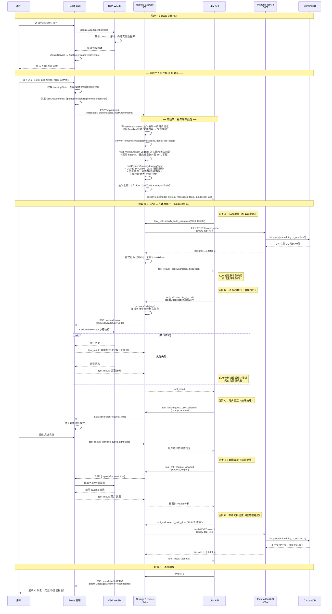

### 原始工具体系

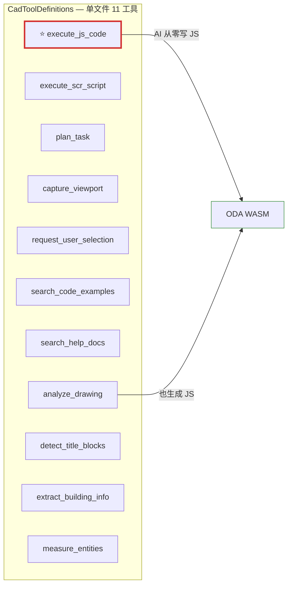

> **核心问题**：`execute_js_code` 承担 90% 任务，AI 每次从零编写 JS 代码操作 WASM API。

### 原始架构痛点分析

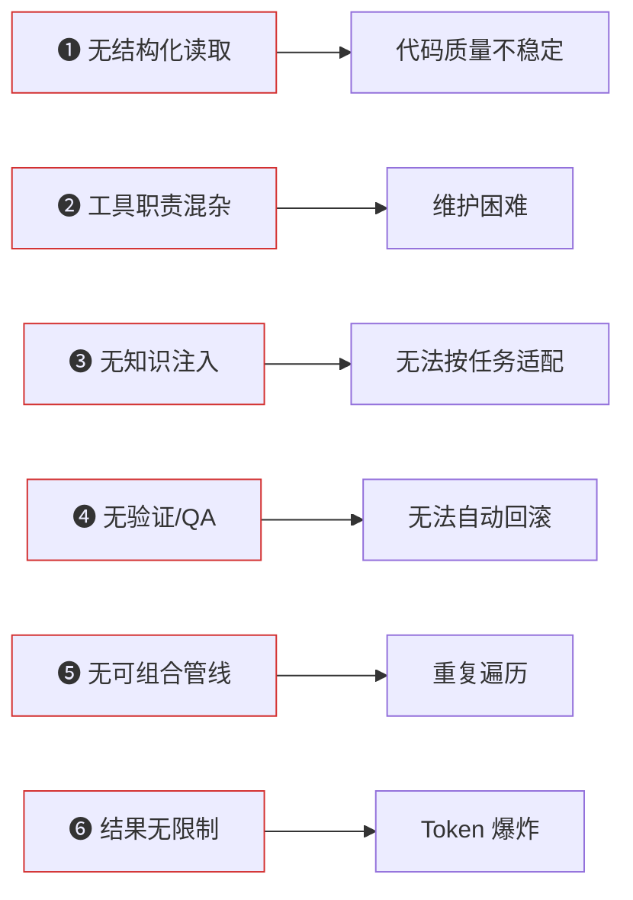

---

## 优化后架构 — 全流程图

### 三层 Skill 架构总览

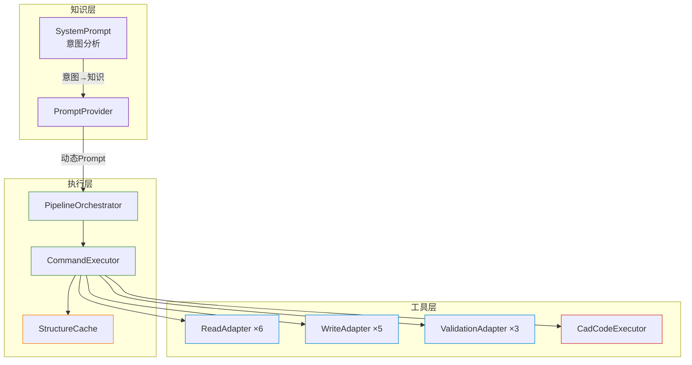

### 优化后完整 Agent 执行流程

> 基于 `ChatController` → `ChatService` → `PromptAssembler` → `ContextManager` → `QueryEngine` → `ToolOrchestrator` 源码绘制，涵盖 Harness Engineering 全部优化点（P0-P8）。

```mermaid
sequenceDiagram
    participant User as 用户
    participant UI as React 前端
    participant WASM as ODA WASM
    participant Server as Spring Boot<br/>ChatService :3001
    participant Engine as QueryEngine<br/>ToolOrchestrator
    participant LLM as LLM API
    participant RAG as Python FastAPI<br/>ChromaDB :3002

    %% ═══ 阶段一：DWG 文件打开（与优化前一致） ═══
    Note over User,RAG: ── 阶段一：DWG 文件打开 ──
    User->>UI: 选择/拖拽 DWG 文件
    UI->>WASM: Module.App.OpenFile(path)
    WASM-->>UI: 渲染完成回调
    UI-->>User: 显示 CAD 图纸画布

    %% ═══ 阶段二：用户发起 AI 对话 ═══
    Note over User,RAG: ── 阶段二：用户发起 AI 对话 ──
    User->>UI: 输入消息（可附带截图/选区/拾取点/文件）
    UI->>UI: 收集 drawingState + userAttachments
    UI->>Server: POST /api/ai/chat（WebFlux Reactive）<br/>{id, messages, drawingState, userAttachments, clientId, fileId}

    %% ═══ 阶段三：服务端 6 步预处理流水线 ═══
    Note over Server,LLM: ── 阶段三：服务端 6 步预处理 ──
    Server->>Server: ① 注入 userAttachments → 最后一条用户消息
    Server->>Server: ② 转换 UI Messages → Spring AI Messages<br/>（兼容 AI SDK v6 parts 格式）
    Server->>Server: ③ 提取用户意图（READ / WRITE / ANALYZE ...）
    Server->>Server: ④ SessionMemory.getOrCreate(sessionId)<br/>incrementTurn()，注入工具使用统计
    Server->>Server: ⑤ PromptAssembler.assemble()<br/>静态前缀（7 Section，跨会话缓存 ~8K tokens）<br/>Identity + CorePrinciples + ExecutionPaths<br/>ToolGuide + JsCodeGuide + Performance + OutputFormat<br/>动态后缀（每次重建 ~1-3K tokens）<br/>DrawingState + IntentKnowledge + SessionMemory
    Server->>Server: ⑥ ContextManager.manage()<br/>估算 tokens（content.length / 3）<br/>阈值：128K × 80% = 102K<br/>超限 → L1 旧 tool result 压缩为 200 字摘要<br/>→ L2 保留最近 4 轮 + 注入会话摘要<br/>→ L3 紧急：仅保留最近 1 轮

    %% ═══ 阶段四：QueryEngine ReAct 循环（maxSteps: 10） ═══
    Note over User,RAG: ── 阶段四：ReAct 工具调用循环（maxSteps: 10）──
    Server->>Engine: QueryEngine.execute(chatModel, messages,<br/>options{internalToolExecution=false}, maxSteps=10)
    Engine->>LLM: chatModel.stream(prompt)

    LLM-->>Engine: text-delta 流式输出
    Engine-->>UI: SSE text-delta（15s heartbeat 防超时）

    LLM-->>Engine: tool_call(s) 检测到
    Engine->>Engine: P0.4 流式预执行：<br/>readonly + concurrencySafe 服务端工具<br/>LLM 流输出期间异步提交线程池
    Engine->>Engine: ToolOrchestrator.partition()<br/>→ clientTools[] + serverTools[]

    %% --- 场景 A：RAG 检索（服务端完成，P0.4 可预执行） ---
    rect rgba(0,0,0,0)
    Note right of LLM: 场景 A：RAG 检索（服务端，P0.4 可预执行）
    LLM->>Engine: tool_call: search_code_examples("填充 Hatch")
    Engine->>RAG: WebClient POST /search_code<br/>{query, top_k: 3}（30s 超时）
    RAG-->>Engine: 3 个完整 JS 代码示例
    Engine->>Engine: 格式化为 markdown 代码块
    Engine-->>LLM: tool_result（P8: 失败自动重试 1 次）
    end

    %% --- 场景 B：声明式读取（新增，替代 JS 代码） ---
    rect rgba(0,0,0,0)
    Note right of LLM: 场景 B：声明式读取（新增）
    LLM->>Engine: tool_call: read_dwg_entities<br/>{type: "AcDbLine", layer: "WALL", limit: 50}
    Engine-->>UI: SSE: readRequest 标记
    UI->>WASM: DwgReadAdapter 结构化查询
    UI->>UI: LRU 缓存检查（命中直接返回）
    WASM-->>UI: 标准化 JSON 结果
    UI-->>Engine: tool_result
    Engine->>Engine: P0.8 compressToolResponse()<br/>> 4000 字符自动截断
    Engine-->>LLM: 压缩后结果
    end

    %% --- 场景 C：声明式修改 + 自动验证管线（新增） ---
    rect rgba(0,0,0,0)
    Note right of LLM: 场景 C：声明式修改 + 验证管线（新增）
    LLM->>Engine: tool_call: modify_entities<br/>{handles: [...], color: 1, targetLayer: "DIM"}
    Engine-->>UI: SSE: modifyRequest 标记
    UI->>WASM: captureState()（修改前快照）
    UI->>WASM: DwgWriteAdapter.modifyEntities()
    UI->>WASM: captureState()（修改后快照）
    UI->>UI: ValidationAdapter.compareStates()<br/>→ 差异报告 + canUndo
    UI-->>Engine: {success, diff, modifiedCount, canUndo}
    Engine-->>LLM: 差异报告
    LLM-->>Engine: 确认 或 tool_call: undo_last_operation
    end

    %% --- 场景 D：JS 代码执行（兼容旧模式） ---
    rect rgba(0,0,0,0)
    Note right of LLM: 场景 D：JS 代码执行（兼容旧模式）
    LLM->>Engine: tool_call: execute_js_code<br/>{code, description, isQuery}
    Engine-->>UI: SSE: cadCode / cadQueryCode 标记
    UI->>WASM: CadCodeExecutor 沙箱执行
    alt 成功
        WASM-->>UI: 执行结果
    else 失败
        WASM-->>UI: 错误信息
        Note right of Engine: P8 错误分类：<br/>RETRYABLE_PARAM → LLM 修正<br/>RETRYABLE_TRANSIENT → 自动重试<br/>NON_RETRYABLE → 终止
    end
    UI-->>Engine: tool_result
    end

    %% --- 场景 E：用户交互 ---
    rect rgba(0,0,0,0)
    Note right of LLM: 场景 E：用户交互（截图/选择）
    LLM->>Engine: tool_call: capture_viewport / request_user_selection
    Engine-->>UI: SSE: 交互标记
    UI->>User: 进入交互模式（截图/框选）
    User->>UI: 操作完成
    UI-->>Engine: 交互结果
    end

    %% --- 递归判断 ---
    Engine->>Engine: 递归判断：<br/>有 clientTools → STOP（等前端回调）<br/>全是标记 → STOP<br/>纯 serverTools → 压缩上下文 → 递归 streamStep()

    %% --- 场景 F：Multi-Agent 审图编排（P5/P7 新增） ---
    rect rgba(0,0,0,0)
    Note over Engine,LLM: 场景 F：Multi-Agent 审图（P5/P7 新增）
    LLM->>Engine: start_comprehensive_review<br/>{objectives, standards}
    Engine->>Engine: ReviewManager 初始化<br/>7 个审查维度
    loop 逐维度审查
        LLM->>Engine: read_dwg_* 读取图纸数据
        Engine-->>UI: 转发至 WASM
        UI-->>Engine: 结构化数据
        Engine-->>LLM: 数据
        LLM->>Engine: batch_record_findings（P7 批量）
    end
    LLM->>Engine: generate_review_report
    Engine-->>LLM: 完整审图报告
    end

    %% ═══ 阶段五：最终回复 ═══
    Note over User,RAG: ── 阶段五：最终回复 ──
    LLM->>Engine: 文字回复
    Engine-->>UI: SSE 流式推送（UI Message Stream v1）<br/>start → start-step → text-delta(s)<br/>→ finish-step → finish → [DONE]
    UI-->>User: 渲染 AI 回复 + 差异卡片 + Undo 按钮

    Note over Server,Engine: SessionMemory 更新：<br/>recordToolCall() × N<br/>addCompactionSummary()（如有压缩）
```

### 优化后工具体系（6 模块 23 个工具）

#### 🔵 read/ — DwgReadTools（5 个）

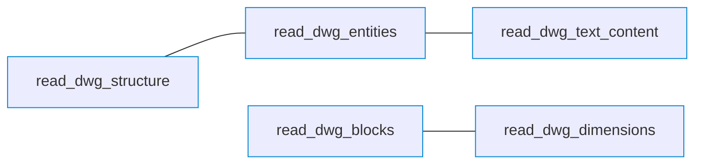

#### 🟢 write/ — DwgWriteTools（4 个）

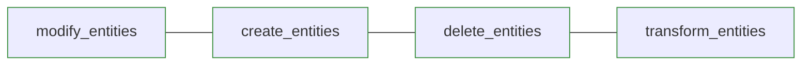

#### 🟠 pipeline/ — DwgPipelineTools（3 个）

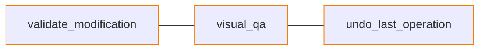

#### 🔴 execution/ — DwgExecutionTools（2 个）

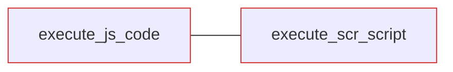

#### 🟣 analysis/ — DwgAnalysisTools（6 个）

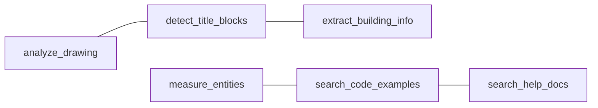

#### 🟣 interaction/ — DwgInteractionTools（3 个）

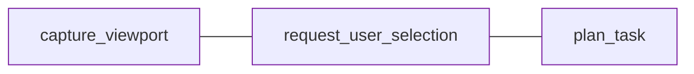

### 三路径执行模型

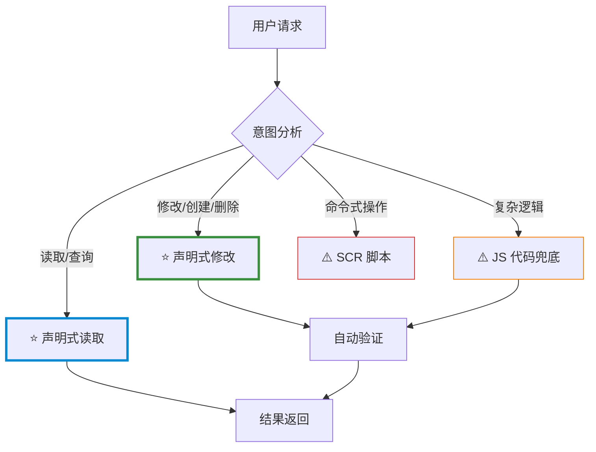

### 修改操作的自动验证管线

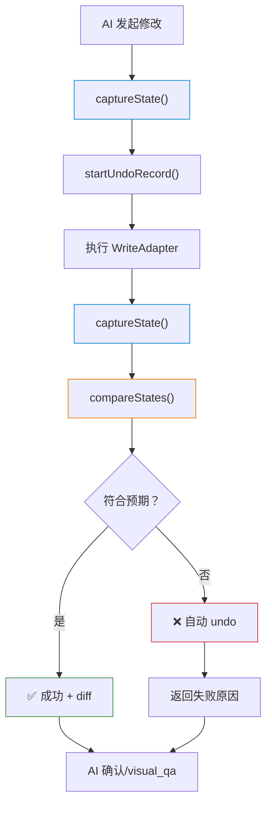

---

## 优化报告（简略）

### 架构对比一览

| 维度 | 优化前 | 优化后 | 改进说明 |
|------|--------|--------|---------|
| **读取方式** | AI 每次从零写 JS 遍历代码 | 6 个预构建 `DwgReadAdapter` 查询方法 | 消除代码质量波动，标准化输出格式 |
| **修改方式** | AI 写 JS 操作 WASM API | 声明式描述 `{ filter, patch }` + JS 兜底 | AI 只需描述"改什么"，不用写"怎么改" |
| **工具组织** | 单文件 `CadToolDefinitions` 11 个工具 | 6 个模块 23 个工具，职责明确 | 可维护性、可扩展性大幅提升 |
| **知识管理** | 硬编码 System Prompt | `DwgSkillPromptProvider` 按意图动态注入 | Token 开销降低，知识精准匹配 |
| **验证机制** | 无（只能手动截图） | `DwgValidationAdapter` 自动快照 + 差异对比 + 视觉 QA | 修改可验证、可回滚 |
| **错误恢复** | AI 手动重试，无回滚 | 自动 `undo()` + 重试机制 | 修改安全性大幅提升 |
| **结果格式** | 自由格式 JSON，无限制 | 标准化 Schema + 分页（MAX=200） + 自动截断（>4000 字符） | 防 Token 爆炸 |
| **缓存机制** | 无（重复遍历数据库） | `DwgStructureCache` LRU（max=20），写操作自动失效 | 同对话内重复查询零开销 |
| **意图分析** | 无 | `analyzeRequestIntent()` 关键词路由 | 按 READ/MODIFY/CREATE/DELETE/TRANSFORM 分流 |

### 核心优化点详述

#### ① 结构化读取替代原始代码（影响最大）

- **问题**：原始架构中 `execute_js_code` 承担 90% 任务，AI 每次需要从零编写 WASM 遍历代码，代码质量波动大、容易出错
- **方案**：新增 `DwgReadAdapter` 6 个预构建查询方法（`extractStructure` / `extractEntities` / `extractTextContent` / `extractBlockReferences` / `extractDimensions` / `spatialQuery`），内建内存管理和安全值提取
- **效果**：读取操作从"AI 写代码"变为"AI 声明意图"，结果格式标准化

#### ② 声明式修改替代命令式代码

- **问题**：修改实体需要 AI 编写完整的 WASM API 调用链（打开对象→修改属性→关闭对象），错误率高
- **方案**：新增 `DwgWriteAdapter` 支持 `{ filter: {layer:"0"}, patch: {color:[255,0,0]} }` 声明式描述
- **效果**：AI 只需描述操作意图，适配器自动翻译为 WASM API 调用序列

#### ③ 自动验证管线（全新）

- **问题**：修改操作无法验证，出错后无法回滚
- **方案**：`DwgValidationAdapter` 提供修改前快照 → 执行 → 修改后快照 → 差异对比 → 期望值校验的完整管线
- **效果**：每次修改自带结构化验证报告，异常时自动 undo 回滚

#### ④ 动态知识注入替代硬编码 Prompt

- **问题**：固定 System Prompt 不区分任务类型，Token 浪费严重
- **方案**：`SystemPromptService.analyzeRequestIntent()` 分析用户意图，`DwgSkillPromptProvider` 按场景注入对应知识片段
- **效果**：读取场景注入读取知识，修改场景注入修改流程 + QA 规则，减少无关 Token 消耗

#### ⑤ 工具模块化拆分

- **问题**：11 个工具挤在单个 `CadToolDefinitions.java`，职责不清
- **方案**：拆分为 6 个模块（`read/` `write/` `pipeline/` `execution/` `analysis/` `interaction/`），扩展到 23 个工具
- **效果**：每个模块职责单一，新增工具无需修改其他模块

#### ⑥ 结果压缩与缓存

- **问题**：大图纸返回全量数据导致 Token 爆炸；同对话内重复查询浪费 WASM 计算
- **方案**：
  - 适配器层限制返回数量（MAX_ENTITIES=200, MAX_TEXTS=300）
  - `ChatService.compressToolResponses()` 超 4000 字符自动截断
  - `DwgStructureCache` LRU 缓存（max=20），写操作自动失效
- **效果**：防止上下文溢出，同查询零开销复用

### 执行路径优化对比

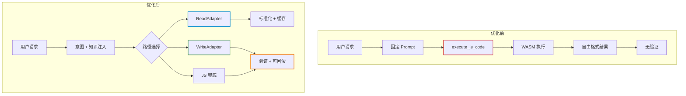

### 量化指标

| 指标 | 优化前 | 优化后 | 变化 |
|------|--------|--------|------|
| 工具数量 | 11 | 23 | +109% |
| 工具模块数 | 1 | 6 | +500% |
| 前端适配器 | 0 | 4（Read/Write/Validation/Pipeline） | 全新 |
| 预构建查询方法 | 0 | 6 | 全新 |
| 声明式修改方法 | 0 | 5 | 全新 |
| 验证/QA 方法 | 0 | 3 | 全新 |
| 缓存机制 | 无 | LRU max=20 | 全新 |
| 结果限制 | 无限制 | MAX=200 实体 + 4000 字符截断 | 防 Token 爆炸 |
| 知识注入维度 | 1（固定 Prompt） | 6（READ/MODIFY/CREATE/DELETE/TRANSFORM/MIXED） | +500% |
| 自动回滚 | 不支持 | 支持（undo + 验证） | 全新 |

---

## 文件变更清单

### 前端新增（drawing-web-app/src/services/）

| 文件 | 职责 | 核心方法数 |
|------|------|-----------|
| `DwgReadAdapter.js` | 结构化读取适配器 | 6 |
| `DwgWriteAdapter.js` | 声明式修改适配器 | 5 |
| `DwgValidationAdapter.js` | 修改验证（快照/差异/校验） | 3 |
| `DwgPipelineOrchestrator.js` | 管线编排 | 2 |

### 前端修改

| 文件 | 变更内容 |
|------|---------|
| `CommandExecutor.js` | 新增 7 类标记分发逻辑（readRequest/modifyRequest/createRequest/deleteRequest/transformRequest/validateRequest/undoRequest） |

### 后端新增（drawing-ai-server/src/.../tool/）

| 文件 | 模块 | 工具数 |
|------|------|--------|
| `read/DwgReadTools.java` | 读取 | 5 |
| `write/DwgWriteTools.java` | 修改 | 4 |
| `pipeline/DwgPipelineTools.java` | 管线 | 3 |
| `execution/DwgExecutionTools.java` | 执行 | 2 |
| `analysis/DwgAnalysisTools.java` | 分析 | 6 |
| `interaction/DwgInteractionTools.java` | 交互 | 3 |

### 后端新增（服务层）

| 文件 | 职责 |
|------|------|
| `DwgSkillPromptProvider.java` | 多场景知识片段管理 |
| `SystemPromptService.java` | 意图分析 + 动态 Prompt 构建 |

### 后端新增（知识库资源）

| 文件 | 内容 |
|------|------|
| `skill-knowledge/dwg-read-patterns.md` | 读取操作模式知识库 |
| `skill-knowledge/dwg-write-patterns.md` | 修改操作模式知识库 |

---

## Harness Engineering 深度重构（P0-P8）

> 记录时间：2026-04  
> 参考设计：**Claude Code 的 Harness Engineering 架构** — Mitchell Hashimoto 分析文章  
> 核心理念：**"模型是商品，Harness 才是护城河"**

### 设计哲学

> "评估一个 AI Agent = 评估模型 + Harness。LLM API 调用是最小的盒子。围绕它的一切——缓存、Memory、安全、成本控制、工具编排——才是真正的产品。"

基于对 Claude Code 源码架构的深度分析，识别出 6 大 Harness 支柱，并逐一对照 DWG 审图 Agent 的差距，进行了 9 阶段（P0-P8）系统性重构。

### Harness 六大支柱对照

| 支柱 | Claude Code 实现 | DWG Agent 重构前 | 重构后 |
|------|----------------|----------------|--------|
| **统一执行内核** | `query()` AsyncGenerator | ChatService 递归 ReAct | QueryEngine 统一入口 |
| **Tool 生命周期** | 15 字段 ToolDef + 8 步管线 | @Tool 扁平注解 | ToolProtocol + ToolOrchestrator |
| **Prompt Cache** | 14 种失效向量 + Sticky Latch | 无缓存意识 | 静态/动态分离 + PromptAssembler |
| **Context 压缩** | 4 级压缩 + 状态复灌 | 4000 字符截断 | ContextManager + AutoCompact + 复灌 |
| **Memory** | MEMORY.md 索引 + 按需加载 | 无 Memory | SessionMemory + 持久化 |
| **安全主干化** | Tool 内建 checkPermissions | 无安全声明 | ToolProtocol 安全属性 |

### 架构演进全景

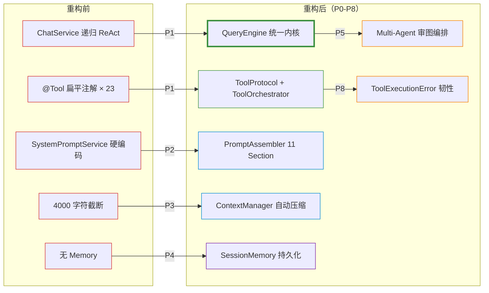

### 各 Phase 详细记录

#### Phase 0：端到端速度优化

**目标**：消除 6 大性能瓶颈，将典型操作耗时降低 50%+。

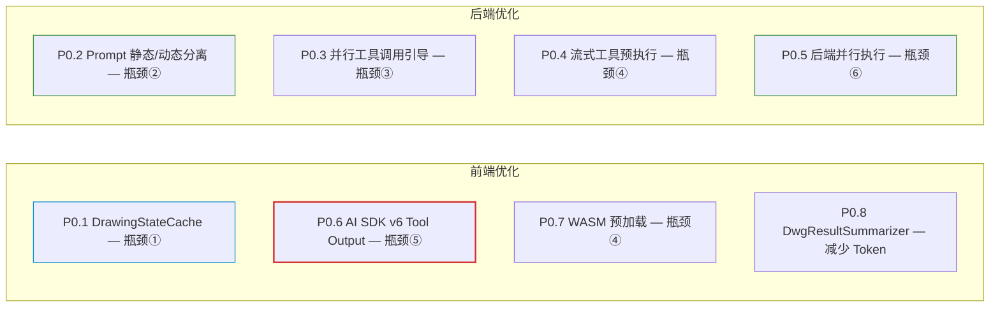

**关键变更**：

| 优化点 | 前端文件 | 后端文件 |
|--------|---------|---------|
| DrawingStateCache | `services/DrawingStateCache.js` | - |
| DwgResultSummarizer | `services/DwgResultSummarizer.js` | - |
| MarkdownRenderer | `components/AiAssistant/MarkdownRenderer.jsx` | - |
| 并行工具执行 | - | `ChatService.java` |
| Marker 跳过递归 | - | `ChatService.java` |
| 性能优化规则 | - | `SystemPromptService.java` |
| AI SDK v6 原生 Tool Output | `AiAssistant.jsx` | - |
| WASM 预加载 + 选择性失效 | `services/DrawingStateCache.js` | - |

#### Phase 1：QueryEngine 执行内核 + Tool 协议

**目标**：抽取统一执行内核，替代 ChatService 递归 ReAct。

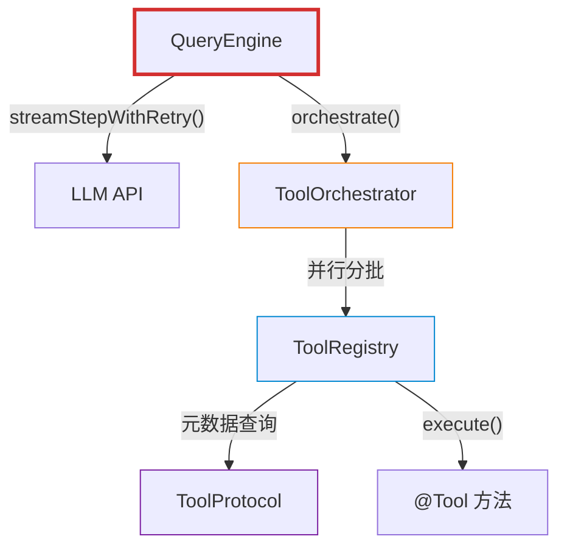

**新增文件**：

| 文件 | 职责 |
|------|------|
| `engine/QueryEngine.java` | 统一 ReAct 循环 + 递归上下文压缩 |
| `engine/tool/ToolProtocol.java` | 工具元数据接口（concurrencySafe/readOnly/isClientSide） |
| `engine/tool/ToolRegistry.java` | 工具注册表 + execute + formatForLlm |
| `engine/tool/ToolOrchestrator.java` | 并发编排（只读并行/写入串行） |

#### Phase 2：Prompt 分层装配系统

**目标**：将 167 行硬编码 CORE_PROMPT 拆分为 11 个独立 Section。

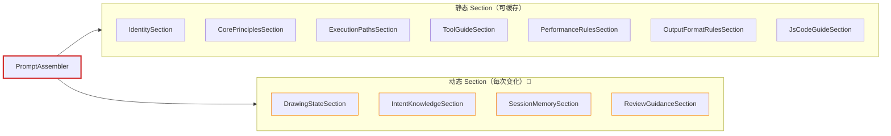

> 📌 标记为动态 Section（每次请求可能变化），其余为静态 Section（利用 LLM 前缀缓存）。

**新增文件**：`engine/prompt/PromptAssembler.java` + `PromptSection.java` + `StaticSection.java` + `DynamicSection.java` + `RequestIntent.java` + 11 个 Section 实现。

#### Phase 3：上下文管理与自动压缩

**目标**：对标 Claude Code 的 `autoCompact.ts`，实现 Token 追踪 + 自动压缩 + 状态复灌 + 熔断器。

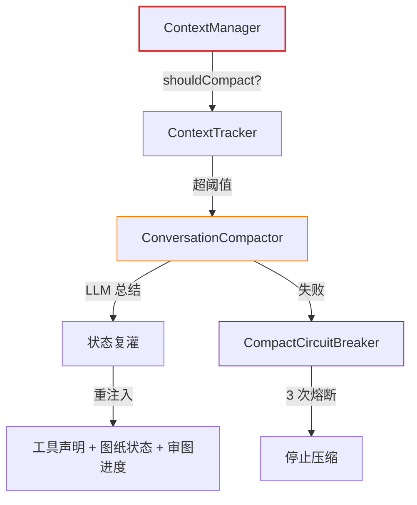

**新增文件**：`engine/context/ContextManager.java` + `ContextTracker.java` + `ConversationCompactor.java` + `CompactCircuitBreaker.java`

**关键设计**：
- 压缩后**重注入**工具声明和关键状态（对标 Claude Code 的 `buildPostCompactMessages()`）
- 熔断器防止压缩死循环（`MAX_FAILURES = 3`）

#### Phase 4：Memory 系统

**目标**：审图发现持久化 + 会话间知识积累。

**新增文件**：

| 文件 | 职责 |
|------|------|
| `memory/SessionMemory.java` | 会话记忆数据结构（发现列表 + 已审维度 + 摘要） |
| `memory/SessionMemoryStore.java` | JSON 文件化持久化（`sessions/{sessionId}.json`） |
| `agent/ReviewFinding.java` | 审查发现数据结构 |
| `agent/ReviewDimension.java` | 审查维度枚举（7 维度） |

通过 `SessionMemorySection` 将记忆注入 Prompt 动态后缀。

#### Phase 5：Multi-Agent 审图编排

**目标**：结构化审图工具 + 7 维度审查计划。

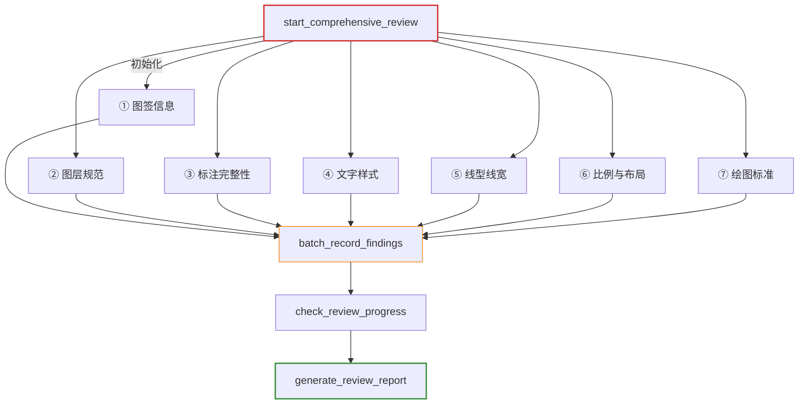

**新增后端工具**（`tool/review/DwgReviewTools.java`）：
- `start_comprehensive_review` — 初始化审查计划
- `batch_record_findings` — 批量记录发现（≤50 条/次）
- `check_review_progress` — 进度追踪
- `get_review_standards` — 审图标准知识
- `generate_review_report` — 结构化报告

**Prompt 引导**（`ReviewGuidanceSection.java`）：强制 LLM 使用结构化审图工具而非自由对话。

#### Phase 6：前端 AiAssistant 组件拆分

**目标**：将 1000+ 行单体组件拆分为职责单一的子组件和 Hooks。

```mermaid
graph TD
    AI["AiAssistant.jsx"]
    subgraph COMP["UI 组件"]
        ML["MessageList"] ~~~ WS["WelcomeScreen"] ~~~ TCB["ToolCallBadge"]
        CT["CollapsibleText"] ~~~ MR["MarkdownRenderer"] ~~~ WFP["WorkspaceFilePicker"]
    end
    subgraph HOOKS["Hooks"]
        H1["useToolExecution"] ~~~ H2["useAttachments"] ~~~ H3["usePointPick"]
        H4["useObjectSelect"] ~~~ H5["useAreaPick"] ~~~ H6["useMessageEditing"]
    end
    subgraph UTIL["工具模块"]
        CON["constants.js"] ~~~ HLP["helpers.js"]
    end
    AI --> COMP
    AI --> HOOKS
    AI --> UTIL

    style AI stroke:#d32f2f,stroke-width:2px
    style ML stroke:#0288d1
    style H1 stroke:#388e3c
    style H2 stroke:#388e3c
```

#### Phase 7：审图专用 Tool 增强

**目标**：新增 6 个审图工具（3 服务端 + 3 客户端 WASM）。

**新增客户端工具**（`tool/review/DwgReviewCheckTools.java` + 前端 dispatch）：
- `check_layer_naming` — WASM 遍历图层名 → 规范比对
- `check_text_styles` — WASM 遍历文字样式表 → 一致性检查
- `create_review_markup` — WASM 创建审图批注图层

**工具总数**：23 → 29 个

#### Phase 8：错误恢复与韧性

**目标**：对标 Claude Code 的工具执行失败反馈链 + 熔断器。

```mermaid
graph TD
    subgraph TOOL["工具执行异常处理"]
        ERR["工具执行异常"] --> CLS["classify()"]
        CLS -->|"RETRYABLE_PARAM"| FMT["formatForLlm()"]
        FMT -->|"发回 LLM"| LLM["LLM 自纠正参数"]
        CLS -->|"RETRYABLE_TRANSIENT"| RTY["自动重试 1 次"]
        RTY -->|"500ms 退避"| EXEC["重新执行"]
        CLS -->|"NON_RETRYABLE"| MSG["LLM 友好消息"]
        MSG -->|"含'不可重试'提示"| LLM
    end
    subgraph STRM["LLM 流式异常处理"]
        STREAM["LLM 流式异常"] --> SLCLS["isRetryable?"]
        SLCLS -->|"timeout/429/5xx"| SLRTY["重试 1 次 + 延迟 1s"]
        SLCLS -->|"不可重试"| UFMT["classifyError()"]
        UFMT -->|"用户友好消息"| USER["前端展示"]
    end

    style CLS stroke:#d32f2f,stroke-width:2px
    style RTY stroke:#f57c00
    style SLRTY stroke:#f57c00
```

**新增文件**：`engine/tool/ToolExecutionError.java`（错误分类枚举 + `formatForLlm()` + `classify()`）

**修改文件**：
- `ToolOrchestrator.java` — 瞬时错误自动重试
- `QueryEngine.java` — LLM 流式调用容错
- `ToolRegistry.java` — 错误格式化
- `ChatService.java` — 用户友好错误分类

### Bug 修复记录

大文件（沙田瑞风学校总平面规划图_t3.dwg, 1187KB）测试中发现 3 个 Bug：

| Bug | 问题 | 修复 | Commit |
|-----|------|------|--------|
| Bug 1 | CadCodeExecutor 变量碰撞 — `new Function(...scopeNames, code)` 参数与 LLM 代码 `const modelSpace` 冲突 | IIFE 隔离：`(function(){ ${code} }).call(this)` | Frontend `f79690c` |
| Bug 2 | 递归上下文溢出 — `streamStep` 无限累积工具结果，超出上下文窗口 | `compactMessagesForRecursion()` 100K 字符预算控制 | Backend `4dd1ef6` |
| Bug 3 | openAs 类型 undefined — 不必要的 error 日志 | `console.error` → `console.warn` | Frontend `f79690c` |

### E2E 验证结果

#### 测试 1：大文件审图（沙田瑞风学校总平面规划图_t3.dwg, 1187KB）

- ✅ 7 维度审查计划初始化
- ✅ 20+ 工具调用（结构/标注/文字/块引用/实体，多轮 ReAct）
- ✅ 23 条审查发现记录（4 CRITICAL + 12 WARNING + 7 INFO）
- ✅ 完整审图报告生成
- ✅ Bug 2 递归上下文压缩在多轮调用中正常工作

#### 测试 2：中等文件审图（单图框2.dwg, 545KB）

- ✅ 7/7 维度全部完成
- ✅ `batch_record_findings` × 1 — 24 条发现一次性记录（提示词优化生效）
- ✅ `check_review_progress` × 7 — 所有维度进度追踪
- ✅ `generate_review_report` — 完整审图报告（2 CRITICAL + 15 WARNING + 7 INFO）
- ✅ P8 LLM 流式容错解决了 P7 测试中第 7 维度的超时中断问题
- ✅ 前端零业务错误

### 提交历史

| Phase | 说明 | Backend Commit | Frontend Commit |
|-------|------|---------------|----------------|
| P0 | 端到端速度优化 | `334348b` + `bababbc` | `e8ae9f6` + `29b7de0` + `3257512` |
| P1 | QueryEngine 执行内核 | `4519fec` | - |
| P2 | Prompt 分层装配 | `ccd9107` | - |
| P3 | 上下文管理与自动压缩 | `29f0895` | - |
| P4 | Memory 系统 | `84a1007` | - |
| P5 | Multi-Agent 审图编排 | `7db999a` | `99ecdd1` |
| P6 | 前端组件拆分 | - | `d6909f7` |
| P7 | 审图专用 Tool 增强 | `c6e3390` | `2722ee9` |
| P8 | 错误恢复与韧性 | `c7f68de` | - |
| Bug | 大文件测试 Bug 修复 | `4dd1ef6` | `f79690c` |
| Opt | 提示词优化 | `09145d7` | - |
| Docs | CLAUDE.md 更新 | `f965060` | - |

### 量化对比（完整重构前后）

| 指标 | 第四章优化后 | P0-P8 重构后 | 变化 |
|------|------------|-------------|------|
| 工具数量 | 23 | 29 | +26% |
| 工具模块数 | 6 | 7 | +1 |
| 后端架构层数 | 2（service + tool） | 6（service + engine + prompt + context + memory + tool） | +200% |
| Prompt 管理 | 硬编码 1 个 | 11 个 Section 装配 | +1000% |
| 上下文管理 | 4000 字符截断 | Token 追踪 + 自动压缩 + 状态复灌 + 熔断器 | 全新 |
| Memory 系统 | 无 | SessionMemory + 文件持久化 | 全新 |
| 审图编排 | 无 | 7 维度结构化审图 + 进度追踪 + 报告生成 | 全新 |
| 错误恢复 | 直接报错 | 三级分类 + 自动重试 + LLM 自纠正 + 用户友好消息 | 全新 |
| LLM 流式容错 | 无 | 超时/连接断开自动重试 1 次 | 全新 |
| 前端组件 | 1 个 1000+ 行单体 | 12 个子组件/Hook | +1100% |
| 审图能力 | 无 | 7 维度自动审图 + 24 条发现/次 | 全新 |

---

## 超大图纸性能调优（P9）

> 记录时间：2026-07  
> 优化目标：消除 >5000 实体图纸在审图流程中的三级数据漏斗瓶颈

### 问题诊断：数据管道级联截断

```mermaid
graph TD
    DWG["DWG 图纸<br/>15000 实体"]
    F1["前端 DwgReadAdapter<br/>MAX_ENTITIES = 200"]
    F2["前端 helpers.js<br/>json > 4000 截断"]
    B1["后端 QueryEngine<br/>TOOL_RESULT_COMPRESS 4000"]
    B2["后端 ConversationCompactor<br/>OLD_TOOL_RESULT 200"]
    LLM["LLM 实际可见"]

    DWG -->|"15000"| F1
    F1 -->|"仅 200 实体"| F2
    F2 -->|"可能截断"| B1
    B1 -->|"≤4000 字符"| B2
    B2 -->|"历史仅 200 字符"| LLM

    style DWG stroke:#d32f2f,stroke-width:2px
    style F1 stroke:#d32f2f
    style F2 stroke:#d32f2f
    style B1 stroke:#f57c00
    style B2 stroke:#7b1fa2
    style LLM stroke:#388e3c
```

**核心问题**：三级漏斗使 LLM 只能看到 ~1.3% 的图纸数据，导致：

1. **分页查询消耗 ReAct 步数**：需 75 轮才能遍历 15000 实体（200/轮），远超 maxSteps=10
2. **历史上下文丢失**：旧轮工具结果被截至 200 字符，前几轮读取的数据完全丢失
3. **审图中断**：步数耗尽时审图流程被强制截断，生成不完整报告

### 优化方案

#### P0：数据管道扩容（3 处改动）

| 序号 | 文件 | 参数 | 改动前 | 改动后 | 效果 |
|------|------|------|--------|--------|------|
| 1a | `DwgReadAdapter.js` | MAX_ENTITIES | 200 | 1000 | 单次查询覆盖率 ×5 |
| 1b | `DwgReadAdapter.js` | MAX_TEXTS | 300 | 800 | 文字内容覆盖率 ×2.7 |
| 1c | `DwgReadAdapter.js` | MAX_BLOCK_REFS | 200 | 500 | 块引用覆盖率 ×2.5 |
| 1d | `DwgReadAdapter.js` | MAX_DIMENSIONS | 200 | 500 | 标注覆盖率 ×2.5 |
| 1e | `helpers.js` | 截断阈值 | 4000 | 12000 | 与后端对齐，避免前端先截 |
| 2 | `QueryEngine.java` | TOOL_RESULT_COMPRESS_THRESHOLD | 4000 | 12000 | 保留完整实体结构 |
| 3 | `ConversationCompactor.java` | OLD_TOOL_RESULT_LIMIT | 200 | 1000 | 历史上下文保留 ×5 |

#### P1：审图容量提升（3 处改动）

| 序号 | 文件 | 参数 | 改动前 | 改动后 | 效果 |
|------|------|------|--------|--------|------|
| 4a | `AppProperties.java` | maxSteps | 10 | 20 | 支持 7 维度完整审图（21 步） |
| 4b | `application.yml` | max-steps | 10 | 20 | 与 Java 默认值同步 |
| 5 | `QueryEngine.java` | MAX_CONTEXT_CHARS | 100K | 200K | 递归上下文预算翻倍 |
| 6 | `QueryEngine.java` | AGGRESSIVE_COMPRESS_THRESHOLD | 1500 | 3000 | 压缩后保留更多信息 |

### 优化后数据管道

```mermaid
graph TD
    DWG["DWG 图纸<br/>15000 实体"]
    F1["前端 DwgReadAdapter<br/>MAX_ENTITIES = 1000 ✅"]
    F2["前端 helpers.js<br/>json > 12000 截断 ✅"]
    B1["后端 QueryEngine<br/>TOOL_RESULT_COMPRESS 12000 ✅"]
    B2["后端 ConversationCompactor<br/>OLD_TOOL_RESULT 1000 ✅"]
    LLM["LLM 实际可见<br/>~6.7% 覆盖率"]

    DWG -->|"15000"| F1
    F1 -->|"1000 实体/轮"| F2
    F2 -->|"≤12000 字符"| B1
    B1 -->|"≤12000 字符"| B2
    B2 -->|"历史保留 1000 字符"| LLM

    style DWG stroke:#0288d1,stroke-width:2px
    style F1 stroke:#388e3c
    style F2 stroke:#388e3c
    style B1 stroke:#388e3c
    style B2 stroke:#388e3c
    style LLM stroke:#388e3c
```

### Token 消耗影响评估

| 指标 | 改动前 | 改动后 | 变化 |
|------|--------|--------|------|
| 单次工具结果 Token | ~1.3K | ~4K | +208% |
| 7 轮审图累计 Token | ~60K | ~80K | +33% |
| 压缩触发轮次 | 第 6 轮 | 第 5 轮 | 提前 1 轮 |
| maxSteps 上限 | 10 | 20 | 避免审图中断 |
| 递归上下文预算 | 100K 字符 | 200K 字符 | ×2 |

### Git 提交记录

- `drawing-web-app` commit `8201a84`（feat-lgs 分支）：前端 DwgReadAdapter + helpers.js 常量调整
- `drawing-ai-server` commit `73ae8f3`（master 分支）：后端 QueryEngine + ConversationCompactor + AppProperties 常量调整

---

## 维度隔离审图架构（P10）

> 记录时间：2026-07
> 优化目标：消除跨维度审图幻觉，让每个审图维度拥有独立 LLM 调用上下文

### 问题诊断：单 Agent 共享消息链的上下文污染

#### 问题本质

P0-P8 重构后审图能力已完善（7 维度结构化审图），但架构本质仍是**单 Agent + 单消息链**：

```mermaid
graph TD
    USER["用户: 全面审图"] --> QE["QueryEngine 单 ReAct 循环"]
    QE --> DIM1["维度 1: 图层规范"]
    QE --> DIM2["维度 2: 标注完整性"]
    QE --> DIM3["维度 3: 尺寸精度"]
    QE --> DIM4["维度 4-7: ..."]

    DIM1 -->|"工具结果累积"| CTX["共享消息链<br/>上下文持续膨胀"]
    DIM2 -->|"工具结果累积"| CTX
    DIM3 -->|"工具结果累积"| CTX
    DIM4 -->|"工具结果累积"| CTX

    CTX -->|"第 4 维度起"| COMPRESS["上下文压缩触发<br/>前几维度数据丢失"]
    COMPRESS --> HALLUCINATION["后续维度幻觉<br/>引用已丢失数据 / 混淆维度"]

    style HALLUCINATION stroke:#d32f2f,stroke-width:2px
    style COMPRESS stroke:#f57c00
    style CTX stroke:#f57c00
```

#### 具体表现

| 问题 | 描述 | 影响 |
|------|------|------|
| **上下文饱和** | 7 维度共享一条消息链，第 4 维度时上下文已接近 80% 阈值 | 触发 ContextCompactor 压缩 |
| **数据丢失** | 前几维度的详细工具结果被压缩为摘要 | LLM 后续维度引用不到实际数据 |
| **跨维度幻觉** | LLM 在第 5-7 维度混淆之前维度的信息 | 报告中出现"标注完整性"引用了"图层规范"的数据 |
| **维度遗漏** | 步数耗尽导致后 2-3 个维度被跳过 | 审图报告不完整 |

#### 与 Claude Code 的对比分析

| 维度 | Claude Code | Drawing AI Server (P8) |
|------|-------------|----------------------|
| Agent 数量 | 多 Agent（explore/task/general） | 单 Agent |
| 上下文隔离 | 每个 sub-agent 独立上下文窗口 | 所有维度共享消息链 |
| Agent 间通信 | 结果传递，不共享对话历史 | N/A |
| 失败隔离 | sub-agent 失败不影响主 agent | 一个维度失败可能中断全部 |

### 方案选型

#### 方案 A：维度级上下文隔离（轻量）✅ 已选

保持单 LLM 实例，但每个审图维度获得独立的 LLM 调用上下文（独立消息链 + 维度专属 Prompt）。

#### 方案 B：完整 Sub-Agent 框架（重量）

为每个维度创建独立 Agent 实例，含 Agent 接口、AgentContext、AgentResultMerger 等完整框架。

#### 选型依据

| 维度 | 方案 A | 方案 B |
|------|--------|--------|
| 改动量 | ~650 行，3 新增 + 3 修改 | ~3000+ 行，10+ 新文件 |
| 风险 | 低（复用现有 QueryEngine） | 高（全新执行框架） |
| 效果 | 消除跨维度幻觉 | 同左 + 可并行 |
| 演进性 | 可平滑升级为方案 B | - |

### 架构设计

#### 核心思路

```mermaid
graph TD
    USER["用户: 全面审图"] --> IR["IntentRouter<br/>意图识别 + 维度拆分"]
    IR -->|"REVIEW_COMPREHENSIVE"| LOOP["ChatService<br/>维度循环 (串行)"]

    LOOP --> D1["维度 1: 图层规范<br/>独立 Prompt + 独立消息链<br/>独立 ReAct (5步)"]
    LOOP --> D2["维度 2: 标注完整性<br/>独立 Prompt + 独立消息链<br/>独立 ReAct (5步)"]
    LOOP --> D3["维度 3-7: ...<br/>每维度独立上下文"]

    D1 -->|"findings"| DRT["DwgReviewTools<br/>维度隔离存储"]
    D2 -->|"findings"| DRT
    D3 -->|"findings"| DRT

    DRT --> RC["ReviewCoordinator<br/>合并 + 去重 + 统计"]
    RC --> REPORT["综合审图报告<br/>Markdown"]

    style IR stroke:#0288d1,stroke-width:2px
    style RC stroke:#388e3c,stroke-width:2px
    style DRT stroke:#7b1fa2
```

#### 与现有架构的关系

| 组件 | 改动级别 | 说明 |
|------|---------|------|
| **QueryEngine** | ❌ 不改 | 完全复用现有 ReAct 循环 |
| **ToolOrchestrator** | ❌ 不改 | 工具编排不变 |
| **ContextManager** | ❌ 不改 | 每维度独立调用 manage() |
| **ChatService** | 🟡 新增方法 | 增加 `streamReviewByDimension()` |
| **PromptAssembler** | 🟡 新增方法 | 增加 `assembleForDimension()` |
| **DwgReviewTools** | 🟡 改造 | findings 存储改为 per-dimension 隔离 |
| **IntentRouter** | 🟢 新增 | 从 PromptAssembler 提取意图路由 |
| **PerDimensionGuidanceSection** | 🟢 新增 | 维度专属审图 Prompt Section |
| **ReviewCoordinator** | 🟢 新增 | 多维度结果合并 |

### 实现细节

#### IntentRouter — 意图路由提取

**文件**：`engine/intent/IntentRouter.java`（新增 ~120 行）

从 `PromptAssembler.analyzeRequestIntent()` 提取为独立组件：

- `analyzeRequestIntent(List<String>)` — 关键词优先级匹配，返回 `RequestIntent` 枚举
- `resolveReviewDimensions(RequestIntent, List<String>)` — 意图 → 审图维度列表
- `detectSpecificDimensions()` — 关键词匹配单个维度

**路由策略**：
- `REVIEW_COMPREHENSIVE` → 全部 7 个 `ReviewDimension`
- `REVIEW_SINGLE` → 从用户消息中检测具体维度

#### PerDimensionGuidanceSection — 维度专属 Prompt

**文件**：`engine/prompt/sections/PerDimensionGuidanceSection.java`（新增 ~110 行）

替代 `ReviewGuidanceSection`（全量 ~600 tokens），生成维度专属引导（~200 tokens）：

- 每个维度的检查目标和工具推荐规则
- `LAYER_COMPLIANCE` → 推荐 `check_layer_naming`
- `TEXT_CONTENT` → 推荐 `check_text_styles`
- 维度级反幻觉规则（"只关注当前维度，不要混入其他维度的判断"）

#### PromptAssembler — 维度装配方法

**文件**：`engine/prompt/PromptAssembler.java`（修改 +35 行）

新增 `assembleForDimension(DrawingState, ReviewDimension, SessionMemory)`：

```
静态前缀（身份/原则/执行路径/工具/JS/性能/输出）
  + DrawingStateSection（图纸状态）
  + SessionMemorySection（上下文记忆）
  + PerDimensionGuidanceSection（维度专属规则）
  + IntentKnowledgeSection（审图知识）
```

关键差异：用 `PerDimensionGuidanceSection` 替代全量 `ReviewGuidanceSection`，Token 节省 ~67%/维度。

#### DwgReviewTools — 维度隔离存储

**文件**：`tool/review/DwgReviewTools.java`（修改 +80 行）

双写架构：

```java
// 原有全局存储（向后兼容）
private final List<ReviewFinding> currentFindings;

// 新增维度隔离存储
private final Map<String, List<ReviewFinding>> dimensionFindings = new ConcurrentHashMap<>();
```

- `recordReviewFinding()` / `batchRecordFindings()` — 同时写入 `currentFindings` 和 `dimensionFindings`
- `startComprehensiveReview()` — 同时清空两个存储
- 新增 `getFindingsForDimension()` / `getAllDimensionFindings()` / `clearDimensionFindings()`

#### ReviewCoordinator — 结果合并

**文件**：`agent/ReviewCoordinator.java`（新增 ~190 行）

- `mergeAndGenerateReport(List<ReviewDimension>, String)` → `ReviewReport` record
- `deduplicateFindings()` — key = `dimension|severity|description`，去除跨维度重复
- 生成 Markdown 综合报告：总览表格 + 各维度详细发现 + 统计

#### ChatService — 维度循环入口

**文件**：`service/ChatService.java`（修改 +100 行）

**路由逻辑**（在 `streamChat()` 中）：

```
intentRouter.analyzeRequestIntent(userTexts)
  → REVIEW_COMPREHENSIVE && drawingState != null
    → streamReviewByDimension()
  → 其他意图
    → 原有单 Agent 路径（完全不变）
```

**`streamReviewByDimension()` 方法**：

1. 生成 textPartId（`UUID.randomUUID()`）
2. 清空 `dwgReviewTools.clearDimensionFindings()`
3. `Flux.create()` + `subscribeOn(Schedulers.boundedElastic())` 避免阻塞
4. 逐维度串行循环：
   - 构建维度专属 Prompt（`promptAssembler.assembleForDimension()`）
   - 构建独立消息链（`SystemMessage` + `UserMessage`，无历史）
   - 独立 sessionId 后缀（`sessionId + "-dim-" + dim.name()`）
   - `queryEngine.execute(..., DIMENSION_MAX_STEPS=5, dimSessionId).blockLast()`
   - 每维度 try-catch，失败跳过继续
5. `reviewCoordinator.mergeAndGenerateReport()` 生成综合报告

### 关键设计决策

#### 串行 vs 并行

选择**串行**执行维度审查：

| 因素 | 串行 | 并行 |
|------|------|------|
| SSE 复杂度 | 简单（单流） | 高（多流合并排序） |
| API 限流 | 无风险 | 7 并发可能触发 429 |
| 用户体验 | 实时看到每个维度进度 | 全部等待后一次输出 |
| 调试 | 日志清晰有序 | 交错混乱 |

#### 维度间信息共享

设计为**只读共享**：
- `DrawingState` — 所有维度只读共享
- 前一维度的 `findings` — **不注入**后续维度（避免交叉污染）
- 最终由 `ReviewCoordinator` 统一合并去重

#### 向后兼容

- `REVIEW_SINGLE`（单维度）→ 走原有路径
- `REVIEW_COMPREHENSIVE`（全面审图）→ 走新的维度隔离路径
- 非审图意图 → 完全不受影响

### Token 成本对比

| 场景 | 原方案（单 Agent） | P10（维度隔离） | 变化 |
|------|-------------------|----------------|------|
| 系统提示 | 1 × 全量 (~2K tokens) | 7 × 维度专属 (~1.3K × 7 = 9.1K) | +355% |
| 对话上下文 | 1 × 累积到 80K | 7 × 独立 ~12K = 84K | +5% |
| 总 Token | ~80K | ~93K | **+16%** |
| 审图质量 | 后 3 维度严重退化 | 每维度同等质量 | ✅ 质变 |
| 上下文溢出 | 频繁触发压缩 | 几乎不触发 | ✅ 大幅改善 |
| 步数预算 | 20 步全局共享 | 5 步/维度 × 7 = 35 步 | +75% |

**结论**：Token 成本增加 ~16%，换来审图质量从"后半段幻觉"变为"全维度高质量"。

### 文件变更清单

| 文件 | 改动类型 | 改动量 |
|------|---------|--------|
| `engine/intent/IntentRouter.java` | 🟢 新增 | ~120 行 |
| `engine/prompt/sections/PerDimensionGuidanceSection.java` | 🟢 新增 | ~110 行 |
| `agent/ReviewCoordinator.java` | 🟢 新增 | ~190 行 |
| `engine/prompt/PromptAssembler.java` | 🟡 修改 | +35 行 |
| `tool/review/DwgReviewTools.java` | 🟡 修改 | +80 行 |
| `service/ChatService.java` | 🟡 修改 | +100 行 |
| **总计** | 3 新增 + 3 修改 | **~635 行** |

### 后续演进路径

方案 A 已为方案 B（完整 Sub-Agent 框架）预留升级接口：

```mermaid
graph LR
    A1["IntentRouter"] -->|"复用为"| B1["Agent 路由"]
    A2["PerDimensionGuidanceSection"] -->|"成为"| B2["Agent 专属 Prompt"]
    A3["ReviewCoordinator"] -->|"演进为"| B3["AgentResultMerger"]
    A4["维度串行循环"] -->|"改为"| B4["并行 Agent 执行"]
    A5["共享 QueryEngine"] -->|"新增"| B5["Agent 接口 + AgentContext"]

    style A1 stroke:#0288d1
    style A2 stroke:#0288d1
    style A3 stroke:#0288d1
    style B1 stroke:#388e3c
    style B2 stroke:#388e3c
    style B3 stroke:#388e3c
```

### Git 提交记录

- `drawing-ai-server` commit `659374f`（master 分支）：维度隔离审图 — 方案 A 全部实现

---

## 维度隔离 E2E 验证与 Bug 修复（P11）

> 维度隔离模式从编译通过到真正可用，经历了 4 个 Bug 修复和 Prompt 优化迭代。

### 问题背景

方案 A 代码实现后（P10），进行端到端测试时发现多个运行时问题。维度隔离模式的 SSE 协议交互、客户端/服务端工具架构、Prompt 引导策略均需要针对性修复。

### BUG #1：AI SDK v6 消息格式不兼容

**现象**：发送"全面审图"后走了单 Agent 路径，未触发维度隔离。

**根因**：`ChatService` 中 `userTexts` 提取使用 `ChatRequest.UiMessage::getContent`，但 AI SDK v6 的消息格式将文本存放在 `parts` 数组中（`type="text"`），`getContent()` 返回 null。

**修复**：新增 `extractText()` 方法，同时处理 `content` 和 `parts` 两种格式：

```java
private String extractText(ChatRequest.UiMessage msg) {
    if (msg.getContent() != null) return msg.getContent();
    if (msg.getParts() != null) {
        return msg.getParts().stream()
            .filter(p -> "text".equals(p.get("type")))
            .map(p -> (String) p.get("text"))
            .collect(Collectors.joining(" "));
    }
    return "";
}
```

### BUG #2：缺少 textStart 事件

**现象**：前端报错 `Received text-delta for missing text part with ID "..."`。

**根因**：`streamReviewByDimension()` 直接发送 `textDelta()` 而未先发送 `textStart()`，违反 AI SDK v6 UI Message Stream 协议。

**修复**：在首个 `textDelta()` 前添加 `sink.next(streamAdapter.textStart(textPartId))`。

### BUG #3：SSE 事件协议架构冲突

**现象**：第一个维度的首步完成后，第二步的 text-delta 再次报同类错误。

**根因**：Vercel AI SDK UI Message Stream 协议要求每个 text-part 生命周期（textStart → textDelta* → textEnd）必须在单个 step 内完成（stepStart → ... → stepFinish）。`streamReviewByDimension()` 的外层文本（维度标题、完成标记）与 QueryEngine 的步骤级事件混合，导致前端 SDK 丢失 text-part 追踪。

**修复**：新增 `emitTextStep()` 辅助方法，将每段外层文本包装为独立完整步骤：

```java
private void emitTextStep(FluxSink<String> sink, String text) {
    String id = UUID.randomUUID().toString();
    sink.next(streamAdapter.stepStart());
    sink.next(streamAdapter.textStart(id));
    sink.next(streamAdapter.textDelta(id, text));
    sink.next(streamAdapter.textEnd(id));
    sink.next(streamAdapter.stepFinish());
}
```

### BUG #4：客户端工具在维度隔离模式下不工作（关键架构缺陷）

**现象**：7 个维度全部执行完成，SSE 无错误，但所有维度的 findings 数量均为 0。

**根因分析**：

```
QueryEngine.buildToolCompletionFlux() 第 286-291 行：
  if (partition.hasClientTools()) {
      return Flux.fromIterable(lines); // ← 不递归！直接返回
  }
```

- `read_dwg_*` 系列工具是**客户端工具**（在浏览器 WASM 中执行）
- QueryEngine 检测到客户端工具时，**中断 ReAct 循环**，返回当前输出，等待前端发送工具执行结果（下一次 HTTP 请求）
- 维度隔离模式使用 `queryEngine.execute().blockLast()` 串行执行，`blockLast()` 在引擎返回时解析完成
- LLM 发出的 `read_dwg_*` 调用被前端执行（UI 上可见工具执行徽标），但结果永远无法回传——因为 SSE 流尚未结束

**修复方案**：服务端专用工具 + 预注入图纸数据

1. **ToolRegistry 新增 `getServerOnlyCallbacks()`**：过滤掉所有客户端工具
2. **QueryEngine 新增 `buildServerOnlyChatOptions()`**：仅注册服务端工具
3. **ChatService 预注入 DrawingState**：`serializeDrawingStateForDimension()` 将图纸摘要序列化为 UserMessage 文本
4. **PerDimensionGuidanceSection 重写**：移除所有客户端工具引用，统一为服务端工具工作流

```
维度隔离模式的数据流（修复后）：

UserMessage = 图纸数据摘要（预读取）+ 维度审查指令
    ↓
LLM 分析预注入数据（无需调用 read_dwg_*）
    ↓
调用服务端工具：get_review_standards → batch_record_findings → check_review_progress
    ↓
QueryEngine 正常递归（无客户端工具阻断）
    ↓
维度完成，收集 findings
```

### Prompt 优化

初始修复 BUG #4 后，首次测试 findings 仍为 0。原因是 Prompt 引导力度不足。

**优化措施**：
- `DIMENSION_MAX_STEPS`：5 → 8（给 LLM 更多步骤空间）
- 用户消息改为严格分步指令：
  1. 调用 `get_review_standards` 获取标准
  2. 分析预注入数据
  3. 调用 `batch_record_findings` 提交发现
  4. 调用 `check_review_progress` 标记完成
- 新增强制规则：`⚠️ 不调用 batch_record_findings 则任务视为未完成`
- 新增规则 #5：即使未发现问题也必须调用 `batch_record_findings`（空列表）
- 新增规则 #6：禁止调用 `read_dwg_*` 系列工具

### E2E 验证结果

测试图纸：`02-01JG-11.dwg`（结构施工图，6878 个实体，54 个图层）

| 维度 | 发现数 | 🔴 严重 | 🟡 警告 | 🔵 提示 | 参考标准 |
|------|--------|---------|---------|---------|---------|
| 图层规范 | 7 | 2 | 4 | 1 | GB/T 50001-2017 |
| 标注完整性 | 6 | 0 | 3 | 3 | GB/T 50001-2017 |
| 尺寸标注精度 | 4 | 0 | 3 | 1 | GB/T 50001-2017 第6章 |
| 图签信息 | 3 | 0 | 1 | 2 | GB/T 50001-2017 附录A |
| 文字内容 | 5 | 0 | 3 | 2 | GB/T 50001-2017 + GB/T 14691-1993 |
| 绘图标准 | 8 | 2 | 4 | 2 | GB/T 50001-2017 + GB/T 50104-2010 |
| 结构完整性 | 5 | 0 | 2 | 3 | — |
| **总计** | **38** | **4** | **20** | **14** | |

**验证结论**：
- ✅ 7 个维度全部独立完成，无跨维度幻觉
- ✅ 每个维度均调用 `batch_record_findings` 成功记录发现
- ✅ SSE 协议完全稳定，前端无任何报错
- ✅ ReviewCoordinator 综合报告正确生成（维度概览表 + 分维度详细发现）
- ✅ LLM 正确引用国标（GB/T 50001-2017 等）作为审查依据

### Git 提交记录

- `drawing-ai-server` commit `b8ede97`（master 分支）：修复 BUG #1/#2/#3（SSE 协议修复）
- `drawing-ai-server` commit `e2e7c5c`（master 分支）：修复 BUG #4（客户端工具架构缺陷）+ Prompt 优化

## 跨维度去重优化（P12）

### 问题发现

P11 E2E 验证的 38 条发现进行质量分析后，发现严重的跨维度重复问题：

| 质量分类 | 数量 | 占比 | 说明 |
|---------|------|------|------|
| VALID | 14 | 37% | 独立的、有证据支撑的有效发现 |
| CROSS_DIM_DUP | 14 | 37% | 同一问题在多个维度重复报告 |
| POSITIVE | 4 | 11% | 正面观察（如"梁标注完善"） |
| SUMMARY | 3 | 8% | 空洞的总结性条目（"维度审查总结"） |
| DATA_LIMIT | 3 | 8% | 数据局限声明错误标记为 WARNING |

**核心问题**：37% 的跨维度重复率意味着每 3 条发现就有 1 条是重复的。典型案例：
- "图层命名不规范"在图层规范、标注完整性、绘图标准、结构完整性 4 个维度重复
- "AcDb2dPolyline 旧版实体"在绘图标准和结构完整性重复
- "UASVGSealEntity 自定义实体"在图层规范、绘图标准、结构完整性 3 个维度重复

### 解决方案

#### Prompt 层 — 维度边界划定

在 `PerDimensionGuidanceSection` 中为每个维度添加 `🔒 维度边界` 规则，明确定义每个维度的"管辖范围"和"禁区"：

```
🔒 维度边界（严格遵守）：
✅ 本维度只关注：[具体范围]
❌ 不要报告：[其他维度的管辖范围]
```

**关键设计原则 — 话题归属（Topic Ownership）**：
- **图层规范**：拥有所有图层命名、前缀、中英文、组织相关问题
- **绘图标准**：拥有实体类型合规（2dPolyline、Solid、自定义实体）
- **标注完整性**：拥有标注覆盖率（缺失标注、标注数量）
- **尺寸标注精度**：仅管辖标注数值精度、闭合性
- 其他维度：各管各的，明确排除已被其他维度管辖的话题

#### Prompt 层 — 新增规则

- **Rule 7**：禁止发布"维度审查总结"等空洞 INFO（消灭 SUMMARY 类发现）
- **Rule 8**：数据局限性声明只能使用 INFO 级别，禁止标记为 WARNING

#### ReviewCoordinator — 三阶段去重管线

将原来的单阶段精确去重升级为三阶段管线：

```
Phase 1: 同维度精确去重
  → 相同 (dimension|severity|description) 的发现合并

Phase 2: 跨维度语义去重 (crossDimensionDedup)
  → 13 个话题关键词 → 归属维度映射
  → 非归属维度的相同话题发现被移除
  话题映射示例：
    "图层命名" → 图层规范
    "2dPolyline" → 绘图标准
    "SealEntity" → 绘图标准
    "标高" → 标注完整性

Phase 3: 低价值过滤 (filterLowValueFindings)
  → 正则匹配空洞模式（总结/结论/综上/概述）
  → 移除无实质内容的 INFO 记录
```

### 代码变更

| 文件 | 变更内容 |
|------|---------|
| `PerDimensionGuidanceSection.java` | +`getDimensionBoundary()` 方法，7 个维度各自的 `✅/❌` 边界定义；+Rule 7/8 |
| `ReviewCoordinator.java` | +`crossDimensionDedup()` 13 个话题关键词归属映射（`Map.ofEntries()`）；+`filterLowValueFindings()` 正则过滤；去重统计日志 |

### E2E 验证结果

使用同一份图纸（`02-01JG-11.dwg`）重新执行全面审图，结果对比：

| 指标 | P11（优化前） | P12（优化后） | 变化 |
|------|-------------|-------------|------|
| 总发现数 | 38 | 38 (报告 36) | 持平 |
| 🔴 严重 | 4 | 2 | **-50%** |
| 🟡 警告 | 20 | 15 | **-25%** |
| 🔵 提示 | 14 | 19 | +36% |

| 质量分类 | P11 | P12 | 变化 |
|---------|-----|-----|------|
| VALID（有效发现） | 14 (37%) | 18 (47%) | **+29% ✅** |
| CROSS_DIM_DUP（跨维度重复） | 14 (37%) | 2 (5%) | **-86% ✅✅✅** |
| POSITIVE（正面观察） | 4 (11%) | 4 (11%) | 持平 |
| SUMMARY（空洞摘要） | 3 (8%) | 0 (0%) | **-100% ✅✅** |
| DATA_LIMIT（数据局限） | 3 (8%) | 14 (37%) | +367% ⚠️ |

#### 各维度详细对比

| 维度 | P11 发现数 | P12 发现数 | P11 重复数 | P12 重复数 |
|------|-----------|-----------|-----------|-----------|
| 图层规范 | 7 | 11 | 0 | 0 |
| 标注完整性 | 6 | 6 | 3 | 0 |
| 尺寸标注精度 | 4 | 3 | 1 | 0 |
| 图签信息 | 3 | 3 | 1 | 0 |
| 文字内容 | 5 | 5 | 2 | 0 |
| 绘图标准 | 8 | 5 | 4 | 0 |
| 结构完整性 | 5 | 5 | 3 | 2 |

#### 分析

**核心成果**：
1. 跨维度重复率从 **37% → 5%**，Prompt 维度边界 + 三阶段去重管线效果显著
2. 空洞摘要**完全消除**，Rule 7 生效
3. 有效发现占比从 37% 提升至 47%，发现质量更高
4. 严重级别从 4→2，更精准地定位真正严重的问题

**DATA_LIMIT 增加的合理性**：
- 14 条 DATA_LIMIT 是因为维度隔离模式只注入 DrawingState 摘要数据（实体类型统计 + 图层列表），不含详细的文字内容、标注数值、块属性等
- Rule 8 将这类"无法验证"从 WARNING 降级为 INFO，是**正确行为** —— 数据局限性不应以 WARNING 形式误导用户
- 后续可通过在维度模式中启用客户端工具（需解决 BUG #4 的 blockLast 问题）来减少 DATA_LIMIT

**仅存的 2 条跨维度重复**：
- 结构完整性维度报告了"AcDb2dPolyline 共存"和"UASVGSealEntity 兼容风险"，这两个话题的 owner 是绘图标准维度
- 因为 ReviewCoordinator 的 `crossDimensionDedup` 依赖关键词精确匹配，部分表述变体未被命中
- 可接受范围内，后续可通过扩展同义词映射进一步优化

### Git 提交记录

- `drawing-ai-server` commit `685aff6`（master 分支）：P12 跨维度去重优化
- `drawing-web-app` commit 待提交（feat-lgs 分支）：P12 文档更新
