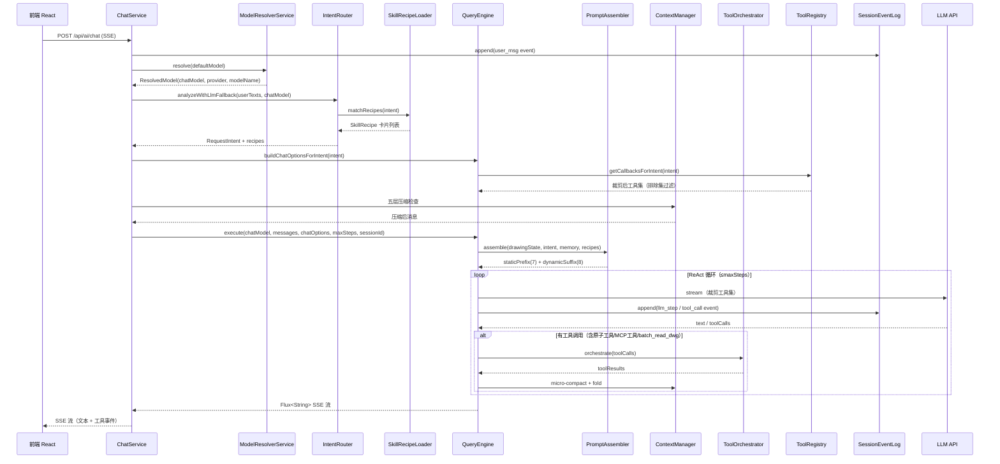

# Harness Engineering 架构详解

> 核心思路：**"评估一个 AI Agent = 评估模型 + Harness。模型是商品，Harness 才是护城河。"**

借鉴《[[Claude Code]] 论文（2604.14228v1）》七大设计视角，本项目采用 Harness Engineering 架构模式，将 LLM 调用作为最小盒子，围绕它构建工具编排、上下文管理、Prompt 装配、Memory 系统、视觉记忆管线、多模型架构、硬件许可、审图编排、错误恢复、[[扩展机制]]等系统层。

## 技术栈

| 项 | 值 |
|---|---|
| [[Spring Boot]] | 3.5.7 |
| [[Spring AI]] | 1.1.2 |
| [[Spring AI]] Alibaba | 1.1.2.2 |
| Java | 17 |
| 向量数据库 | Qdrant（端口 18140/18141） |
| Embedding | Ollama bge-m3（本地）/ DashScope text-embedding-v3/v4（云端） |
| 密码学 | Bouncy Castle 1.78.1（SM2/SM3） |

## 系统层次图

```
┌──────────────────────────────────────────────────────────────────────┐
│  service/ChatService — SSE 入口 + UIMessageStreamAdapter 协议适配       │
│                      + 意图驱动路由 + ModelResolverService 多模型解析    │
├──────────────────────────────────────────────────────────────────────┤
│  engine/intent/IntentRouter — 两层意图识别（关键词快速通道 + LLM 兜底）    │
│    └── SkillRecipeLoader — Skills Recipe 按意图匹配与注入                 │
├──────────────┬───────────────┬──────────────────────────────────────┤
│ engine/tool/ │ engine/prompt/│ engine/context/                       │
│ ToolRegistry │ PromptAssembler│ ContextManager（五层压缩管线）          │
│ (内置+MCP)   │ 15 个 Section │   Layer3 MicroCompactor               │
│ ToolProtocol │               │   Layer4 ToolResultFolder             │
│ ToolOrchestr.│               │   Layer5 ConversationCompactor        │
│ 意图级裁剪   │               │   CompactCircuitBreaker               │
├──────────────┴───────────────┴──────────────────────────────────────┤
│  engine/BackpressureController — 滑动窗口预测性背压（与 QueryEngine 协作）  │
├──────────────────────────────────────────────────────────────────────┤
│  service/ModelResolverService — 4 角色模型 + 多供应商 + Thinking Mode    │
│    default / review / vision / memory-init                            │
│    OpenAI / DashScope / DeepSeek / Qwen                              │
├──────────────────────────────────────────────────────────────────────┤
│  memory/ — 三层记忆 + 视觉记忆                                          │
│    L1 SessionMemory + SessionEventLog（append-only jsonl）            │
│    L2 ProjectMemory（Redis，按 DWG 指纹隔离）                          │
│    L3 DrawingMemory（Qdrant + Redis，13 个 section）                  │
│        └── memory/vision/ Stage A（全图）/ Stage B（区域）/ Stage C（定位）│
├──────────────────────────────────────────────────────────────────────┤
│  service/RagService — RAG 三级缓存 + SingleFlight + 熔断 + Rerank       │
│  qa/QaCacheService — 跨会话 QA 语义缓存（WRITE_ONLY/SHADOW/ACTIVE）     │
├──────────────────────────────────────────────────────────────────────┤
│  tool/ — 11 模块 47 个 @Tool（内置 + 原子工具 + MCP 外部工具）           │
│    read(8) write(4) pipeline(3) execution(2) analysis(10)            │
│    interaction(4) review(2) atomic(12) planning(1) memory(1) + MCP  │
├──────────────────────────────────────────────────────────────────────┤
│  license/ — WASM 硬件许可（License Gate）                               │
│    LicenseValidator(6步验证) + SessionStore + TokenSigner(SM2)        │
│    FingerprintService(SM3) + 厂商 CLI（4 子命令）                      │
├──────────────────────────────────────────────────────────────────────┤
│  event/ — Hook 事件（PreLlmCall / PostToolCall / PreCompact）          │
│  controller/ — TraceController + MarkerAckController + ResumeController│
│              + DrawingMemoryController（视觉管线 REST）                  │
└──────────────────────────────────────────────────────────────────────┘
```

## 请求处理流程



## 请求入口：ChatService

`service/ChatService.java` 是整个系统的顶层编排入口，职责：

- **SSE 协议适配**：通过 `UIMessageStreamAdapter` 兼容 Vercel AI SDK UI Message Stream Protocol v1
- **多模型解析**：通过 `ModelResolverService.resolve()` 解析当前使用的模型，支持 4 个独立角色
- **意图驱动路由**：`analyzeWithLlmFallback()` 确定意图后，`buildChatOptionsForIntent()` 按意图裁剪工具集
- **事件追踪**：每次请求开始时向 `SessionEventLog` 写入 `user_msg` 事件
- **用户友好错误分类**：`classifyStreamError()` 将 LLM 异常转为中文提示

| 错误类型 | 用户提示 |
|---------|---------|
| 超时 | "建议重试或缩小查询范围" |
| 429 限流 | "请等待 30 秒后重试" |
| 503/502 | "服务负载较高，请稍后重试" |
| Token 超限 | "建议新建对话" |

## 多模型架构：ModelResolverService

`service/ModelResolverService.java` 统一管理 4 个独立角色模型，支持多供应商和 Thinking Mode。

### 4 个角色模型

| 角色 | 用途 | 环境变量前缀 |
|------|------|-------------|
| **default** | 通用 CAD 助手对话 | `DEFAULT_*` |
| **review** | 规划技术审查 | `REVIEW_*` |
| **vision** | 截图/图像分析（视觉记忆管线） | `VISION_*` |
| **memory-init** | 记忆初始化 | `MEMORY_INIT_*` |

每个角色独立配置 `apiKey / baseUrl / model` 三字段（共 12 个必填环境变量），启动时 `@PostConstruct validateRoleModels()` 校验，任一缺失则 `IllegalStateException` 快速失败。

### 模型解析流程

```
resolveByRole(role)
  └─ default → 返回 Spring @Primary defaultChatModel Bean
  └─ 其他角色 → ConcurrentHashMap 缓存 → 按需构建 ChatModel

resolve(modelId)
  └─ "model" → 默认供应商
  └─ "provider:model" → 指定供应商（deepseek:deepseek-chat / qwen:qwen-plus / dashscope:qwen-plus）
```

### 供应商类型

| 供应商 | 实现 | 模式 | 特性 |
|--------|------|------|------|
| **openai** | OpenAiChatModel | direct / proxy | 标准 OpenAI 协议 |
| **dashscope** | DashScopeChatModel | direct | Qwen3 Thinking Mode + 原生 Tool Calling + Web Search |
| **deepseek** | OpenAiChatModel（兼容） | direct / proxy | OpenAI 兼容 |
| **qwen** | OpenAiChatModel（兼容） | direct / proxy | DashScope 端点 |

### Thinking Mode（DashScope 专属）

```yaml
app.enable-thinking: true    # 默认开启
app.thinking-budget: 500     # 推理 token 预算
```

仅 DashScope 原生供应商（`dashscope:` 前缀）生效，启用 Qwen3 扩展推理，提升审图/标准合规场景准确率。

### Embedding 双供应商

| 供应商 | 激活条件 | 模型 | 位置 |
|--------|---------|------|------|
| **Ollama**（默认） | `app.embedding.provider=ollama` | bge-m3 | 本地 localhost:18130 |
| **DashScope** | `app.embedding.provider=dashscope` | text-embedding-v3/v4 | 云端 API |

`CachedEmbeddingModel` 包装两层供应商，Redis 缓存前缀 `{provider}:{model}`，`app.embedding.cache.enabled` 控制开关。

## 意图路由：IntentRouter + SkillRecipeLoader

`engine/intent/IntentRouter.java` 两层识别策略，优先关键词、兜底 LLM：

1. **关键词快速通道**（零延迟）：按优先级匹配末条用户消息
   - 审图 > 读取 > 修改 > 创建 > 删除 > 变换
2. **LLM 结构化分析兜底**：仅当快速通道无法匹配（MIXED）时触发 `BeanOutputConverter + JSON Schema`

意图枚举 `RequestIntent`：`READ / MODIFY / CREATE / DELETE / TRANSFORM / REVIEW / MIXED`

`service/SkillRecipeLoader` 在意图确定后，扫描 `classpath:skills/*.md`（YAML front matter），按 `RequestIntent` 建索引，通过 `IntentKnowledgeSection` 将匹配的 Recipe 卡片注入 Prompt。

## 执行内核：QueryEngine

`engine/QueryEngine.java` 是所有 LLM 交互的唯一入口，实现完整的 ReAct 循环：

- **统一 ReAct**：`execute(chatModel, messages, chatOptions, maxSteps, sessionId)` 接收预解析的 ChatModel
- **意图级工具裁剪**：`buildChatOptionsForIntent(intent)` → `ToolRegistry.getCallbacksForIntent(intent)` 按排除集过滤
- **服务端专用模式**：`buildServerOnlyChatOptions()` 获取不含客户端工具的工具集
- **递归上下文压缩**：`compactMessagesForRecursion()` 控制递归消息在 200K 字符预算内
- **LLM 流式容错**：`isRetryableLlmError()` 判断可重试错误（timeout / connection closed / EOF / broken pipe / 429 / 500–503），自动重试 1 次（延迟 1 秒）
- **背压协作**：查询 `BackpressureController.getBackpressureLevel()` 决定是否主动降速

> `QueryEngine` 是唯一的 LLM 交互入口，禁止在其他类中直接调用 `chatModel`

### 工具裁剪策略

`ToolRegistry.getCallbacksForIntent()` 使用排除集过滤：

| 意图 | 排除工具 |
|------|---------|
| `READ` | 所有写工具 + 审图工具 + 原子写工具（22 个排除） |
| `REVIEW` | 同 READ 但保留 `create_review_markup` |
| 其他 | 全集（不过滤） |

## 背压控制：BackpressureController

`engine/BackpressureController.java` 与 QueryEngine 的即时 429 退避互补：

- **滑动窗口**：维护最近 60 秒 LLM 请求的成功/失败记录（最少 5 条样本才计算）
- **触发降速**：失败率 > 20% 时提升背压级别，主动通知 QueryEngine 降速
- **恢复策略**：成功率 > 95% 后逐步恢复原始并发度

## 工具体系

### 工具清单（11 模块 47 个 @Tool）

| 模块 | 文件 | 工具数 | 并发安全 | 执行端 |
|------|------|--------|---------|--------|
| `tool/read/` | DwgReadTools | 8 | ✅ | marker |
| `tool/write/` | DwgWriteTools | 4 | ❌ | marker |
| `tool/pipeline/` | DwgPipelineTools | 3 | ❌ | marker |
| `tool/execution/` | DwgExecutionTools | 2 | ❌ | marker |
| `tool/analysis/` | DwgAnalysisTools | 7 | ✅ | 直接 |
| `tool/analysis/` | DwgWebSearchTools | 1 | ✅ | 直接 |
| `tool/analysis/` | WasmApiSearchTool | 2 | ✅ | 直接 |
| `tool/interaction/` | DwgInteractionTools | 4 | ❌ | 混合 |
| `tool/review/` | DwgReviewTools | 2 | ✅/❌ | 混合 |
| `tool/atomic/` | DwgAtomicTools | 12 | ❌ | marker |
| `tool/planning/` | DwgPlanningTools | 1 | ✅ | marker+直接 |
| `tool/memory/` | DrawingMemoryTools | 1 | ✅ | 直接 |
| `tool/mcp/`（动态） | McpToolAdapter | 0 | — | 外部 |

### 按模块详述

#### read（8 个）

| 工具 | 说明 |
|------|------|
| `read_dwg_structure` | 读取 DWG 图层/块/样式结构 |
| `read_dwg_entities` | 读取模型空间实体列表 |
| `read_dwg_text_content` | 读取文字内容 |
| `read_dwg_blocks` | 读取块定义和引用 |
| `read_dwg_comprehensive` | 一次性返回完整审图数据包（实体摘要+块引用+文字+标注） |
| `read_block_entities` | 读取指定块内的实体列表 |
| `read_dwg_dimensions` | 读取标注信息 |
| `batch_read_dwg` | 批量读取多类数据，N 轮往返压缩为 1 轮 |

#### write（4 个）

| 工具 | 说明 |
|------|------|
| `modify_entities` | 修改已有实体属性 |
| `create_entities` | 创建新实体 |
| `delete_entities` | 删除实体 |
| `transform_entities` | 变换实体（移动/旋转/缩放） |

#### pipeline（3 个）

| 工具 | 说明 |
|------|------|
| `validate_modification` | 验证修改结果的正确性 |
| `visual_qa` | 视觉 QA 检查 |
| `undo_last_operation` | 撤销上一步操作 |

#### execution（2 个）

| 工具 | 说明 |
|------|------|
| `execute_js_code` | 执行 LLM 生成的 JS 代码（[[CadCodeExecutor 沙箱]]） |
| `execute_scr_script` | 执行 SCR 脚本 |

#### analysis（10 个）

| 工具 | 文件 | 说明 |
|------|------|------|
| `search_code_examples` | DwgAnalysisTools | RAG 检索代码示例 |
| `search_help_docs` | DwgAnalysisTools | RAG 检索帮助文档 |
| `search_standards` | DwgAnalysisTools | RAG 检索行业标准 |
| `analyze_drawing` | DwgAnalysisTools | 图纸综合分析 |
| `detect_title_blocks` | DwgAnalysisTools | 图框检测 |
| `extract_building_info` | DwgAnalysisTools | 提取建筑信息 |
| `measure_entities` | DwgAnalysisTools | 测量实体 |
| `search_wasm_api` | WasmApiSearchTool | [[WASM API]] 目录语义检索（防幻觉） |
| `get_wasm_class_methods` | WasmApiSearchTool | 获取指定 WASM 类的全部方法 |
| `web_search` | DwgWebSearchTools | DashScope enable_search 实时搜索，独立轻量 ChatModel，API Key 未配置时优雅降级 |

#### interaction（4 个）

| 工具 | 说明 |
|------|------|
| `plan_task` | 任务规划 |
| `capture_viewport` | 截取当前视口 |
| `request_user_selection` | 请求用户选择实体 |
| `save_analysis` | 保存分析结果 |

#### review（2 个）

| 工具 | 说明 |
|------|------|
| `record_review_finding` | 记录单条合规发现（compliant/non-compliant/needs human confirmation） |
| `generate_review_report` | 聚合 findings 为结构化 Markdown 报告 |

#### atomic（12 个）

高频模板化操作，覆盖 80% 常见场景，`execute_js_code` 兜底 20% 复杂场景：

| 工具 | 类别 |
|------|------|
| `create_layer` | 图层管理 |
| `set_layer_state` | 图层管理 |
| `set_current_layer` | 图层管理 |
| `create_hatch` | 高频创建 |
| `add_aligned_dimension` | 高频创建 |
| `add_linear_dimension` | 高频创建 |
| `insert_block_ref` | 高频创建 |
| `copy_entities_to` | 批量操作 |
| `array_rectangular` | 批量操作 |
| `create_axis_grid` | 批量操作 |
| `count_entities` | 精确查询 |
| `get_entities_bbox` | 精确查询 |

#### planning（1 个）

| 工具 | 说明 |
|------|------|
| `identify_land_boundary` | 三阶段综合验证识别用地红线：几何查询 → 视觉定位技经表 → 子集匹配面积误差≤5% |

#### memory（1 个）

| 工具 | 说明 |
|------|------|
| `update_drawing_memory` | 持久化已验证事实到 DrawingMemory（13 个 section 白名单） |

### ToolProtocol — 工具元数据层

`engine/tool/ToolProtocol.java` 为每个 @Tool 方法叠加运行时元数据：

| 属性 | 说明 | 决定 |
|------|------|------|
| `concurrencySafe` | 并发安全 | ToolOrchestrator 分批策略 |
| `readOnly` | 只读操作 | 缓存失效策略 |
| `isClientSide` | 前端执行 | Marker 跳过递归，通过 Split-Brain 协议执行 |

> `ToolProtocol` 元数据是工具安全属性的单一来源，新增工具必须声明

### ToolOrchestrator — 并发编排器

`engine/tool/ToolOrchestrator.java`：

- **只读工具** → `CompletableFuture` 并行执行
- **写入工具** → 严格串行
- **幂等键**：写工具执行前查 Redis（`tool_idempotency:{toolCallId}`，TTL 60 秒）
- **重试**：瞬时错误自动重试 1 次，500ms 退避

### Split-Brain 协议（前后端协作）

`isClientSide=true` 的工具返回 marker 标记，前端 WASM 执行后结果以新 user message 回传。

marker 协议字段：`readRequest / cadCode / scrScript / atomicRequest / captureRequest / selectionRequest`

- **`batch_read_dwg`**：一次调用返回 `batchReadRequests[]`，前端串行执行各子请求
- **前端只读工具并行**：多个 `readRequest` 类型 marker 并行调用 WASM，写操作保持串行
- **ACK 可观测性**：写操作完成后向 `MarkerAckController` 发送 fire-and-forget ACK

## Prompt 装配：PromptAssembler

`engine/prompt/PromptAssembler.java` 将 Prompt 拆分为 **15 个独立 Section**：

- **静态前缀**（7 个 Section）：身份/原则/执行路径/工具指南/性能规则/输出格式/JS 代码规范 → 利用 LLM 前缀缓存
- **动态后缀**（8 个 Section）：图纸状态/意图知识/会话记忆/审图引导/维度专属引导/项目记忆/审图历史/绘图记忆 → 每次请求变化

关键 Section 说明：

| Section | 特性 |
|---------|------|
| `DrawingStateSection` | 三档分级：详细档（<5K 实体）/ 摘要档（5K–15K 实体）/ 骨架档（>15K 实体），保留 `entity_id` 索引 |
| `PerDimensionGuidanceSection` | 审图维度专属引导（~200 tokens），替代全量引导（~600 tokens），节省 67% |
| `ProjectMemorySection` | 注入用户可编辑的项目级透明记忆 |
| `IntentKnowledgeSection` | SkillRecipeLoader 供给的 Recipe 卡片 |
| `DrawingMemorySection` | 注入 DrawingMemory 13 个 section 的结构化数据（含视觉管线结果） |

> `PromptSection` 新增时需评估 token 预估值（`estimatedTokens()`）

## 上下文管理：ContextManager（五层压缩管线）

| 层次 | 组件 | 触发条件 | 操作 |
|------|------|---------|------|
| 第 1 层 | `ContextManager.shouldCompact()` | Token 预算超阈值 | 预算削减决策 |
| 第 2 层 | `ContextManager.manage()` | 老旧 toolResp > N 轮 | 裁剪超期工具响应 |
| 第 3 层 | `MicroCompactor` | 单条 toolResp > 4000 字符 | 截断 + "[已截断…]" 标记 |
| 第 4 层 | `ToolResultFolder` | 同名工具连续调用 ≥3 次 | 折叠为"调用了 N 次，最后结果：…" |
| 第 5 层 | `ConversationCompactor` | 总 token > COMPACT_THRESHOLD | LLM 生成对话摘要 + 状态复灌 |

- `CompactCircuitBreaker`：连续压缩失败 3 次触发熔断
- `ContextTracker`：实时估算 token 消耗

## 记忆系统（三层 + 视觉记忆）

| 层级 | 组件 | 作用域 | 持久化 |
|------|------|--------|--------|
| L1 会话记忆 | `SessionMemory` + `SessionMemoryStore` | 单次会话 | `sessions/{id}.json` |
| L2 项目记忆 | `ProjectMemory` + `ProjectMemoryStore` | 同一 DWG 指纹 | Redis `project_memory:{fingerprint}` |
| L3 [[图纸记忆]] | `DrawingMemory` + `DrawingMemoryStore` | 跨会话知识沉淀 | Qdrant + Redis |

### DrawingMemory（13 个 Section）

| Section | 来源 | 说明 |
|---------|------|------|
| `summary` | Stage A | 图纸类型/单位/布局/图框状态 |
| `layer-semantics` | LLM | 图层语义映射 |
| `key-facts` | LLM | 关键事实 |
| `qa-cache` | LLM | QA 缓存条目 |
| `metadata` | 系统 | 元数据 |
| `staleness` | 系统 | 过期标记 |
| `application-form` | 前端 | 规划报建表单（12 字段） |
| `spatial-constraints` | Stage C | 用地红线句柄/退让线 |
| `main-area` | [[Stage B]] | 主体区自然语言描述 |
| `main-area-bbox` | [[Stage B]] | 主体区边界（世界坐标） |
| `redline-pick-zone` | [[Stage B]] | 红线最佳拾取区域（世界坐标） |
| `legend-items` | [[Stage B]] | 图例视觉描述列表 |
| `indicator-rows` | [[Stage B]] | 技经表指标行 |

### L1 会话事件日志

`SessionEventLog`（`sessions/{id}.jsonl`），append-only 事件行（user_msg / tool_call / tool_result / llm_step / compact），崩溃恢复的物理基础。

### L2 项目记忆

按 DWG 文件指纹隔离，用户可在前端通过 `ProjectMemoryController`（REST `/api/ai/project-memory/{fingerprint}`）读写。

## 视觉记忆管线（Stage A/B/C）

`memory/vision/` 实现 CAD 图纸视觉分析的三阶段管线，将截屏图像转化为结构化数据注入 DrawingMemory。

### Stage A — 全图粗分析（StageAService）

**输入**：全图截屏（base64）
**输出**：`StageAResult`

| 字段 | 说明 |
|------|------|
| `frameStatus` | 图框状态："full"（>50%）/ "small"（>30%）/ "not_visible" |
| `frameBbox` | 图框边界 [x1,y1,x2,y2]（仅 small 时有效） |
| `drawingType` | 图纸类型：REGULATORY_PLAN / SITE_PLAN / ARCHITECTURAL_DESIGN 等 |
| `drawingUnit` | 绘图单位：meter / millimeter / unknown |
| `drawingLayout` | 布局描述（≤200 字符） |
| `keyRegions` | 关键区域列表（技经表/图例/主体区 + bbox + 置信度） |

**调用方式**：`DrawingMemoryInitService.init()` → `StageAService.runStageA()` → 持久化到 DrawingMemory.summary

**端点**：`POST /api/ai/drawing-memory/{clientId}/{fileId}/init`

**幂等性**：summary 已有 drawingType 时跳过

### Stage B — 逐区域精读（StageBService）

根据 Stage A 定位的关键区域，分别切图后逐区域精准读取。

**三种区域分析器**：

| 区域 | PromptBuilder | 输出 DTO | 说明 |
|------|---------------|---------|------|
| 技经表 | `IndicatorTablePromptBuilder` | `IndicatorTableResult` | 提取所有可见行（名称/值/单位/置信度），含完整性验证和重切建议 |
| 图例 | `LegendPromptBuilder` | `LegendResult` | 视觉描述（颜色/线型/线宽/符号/填充），不映射图层名 |
| 主体区 | `MainAreaPromptBuilder` | `MainAreaResult` | 2×2 象限分析，自然语言描述（≤800 字符）+ 红线拾取区域 |

**调用方式**：`DrawingMemoryController.readRegion()` → `StageBService.read*()` → 持久化到 DrawingMemory 对应 section

**端点**：`POST /api/ai/drawing-memory/{clientId}/{fileId}/region`（`regionType`: "技经表" / "图例" / "主体区"）

**坐标转换**：视觉输出归一化 [0-1] 屏幕坐标（Y 向下），存储为世界坐标（Y 向上），在 Controller 层通过 `viewExtents` 转换。

### Stage C — 目标定位（ObjectLocateService）

在截屏中精确定位 CAD 对象（用地红线、退让线等），返回归一化坐标供前端 ODA 实体选择。

**输入**：截屏 + 多目标列表（`LocateTarget`：objectType + legendHint）
**输出**：`ObjectLocateResult`（found / x,y 归一化坐标 / confidence / visualClue）

**关键特性**：
- 多目标单次调用：一次视觉请求可定位多个对象
- 图例引导：[[Stage B]] 的 `LegendResult` 提供视觉线索（颜色/线型/线宽）
- 选择策略优先级：拐角/顶点 > 可见退让线 > 文字标注区域

**端点**：`POST /api/ai/drawing-memory/{clientId}/{fileId}/object-locate`

### 数据流总览

```
前端截屏 → Stage A（全图）→ DrawingMemory.summary
                                   ↓
          Stage A.keyRegions → 前端切图 → Stage B（区域）→ DrawingMemory.{indicator-rows, legend-items, main-area, ...}
                                                                   ↓
                                              Stage B.legend → Stage C（定位）→ DrawingMemory.spatial-constraints
                                                                                        ↓
                                                                    DrawingMemorySection → LLM Prompt → 审图/问答
```

## License Gate — WASM 硬件许可

`license/` 实现基于 SM2 签名的硬件许可协议，控制 WASM 图纸加载能力。

### 三级密钥体系

| 级别 | 密钥对 | 用途 | 存储 |
|------|--------|------|------|
| Root | SM2 密钥对 | 签发 License | 厂商离线保管 |
| Customer | SM2 密钥对 | 签发 Session Token | 部署服务器 `customer_key.pem` |
| Session | Token（短期） | 前端 WASM 加载凭证 | 内存 + 前端 `window.__currentLicenseToken` |

### 6 步验证流程（LicenseValidator）

启动时 `LicenseStartupRunner` 执行，任一步失败 `System.exit(1)`：

1. **加载 Root 公钥**：`root_pubkey.pem`（130 hex = 65 字节 SM2 公钥）
2. **解析 License 文件**：`license.dat`（JSON：`{payload, signature}`）
3. **验证签名**：Canonical JSON（RFC 8785 JCS）+ SM2 根签名验证
4. **比对指纹**：`server_fingerprint` vs 实际硬件 SM3 指纹
5. **检查过期**：`expires_at` ISO 8601 时间戳
6. **加载 Customer 私钥**：`customer_key.pem`（64 hex = 32 字节 SM2 私钥）

### 硬件指纹采集（FingerprintService）

```
SM3(machine-id | sortedLowerMACs | motherboard-uuid) → 64 hex chars
```

| 组件 | 采集方式 |
|------|---------|
| machine-id | Linux `/etc/machine-id` / Windows 注册表 `MachineGuid` |
| MAC 地址 | 物理网卡 MAC，三层过滤（接口名前缀 + 显示名关键词 + OUI 过滤虚拟网卡） |
| 主板 UUID | Linux `/sys/class/dmi/id/product_uuid` / Windows `wmic csproduct get uuid` |

### 会话管理（SessionStore）

| 操作 | 端点 | 行为 |
|------|------|------|
| 创建 | `POST /api/license/session/start` | 生成 `sess_<UUID>`，检查 `max_concurrent` 限制 |
| 刷新 | `POST /api/license/token/refresh` | 更新 lastSeen，签发新 5 分钟 Token |
| 结束 | `POST /api/license/session/end` | 立即删除（sendBeacon） |
| 过期 | `@Scheduled`（60 秒） | 移除 >300 秒无活动会话 |

### TokenSigner

Token 格式：`base64url(canonicalPayload).base64url(rsSignature)`

Payload 包含：`license_id / session_id / issued_at / expires_at / max_concurrent / nonce`（16 hex 随机数防重放）

### 前端集成

```
1. GET /api/license/info → license.dat JSON
2. WASM: Module.initLicenseGate(licenseJson) → 缓存 customer_pubkey
3. POST /api/license/session/start → sessionId + Token
4. 前端每 180 秒 POST /api/license/token/refresh
5. WASM OpenFile 时读取 window.__currentLicenseToken → SM2 验证
```

### 厂商 CLI（LicenseToolsMain）

| 子命令 | 用途 |
|--------|------|
| `generate-root-key [outDir]` | 生成 SM2 Root 密钥对 |
| `sign-license --root-key --customer --fingerprint --max-concurrent --expires` | 签发 License + 生成 Customer 密钥对 |
| `verify-license --license --root-pub` | 验证 License 签名和有效期 |
| `print-fingerprint` | 输出当前机器指纹（调试用） |

> ⚠️ `license.dat` / `*.pem` 由专职负责人签发，AI 助手不得执行厂商 CLI 或提交密钥文件

## RAG 知识库：RagService

`service/RagService.java` 通过 [[Spring AI]] VectorStore（Qdrant `drawing_knowledge` 集合）提供三类知识检索：`searchCode` / `searchDocs` / `searchStandard`。

| 组件 | 职责 |
|------|------|
| `TieredCacheTemplate` | L0 Caffeine + L1 Redis + L2 回源三级缓存，TTL 60 分钟 |
| `SingleFlightExecutor` | Redis SET NX 分布式锁防缓存击穿 |
| `CircuitBreaker` | Qdrant 故障时熔断降级 |
| `RerankModel` | 可选 Rerank（`app.rerank.enabled=true`），初步取 topK×3，Rerank 后取 topK |
| `HotQueryTracker` | Redis ZSet 热门 query 埋点（TTL 30 天） |
| `HotQueryPreheater` | 启动时预热热门 query |

## 跨会话 QA 语义缓存：QaCacheService

`qa/QaCacheService.java` 将高频问答对沉淀为向量缓存，绕过 LLM 直接返回：

- **存储**：MySQL（`qa_library`）+ Qdrant 独立集合
- **运行模式**（`app.qa-cache.mode`）：

| 模式 | 行为 |
|------|------|
| `WRITE_ONLY` | 只沉淀问答对，不做命中查询 |
| `SHADOW` | 真实请求照走 LLM，并行记录灰度验证 |
| `ACTIVE` | 命中则绕过 LLM 直接返回 |

- **默认关闭**：`app.qa-cache.enabled=false`
- **写入判断**：`QaWriteJudge` 过滤低质量问答

## 审图编排

### 工具链

审图通过意图驱动的统一 ReAct 循环执行，工具链包括：

- `identify_land_boundary`（DwgPlanningTools）：三阶段识别用地红线
- `record_review_finding`（DwgReviewTools）：记录合规发现
- `generate_review_report`（DwgReviewTools）：生成结构化报告
- `search_standards`（DwgAnalysisTools）：标准检索
- DrawingMemory 视觉数据（[[Stage B]] 技经表/图例）通过 `DrawingMemorySection` 注入 Prompt

### 报告生成与去重

`generate_review_report`（DwgReviewTools）聚合所有 `record_review_finding` 记录的发现，生成结构化 Markdown 报告，含摘要统计。去重逻辑（P12 三阶段管线设计）已融入报告生成流程。

## WASM 知识库（三层）

**L1 · API 目录索引**（`tool/analysis/WasmApiSearchTool`）
- `scripts/build_api_catalog.py` 扫描 `drawingweb/Wrappers/` 生成 `api_catalog.json`
- `search_wasm_api` @Tool 供 LLM 查询精确 API 签名，幻觉率下降 ≥80%

**L2 · [[Skills]] Recipes**（`service/SkillRecipeLoader`）
- 扫描 `classpath:skills/*.md`，按 `RequestIntent` 建索引

**L3 · 原子 Tool**（`tool/atomic/DwgAtomicTools`，12 个工具）
- 前端 `DwgAtomicAdapter` 解析 `atomicRequest` 标记，直接调用 WASM
- 与 `execute_js_code` 分工：原子工具覆盖 80% 模板化场景，`execute_js_code` 兜底 20%

## 错误恢复与韧性

**工具错误分类体系**（`ToolExecutionError`）：

| 分类 | 触发条件 | 处理方式 |
|------|---------|---------|
| `RETRYABLE_PARAM` | JSON 解析失败、参数无效 | 格式化错误发回 LLM 自纠正 |
| `RETRYABLE_TRANSIENT` | 超时、连接断开、并发冲突 | 自动重试 1 次（500ms 退避） |
| `NON_RETRYABLE` | 工具不存在、权限拒绝 | 返回 LLM 友好消息（含"不可重试"提示） |

**LLM 流式容错**：`QueryEngine` 覆盖 timeout / connection closed/reset / EOF / broken pipe / 429 / 500–503，重试 1 次。

**[[CadCodeExecutor 沙箱]]保护**（前端侧）：`cadCodeWorker.js` 预检 + `wrapPdbWithCallCounter` Proxy 限制调用深度。

## 可观测性与链路追踪

### Hook 事件机制

| 事件 | 发布时机 | 携带信息 |
|------|---------|---------|
| `PreLlmCallEvent` | 每轮 `chatModel.stream()` 前 | sessionId / traceId / round / toolNames |
| `PostToolCallEvent` | 每次工具执行后 | toolName / success / durationMs |
| `PreCompactEvent` | `ConversationCompactor` 执行前 | sessionId / messageCount |

### TraceController — 链路追踪

- `GET /api/ai/trace/{sessionId}` — 完整事件日志
- `GET /api/ai/trace/{sessionId}/summary` — 各步骤耗时摘要

### MarkerAckController — Split-Brain 可观测性

- POST `/api/ai/marker-ack/{sessionId}`：写 Redis（TTL 5 分钟），TraceController 聚合

### ResumeController — SSE 断线续传

- `GET /api/ai/resume/{sessionId}?afterSeq=N` — 返回 seq > N 的未消费事件（最多 200 条）

### 全链路追踪

`config/WebFluxTraceFilter.java` 注入 `traceId` 到 MDC，Hook 事件透传。

## 扩展机制：MCP 工具接入

`tool/mcp/` 三件套将外部 MCP server 工具动态注册为虚拟 @Tool：

- **`McpProperties`**：`@ConfigurationProperties("app.mcp")`，支持多 server，默认 `enabled: false`
- **`McpToolCallback`**：[[Spring AI]] `ToolCallback` 实现，代理 MCP JSON-RPC 2.0
- **`McpToolAdapter`**：`SmartLifecycle` Bean，命名空间前缀 `mcp_{server}__` 防冲突

## 代码目录

```
src/main/java/com/lvjian/drawingai/
├── DrawingAiServerApplication.java     # 入口 + .env 加载
├── config/                             # 配置
│   ├── AiProviderConfig.java           # 多 Provider ChatModel Bean 定义
│   ├── AppProperties.java             # @ConfigurationProperties("app")
│   └── WebFluxTraceFilter.java         # 全链路 traceId MDC 注入
├── controller/
│   ├── ChatController.java             # SSE /api/ai/chat
│   ├── MarkerAckController.java        # Split-Brain ACK
│   ├── ProjectMemoryController.java    # 项目记忆 CRUD
│   ├── ResumeController.java           # SSE 断线续传
│   ├── TraceController.java            # 审图 Trace 甘特图
│   ├── VisionController.java           # 视觉分析（非流式）
│   ├── DrawingMemoryController.java    # L3 图纸记忆 + 视觉管线 REST
│   ├── ApplicationFormController.java  # 规划报建表单
│   ├── LicenseController.java          # License 会话管理
│   └── ...（HealthController / HistoryController / QaCacheDebugController 等）
├── event/                              # Hook 事件
│   ├── PreLlmCallEvent.java
│   ├── PostToolCallEvent.java
│   └── PreCompactEvent.java
├── model/                              # 请求/响应 DTO
├── protocol/                           # Vercel AI SDK 协议适配
│
├── service/
│   ├── ChatService.java               # SSE 入口 + 意图驱动路由 + 多模型解析
│   ├── ModelResolverService.java      # 4 角色模型 + 多供应商 + Thinking Mode
│   ├── RagService.java                # RAG + 三级缓存 + 熔断
│   ├── IndexBuilder.java              # RAG 索引构建
│   ├── SkillRecipeLoader.java         # Skills Recipe 加载
│   ├── SkillRecipe.java               # Recipe 数据结构
│   └── DwgSkillPromptProvider.java    # Recipe → Prompt 片段
│
├── engine/                             # ⭐ 执行内核
│   ├── QueryEngine.java               # 统一 ReAct + LLM 容错 + Hook 发布
│   ├── BackpressureController.java    # 滑动窗口预测性背压
│   ├── intent/IntentRouter.java       # 两层意图识别
│   ├── tool/
│   │   ├── ToolProtocol.java          # 工具元数据
│   │   ├── ToolRegistry.java          # 工具注册 + 意图级裁剪
│   │   ├── ToolOrchestrator.java      # 并发编排 + 重试
│   │   └── ToolExecutionError.java    # 错误分类
│   ├── prompt/
│   │   ├── PromptAssembler.java       # 15 个 Section
│   │   ├── PromptSection.java         # Section 接口
│   │   └── sections/                  # 各 Section 实现
│   └── context/
│       ├── ContextManager.java        # 压缩调度
│       ├── ContextTracker.java        # Token 追踪
│       ├── MicroCompactor.java        # Layer3 微截断
│       ├── ToolResultFolder.java      # Layer4 连续调用折叠
│       ├── ConversationCompactor.java # Layer5 LLM 摘要
│       └── CompactCircuitBreaker.java # 压缩熔断器
│
├── memory/
│   ├── SessionMemory.java             # L1 会话记忆
│   ├── SessionMemoryStore.java        # L1 文件持久化
│   ├── SessionEvent.java              # 事件结构
│   ├── SessionEventLog.java           # append-only JSONL
│   ├── ProjectMemory.java             # L2 项目记忆
│   ├── ProjectMemoryStore.java        # L2 Redis
│   ├── DrawingMemory.java             # L3 图纸知识（13 section）
│   ├── DrawingMemoryStore.java        # L3 Qdrant + Redis
│   ├── DrawingMemoryInitService.java  # L3 初始化 + Stage A 集成
│   └── vision/                        # ⭐ 视觉记忆管线
│       ├── StageAService.java         # 全图粗分析（图框/类型/区域）
│       ├── StageBService.java         # 区域精读（技经表/图例/主体区）
│       ├── ObjectLocateService.java   # 目标定位（用地红线/退让线）
│       ├── dto/                       # 数据传输对象
│       │   ├── StageAResult.java
│       │   ├── CandidateObject.java
│       │   ├── IndicatorTableResult.java
│       │   ├── KeyAnnotation.java
│       │   ├── KeyRegion.java
│       │   ├── LegendResult.java
│       │   ├── MainAreaResult.java
│       │   ├── ObjectLocateResult.java
│       │   └── RegionResult.java
│       └── regions/                   # 区域 Prompt Builder
│           ├── IndicatorTablePromptBuilder.java
│           ├── LegendPromptBuilder.java
│           └── MainAreaPromptBuilder.java
│
├── agent/
│   └── ReviewFinding.java             # 审查发现数据结构
│
├── cache/
│   ├── TieredCacheTemplate.java       # L0 Caffeine + L1 Redis
│   ├── SingleFlightExecutor.java      # 分布式锁防击穿
│   ├── HotQueryTracker.java           # 热门 query 埋点
│   └── HotQueryPreheater.java         # 启动预热
│
├── qa/
│   ├── QaCacheService.java            # 三模式语义缓存
│   ├── QaWriteJudge.java              # 写入质量判断
│   └── QaLibraryRepository.java      # MySQL 语料库
│
├── bloom/                              # Bloom 过滤器（防缓存穿透）
├── ratelimit/                          # 限流基础设施
├── resilience/                         # Resilience4j 熔断器
├── embedding/                          # Embedding 模型管理
│
├── license/                            # ⭐ WASM 硬件许可
│   ├── LicenseController.java         # REST 端点
│   ├── LicenseValidator.java          # 6 步验证
│   ├── LicenseStartupRunner.java      # 启动自检
│   ├── LicenseProperties.java         # 配置绑定
│   ├── SessionStore.java              # 内存会话管理
│   ├── TokenSigner.java               # SM2 Token 签发
│   ├── FingerprintService.java        # SM3 硬件指纹
│   ├── Sm2Helper.java                 # SM2 签名/验签
│   ├── PemReader.java                 # PEM 解析
│   ├── Base64UrlCodec.java            # Base64URL 编码
│   ├── CanonicalJsonSerializer.java   # RFC 8785 JCS
│   └── tools/LicenseToolsMain.java    # 厂商 CLI
│
└── tool/                              # AI Tool 定义，11 模块 47 个 @Tool
    ├── CadToolConfig.java             # 工具 Bean 注册
    ├── CadToolDefinitions.java        # 工具定义常量
    ├── read/DwgReadTools.java         # 8 个只读工具
    ├── write/DwgWriteTools.java       # 4 个写工具
    ├── pipeline/DwgPipelineTools.java # 3 个验证/QA 工具
    ├── execution/DwgExecutionTools.java  # 2 个代码执行工具
    ├── analysis/                      # 10 个分析+RAG 工具
    │   ├── DwgAnalysisTools.java
    │   ├── DwgWebSearchTools.java
    │   └── WasmApiSearchTool.java
    ├── atomic/DwgAtomicTools.java     # 12 个原子工具
    ├── interaction/DwgInteractionTools.java  # 4 个交互工具
    ├── review/DwgReviewTools.java     # 2 个审图工具
    ├── planning/DwgPlanningTools.java # 1 个规划审查工具
    ├── memory/DrawingMemoryTools.java # 1 个图纸记忆工具
    └── mcp/                           # MCP 外部工具接入
        ├── McpProperties.java
        ├── McpToolCallback.java
        └── McpToolAdapter.java
```

## 架构演进历史

> 此表仅供历史溯源，不影响对当前架构的理解。阶段编号中的间隙为开发过程中合并或跳过的阶段。

| Phase | 核心交付 |
|-------|---------|
| P0 | 端到端速度优化，ChatService 并行执行 + Marker 跳过递归 |
| P1 | QueryEngine 执行内核（engine/QueryEngine + tool/*） |
| P2 | PromptAssembler 15 个 Section |
| P3 | ContextManager 五层压缩管线 |
| P4 | SessionMemory L1 + Redis/MySQL 三层缓存 + 熔断限流 + Bloom 过滤 + QA 语义缓存 |
| P5 | Multi-Agent 审图编排（agent/* + tool/review/DwgReviewTools） |
| P7 | 审图专用 Tool 增强 |
| P8 | 错误恢复与韧性（ToolExecutionError + 重试机制） |
| P9 | 超大图纸性能调优（数据管道常量扩容 + maxSteps=20 + 上下文 200K） |
| P10 | 维度隔离审图（IntentRouter + PerDimensionGuidanceSection + ReviewCoordinator） |
| P12 | 跨维度去重优化（三阶段管线 + Topic Ownership，重复率 37%→5%） |
| P13 | 精确性增强（ToolRegistry 动态路由 + DimensionReport 摘要契约 + ProjectMemory + DrawingStateSection 三档） |
| P14 | 高效性增强（MicroCompactor/ToolResultFolder + batch_read_dwg + MarkerAckController） |
| P15 | 健壮性增强（SessionEventLog + ResumeController + TraceController + Hook 事件三件套） |
| P16 | [[扩展机制]]（MCP 接入 + BackpressureController + Hook 三件套） |
| P17 | drawingweb 修改报告（API 覆盖分析 / 性能改进空间 / C++ 插桩指南） |
| P18 | WASM 知识库（build_api_catalog.py + WasmApiSearchTool + SkillRecipeLoader + DwgAtomicTools 12 个 + DwgAtomicAdapter） |
| P19 | 多模型架构（ModelResolverService 4 角色 + 多供应商 + DashScope Thinking Mode + Embedding 双供应商） |
| P20 | 视觉记忆管线（Stage A 全图分析 + [[Stage B]] 区域精读 + Stage C 目标定位 + 3 个 PromptBuilder + DrawingMemory 扩展至 13 section） |
| P21 | [[License Gate]]（SM2 三级密钥 + 6 步验证 + SM3 硬件指纹 + [[会话管理]] + 厂商 CLI） |
| P22 | 规划审查工具链（DwgPlanningTools + identify_land_boundary 三阶段验证 + 规划报建表单） |
| P23 | 意图驱动统一编排（移除 streamReviewByDimension → buildChatOptionsForIntent 排除集过滤） |
