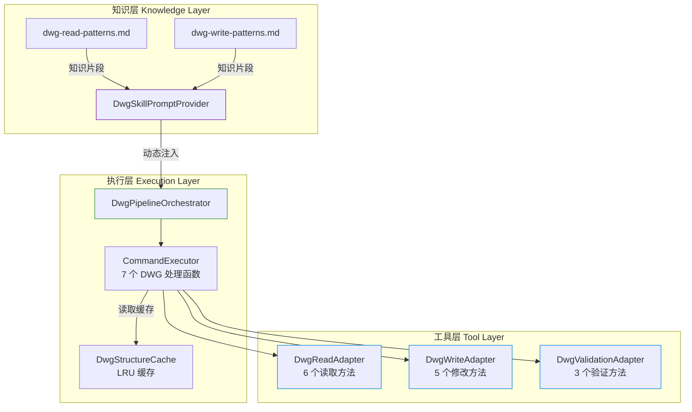
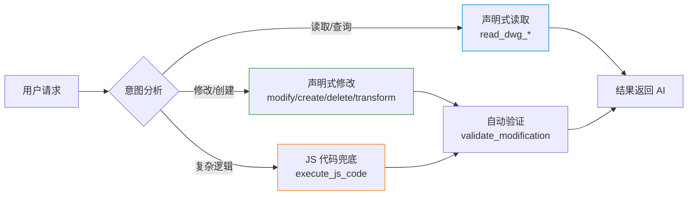
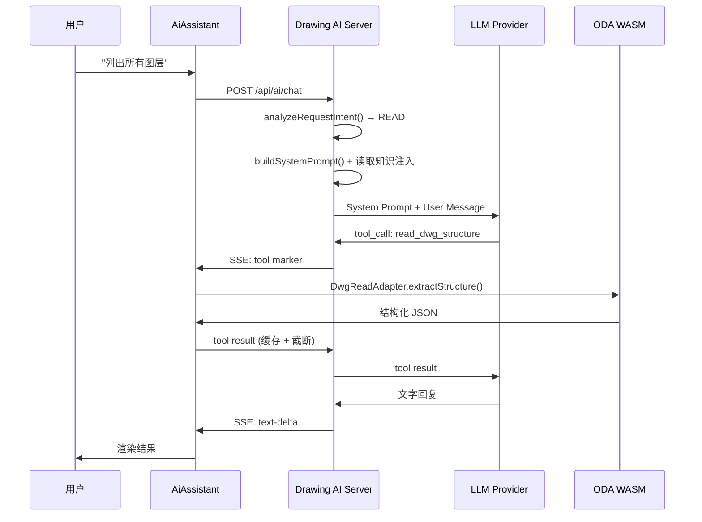

# DWG Skill 架构设计

> 参考 Anthropic [[PDF Skill]] + Office [[Skills]] 设计哲学，为 Web CAD 平台构建完整的 DWG 读取解析与修改 Agent 能力体系。

## 核心设计哲学

**"DWG 是结构化数据库，让 AI 操作结构化数据"**

| Skill | 核心洞察 | 执行策略 |
|-------|---------|---------|
| [[PDF Skill]] | PDF 有丰富的结构化数据（表单/文字/元数据） | pypdf/pdfplumber 预构建提取器 |
| Office [[Skills]] | OOXML 本质是 ZIP + XML 文本 | 解包 → AI 编辑 XML → 打包 |
| **[[DWG Skill]]** | DWG 通过 ODA 打开 = 实体数据库 | 结构化读取 → 声明式修改 → 自动验证 |

## 三层架构



## 工具体系（23 个）

### 后端工具模块化

旧架构: `CadToolDefinitions.java` 单文件 11 个工具

新架构: 6 个模块，23 个工具

| 模块 | 文件 | 工具数 | 职责 |
|------|------|--------|------|
| `read/` | DwgReadTools.java | 5 | DWG 结构化读取 |
| `write/` | DwgWriteTools.java | 4 | 声明式实体修改 |
| `pipeline/` | DwgPipelineTools.java | 3 | 验证与 QA 管线 |
| `execution/` | DwgExecutionTools.java | 2 | 原始代码执行（兜底） |
| `analysis/` | DwgAnalysisTools.java | 6 | 图纸分析 + RAG 检索 |
| `interaction/` | DwgInteractionTools.java | 3 | 用户交互 |

### 三路径执行模型



**选择策略**：声明式优先 → JS 代码兜底 → SCR 脚本最后

## 前端适配器

### DwgReadAdapter（对标 unpack.py）

6 个静态方法，预构建查询模板，自带[[内存管理]]：

| 方法 | 功能 | 输出 |
|------|------|------|
| `extractStructure()` | 图层/块/样式/实体统计 | 完整结构 JSON |
| `extractEntities(filter)` | 按条件过滤实体 | 实体详情数组 |
| `extractTextContent(filter)` | 文字内容+位置 | 文字信息数组 |
| `extractBlockReferences(name?)` | 块引用+属性值 | 块引用数组 |
| `extractDimensions(filter)` | 标注信息 | 标注数组 |
| `spatialQuery(bbox)` | 空间范围查询 | 实体数组 |

**结果限制**: MAX_ENTITIES=200, MAX_TEXTS=300, MAX_BLOCK_REFS=200, MAX_DIMENSIONS=200

### DwgWriteAdapter（对标 pack.py）

5 个静态方法，声明式操作描述驱动 WASM 执行：

| 方法 | 功能 | 特性 |
|------|------|------|
| `modifyEntities(filter, patch)` | 批量属性修改 | 两遍扫描，自动 undo |
| `createEntities(descriptions)` | 实体创建（7 类型） | 声明式描述 |
| `deleteEntities(filter)` | 条件删除 | 计数确认 |
| `transformEntities(filter, transform)` | 几何变换 | 移动/旋转/缩放/镜像 |
| `undo(viewer)` | 撤销 | 调用 pDb.undo() |

### DwgValidationAdapter

自动快照与差异对比：

- `captureState()` — 操作前快照
- `compareStates(before, after)` — 结构化 diff
- `validateModification(expected, diff)` — 期望值校验

### DwgStructureCache（LRU）

- 最多 20 条缓存
- 读取操作命中缓存直接返回
- 写操作（modify/create/delete/transform/undo）后自动失效

## 知识注入体系

### 意图分析

`SystemPromptService.analyzeRequestIntent()` 通过关键词检测用户意图：

| 意图 | 触发关键词 | 注入知识 |
|------|-----------|---------|
| READ | 读取、查看、列出、统计 | 读取模式 + 工具选择 |
| MODIFY | 修改、改变、设置、更新 | 修改流程 + 验证规则 |
| CREATE | 创建、绘制、添加、新建 | 创建规范 + 实体描述格式 |
| DELETE | 删除、移除、清除 | 删除确认 + 安全规则 |
| TRANSFORM | 移动、旋转、缩放、镜像 | 变换参数规范 |
| MIXED | 混合意图 | 全量注入 |

### 动态 System Prompt

```
基础 Prompt（身份 + 核心原则）
  + 图纸状态上下文
  + 意图匹配的知识片段
  + 工具选择指南
  + QA 规则
```

## 上下文优化

### 工具结果压缩

`ChatService.compressToolResponses()`:
- 超过 4000 字符的工具结果自动截断
- 附加摘要提示引导 AI 缩小查询范围

### 读取缓存

`DwgStructureCache`:
- 同一对话中重复读取同一查询直接返回缓存
- 写操作后缓存自动失效
- UI 显示 ⚡缓存 标记

## 数据流



## 相关笔记

- [[ai-agent]]
- [[WebUACAD AI Agent 全面分析报告]]
- [[AI 绘图助手 — 实现文档]]
- [[CAD AI Agent 改进计划]]
- [[RAG 知识库 — AutoCAD 帮助文档检索系统]]
- [[规划审图 AI 智能体解决方案]]
- [[DWG Skill 深度重构优化记录]]
- [[Office Document Skills 实现原理分析（DOCX / XLSX / PPTX）]]
