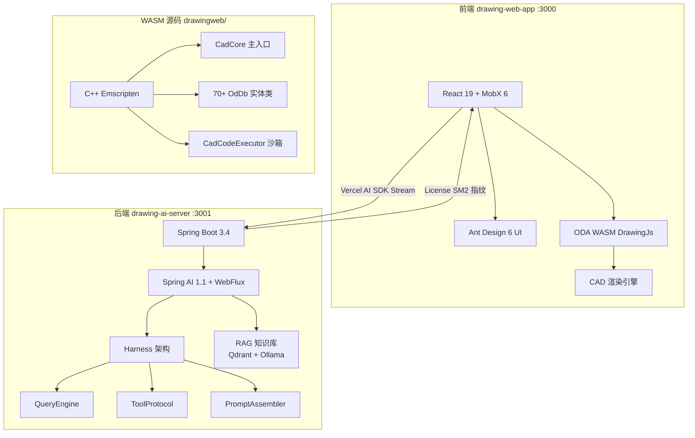

# drawing-cad — Web CAD 图纸平台

> 基于 ODA WASM 引擎的浏览器端 CAD 查看器/编辑器 + AI 智能审图。这是 UOCS 中技术最复杂的子项目。

## 为什么这个项目复杂？

Web CAD 要在浏览器里运行一个原本需要桌面应用的 CAD 引擎。核心技术挑战：

1. **WASM 引擎** — C++ CAD 引擎编译为 WebAssembly，需要处理线程、内存、性能
2. **License Gate** — SM2 国密算法 + 硬件指纹的授权体系，防止盗用
3. **AI 审图** — 大语言模型 + RAG 知识库审阅图纸合规性
4. **性能优化** — 大型 DWG 文件的加载、渲染、交互流畅度

## 三个核心组件



## 子目录导航

| 目录 | 内容 | 入门文档 |
|------|------|----------|
| [[WebCAD前端/]] | React 前端架构、功能说明、设计规格 | [[WebCAD前端/前端架构\|前端架构]] |
| [[AI后端/]] | AI 审图后端、Harness 架构、License Gate | [[AI后端/Harness架构详解\|Harness 架构详解]] |
| [[WASM引擎/]] | WASM C++ 绑定分析、API 覆盖报告 | — |
| [[Cursor开发笔记/]] | 使用 Cursor AI 开发时的笔记 | — |

### WebCAD前端 子目录

| 目录 | 说明 |
|------|------|
| [[WebCAD前端/功能说明/]] | 图纸比对、前后端对接等功能说明 |
| [[WebCAD前端/技术参考/]] | WASM API 速查、CadCodeExecutor 沙箱、GIS 接口 |
| [[WebCAD前端/设计规格/]] | specs（功能设计文档）、plans（实施计划）、superpowers |
| [[WebCAD前端/设计规格/specs/]] | 11 份功能设计文档（GIS、标注、图纸记忆等） |

### AI后端 子目录

| 目录 | 说明 |
|------|------|
| [[AI后端/ai-agent/]] | AI 智能体分析、实现、改进方案 |
| [[AI后端/Agent优化记录/]] | Agent 优化过程记录 |

## 技术栈速览

| 层 | 技术 |
|----|------|
| 前端框架 | React 19 + MobX 6 + Ant Design 6 + Vite 7 |
| CAD 引擎 | ODA WASM (DrawingJs) |
| 后端框架 | Spring Boot 3.4 + Spring AI 1.1 + WebFlux |
| AI 协议 | Vercel AI SDK UI Message Stream |
| 向量数据库 | Qdrant（集合 `drawing_knowledge`） |
| Embedding | Ollama (bge-m3) |
| License | SM2 (Bouncy Castle) + OSHI 硬件指纹 |
| WASM 源码 | C++ Emscripten 绑定（70+ OdDb 实体类） |

## 建议阅读路线

```
前端架构 → Harness架构详解 → License Gate → WASM引擎 → AI Agent
```
