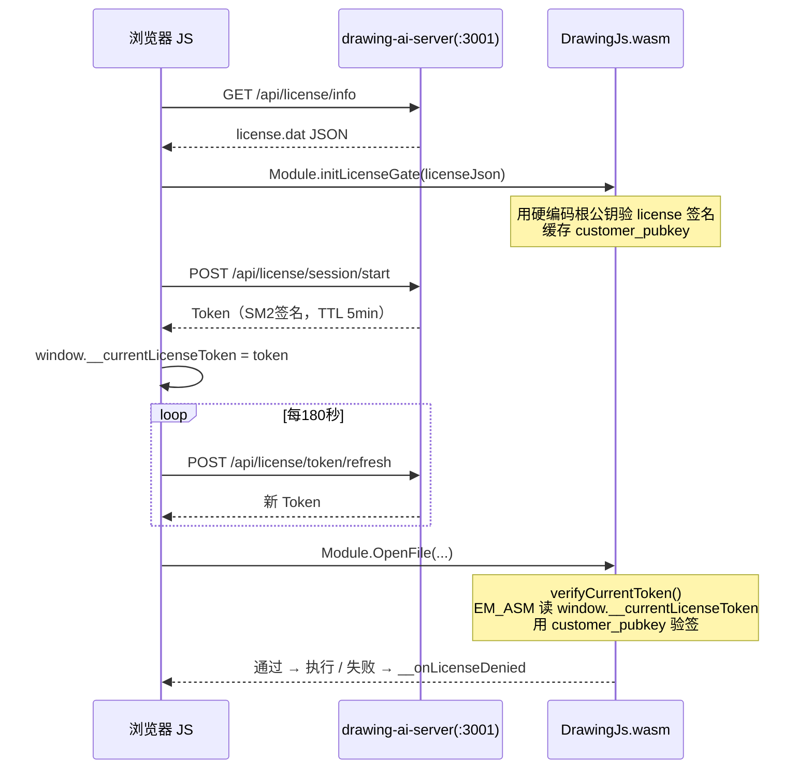

# WASM License Gate 实施报告（p17-wasm-report-3）

**报告日期**：2026-05  
**报告对象**：`drawing-cad/drawingweb` 仓库维护者  
**优先级**：⭐⭐ 高（防盗用核心防线，WASM 侧不接入则整条链路无实际防护）

---

## 状态摘要

| 侧 | 状态 | 说明 |
|---|---|---|
| **后端（drawing-ai-server）** | ✅ **已完成** | 提交 `92eda17` `d1a287e`，[[Spring Boot]] 3.5 + WebFlux，国密 SM2/SM3 |
| **前端（drawing-web-app）** | ✅ **已完成** | `LicenseStore.js`、`useWasmModule` 集成，Token 刷新心跳 |
| **WASM（drawingweb C++）** | ❌ **待实施** | 本报告核心内容 |

**结论**：前端/后端已完整实现，仅 WASM 侧缺少 `LicenseGate.h/cpp` 插桩——这是防绕过的最后防线。

---

## 架构概览



---

## WASM 侧需要做的改动

改动规模：**7 处，全部为新增**，不修改任何现有业务逻辑。

| # | 文件 | 类型 | 规模 |
|---|------|------|------|
| 1 | `LicenseGate.h`（仓根） | **新增** | ~60 行 |
| 2 | `LicenseGate.cpp`（仓根） | **新增** | ~250 行 |
| 3 | `root_pubkey.inc`（仓根，自动生成） | **新增** | 1 行常量 |
| 4 | `CadCore.cpp:571`（`OpenFile`） | **插桩** | +10 行 |
| 5 | `CadCore.cpp:587`（`CreateNewFile`） | **插桩** | +10 行 |
| 6 | `CadCoreWebBridge.cpp`（embind） | **新增 2 个导出** | +10 行 |
| 7 | `CMakeLists.txt` | **新增 1 个源文件** | +3 行 |

---

## 插桩模板（OpenFile/CreateNewFile）

```cpp
// CadCore.cpp:571 — OpenFile 插桩（CreateNewFile 同样处理）
bool CadCore::OpenFile(const std::string& path) {
    // ★ License Gate 插桩
    if (!LicenseGate::instance().verifyCurrentToken()) {
        EM_ASM({
            if (typeof Module.__onLicenseDenied === 'function')
                Module.__onLicenseDenied(UTF8ToString($0));
        }, LicenseGate::instance().lastError().c_str());
        return false;   // 不修改原有 return 路径
    }
    // ★ 插桩结束 — 以下为原有逻辑（不修改）
    // ... 原代码 ...
}
```

---

## embind 导出（CadCoreWebBridge.cpp）

```cpp
EMSCRIPTEN_BINDINGS(license_gate) {
    emscripten::function("initLicenseGate", emscripten::optional_override(
        [](const std::string& licenseJson) -> bool {
            return LicenseGate::instance().initFromLicenseJson(licenseJson);
        }
    ));
    emscripten::function("getLicenseGateError", emscripten::optional_override(
        []() -> std::string {
            return LicenseGate::instance().lastError();
        }
    ));
}
```

---

## 关键密码学约定（必须与后端对齐）

| 参数 | 值 | 说明 |
|------|-----|------|
| 签名算法 | SM2 + SM3 | GMT 0009 标准 |
| SM2 userId | `"1234567812345678"` | 与 Java `Sm2Helper` 对齐 |
| Token 格式 | `base64url(payload).base64url(R‖S)` | `.` 分隔，R‖S 共 64 字节 |
| 根公钥格式 | 65 字节 uncompressed，130 hex | 编译时注入 `root_pubkey.inc` |
| GmSSL 符号 | `SM2_verify` / `sm2_do_verify` | 见 `asyncify_whitelist.txt:8534-8543` |

---

## 详细实现文档

完整代码（LicenseGate.h/cpp 全文 + CMakeLists.txt 改动 + token 解析逻辑）请参阅：

→ **[drawing-web-app/docs/技术参考/wasm-license-gate-cpp-patch.md](../drawing-web-app/docs/技术参考/wasm-license-gate-cpp-patch.md)**

后端/前端协议设计请参阅：

→ **[drawing-ai-server/docs/License-Gate.md](../drawing-ai-server/docs/License-Gate.md)**  
→ **[docs/WebUACAD授权管理/2026-04-15-wasm-license-gate-design.md](WebUACAD授权管理/2026-04-15-wasm-license-gate-design.md)**

---

## 验收检查表

```
[ ] LicenseGate.h / LicenseGate.cpp 新增于仓根
[ ] root_pubkey.inc 由厂商提供的 root_pubkey.pem 导出（130 hex 字符）
[ ] CadCore.cpp OpenFile 函数顶部添加 verifyCurrentToken() 插桩
[ ] CadCore.cpp CreateNewFile 函数顶部添加 verifyCurrentToken() 插桩
[ ] embind 导出 initLicenseGate 和 getLicenseGateError
[ ] CMakeLists.txt 加入 LicenseGate.cpp 源文件
[ ] 构建成功，无编译警告
[ ] 端到端测试：无 Token 时 OpenFile 返回 false 并触发 __onLicenseDenied
[ ] 端到端测试：有效 Token 时 OpenFile 正常执行
```
