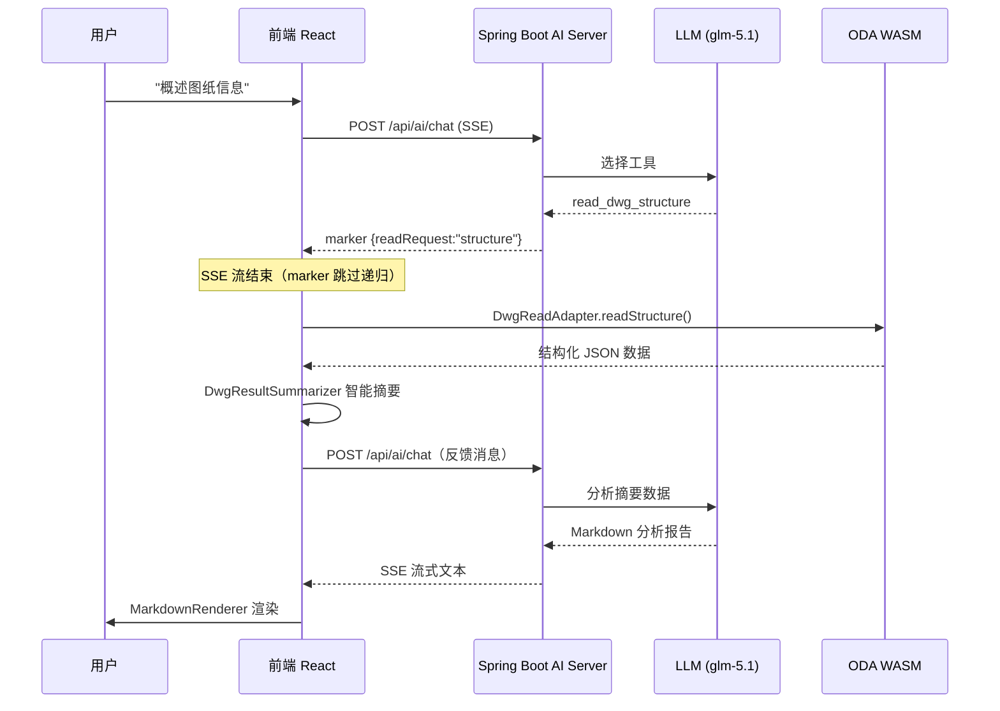
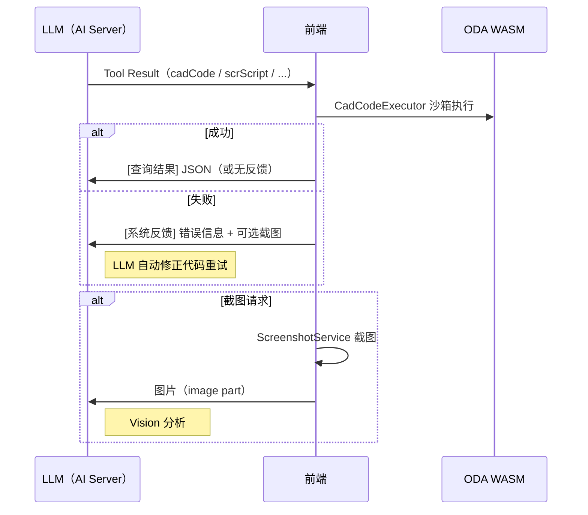

# 前端架构详情

DrawingWebApp 前端架构补充文档（详细目录、协议流程图、工具模块表、组件职责分工）。

---

## 完整目录结构

```
drawing-web-app/
├── src/                          # 前端源码
│   ├── App.jsx                   # 根组件（observer）
│   ├── main.jsx                  # 入口 — StrictMode + StoreProvider
│   ├── components/               # UI 组件（每个一个目录 + module.css）
│   │   ├── AiAssistant/          # ⭐ AI 对话面板
│   │   │   ├── AiAssistant.jsx   # 面板容器（useChat + 布局 + 展开/折叠）
│   │   │   ├── MessageList.jsx   # 消息列表渲染（分发 text/tool/system）
│   │   │   ├── ToolCallBadge.jsx # 工具调用状态徽章
│   │   │   ├── WelcomeScreen.jsx # 欢迎屏（快捷按钮 + 指引）
│   │   │   ├── CollapsibleText.jsx # 可折叠长文本
│   │   │   ├── WorkspaceFilePicker.jsx # 工作区文件选择器
│   │   │   ├── MarkdownRenderer.jsx # react-markdown 渲染 AI 响应
│   │   │   ├── MarkdownRenderer.module.css # 暗/亮主题 Markdown 样式
│   │   │   ├── constants.js      # SERVER_SIDE_TOOLS 等常量
│   │   │   ├── helpers.js        # 消息解析、格式化工具函数
│   │   │   └── hooks/            # 自定义 Hooks
│   │   │       ├── useToolExecution.js  # 工具执行状态管理
│   │   │       ├── useAttachments.js    # 附件系统（拾点/选择/截图/文件）
│   │   │       ├── usePointPick.js      # 拾点交互
│   │   │       ├── useObjectSelect.js   # 对象选择交互
│   │   │       ├── useAreaPick.js       # 区域拾取交互
│   │   │       └── useMessageEditing.js # 消息编辑
│   │   ├── CanvasArea/           # CAD 画布
│   │   ├── Ribbon/               # 工具栏
│   │   ├── TopBar/TabBar/StatusBar/BottomDock/
│   │   ├── RightSidebar/SidePanels/
│   │   ├── CompareResultPanel/   # 图纸比对结果
│   │   ├── ReviewLayerPanel/     # 审图批注图层
│   │   ├── LicenseErrorOverlay/  # ⭐ License 失败/429 全屏蒙层（与 LicenseStore 配合）
│   │   ├── GisService/           # ⭐ GIS 服务面板（9 个组件：ServiceBrowser/AuthManager/
│   │   │                         #   Import/Export/StyleMapping/Log/CrsInfo/AddService + Tab 容器）
│   │   └── ...各种对话框组件
│   ├── stores/                   # MobX 状态管理
│   │   ├── RootStore.js          # 根 Store（聚合所有子 Store）
│   │   ├── AppStore.js           # 全局应用状态（主题、WASM 就绪、loadingText 等）
│   │   ├── EditorStore.js        # 编辑器状态（含 dynamicPromptEnabled）
│   │   ├── CompareStore.js       # 图纸比对状态
│   │   ├── LicenseStore.js       # ⭐ License 握手/心跳/session end
│   │   └── GisStore.js           # ⭐ GIS 服务列表/认证/样式映射/日志
│   ├── services/                 # 业务服务层
│   │   ├── ViewerService.js      # 核心 Viewer 操作（WASM 桥接 + GIS 加载/导出/代理）
│   │   ├── CadCodeExecutor.js    # 沙箱执行 AI 生成的 JS 代码
│   │   ├── CommandExecutor.js    # 调度 viewer.execute() + DWG Skill 7 类标记处理
│   │   ├── DwgReadAdapter.js     # DWG 结构化读取适配器（6 个预构建查询）
│   │   ├── DwgWriteAdapter.js    # DWG 声明式修改适配器（5 个操作方法）
│   │   ├── DwgValidationAdapter.js # DWG 修改验证（快照/差异/校验）
│   │   ├── DwgPipelineOrchestrator.js # DWG 操作管线编排
│   │   ├── DrawingStateCache.js  # DrawingState 脏标记缓存
│   │   ├── DwgResultSummarizer.js # WASM 读取结果智能摘要
│   │   ├── ScreenshotService.js  # 截图服务
│   │   ├── TitleBlockAnalyzer.js # 图签识别
│   │   └── DiagnosticReporter.js # 诊断报告
│   ├── hooks/
│   │   └── useWasmModule.js      # WASM 模块加载 Hook（postRun 挂 __currentLicenseToken +
│   │                             #   __onLicenseDenied + GIS 回调；URL ?demo= 等 license ready）
│   └── context/
│       └── ViewerContext.jsx     # MobX Store Provider（useStores）
├── public/                       # 静态资源（.gitignore 中，不提交）
│   ├── DrawingJs.wasm/js/data    # ODA WASM 引擎
│   ├── notation.js               # ODA 枚举常量
│   ├── samples/                  # 示例 DWG（building / mechanical / gis）
│   └── icons/                    # 图标
├── docs/                         # 文档
│   ├── wasm-license-gate-cpp-patch.md  # ⭐ WASM 侧 C++ 插桩修改报告
│   └── ...
└── vite.config.js                # Vite 配置（代理 /api → :3001）
```

> **后端已迁移**：早期 `server/` 下的 Node.js 后端已整体重写为 `drawing-cad/drawing-ai-server/`，前端仅通过 `/api/*` 与之交互。

---

## Split-Brain 标记协议流程



---

## 执行反馈循环



---

## 7 模块 30 个工具

| 模块 | 工具数 | 类型 | 说明 |
|------|--------|------|------|
| `tool/read/` | 5 | marker | DWG 结构/文字/块/实体/标注读取 |
| `tool/write/` | 4 | marker | DWG 修改/创建/删除/变换 |
| `tool/pipeline/` | 3 | marker | 验证/视觉QA/撤销 |
| `tool/execution/` | 2 | marker | JS Code / SCR Script 执行 |
| `tool/analysis/` | 6 | 直接 | 分析/RAG检索/图框检测/精确测量 |
| `tool/interaction/` | 3 | marker | 截图/用户选择/任务规划 |
| `tool/review/` | 6 | 混合 | ⭐ 审图工具（3 服务端 + 3 客户端 marker） |

### 审图专用工具

| 工具 | 执行端 | 说明 |
|------|--------|------|
| `start_comprehensive_review` | 服务端 | 初始化 7 维度审查计划 |
| `batch_record_findings` | 服务端 | 批量记录审查发现（≤50 条/次） |
| `check_review_progress` | 服务端 | 查询各维度审查进度 |
| `get_review_standards` | 服务端 | 获取审图标准知识 |
| `generate_review_report` | 服务端 | 生成结构化审图报告 |
| `check_layer_naming` | 前端 WASM | 检查图层命名规范 |
| `check_text_styles` | 前端 WASM | 检查文字样式一致性 |
| `create_review_markup` | 前端 WASM | 创建审图批注标记 |

---

## AiAssistant 组件职责

`components/AiAssistant/` 采用职责单一原则，各子组件分工明确：

| 文件 | 职责 |
|------|------|
| `AiAssistant.jsx` | 面板容器：布局、展开/折叠、`useChat` 接入 |
| `MessageList.jsx` | 消息列表渲染，按消息类型分发（text / tool / system） |
| `ToolCallBadge.jsx` | 工具调用状态徽章（pending / running / done / error） |
| `WelcomeScreen.jsx` | 欢迎屏：快捷操作按钮 + 使用指引 |
| `CollapsibleText.jsx` | 可折叠长文本组件（超过阈值自动折叠） |
| `WorkspaceFilePicker.jsx` | 工作区文件选择器（供附件上传使用） |
| `MarkdownRenderer.jsx` | react-markdown + remark-gfm 渲染，自定义代码块/表格/链接 |
| `constants.js` | `SERVER_SIDE_TOOLS` 等常量定义 |
| `helpers.js` | 消息解析、格式化、内容提取工具函数 |
| `hooks/useToolExecution.js` | 工具执行状态管理（running/pending/result） |
| `hooks/useAttachments.js` | 附件系统（拾点/对象选择/截图/文件上传） |
| `hooks/usePointPick.js` | 点拾取交互（与 WASM 配合） |
| `hooks/useObjectSelect.js` | 对象选择交互 |
| `hooks/useAreaPick.js` | 区域拾取交互 |
| `hooks/useMessageEditing.js` | 消息编辑（重发、修改历史消息） |
