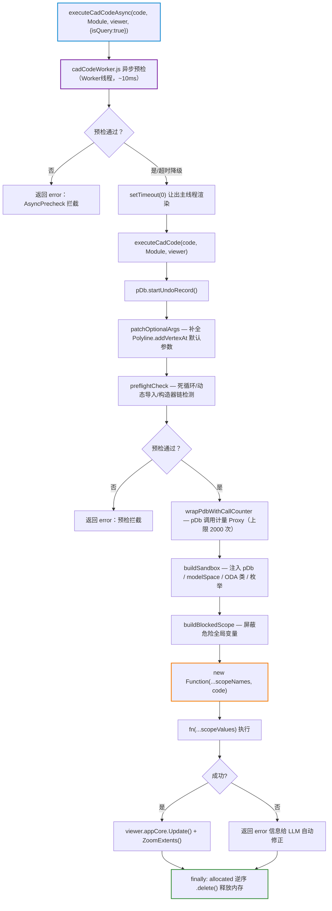

# CadCodeExecutor 沙箱

> 文件：`src/services/CadCodeExecutor.js`。AI 生成的 JS 代码通过 `new Function()` 在受控作用域中执行。
>
> **⚠️ 安全定位（重要）**：这是**误用防护（Misuse Prevention）**，不是安全沙箱。
> `new Function()` 在同 realm 中执行，构造器链（如 `Array.constructor("return globalThis")()`）理论上仍可逃逸。
> 本执行器的目标是防止 LLM 生成代码意外访问 DOM/网络/存储，并在死循环/过度写入时及时告警——
> 不适用于执行不可信第三方代码。

## 安全策略 — 黑名单机制

| 屏蔽类型 | 被设为 `undefined` 的全局变量 |
|---------|----------------------------|
| 代码执行 | `eval`, `Function`, `setTimeout`, `setInterval`, `setImmediate` |
| 网络访问 | `XMLHttpRequest`, `fetch`, `WebSocket`, `Worker`, `SharedWorker` |
| 存储 | `localStorage`, `sessionStorage`, `indexedDB`, `caches` |
| DOM/浏览器 | `document`, `window`, `globalThis`, `self`, `top`, `parent`, `frames`, `opener`, `location`, `history`, `navigator` |
| 用户交互 | `alert`, `confirm`, `prompt` |
| 模块加载 | `importScripts`, `require`, `process` |
| 底层能力（P15 新增） | `WebAssembly`, `crossOriginIsolated`, `performance`, `crypto` |

## 预置变量

| 变量 | 说明 |
|------|------|
| `pDb` | 当前 `OdDbDatabase`（通过 `viewer.appCore.getDb()` 获取；**P15 起经 pDb 调用计量 Proxy 包装**） |
| `modelSpace` | 模型空间 `OdDbBlockTableRecord`（写模式打开，自动追踪回收） |
| `OpenMode` | 枚举快捷引用（`kForRead=0`, `kForWrite=1`） |

## 辅助函数

| 函数 | 签名 | 说明 |
|------|------|------|
| `OpenAs` | `(id, Type, openMode) → instance\|null` | 安全打开 ObjectId 并 cast 为指定类型，自动追踪 |
| `getModelSpace` | `() → OdDbBlockTableRecord` | 获取模型空间（写模式），自动追踪 |
| `getObjectIdByHandle` | `(handleHex: string) → OdDbObjectId` | Handle 十六进制字符串 → ObjectId |
| `setResult` | `(data) → void` | 设置查询结果（`isQuery` 模式下 LLM 读取返回值） |

## 注入的 JS 标准对象

`console`（带 `[CadCode]` 前缀）, `Math`, `JSON`（parse/stringify）, `Array`, `Object`, `parseInt`, `parseFloat`, `isNaN`, `isFinite`, `Date.now`

> 注意：`String` / `Number` / `Boolean` 注入为 `_String` / `_Number` / `_Boolean`，避免与 OdString 冲突。

## 注入的 ODA 实体类（通过 `Type.createObject()` 创建）

**基类**：`OdDbObject`, `OdDbEntity`, `OdDbCurve`, `OdDbDimension`

**绘图实体**：`OdDbLine`, `OdDbCircle`, `OdDbArc`, `OdDbEllipse`, `OdDbPolyline`, `OdDb2dPolyline`, `OdDb3dPolyline`, `OdDb2dVertex`, `OdDb3dPolylineVertex`, `OdDbText`, `OdDbMText`, `OdDbHatch`, `OdDbPoint`, `OdDbTrace`, `OdDbSolid`, `OdDbFace`, `OdDbSpline`, `OdDbLeader`, `OdDbShape`

**块/外部引用**：`OdDbBlockReference`, `OdDbMInsertBlock`, `OdDbAttribute`, `OdDbAttributeDefinition`, `OdDbRasterImage`, `OdDbRasterImageDef`

**标注**：`OdDbAlignedDimension`, `OdDbRotatedDimension`, `OdDbRadialDimension`, `OdDbDiametricDimension`, `OdDb3PointAngularDimension`, `OdDb2LineAngularDimension`, `OdDbArcDimension`, `OdDbOrdinateDimension`, `OdDbRadialDimensionLarge`

**3D/曲面/网格**：`OdDb3dSolid`, `OdDbRegion`, `OdDbBody`, `OdDbSurface`, `OdDbPlaneSurface`, `OdDbSubDMesh`, `OdDbPolygonMesh`, `OdDbPolygonMeshVertex`, `OdDb3dProfile`

**符号表**：`OdDbSymbolTable/Record`, `OdDbBlockTable/Record`, `OdDbLayerTable/Record`, `OdDbLinetypeTable/Record`, `OdDbTextStyleTable/Record`, `OdDbDimStyleTable/Record`, `OdDbViewportTableRecord`

**迭代器**：`OdDbSymbolTableIterator`, `OdDbObjectIterator`

**其他**：`OdDbViewport`, `OdDbPlotSettings`, `OdDbTable`, `OdDbDictionary`, `OdDbGroup`, `OdDbMaterial`, `OdDbMLeaderStyle`, `OdDbSortentsTable`, `OdDbIdMapping`, `OdDbIdBuffer`, `OdDbObjectIdArray`, `OdDbVertexRef`, `OdDbFullSubentPath/Array`, `OdDbAssocArrayPolarParameters`, `OdDbAssocArrayPathParameters`, `OdDbSelectionSet`, `OdDbGripData`, `OdDbGripOperations`

## 注入的几何类（通过 `new Type(...)` 创建）

`OdGePoint3d`, `OdGePoint2d`, `OdGeVector3d`, `OdGeVector2d`, `OdGeMatrix3d`, `OdGePoint3dArray`, `OdGePoint2dArray`, `OdGeVector2dArray`, `OdGeCircArc2d`, `OdGeLine2d`, `OdGeExtents2d`, `OdGeScale3d`, `OdGeTol`, `OdGePlane`, `OdGeQuaternion`

## 注入的工具类

`OdCmColor`, `OdCmTransparency`, `OdCmEntityColor`, `OdString`, `OdResBuf`, `OdDbHandle`, `OdRxVariantValue`, `OdRxVariant`, `OdHatchPattern`, `OdHatchPatternLine`, `OdIntArray`, `OdGeDoubleArray`, `EdgeArray`, `VectorString`, `OdDbObjectId`, `OdValue`, `OdDbDate`

## 注入的枚举

`OpenMode`, `SaveType`, `DwgVersion`, `HatchPatternType`, `HatchLoopType`, `HatchStyle`, `ACIcolorMethod`, `LineWeight`, `ValueType`, `OsnapMode`, `OdResult`, `UnitsValue`, `Mode`, `SubentSelectionMode`, `TextHorzMode`, `TextVertMode`, `AttachmentPoint`, `Visibility`, `SubentType`, `Vertex2dType`, `Vertex3dType`, `SplineType`, `Planarity`, `FlowDirection`, `ColorMethod`, `TransparencyMode`

## 注入的全局函数

`odcmAcadPalette`, `createPolarArrayParameters`, `createPathArrayParameters`, `createEdgeRefFromEntity`, `createPolarArrayInstance`, `setPathForPathParameters`, `releaseEdgeRef`, `oddbCreateEdgesFromEntity`, `oddbAppendLoopFromPickPoint`

## 内存管理

- 所有通过 `createObject()` 或 `new` 创建的 embind 对象由 `wrapWithTracking` / `wrapConstructor` 自动追踪到 `allocated` 数组
- 执行结束后 `finally` 块逆序调用 `.delete()` 统一释放
- **AI 生成的代码无需手动调用 `.delete()`**

## 执行流程

> **同步入口**：`executeCadCode(code, Module, viewer)` — 跳过 Worker 预检和 setTimeout 调度，直接执行（适用于写操作，不接受延迟）。
>
> **调试技巧**：浏览器控制台执行 `window.__cadCodeHistory` 查看所有历史执行记录（代码、结果、错误、pDbCallCount、分配对象数）。

## P15 新增防护机制

### preflightCheck 扩展检测项

| 检测目标 | 正则 / 规则 | 说明 |
|---------|------------|------|
| `while(true)` 死循环 | `/while\s*\(\s*true\s*\)/` | LLM 常见写法 |
| `while(1)` 死循环 | `/while\s*\(\s*1\s*\)/` | 等价写法 |
| `while(!0)` 死循环 | `/while\s*\(\s*!0\s*\)/` | 压缩写法 |
| `while(!false)` 死循环 | `/while\s*\(\s*!false\s*\)/` | 罕见但可能 |
| `for(;;)` 死循环 | `/for\s*\(\s*;\s*;\s*\)/` | 经典死循环 |
| 动态导入 | `/import\s*\(/` | 绕过黑名单 |
| 构造器链逃逸 | `Array.constructor(` / `[].constructor(` | 获取 globalThis 逃逸 |

> `with` 语句无需检测：代码已包裹在 `"use strict"` 中，`with` 是语法错误，运行时直接拒绝。

### pDb 调用计量 Façade（wrapPdbWithCallCounter）

`pDb` 对象在沙箱注入前经过 Proxy 包装，统计直接方法调用次数：
- **上限**：2000 次/次执行（LLM 正常代码远低于此值，仅防意外大循环）
- **超限处置**：抛出 `[pDb 调用超限]` 异常，终止执行
- **计量范围**：仅 `pDb` 直接方法；`modelSpace`、entity 对象等次级对象不在计量范围
- **日志**：执行结束后 `pDbCallCount` 字段记录在 `__cadCodeHistory`

### cadCodeWorker.js — 异步预检 Worker

Worker 在独立线程做**纯静态代码分析**，不接触 WASM：
- 代码 Hash 缓存（LRU 50 个），重复代码直接命中
- 检测：动态 `import()`、构造器链逃逸、原型链污染（`__proto__`/`prototype`）、死循环（5 种变体）、循环数量（上限 20 个）、代码体积（超 50KB 拒绝）
- 超时（200ms）→ 自动降级返回 `safe: true`，由主线程 preflightCheck 兜底
- Worker 故障 → 降级，不阻塞执行

> ODA WASM `Module`、`viewer`、`pDb` 均不可序列化，Worker 只做静态分析，WASM 执行仍在主线程。

## 架构约束 — IIFE 隔离

`CadCodeExecutor.js` 用 IIFE 包装执行代码，防止沙箱变量碰撞：
- `new Function(...scopeNames, code)` 注入的参数（如 `modelSpace`）与 LLM 生成的同名变量冲突
- 写法：`(function(){ ${code} }).call(this)`

## 已知边界与非目标

| 问题 | 状态 | 说明 |
|------|------|------|
| 构造器链逃逸（`Array.constructor("return globalThis")()`） | **无法完全阻止** | `new Function` 同 realm 执行的根本限制；preflightCheck 检测常见写法但不能枚举所有变体 |
| WASM 单次调用无法中断 | **架构约束** | `checkBudget` 协作式超时依赖循环体内调用；LLM 生成的单次大 WASM 调用无法超时 |
| Worker 预检不是安全屏障 | **设计定位** | Worker 只做静态分析，不能检测所有运行时问题；真正的防护靠黑名单 + preflightCheck |
