# Office Document Skills 实现原理分析（DOCX / XLSX / PPTX）

> 分析对象：Anthropic 官方 `document-skills` 插件中的 `docx`、`xlsx`、`pptx` 三个 Skill  
> 源码位置：`~/.claude/plugins/cache/anthropic-agent-skills/document-skills/<commit>/skills/{docx,xlsx,pptx}/`  
> 关联文档：[PDF-Skill-实现原理分析.md](./PDF-Skill-实现原理分析.md)

---

## 目录

1. [总体架构：共享 Office 基础设施](#1-总体架构共享-office-基础设施)
2. [OOXML 文件格式基础](#2-ooxml-文件格式基础)
3. [DOCX Skill 详解](#3-docx-skill-详解)
4. [XLSX Skill 详解](#4-xlsx-skill-详解)
5. [PPTX Skill 详解](#5-pptx-skill-详解)
6. [共享 office/ 工具链逐一详解](#6-共享-office-工具链逐一详解)
7. [专有脚本逐一详解](#7-专有脚本逐一详解)
8. [三种 Skill 对比矩阵](#8-三种-skill-对比矩阵)
9. [与 PDF Skill 的差异对比](#9-与-pdf-skill-的差异对比)
10. [设计哲学总结](#10-设计哲学总结)

---

## 总体架构：共享 Office 基础设施

DOCX / XLSX / PPTX 三个 Skill 共享一套 `scripts/office/` 工具链，形成统一的"解包 → 编辑 → 打包"流水线。

### 目录结构

```
docx/                           xlsx/                         pptx/
├── SKILL.md                    ├── SKILL.md                  ├── SKILL.md
├── scripts/                    ├── scripts/                  ├── scripts/
│   ├── accept_changes.py       │   ├── recalc.py             │   ├── thumbnail.py
│   ├── comment.py              │   └── office/ → (symlink)   │   ├── add_slide.py
│   ├── templates/              │                              │   ├── clean.py
│   │   ├── comments.xml        │                              │   └── office/ → (symlink)
│   │   ├── commentsExtended.xml│                              │
│   │   ├── commentsIds.xml     │                              │
│   │   └── commentsExtensible.xml                             │
│   └── office/                 ←←← 三个 Skill 共享 ←←←←←←←←←←┘
│       ├── pack.py
│       ├── unpack.py
│       ├── validate.py
│       ├── soffice.py
│       ├── helpers/
│       │   ├── merge_runs.py
│       │   └── simplify_redlines.py
│       ├── validators/
│       │   ├── base.py
│       │   ├── docx.py
│       │   ├── pptx.py
│       │   └── redlining.py
│       └── schemas/            # OOXML XSD 验证规则
```

### 核心流水线

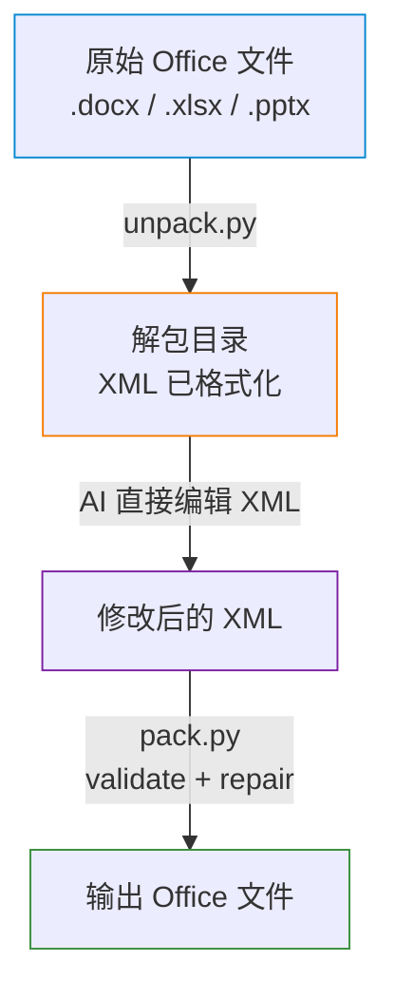

### 与 PDF Skill 的本质差异

| 维度 | [[PDF Skill]] | Office [[Skills]] |
|------|-----------|---------------|
| 文件本质 | 二进制流 | ZIP 压缩包（内含 XML） |
| 编辑方式 | Python 库 API 调用 | 解包 → 直接编辑 XML → 重新打包 |
| 创建方式 | Python（reportlab / pypdf） | JavaScript（docx-js / pptxgenjs / openpyxl） |
| 外部依赖 | 无 | LibreOffice（格式转换 / 公式重算 / 宏执行） |

---

## OOXML 文件格式基础

DOCX、XLSX、PPTX 均基于 **OOXML**（Office Open XML）标准，本质是一个 ZIP 压缩包：

```
document.docx（ZIP）
├── [Content_Types].xml          ← 声明所有部件的 MIME 类型
├── _rels/
│   └── .rels                    ← 顶层关系定义
├── word/                        ← DOCX 特有（XLSX 为 xl/，PPTX 为 ppt/）
│   ├── document.xml             ← 主文档内容
│   ├── styles.xml               ← 样式定义
│   ├── comments.xml             ← 批注
│   ├── media/                   ← 嵌入的图片等
│   └── _rels/
│       └── document.xml.rels    ← 文档内部关系
```

**核心洞察**：因为 Office 文档的内容全部以 XML 形式存储，AI 只需要：
1. 将 ZIP 解压为目录
2. 对 XML 文件进行文本编辑（AI 擅长的）
3. 重新压缩为 ZIP

这就是整个 Office Skill 体系的设计基石。

---

## DOCX Skill 详解

### 能力矩阵

| 操作 | 实现方式 | 工具/库 |
|------|---------|--------|
| **从头创建** | JavaScript | `docx` npm 包（docx-js） |
| **读取内容** | Python | `markitdown` 包 |
| **编辑现有文档** | 解包 → 编辑 XML → 打包 | `unpack.py` + AI + `pack.py` |
| **添加批注** | Python 脚本 | `comment.py`（操作 4 个 XML 文件） |
| **接受修订** | LibreOffice 宏 | `accept_changes.py` |
| **格式转换** | LibreOffice | `soffice --convert-to` |

### 创建流程（docx-js）

SKILL.md 明确指定**从头创建 DOCX 必须使用 JavaScript**，而非 Python：

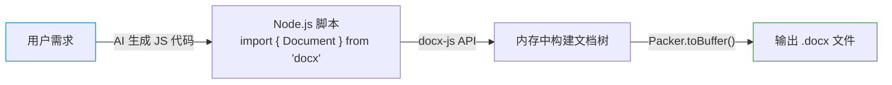

选择 docx-js 而非 python-docx 的原因：
- docx-js 提供声明式 API，更适合 AI 生成代码
- 支持更完整的 OOXML 特性（如复杂表格、页眉页脚）

### 编辑流程（XML 直接操作）

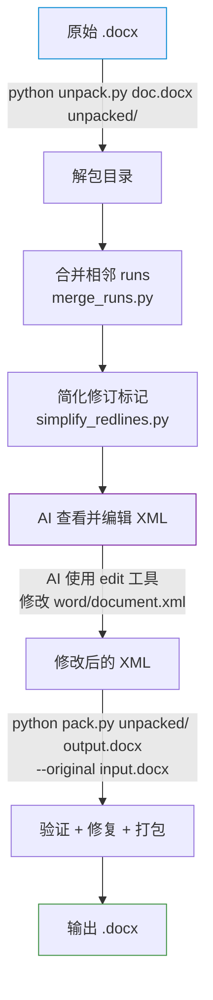

#### 关键设计：为什么要合并 runs？

OOXML 中一个段落内的文本被分割为多个 `<w:r>`（run）元素，每次编辑、拼写检查都可能产生新的 run 切分。AI 面对大量碎片化 run 会：
1. 增加 Token 消耗
2. 难以理解文本语义
3. 编辑时容易出错

`merge_runs.py` 将格式相同的相邻 run 合并为一个，大幅降低 XML 复杂度。

#### 修订追踪（Tracked Changes）

SKILL.md 对修订操作有严格规则：

```
编辑策略：
├── 若用户要求保留修订 → AI 必须手动包裹 <w:ins> / <w:del> 标记
├── 若用户要求接受所有修订 → 调用 accept_changes.py
└── 禁止删除修订标记却不接受更改（会导致文档损坏）
```

### 批注系统（Comments）

DOCX 的批注实现极其复杂，需要同步更新 **4 个 XML 文件 + 2 个关系文件**：

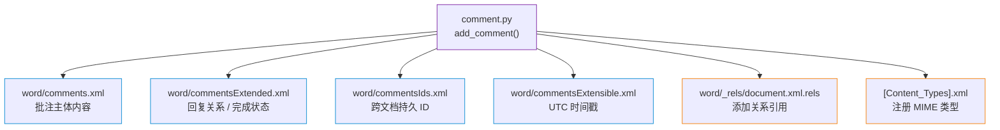

批注脚本运行后还会输出提示，告知 AI 需要在 `document.xml` 中手动添加标记：

```xml
<!-- 批注范围标记 — 必须是 w:p 的直接子节点，不能放在 w:r 内 -->
<w:commentRangeStart w:id="0"/>
<w:r>... 被批注的内容 ...</w:r>
<w:commentRangeEnd w:id="0"/>
<w:r>
  <w:rPr><w:rStyle w:val="CommentReference"/></w:rPr>
  <w:commentReference w:id="0"/>
</w:r>
```

---

## XLSX Skill 详解

### 能力矩阵

| 操作 | 实现方式 | 工具/库 |
|------|---------|--------|
| **创建/编辑** | Python | `openpyxl`（结构化操作） |
| **数据分析** | Python | `pandas`（[[数据读取]]分析） |
| **公式重算** | LibreOffice 宏 | `recalc.py` |
| **读取内容** | Python | `openpyxl`（data_only=True） |

### 创建/编辑流程

与 DOCX/PPTX 不同，XLSX 通常**不需要解包 XML**，而是直接使用 `openpyxl` 的高级 API：


### 核心原则：公式优先

SKILL.md 中最重要的规则：

> **Always use Excel formulas, NEVER hardcode calculated values.**

```python
# ✅ 正确：使用公式
ws['C2'] = '=A2*B2'

# ❌ 错误：硬编码计算结果
ws['C2'] = 150
```

这保证了电子表格的交互性和可维护性。

### 公式重算验证

`recalc.py` 的工作流程：

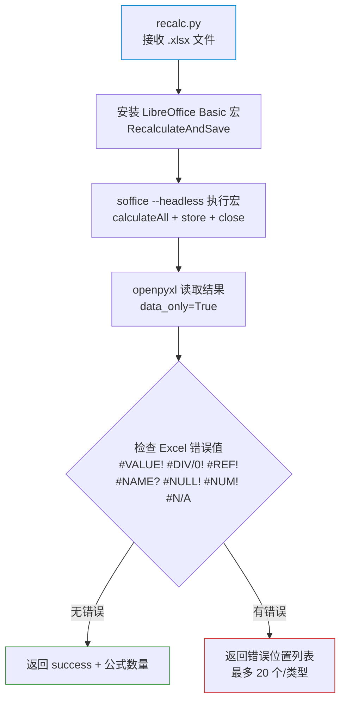

### pandas vs openpyxl 选择策略

| 场景 | 推荐工具 | 原因 |
|------|---------|------|
| 读取数据做分析 | `pandas` | DataFrame 操作更自然 |
| 创建格式化表格 | `openpyxl` | 支持样式、公式、合并单元格 |
| 编辑现有文件 | `openpyxl` | 保留原有格式和公式 |
| 简单数据导出 | `pandas` | `to_excel()` 一行搞定 |

### 财务模型色彩编码

SKILL.md 定义了专业的财务建模规范：

| 颜色 | 含义 |
|------|------|
| 🔵 蓝色 | 硬编码输入值 |
| ⚫ 黑色 | 公式计算值 |
| 🟢 绿色 | 引用其他工作表 |
| 🔴 红色 | 引用外部文件 |

---

## PPTX Skill 详解

### 能力矩阵

| 操作 | 实现方式 | 工具/库 |
|------|---------|--------|
| **从头创建** | JavaScript | `pptxgenjs` npm 包 |
| **读取内容** | Python | `markitdown` 包 |
| **编辑现有文档** | 解包 → 编辑 XML → 打包 | `unpack.py` + AI + `pack.py` |
| **添加幻灯片** | Python 脚本 | `add_slide.py` |
| **清理孤立资源** | Python 脚本 | `clean.py` |
| **视觉预览** | LibreOffice + poppler | `thumbnail.py` |

### 创建流程（pptxgenjs）

与 DOCX 类似，从头创建使用 JavaScript 而非 Python：


### 编辑流程（XML 操作）

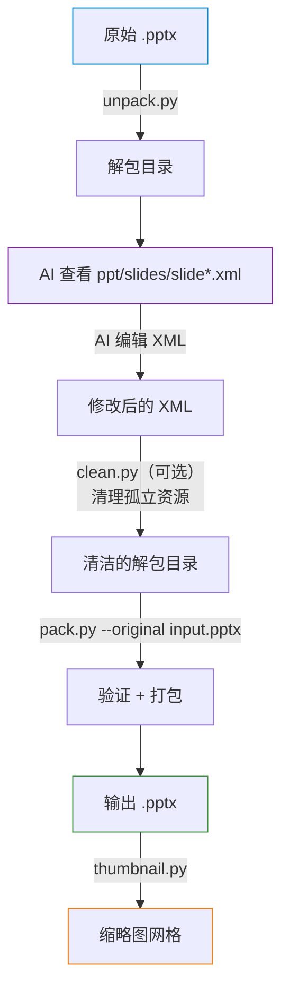

### 视觉 QA 循环（强制）

SKILL.md 将视觉 QA 设为**强制步骤**：

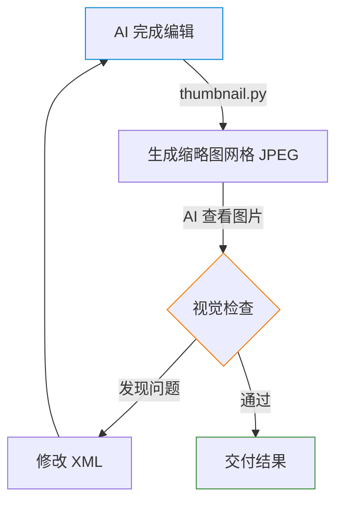

转换链路：`PPTX → (LibreOffice) → PDF → (pdftoppm/poppler) → JPEG 缩略图`

### 设计规范

SKILL.md 内嵌了丰富的演示设计指南：

| 规范 | 要求 |
|------|------|
| 字体层级 | 标题 ≥ 24pt / 正文 ≥ 16pt / 注释 ≥ 12pt |
| 配色方案 | 从 PPTX 内的 `theme*.xml` 提取，保持一致 |
| 文本量 | 每张幻灯片不超过 6 个要点，每要点 ≤ 2 行 |
| 反模式 | 禁止全文字幻灯片、禁止默认 PowerPoint 模板配色 |

---

## 共享 office/ 工具链逐一详解

### unpack.py — 解包器

**功能**：将 Office 文件（ZIP）解压为可编辑的目录结构

**输入**：Office 文件路径 + 输出目录路径  
**输出**：格式化后的 XML 文件目录

**核心逻辑**：

```python
def unpack(input_file, output_directory, merge_runs=True, simplify_redlines=True):
    # 1. ZIP 解压
    zipfile.ZipFile(input_path).extractall(output_path)
    
    # 2. XML 格式化（缩进美化，方便 AI 阅读）
    for xml_file in output_path.rglob("*.xml"):
        defusedxml.minidom.parseString(content).toprettyxml(indent="  ")
    
    # 3. DOCX 专有：合并碎片化 runs + 简化修订标记
    if suffix == ".docx":
        do_simplify_redlines(output_path)  # 合并相同作者的相邻 w:ins/w:del
        do_merge_runs(output_path)          # 合并格式相同的相邻 w:r
    
    # 4. 转义智能引号（防止 XML 解析问题）
    for xml_file in xml_files:
        _escape_smart_quotes(xml_file)  # " " ' ' → XML 实体
```

**设计亮点**：
- 使用 `defusedxml` 而非标准 `xml.dom.minidom`，防止 XXE 攻击
- 智能引号转义确保跨平台 XML 兼容性
- DOCX 专有的 run 合并和修订简化大幅降低 AI 编辑难度

### pack.py — 打包器

**功能**：将编辑后的目录重新打包为 Office 文件

**输入**：解包目录 + 输出文件路径 + 可选原始文件（用于对比验证）  
**输出**：标准 Office 文件

**核心逻辑**：

```python
def pack(input_directory, output_file, original_file=None, validate=True):
    # 1. 验证 + 自动修复（如果提供了原始文件）
    if validate and original_file:
        validators = [DOCXSchemaValidator(...), RedliningValidator(...)]
        total_repairs = sum(v.repair() for v in validators)  # 自动修复常见问题
        all(v.validate() for v in validators)                 # 验证通过才继续
    
    # 2. XML 压缩（移除格式化空白，减小文件体积）
    for xml_file in temp_content_dir.rglob("*.xml"):
        _condense_xml(xml_file)  # 移除纯空白文本节点，但保留 w:t 内容
    
    # 3. ZIP 压缩
    zipfile.ZipFile(output_path, "w", ZIP_DEFLATED).write(...)
```

**关键设计 — `_condense_xml` 的 `w:t` 保护**：

```python
def _condense_xml(xml_file):
    for element in dom.getElementsByTagName("*"):
        if element.tagName.endswith(":t"):
            continue  # 跳过文本元素，保留其中的空白
        # 只移除非文本元素中的格式化空白
```

这确保了 `unpack` 添加的缩进空白不会被带入最终文件，同时文档正文中的空格得到保留。

### validate.py — 验证器

**功能**：对解包后的 XML 进行 OOXML Schema 验证 + 修订一致性验证

**验证器体系**：

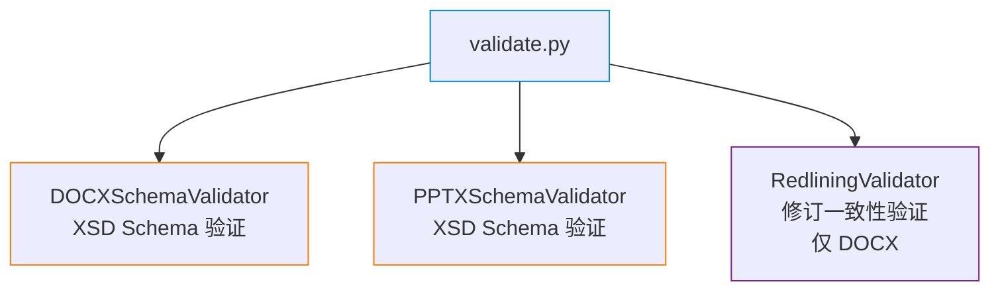

**自动修复能力**：
- 修复超出 OOXML 限制的 `paraId` / `durableId` 值
- 补充缺失的 `xml:space="preserve"` 属性
- 修复 Schema 违规的 XML 结构

### soffice.py — LibreOffice 适配器

**功能**：在沙箱环境（如 Claude 的 VM）中安全运行 LibreOffice

**核心问题**：Claude 的运行环境可能禁用 `AF_UNIX` 套接字，而 LibreOffice 内部依赖 Unix 域套接字通信。

**解决方案 — C 语言 LD_PRELOAD Shim**：

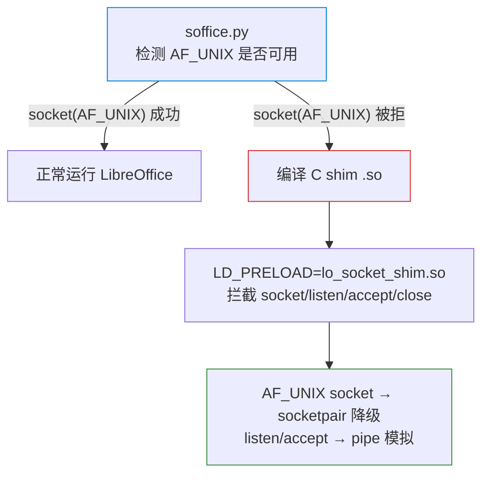

**Shim 原理详解**：

| 被拦截的系统调用 | Shim 行为 |
|-----------------|----------|
| `socket(AF_UNIX)` | 先尝试真实调用；失败则用 `socketpair()` 创建一对已连接的套接字 |
| `listen(fd)` | 记录 listener fd，返回成功 |
| `accept(fd)` | 在 wake pipe 上阻塞读取，模拟"等待连接" |
| `close(fd)` | 如果关闭的是 listener fd，写入 wake pipe 解除 accept 阻塞，然后 `_exit(0)` |

这是一个极其精巧的系统级 Hack，完全在用户态实现，不需要 root 权限。

### helpers/merge_runs.py — Run 合并器

**功能**：合并 DOCX `document.xml` 中格式相同的相邻 `<w:r>` 元素

**处理步骤**：

1. **移除 `proofErr` 元素** — 拼写/语法检查标记会阻止相邻 run 的识别
2. **剥离 `rsid` 属性** — 修订元数据不影响渲染，但会导致格式"看似不同"
3. **合并相邻 run** — 比较 `<w:rPr>` 的 XML 字符串，完全一致则合并
4. **整合文本节点** — 合并后的多个 `<w:t>` 合并为一个，自动处理 `xml:space="preserve"`

**示例效果**：

```xml
<!-- 合并前（3 个 run，实际格式完全相同） -->
<w:r><w:rPr><w:b/></w:rPr><w:t>Hello </w:t></w:r>
<w:r><w:rPr><w:b/></w:rPr><w:t>beautiful </w:t></w:r>
<w:r><w:rPr><w:b/></w:rPr><w:t>world</w:t></w:r>

<!-- 合并后（1 个 run） -->
<w:r><w:rPr><w:b/></w:rPr><w:t xml:space="preserve">Hello beautiful world</w:t></w:r>
```

### helpers/simplify_redlines.py — 修订简化器

**功能**：合并相邻的同作者 `<w:ins>` / `<w:del>` 修订标记

**合并规则**：
- 只合并相同标签类型（ins + ins 或 del + del）
- 只合并相同作者（忽略时间戳差异）
- 只合并真正相邻的元素（中间只有空白文本节点）

**附加能力 — 作者推断**：

```python
def infer_author(modified_dir, original_docx, default="Claude"):
    """对比原始文件和修改后文件的修订作者，推断出 AI 新增的修订属于哪个作者"""
    modified_authors = get_tracked_change_authors(modified_xml)
    original_authors = _get_authors_from_docx(original_docx)
    new_changes = {author: count - orig for author, count in modified_authors.items()
                   if (orig := original_authors.get(author, 0)) < count}
```

这在 `pack.py` 的 RedliningValidator 中使用，确保修订验证针对正确的作者。

---

## 专有脚本逐一详解

### DOCX — accept_changes.py

**功能**：通过 LibreOffice 宏接受文档中的所有修订

| 项目 | 描述 |
|------|------|
| **输入** | 含修订的 .docx 文件路径 + 输出路径 |
| **输出** | 已接受所有修订的 .docx 文件 |
| **依赖** | LibreOffice + soffice.py |
| **超时处理** | 30 秒超时也视为成功（LibreOffice 可能不返回退出码） |

**工作流程**：

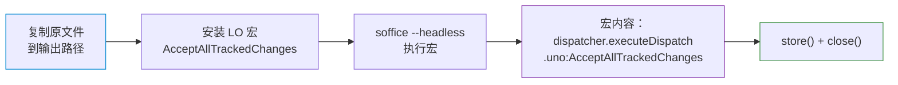

**关键细节**：
- 使用独立 LibreOffice 用户配置目录 `/tmp/libreoffice_docx_profile`，避免污染系统配置
- `TimeoutExpired` 异常被视为成功 — LibreOffice headless 模式下经常"执行完但不退出"

### DOCX — comment.py

**功能**：向解包后的 DOCX 添加批注或回复

| 项目 | 描述 |
|------|------|
| **输入** | 解包目录 + 批注 ID + 文本 + 可选父 ID（回复） |
| **输出** | 更新后的 4 个 XML 文件 + 控制台输出标记指令 |
| **模板** | `templates/` 目录中的 4 个空 XML 文件 |

**操作的 4 个 XML 文件**：

| 文件 | 作用 | 关键数据 |
|------|------|---------|
| `comments.xml` | 批注主体 | id, author, date, text |
| `commentsExtended.xml` | 扩展信息 | paraId, paraIdParent（回复链） |
| `commentsIds.xml` | 持久标识 | paraId → durableId 映射 |
| `commentsExtensible.xml` | 可扩展数据 | durableId, dateUtc |

**首次添加批注时的额外工作**：
1. 从 `templates/` 复制 4 个空 XML 模板到 `word/`
2. 在 `document.xml.rels` 中添加 4 个 Relationship
3. 在 `[Content_Types].xml` 中注册 4 个 Override

### XLSX — recalc.py

**功能**：使用 LibreOffice 重新计算 Excel 公式并验证结果

| 项目 | 描述 |
|------|------|
| **输入** | .xlsx 文件路径 + 可选超时时间 |
| **输出** | JSON 格式的验证报告 |
| **依赖** | LibreOffice + openpyxl |

**输出格式示例**：

```json
{
  "status": "errors_found",
  "total_errors": 3,
  "total_formulas": 150,
  "error_summary": {
    "#REF!": { "count": 2, "locations": ["Sheet1!C5", "Sheet1!D10"] },
    "#DIV/0!": { "count": 1, "locations": ["Sheet2!B3"] }
  }
}
```

**双阶段验证**：
1. `data_only=True`：读取计算结果，检查 7 种 Excel 错误值
2. `data_only=False`：统计公式总数，确认公式没有丢失

### PPTX — thumbnail.py

**功能**：将 PPTX 幻灯片转换为缩略图网格 JPEG

| 项目 | 描述 |
|------|------|
| **输入** | .pptx 文件 + 可选列数/输出前缀 |
| **输出** | 带标签的幻灯片缩略图网格 JPEG |
| **依赖** | LibreOffice + pdftoppm（poppler） + Pillow |

**转换链路**：

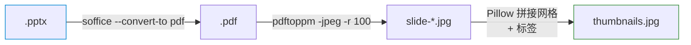

**特殊处理**：
- 隐藏幻灯片：显示为交叉线占位图 + "(hidden)" 标签
- 大型演示文稿：自动分页生成多个网格文件（每页 cols × (cols+1) 张）
- 每个缩略图标注对应的 `slide*.xml` 文件名，方便 AI 定位编辑目标

### PPTX — add_slide.py

**功能**：在解包后的 PPTX 目录中添加新幻灯片

| 项目 | 描述 |
|------|------|
| **输入** | 解包目录 + 来源（幻灯片文件名 或 布局文件名） |
| **输出** | 新的 slide XML + 控制台输出 sldId 指令 |

**两种添加模式**：

| 模式 | 来源 | 行为 |
|------|------|------|
| 复制 | `slide2.xml` | 完整复制幻灯片内容 + rels（剥离 notesSlide 引用） |
| 从布局创建 | `slideLayout2.xml` | 创建空白幻灯片 + 绑定指定布局 |

**联动更新**：
1. `[Content_Types].xml` — 添加新幻灯片的 Override
2. `ppt/_rels/presentation.xml.rels` — 添加新的 Relationship
3. 控制台输出 `<p:sldId>` 元素，提示 AI 手动添加到 `presentation.xml`

### PPTX — clean.py

**功能**：清理解包目录中的孤立/未引用资源

| 项目 | 描述 |
|------|------|
| **输入** | 解包后的 PPTX 目录 |
| **输出** | 清理报告（删除了哪些文件） |

**清理范围**：

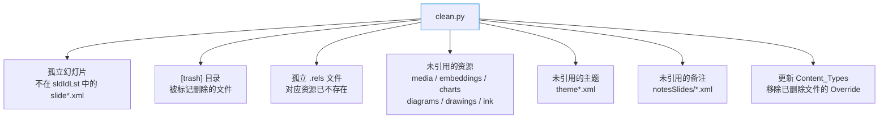

**迭代清理**：清理是循环进行的 — 删除某个资源可能导致其引用的其他资源也变为孤立，因此使用 `while True` 循环直到没有更多孤立文件。

---

## 三种 Skill 对比矩阵

| 维度 | DOCX | XLSX | PPTX |
|------|------|------|------|
| **创建工具** | docx-js (JS) | openpyxl (Python) | pptxgenjs (JS) |
| **读取工具** | markitdown | openpyxl / pandas | markitdown |
| **编辑方式** | 解包 XML | openpyxl API | 解包 XML |
| **需要 LibreOffice** | ✅ 修订/转换 | ✅ 公式重算 | ✅ 缩略图/转换 |
| **专有脚本数** | 2 | 1 | 3 |
| **验证器** | Schema + Redlining | 无 | Schema |
| **视觉 QA** | 否 | 否 | **强制** |
| **最复杂操作** | 批注系统（4 XML） | 公式重算验证 | 幻灯片资源清理 |
| **SKILL.md 行数** | 590 | 290 | 233 |

---

## 与 PDF Skill 的差异对比

| 维度 | [[PDF Skill]] | Office [[Skills]] |
|------|-----------|---------------|
| **文件本质** | 二进制页面描述语言 | ZIP + XML |
| **编辑粒度** | 页面/注解/表单域 | 段落/单元格/幻灯片 |
| **AI 直接编辑** | 不接触内部结构 | 直接编辑 XML |
| **脚本复杂度** | 8 个 Python 脚本 | 4 个共享 + 6 个专有 = 10 个 |
| **外部依赖** | 无（纯 Python） | LibreOffice（必须） |
| **创建语言** | Python | JS（docx/pptx）/ Python（xlsx） |
| **验证体系** | 无 | XSD Schema + 自动修复 |
| **核心 Hack** | monkey patch pypdf `/Opt` 解析 | C shim 绕过 AF_UNIX 限制 |

---

## 设计哲学总结

### "AI 擅长文本，让 AI 操作文本"

整个 Office Skill 体系的核心洞察是：**OOXML 文档就是 XML 文本，而 AI 非常擅长理解和编辑结构化文本**。

- `unpack.py` 将二进制 ZIP 转为可读 XML
- `merge_runs.py` 降低 XML 噪音
- `pack.py` 的 `_condense_xml` 确保格式化空白不污染输出

### "防御性工程"

每一步都有防护：

| 阶段 | 防御措施 |
|------|---------|
| 解包 | `defusedxml` 防 XXE / 智能引号转义 |
| 编辑 | Schema 验证 + 自动修复 |
| 打包 | RedliningValidator 确保修订一致性 |
| 运行时 | `soffice.py` 的 C shim 适配沙箱环境 |

### "正确的工具做正确的事"

| 任务 | 选择 | 理由 |
|------|------|------|
| 创建 DOCX/PPTX | JavaScript | 声明式 API 更适合 AI 生成 |
| 创建 XLSX | Python openpyxl | Excel 操作的 Python 生态更成熟 |
| 编辑所有格式 | XML 直接操作 | 最大灵活性，不受 API 限制 |
| 公式重算 | LibreOffice | 唯一能在无 Excel 环境下执行公式的方案 |
| 视觉 QA | LibreOffice + poppler | 成熟的文档渲染链路 |

### "可组合的工具链"

共享 `office/` 基础设施使得三个 Skill 的维护成本大幅降低：

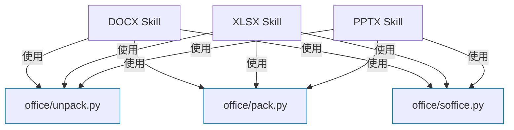

新增一种 Office 格式的支持，只需：
1. 编写 `SKILL.md` 指令
2. 添加少量专有脚本
3. 复用已有的 `unpack → edit → pack` 流水线

---

> **文档版本**：v1.0  
> **分析日期**：2025-07  
> **源码版本**：commit `98669c11ca63`  
> **关联文档**：[PDF-Skill-实现原理分析.md](./PDF-Skill-实现原理分析.md)

## 相关笔记

- [[PDF Skill 实现原理分析]]
- [[DWG Skill 深度重构优化记录]]
- [[DWG Skill 架构设计]]
- [[Spring AI 1.1.x 更新日志]]
- [[Spring AI 2.0 Milestone 更新日志]]
- [[Spring AI 更新日志总览]]
- [[Agent SDK]]
- [[扩展机制]]
