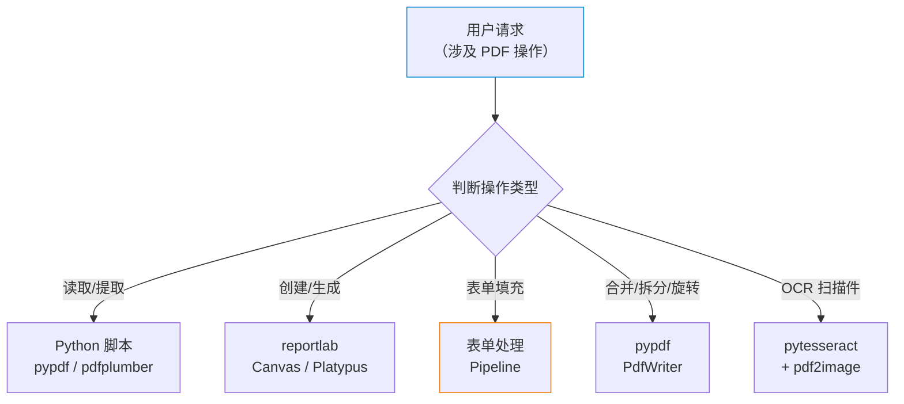
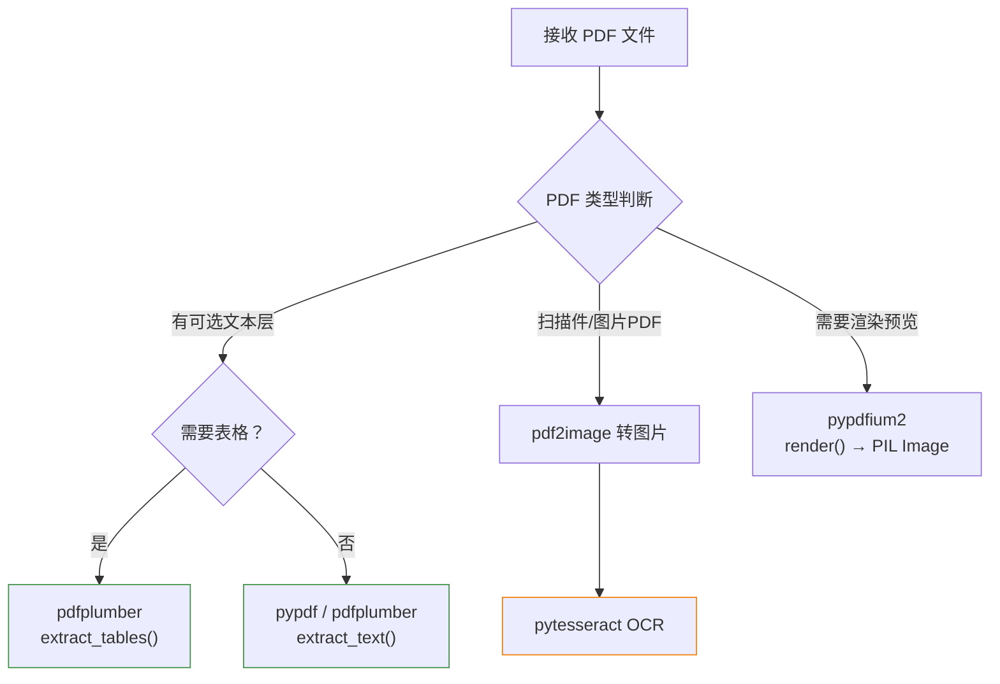
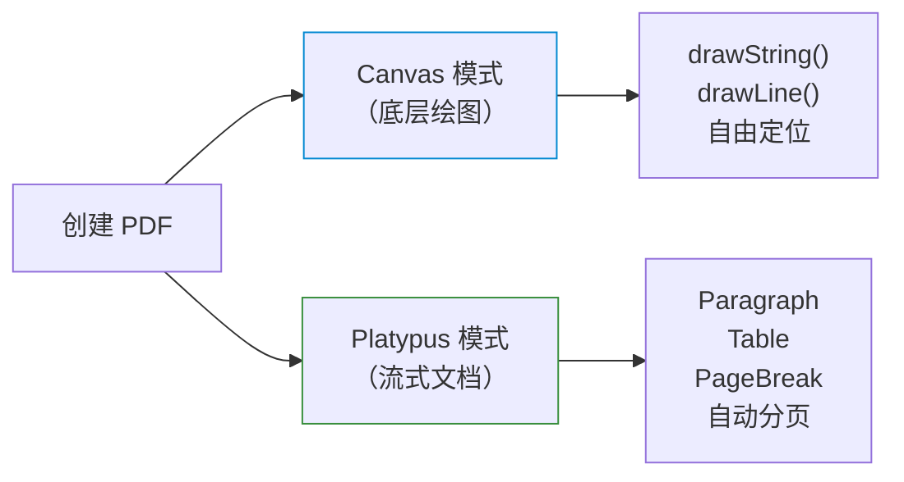
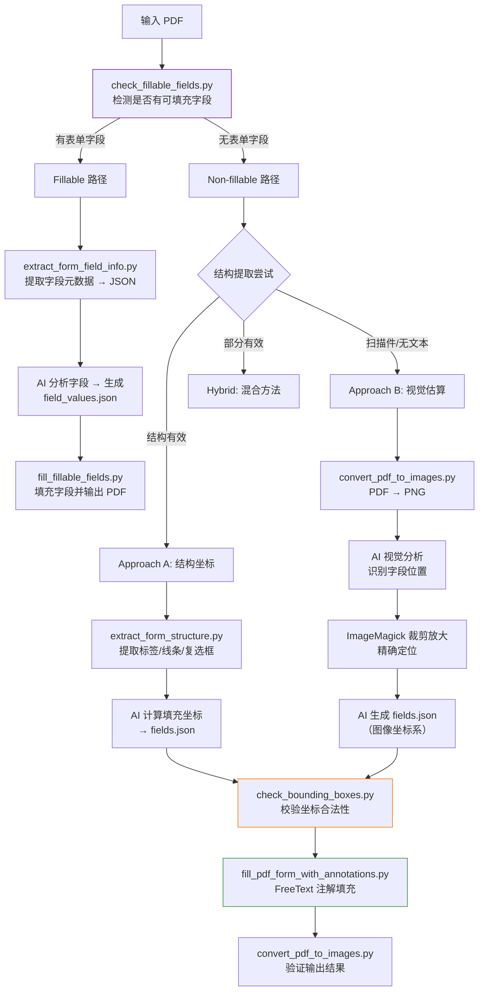
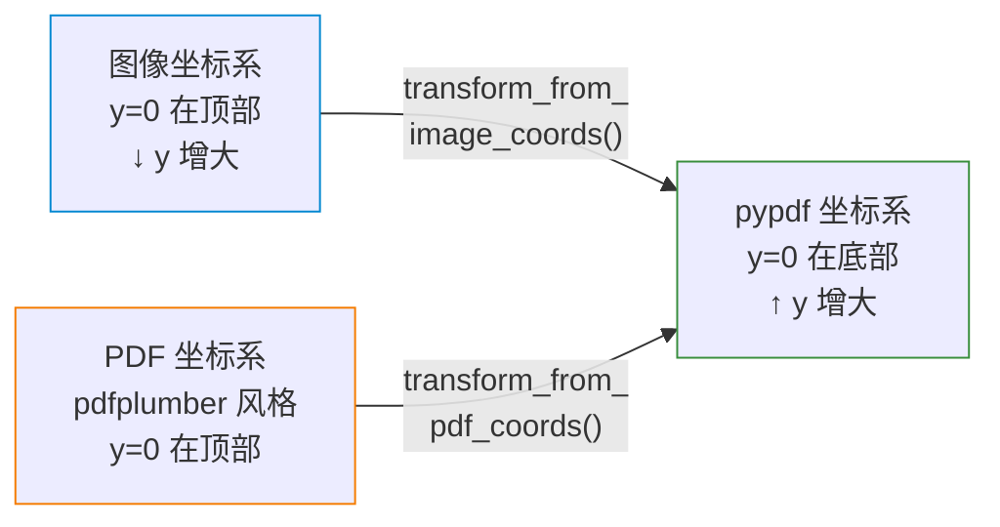
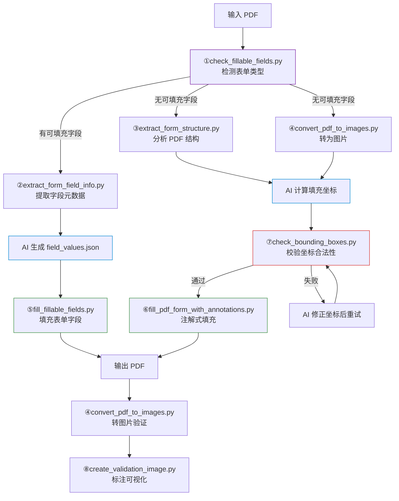
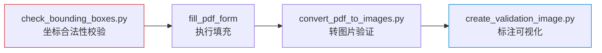
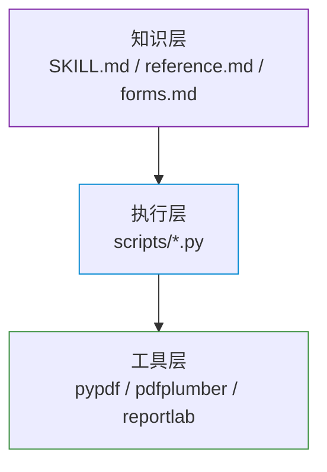

# PDF Skill 实现原理分析

> 本文档基于 Anthropic 官方 `document-skills` 插件中 `pdf` skill 的源码分析，阐述其如何赋予 AI Agent 读写 PDF 文件的能力。

## 总体架构



## 核心文件结构与职责

```
skills/pdf/
├── SKILL.md                          # 主指令文件（Quick Start + 常用操作）
├── reference.md                      # 高级参考（pypdfium2 / JS 库 / CLI 工具）
├── forms.md                          # 表单填充专用指令（完整 Pipeline）
├── LICENSE.txt                       # Anthropic 专有许可
└── scripts/                          # Python 工具脚本
    ├── check_fillable_fields.py      # 检测 PDF 是否含可填充表单字段
    ├── extract_form_field_info.py    # 提取可填充字段元数据 → JSON
    ├── extract_form_structure.py     # 分析非填充 PDF 的结构（标签/线条/复选框）
    ├── convert_pdf_to_images.py      # PDF → PNG 图片（用于视觉分析）
    ├── fill_fillable_fields.py       # 填充可填充表单字段
    ├── fill_pdf_form_with_annotations.py  # 通过 FreeText 注解填充非填充表单
    ├── check_bounding_boxes.py       # 验证填充坐标合法性
    └── create_validation_image.py    # 生成标注验证图片
```

## PDF 读取能力实现

### 读取技术栈

| 场景 | 工具 | 关键 API |
|------|------|---------|
| 基础文本提取 | `pypdf` | `PdfReader.pages[i].extract_text()` |
| 带布局文本提取 | `pdfplumber` | `page.extract_text()` |
| 表格提取 | `pdfplumber` | `page.extract_tables()` |
| 元数据读取 | `pypdf` | `reader.metadata` |
| 坐标精确提取 | `pdfplumber` | `page.chars` / `page.within_bbox()` |
| PDF 渲染为图片 | `pypdfium2` | `page.render(scale=2.0)` |
| 扫描件 OCR | `pytesseract` + `pdf2image` | `image_to_string()` |
| CLI 文本提取 | `pdftotext`（poppler） | `pdftotext -layout input.pdf` |

### 读取流程

AI Agent 根据 SKILL.md 中的指南，选择最合适的读取方式：



### 关键代码解析

**pdfplumber 表格提取**（SKILL.md 中教 AI 使用的代码模式）：

```python
import pdfplumber
import pandas as pd

with pdfplumber.open("document.pdf") as pdf:
    all_tables = []
    for page in pdf.pages:
        tables = page.extract_tables()
        for table in tables:
            if table:
                df = pd.DataFrame(table[1:], columns=table[0])
                all_tables.append(df)
```

**带坐标的精确文本提取**（reference.md）：

```python
with pdfplumber.open("document.pdf") as pdf:
    page = pdf.pages[0]
    chars = page.chars  # 每个字符的精确坐标
    bbox_text = page.within_bbox((100, 100, 400, 200)).extract_text()
```

## PDF 写入能力实现

### 写入技术栈

| 场景 | 工具 | 原理 |
|------|------|------|
| 从零创建 PDF | `reportlab` | Canvas 绘图 / Platypus 流式布局 |
| 合并多 PDF | `pypdf` | `PdfWriter.add_page()` |
| 拆分 PDF | `pypdf` | 遍历 pages 各写一个 PdfWriter |
| 旋转页面 | `pypdf` | `page.rotate(90)` |
| 加水印 | `pypdf` | `page.merge_page(watermark_page)` |
| 加密 | `pypdf` | `writer.encrypt(user_pw, owner_pw)` |
| 裁剪 | `pypdf` | 修改 `page.mediabox` 属性 |
| 填充表单字段 | `pypdf` | `writer.update_page_form_field_values()` |
| 填充非表单 PDF | `pypdf` FreeText | `writer.add_annotation(FreeText(...))` |

### 创建 PDF 的两种模式



## 表单填充 Pipeline（核心亮点）

表单填充是该 Skill 最复杂的功能，设计了一套完整的多步骤 Pipeline。

### 整体流程



### 可填充表单路径（Fillable Path）

#### 步骤 1：检测表单字段

`check_fillable_fields.py` — 仅 12 行代码，判断 PDF 是否包含 AcroForm 表单：

```python
from pypdf import PdfReader
reader = PdfReader(sys.argv[1])
if reader.get_fields():
    print("This PDF has fillable form fields")
```

**原理**：PDF 规范中，可填充表单存储在 `/AcroForm` 字典中，`pypdf` 的 `get_fields()` 解析该结构。

#### 步骤 2：提取字段元数据

`extract_form_field_info.py` 深入解析 PDF 的 AcroForm 结构：

```python
def get_full_annotation_field_id(annotation):
    """遍历 /Parent 链构建完整字段 ID（如 "form1.page1.lastName"）"""
    components = []
    while annotation:
        field_name = annotation.get('/T')
        if field_name:
            components.append(field_name)
        annotation = annotation.get('/Parent')
    return ".".join(reversed(components))
```

支持的字段类型：

| PDF 字段类型 (`/FT`) | 映射结果 | 附加信息 |
|---|---|---|
| `/Tx` | `text` | 文本输入框 |
| `/Btn` | `checkbox` / `radio_group` | 从 `/_States_` 或 `/AP/N` 提取选项值 |
| `/Ch` | `choice` | 下拉/列表选择 |

#### 步骤 3：填充表单

`fill_fillable_fields.py` 使用 `pypdf` 的原生表单 API：

```python
writer = PdfWriter(clone_from=reader)
writer.update_page_form_field_values(
    writer.pages[page - 1],
    field_values,        # {"field_id": "value"} 字典
    auto_regenerate=False
)
writer.set_need_appearances_writer(True)  # 让 PDF 阅读器自动渲染外观
```

值得注意的是，该脚本还对 `pypdf` 做了 **Monkey Patch** 修复：

```python
def monkeypatch_pydpf_method():
    """修复 pypdf 对 /Opt 字段的解析问题：
    当选项值为 [[export_val, display_text], ...] 格式时，
    pypdf 原生返回嵌套列表，此补丁将其扁平化为仅 export_val 列表"""
    original_get_inherited = DictionaryObject.get_inherited
    def patched_get_inherited(self, key, default=None):
        result = original_get_inherited(self, key, default)
        if key == FieldDictionaryAttributes.Opt:
            if isinstance(result, list) and all(
                isinstance(v, list) and len(v) == 2 for v in result
            ):
                result = [r[0] for r in result]
        return result
    DictionaryObject.get_inherited = patched_get_inherited
```

### 非填充表单路径（Non-fillable Path）

当 PDF 没有可填充的 AcroForm 字段时（如扫描件、静态 PDF），Skill 采用 **FreeText Annotation 注解叠加** 技术。

#### 结构提取（Approach A）

`extract_form_structure.py` 使用 `pdfplumber` 解析 PDF 的矢量结构：

```python
def extract_form_structure(pdf_path):
    with pdfplumber.open(pdf_path) as pdf:
        for page in pdf.pages:
            # 提取所有文字标签及其精确坐标
            words = page.extract_words()

            # 提取水平线条（行边界，仅取超过页宽 50% 的线条）
            for line in page.lines:
                if abs(line["x1"] - line["x0"]) > page.width * 0.5:
                    ...

            # 检测复选框（5-15pt 的方形矩形）
            for rect in page.rects:
                w = rect["x1"] - rect["x0"]
                h = rect["bottom"] - rect["top"]
                if 5 <= w <= 15 and 5 <= h <= 15 and abs(w - h) < 2:
                    ...  # 识别为复选框
```

#### 视觉估算（Approach B）

对于纯图片 PDF，Skill 指导 AI 执行视觉分析：

1. `convert_pdf_to_images.py` — 使用 `pdf2image`（底层 poppler）将 PDF 转为 PNG
2. AI 通过多模态视觉能力分析图片中的表单布局
3. 使用 ImageMagick 裁剪放大局部区域精确定位
4. 将图像坐标转换为 PDF 坐标

#### FreeText 注解填充

`fill_pdf_form_with_annotations.py` 是非填充路径的最终执行器：

```python
from pypdf.annotations import FreeText

# 坐标转换：支持图像坐标系和 PDF 坐标系两种输入
def transform_from_image_coords(bbox, image_width, image_height, pdf_width, pdf_height):
    """图像坐标 → PDF 坐标（y 轴翻转 + 比例缩放）"""
    x_scale = pdf_width / image_width
    y_scale = pdf_height / image_height
    left = bbox[0] * x_scale
    right = bbox[2] * x_scale
    top = pdf_height - (bbox[1] * y_scale)     # PDF y轴从底部开始
    bottom = pdf_height - (bbox[3] * y_scale)
    return left, bottom, right, top

# 创建 FreeText 注解并添加到页面
annotation = FreeText(
    text=text,
    rect=transformed_entry_box,
    font="Arial",
    font_size="10pt",
    font_color="000000",
    border_color=None,       # 无边框
    background_color=None,   # 透明背景
)
writer.add_annotation(page_number=page_num - 1, annotation=annotation)
```

**核心原理**：不修改 PDF 原始内容，而是在指定坐标叠加透明背景的 FreeText 注解，视觉效果等同于在表单字段中填写了文字。

### 坐标系统与转换



| 坐标系 | y=0 位置 | 使用场景 |
|--------|---------|---------|
| 图像坐标系 | 顶部（左上角） | `convert_pdf_to_images.py` 输出 |
| pdfplumber PDF 坐标系 | 顶部 | `extract_form_structure.py` 输出 |
| pypdf 坐标系 | 底部（左下角） | 实际写入注解时使用 |

## scripts/ 目录脚本逐一详解

以下对 `scripts/` 目录下的 8 个 Python 脚本进行逐一分析，说明其输入/输出、核心逻辑和在整体 Pipeline 中的角色。

### check_fillable_fields.py — 表单字段检测器

| 项目 | 说明 |
|------|------|
| **代码量** | 12 行（最简单的脚本） |
| **依赖** | `pypdf` |
| **输入** | PDF 文件路径（命令行参数） |
| **输出** | 终端打印检测结果 |
| **Pipeline 角色** | 分流入口，决定走 Fillable 还是 Non-fillable 路径 |

**核心逻辑**：

```python
reader = PdfReader(sys.argv[1])
if reader.get_fields():
    print("This PDF has fillable form fields")
else:
    print("This PDF does not have fillable form fields")
```

`get_fields()` 方法解析 PDF 文件中的 `/AcroForm` 字典。PDF 规范（ISO 32000）定义了交互式表单的存储结构：

```
PDF 文档根
  └── /AcroForm（交互式表单字典）
        ├── /Fields[]  ← 所有顶层表单字段
        └── /NeedAppearances  ← 是否需要生成外观流
```

若 `/AcroForm/Fields` 存在且非空，则返回字段字典；否则返回 `None`，即"没有可填充字段"。

---

### extract_form_field_info.py — 可填充字段元数据提取器

| 项目 | 说明 |
|------|------|
| **代码量** | 123 行 |
| **依赖** | `pypdf` |
| **输入** | PDF 文件路径 + 输出 JSON 路径 |
| **输出** | 字段元数据 JSON 文件 |
| **Pipeline 角色** | Fillable 路径的核心信息提取步骤 |

**核心逻辑解析**：

#### 函数 1：`get_full_annotation_field_id(annotation)`

PDF 表单字段可以嵌套（例如 `form1.page1.lastName`），该函数通过遍历 `/Parent` 引用链重建完整路径：

```python
while annotation:
    field_name = annotation.get('/T')  # /T = 字段名称（Terminal name）
    if field_name:
        components.append(field_name)
    annotation = annotation.get('/Parent')  # 沿父级链向上
return ".".join(reversed(components))
```

#### 函数 2：`make_field_dict(field, field_id)`

根据 PDF 字段类型标记 `/FT` 分类处理：

- `/Tx`（Text）→ `"text"`
- `/Btn`（Button）→ `"checkbox"`，从 `/_States_` 提取 checked/unchecked 值
- `/Ch`（Choice）→ `"choice"`，提取所有选项的 value + text

#### 函数 3：`get_field_info(reader)`

**两遍扫描策略**：

1. **第一遍**：遍历 `reader.get_fields()` 获取所有字段的类型和状态。如果字段有 `/Kids`（子元素）且类型为 `/Btn`，标记为可能的 radio_group
2. **第二遍**：遍历每一页的 `/Annots`（注解数组），将字段与页码和矩形坐标绑定。对 radio_group 类型，从 `/AP/N`（Appearance/Normal）中提取每个选项的激活值

**排序逻辑**：按页码 → y 坐标（从上到下）→ x 坐标（从左到右）排序，模拟人类阅读顺序。

---

### extract_form_structure.py — 非填充 PDF 结构分析器

| 项目 | 说明 |
|------|------|
| **代码量** | 116 行 |
| **依赖** | `pdfplumber` |
| **输入** | PDF 文件路径 + 输出 JSON 路径 |
| **输出** | 结构 JSON（标签、线条、复选框、行边界） |
| **Pipeline 角色** | Non-fillable Approach A 的起点 |

**核心逻辑**：利用 `pdfplumber` 的矢量元素解析能力，从 PDF 的 Content Stream 中提取三类结构化元素：

#### 提取 1：文字标签

```python
words = page.extract_words()  # pdfplumber 将字符合并为单词
# 每个 word 包含：text, x0, top, x1, bottom（精确到 0.1pt）
```

`pdfplumber` 在底层解析 PDF 的文本绘制操作符（`Tj`、`TJ`、`Tm` 等），将字符按间距阈值合并为单词，并记录其边界框。

#### 提取 2：水平线条

```python
for line in page.lines:
    if abs(line["x1"] - line["x0"]) > page.width * 0.5:
        # 仅保留超过页宽 50% 的水平线条
```

这些线条通常是表格的行分隔线。`pdfplumber` 解析 PDF 绘图操作符（`m`/`l`/`re`/`S`/`f` 等）来识别线段和路径。

#### 提取 3：复选框检测

```python
for rect in page.rects:
    width = rect["x1"] - rect["x0"]
    height = rect["bottom"] - rect["top"]
    if 5 <= width <= 15 and 5 <= height <= 15 and abs(width - height) < 2:
        # 5-15pt 的近正方形 → 识别为复选框
```

**设计巧妙之处**：通过尺寸启发式规则区分复选框与其他矩形装饰元素（边框、背景框等）。

#### 后处理：行边界计算

将排序后的水平线条 y 坐标两两配对，生成行的上下边界：

```python
y_coords = sorted(set(y_coords))
for i in range(len(y_coords) - 1):
    row_boundaries.append({
        "row_top": y_coords[i],
        "row_bottom": y_coords[i + 1],
        "row_height": y_coords[i + 1] - y_coords[i]
    })
```

---

### convert_pdf_to_images.py — PDF 转图片工具

| 项目 | 说明 |
|------|------|
| **代码量** | 30 行 |
| **依赖** | `pdf2image`（底层依赖 poppler） |
| **输入** | PDF 文件路径 + 输出目录路径 |
| **输出** | 每页一个 PNG 文件（`page_1.png`, `page_2.png`, ...） |
| **Pipeline 角色** | 视觉分析入口 + 结果验证工具 |

**核心逻辑**：

```python
images = convert_from_path(pdf_path, dpi=200)  # poppler 渲染

for i, image in enumerate(images):
    width, height = image.size
    if width > max_dim or height > max_dim:  # 默认 max_dim=1000
        scale_factor = min(max_dim / width, max_dim / height)
        image = image.resize((new_width, new_height))
    image.save(os.path.join(output_dir, f"page_{i+1}.png"))
```

**为什么限制 1000px**：图片用于 AI 视觉分析，过大的图片会消耗过多 token 且不影响字段识别精度。200 DPI + 1000px 上限在精度和效率之间取得平衡。

**底层调用链**：`pdf2image` → `pdftoppm`（poppler-utils CLI）→ 读取 PDF Content Stream → 逐页光栅化渲染。

---

### fill_fillable_fields.py — 可填充表单填充器

| 项目 | 说明 |
|------|------|
| **代码量** | 99 行 |
| **依赖** | `pypdf` |
| **输入** | 原始 PDF + field_values.json + 输出 PDF 路径 |
| **输出** | 填充后的 PDF 文件 |
| **Pipeline 角色** | Fillable 路径的最终执行器 |

**核心逻辑分三步**：

#### 步骤 1：验证字段合法性

在填充之前，对每个字段执行严格校验：

```python
# 校验 1：field_id 是否存在于 PDF 中
if not existing_field:
    print(f"ERROR: `{field['field_id']}` is not a valid field ID")

# 校验 2：page 页码是否匹配
if field["page"] != existing_field["page"]:
    print(f"ERROR: Incorrect page number...")

# 校验 3：值是否合法（checkbox/radio/choice 限定范围）
err = validation_error_for_field_value(existing_field, field["value"])
```

任何校验失败都会 `sys.exit(1)` 中止，**绝不静默跳过**。

#### 步骤 2：Monkey Patch 修复 pypdf 的 /Opt 解析 bug

```python
def monkeypatch_pydpf_method():
    """当 /Opt 选项值格式为 [[export_val, display_text], ...] 时，
    pypdf 返回嵌套列表导致值匹配失败。
    此补丁将其扁平化为 [export_val, ...] 列表"""
```

这是针对 `pypdf` 库的一个已知兼容性问题的临时修复，展示了脚本的工程健壮性。

#### 步骤 3：使用 pypdf 原生 API 写入表单值

```python
writer = PdfWriter(clone_from=reader)  # 完整克隆原 PDF
for page, field_values in fields_by_page.items():
    writer.update_page_form_field_values(
        writer.pages[page - 1],
        field_values,
        auto_regenerate=False  # 不自动重新生成外观流
    )
writer.set_need_appearances_writer(True)  # 标记需要阅读器渲染
```

**`auto_regenerate=False` + `set_need_appearances_writer(True)` 组合的含义**：不在 Python 侧生成字段的可视外观（Appearance Stream），而是设置 `/NeedAppearances` 标志，让 PDF 阅读器（如 Adobe Reader）在打开时自动渲染。这避免了字体嵌入、排版计算等复杂问题。

---

### fill_pdf_form_with_annotations.py — 注解式表单填充器

| 项目 | 说明 |
|------|------|
| **代码量** | 106 行 |
| **依赖** | `pypdf`（`pypdf.annotations.FreeText`） |
| **输入** | 原始 PDF + fields.json + 输出 PDF 路径 |
| **输出** | 带 FreeText 注解的 PDF |
| **Pipeline 角色** | Non-fillable 路径的最终执行器 |

**核心原理**：对于没有 AcroForm 字段的 PDF（如扫描件、静态排版 PDF），无法使用表单 API。该脚本通过在指定坐标叠加 **FreeText Annotation（自由文本注解）** 实现"填写"效果。

#### 坐标转换系统

脚本支持两种坐标输入模式，通过 JSON 中是否包含 `pdf_width` 或 `image_width` 自动检测：

**模式 A：图像坐标 → pypdf 坐标**

```python
def transform_from_image_coords(bbox, image_width, image_height, pdf_width, pdf_height):
    x_scale = pdf_width / image_width    # 水平缩放比
    y_scale = pdf_height / image_height  # 垂直缩放比
    left = bbox[0] * x_scale
    right = bbox[2] * x_scale
    # 关键：图像坐标 y=0 在顶部，PDF 坐标 y=0 在底部
    top = pdf_height - (bbox[1] * y_scale)      # 翻转 y 轴
    bottom = pdf_height - (bbox[3] * y_scale)    # 翻转 y 轴
    return left, bottom, right, top
```

**模式 B：pdfplumber PDF 坐标 → pypdf 坐标**

```python
def transform_from_pdf_coords(bbox, pdf_height):
    left = bbox[0]
    right = bbox[2]
    # pdfplumber 的 top/bottom 是从顶部计算的，pypdf 从底部计算
    pypdf_top = pdf_height - bbox[1]
    pypdf_bottom = pdf_height - bbox[3]
    return left, pypdf_bottom, right, pypdf_top
```

#### FreeText 注解创建

```python
annotation = FreeText(
    text=text,                    # 要"填写"的文字内容
    rect=transformed_entry_box,   # 精确的放置坐标
    font="Arial",                 # 字体
    font_size="10pt",             # 字号
    font_color="000000",          # 黑色
    border_color=None,            # 无边框 → 视觉上"嵌入"原文档
    background_color=None,        # 透明背景 → 不遮挡原有内容
)
writer.add_annotation(page_number=page_num - 1, annotation=annotation)
```

**巧妙之处**：通过设置 `border_color=None` 和 `background_color=None`，注解在视觉上完全"融入"原始 PDF 页面，看起来就像是在表单字段中填写了文字。但本质上，它是一个叠加在原始内容之上的注解层。

---

### check_bounding_boxes.py — 坐标合法性校验器

| 项目 | 说明 |
|------|------|
| **代码量** | 66 行 |
| **依赖** | 无外部依赖（纯 Python + JSON） |
| **输入** | fields.json 文件路径 |
| **输出** | 终端打印校验结果（SUCCESS / FAILURE） |
| **Pipeline 角色** | 填充前的质量关卡 |

**核心逻辑**：对 `fields.json` 中所有表单字段的 `label_bounding_box` 和 `entry_bounding_box` 执行两项检查。

#### 检查 1：矩形交叉检测

```python
def rects_intersect(r1, r2):
    """判断两个矩形是否重叠（AABB 碰撞检测算法）"""
    disjoint_horizontal = r1[0] >= r2[2] or r1[2] <= r2[0]  # 水平不相交
    disjoint_vertical = r1[1] >= r2[3] or r1[3] <= r2[1]    # 垂直不相交
    return not (disjoint_horizontal or disjoint_vertical)     # 取反 = 相交
```

对同一页内的所有矩形做 **O(n²) 两两比较**：
- label ↔ entry 交叉 → 标签和输入框重叠
- entry ↔ entry 交叉 → 两个输入区域重叠
- label ↔ label 交叉 → 通常无害但也会警告

#### 检查 2：字体尺寸适配

```python
font_size = ri.field["entry_text"].get("font_size", 14)
entry_height = ri.rect[3] - ri.rect[1]
if entry_height < font_size:
    # 输入框高度不足以容纳文字
```

如果输入框的高度小于指定字号，文字会溢出或被截断。

**容错设计**：最多报告 20 个错误后停止（避免海量错误淹没关键问题）。

---

### create_validation_image.py — 可视化验证图生成器

| 项目 | 说明 |
|------|------|
| **代码量** | 38 行 |
| **依赖** | `Pillow`（PIL） |
| **输入** | 页码 + fields.json + 页面图片 + 输出图片路径 |
| **输出** | 标注了边界框的验证图片 |
| **Pipeline 角色** | 可选的人工审核辅助工具 |

**核心逻辑**：

```python
img = Image.open(input_path)
draw = ImageDraw.Draw(img)

for field in data["form_fields"]:
    if field["page_number"] == page_number:
        draw.rectangle(field['entry_bounding_box'], outline='red', width=2)
        draw.rectangle(field['label_bounding_box'], outline='blue', width=2)
```

在页面图片上用颜色标注边界框：
- **蓝色框** = label 区域（标签位置）
- **红色框** = entry 区域（填写位置）

这让 AI 或人类可以直观验证坐标是否正确对齐到了表单字段上。

---

### 脚本协作关系总图



## 质量保障机制

### 多层验证



- **交叉检测**：检查所有 label/entry 边界框是否重叠
- **尺寸验证**：确保 entry 框高度 ≥ 字体大小
- **字段验证**：填充前校验 field_id 存在性、页码正确性、选项值合法性
- **视觉验证**：填充后转图片人工确认

### 验证脚本核心逻辑

`check_bounding_boxes.py` 的交叉检测算法：

```python
def rects_intersect(r1, r2):
    """矩形相交判断：排除不相交的情况"""
    disjoint_horizontal = r1[0] >= r2[2] or r1[2] <= r2[0]
    disjoint_vertical = r1[1] >= r2[3] or r1[3] <= r2[1]
    return not (disjoint_horizontal or disjoint_vertical)
```

## 依赖库全景

| 库名 | 许可证 | 职责 | 语言 |
|------|--------|------|------|
| `pypdf` | BSD | 读写/合并/拆分/加密/表单 | Python |
| `pdfplumber` | MIT | 文本/表格/结构提取 | Python |
| `reportlab` | BSD | 从零创建 PDF | Python |
| `pypdfium2` | Apache/BSD | PDF 渲染为图片 | Python |
| `pytesseract` | Apache | OCR 文字识别 | Python |
| `pdf2image` | MIT | PDF → 图片转换（依赖 poppler） | Python |
| `Pillow` (PIL) | HPND | 图像处理 | Python |
| `pandas` | BSD | 表格数据处理 | Python |
| `pdf-lib` | MIT | 创建/修改 PDF（浏览器/Node） | JavaScript |
| `pdfjs-dist` | Apache | PDF 渲染（浏览器） | JavaScript |
| `poppler-utils` | GPL-2 | CLI 文本/图片提取 | C++ CLI |
| `qpdf` | Apache | CLI 合并/拆分/加密/修复 | C++ CLI |

## 设计哲学总结

### Skill 即知识注入

PDF Skill 的核心设计哲学是 **"教 AI 如何使用已有工具"**，而非重新发明轮子：

1. **SKILL.md** 提供操作指南和最佳实践 → 注入 AI 上下文
2. **scripts/** 提供可复用的 Python 工具 → AI 通过终端调用
3. **reference.md** 提供进阶知识 → 扩展 AI 的决策范围
4. **forms.md** 提供复杂流程的分步指导 → 确保 AI 按正确顺序执行

### 三层分离



- **知识层**：Markdown 文档，告诉 AI "什么时候用什么工具"
- **执行层**：封装好的 Python 脚本，处理复杂流程（如表单字段提取）
- **工具层**：成熟的开源 Python/CLI 库，提供底层 PDF 操作能力

### 为什么这套方案能"读写 PDF"

1. **读取能力**：AI 根据 Skill 指令选择合适的 Python 库（pypdf/pdfplumber/pytesseract），通过终端执行代码提取文本、表格、元数据或渲染图片
2. **写入能力**：AI 使用 reportlab 创建新 PDF，或使用 pypdf 的 PdfWriter 执行合并/拆分/旋转/加密等操作
3. **表单填充**：通过预置的 Pipeline 脚本链实现精确的表单检测 → 字段提取 → 坐标计算 → 注解叠加 → 结果验证

> **本质上，PDF Skill 是一套"增强提示词 + 配套工具脚本"的组合。AI 的代码执行能力（终端工具调用）是真正的"手"，而 Skill 是指导这双手如何操作 PDF 的"大脑知识"。**
