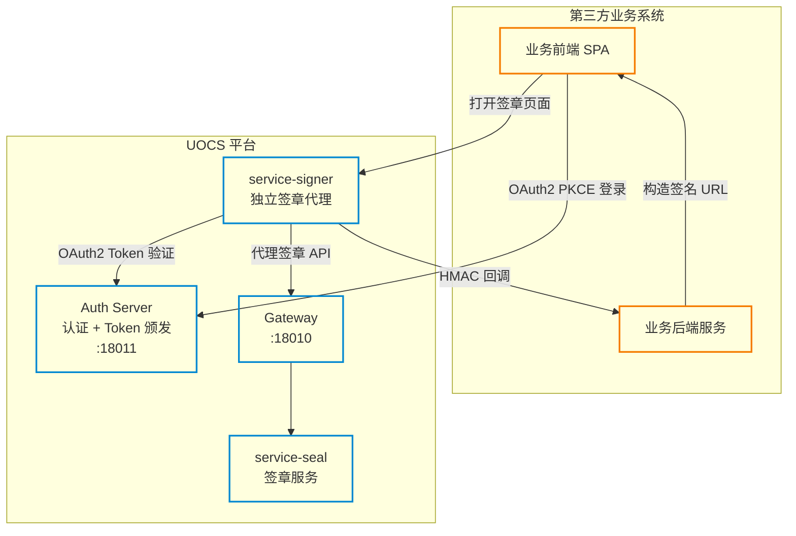
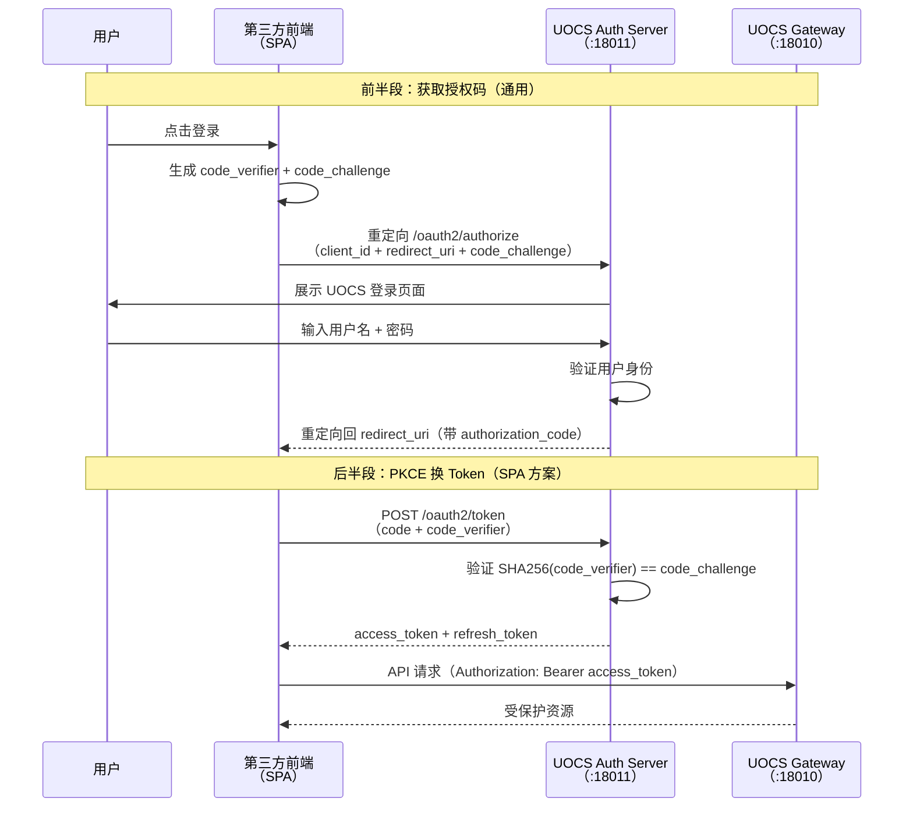
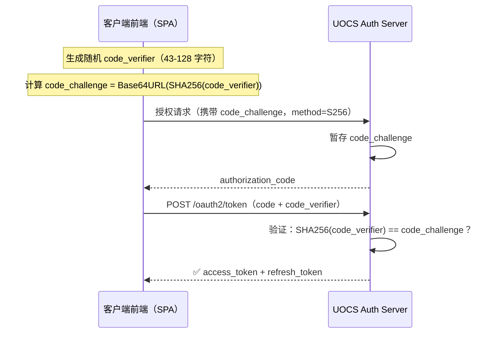
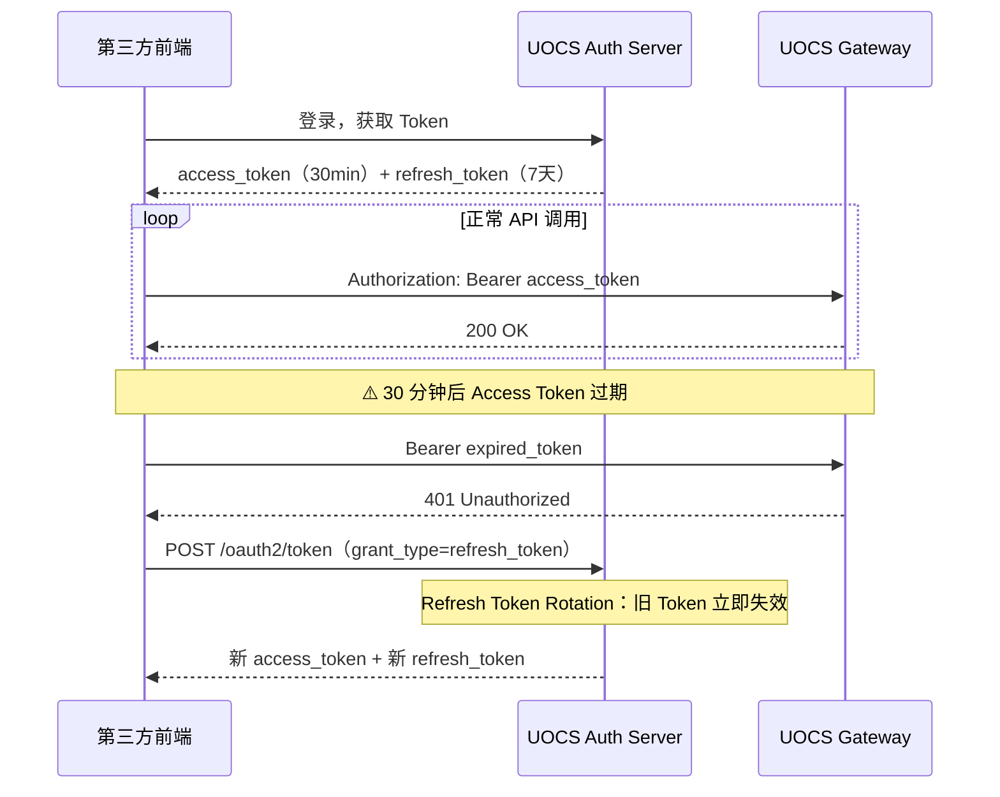
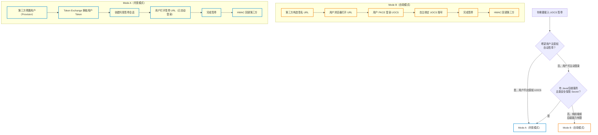
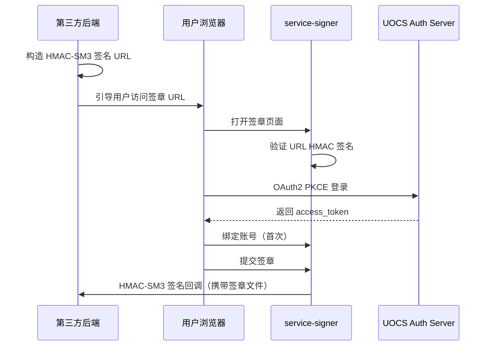
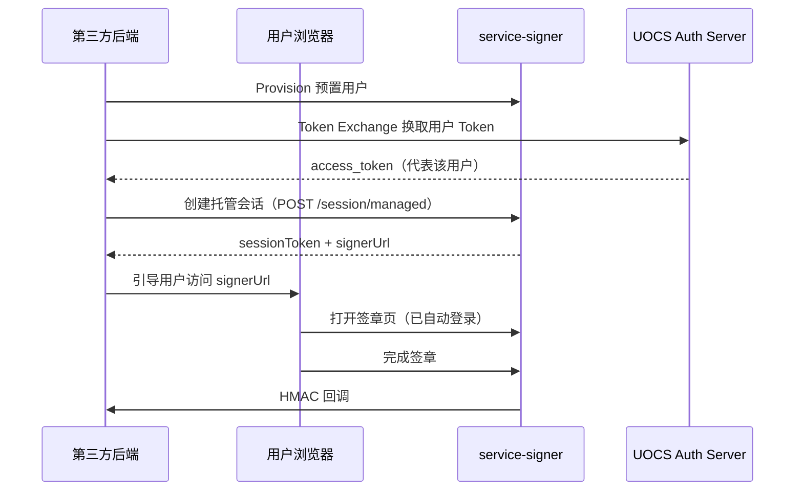
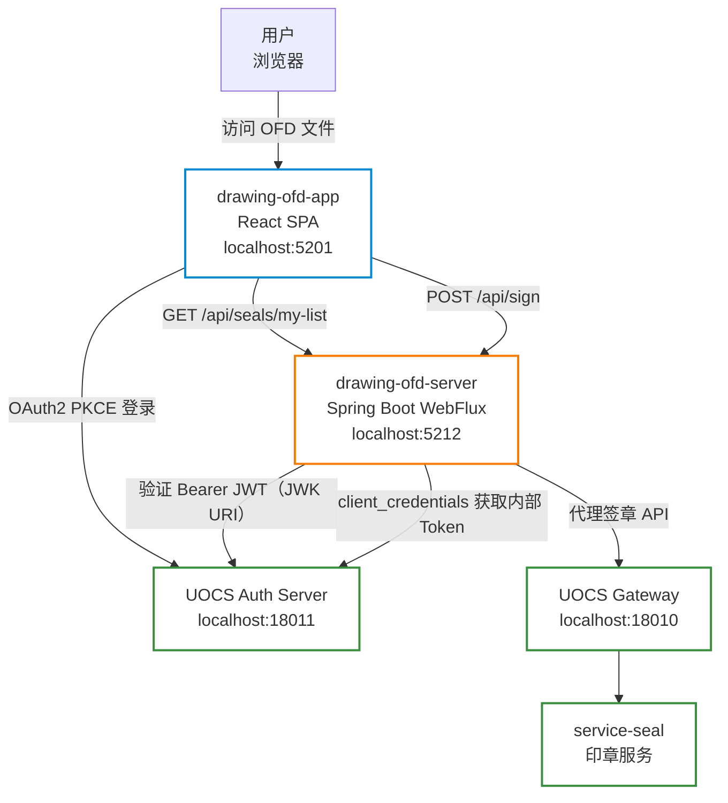
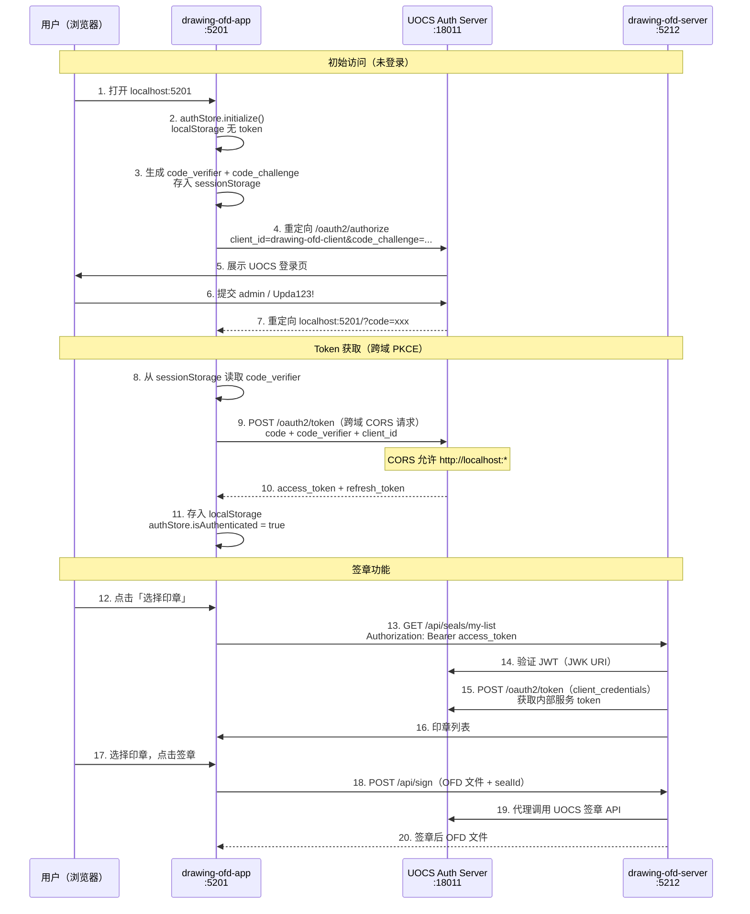
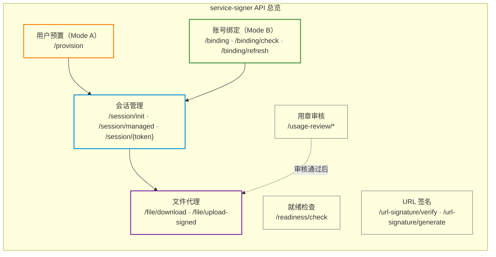

# UOCS 电子签章平台 — 第三方对接指南

> **适用对象**：接入 UOCS 独立签章功能的第三方业务系统开发人员。
> 本文档说明如何通过 [[OAuth2]] 协议获取用户授权，并调用 UOCS 签章 API 完成 OFD 文件签章。

---

## 目录

### 第一部分：认识 UOCS
- [项目定位与核心能力](#项目定位与核心能力)
- [平台架构总览](#平台架构总览)

### 第二部分：理解 OAuth2
- [为什么需要 OAuth2](#为什么需要-oauth2)
- [OAuth2 不是什么](#oauth2-不是什么)
- [四个角色](#四个角色)
- [授权码流程（Authorization Code Flow）](#授权码流程authorization-code-flow)
- [PKCE 扩展原理](#pkce-扩展原理)
- [Token 类型与生命周期](#token-类型与生命周期)
- [可用 Scope](#可用-scope)

### 第三部分：准备对接
- [应用注册](#应用注册)
- [对接模式选择](#对接模式选择)

### 第四部分：动手对接
- [Mode B 自助模式对接](#mode-b-自助模式对接)
- [Mode A 托管模式对接](#mode-a-托管模式对接)
- [对接 Checklist](#对接-checklist)

### 第五部分：集成案例
- [OFD 签章查看器集成（drawing-ofd-app）](#ofd-签章查看器集成)

### 附录
- [A. API 参考](#a-api-参考)
- [B. 安全要求](#b-安全要求)
- [C. 配置参考](#c-配置参考)
- [D. 常见问题](#d-常见问题)

---

## 第一部分：认识 UOCS

### 项目定位与核心能力

UOCS（Universal Open Certification & Signing）是一个提供 [[OAuth2]] 统一认证和国密电子签章能力的云平台。它的核心目标是让第三方业务系统无需自建签章基础设施，即可为用户提供合规的 OFD 文件签章服务。

**如果你是第三方系统的开发者**，你可能面临以下场景：

- 你的业务系统需要让用户对 OFD 文件进行电子签章，但不想自己实现证书管理、印章管理、签章算法等底层能力
- 你需要一种安全的方式让 UOCS 「代表」你的用户执行签章操作，而不是让用户重新注册一个 UOCS 账号
- 你希望签章流程对用户尽可能透明（无感知），或者让用户主动完成一次账号绑定后自动使用

UOCS 通过 [[OAuth2]] 授权框架 + 两种对接模式（Mode A 托管 / Mode B 自助）解决了这些问题。本文档将按以下顺序帮助你完成对接：

1. 先理解 UOCS 的架构（你对接的是哪些服务）
2. 再理解 [[OAuth2]] 在这个体系中的作用（为什么需要它、它解决了什么问题）
3. 然后选择对接模式、完成应用注册
4. 最后按照步骤实现对接

### 平台架构总览

UOCS 平台由以下核心服务组成，第三方系统通过 [[OAuth2]] 协议接入：



**核心组件说明**：

| 组件 | 地址 | 职责 |
|------|------|------|
| Auth Server | `:18011` | [[OAuth2]] Token 颁发、[[用户认证]] |
| Gateway | `:18010` | 路由转发、[[Bearer Token]] 验证 |
| service-signer | `/signer/**` | 独立签章代理（账号绑定、[[会话管理]]、文件回调） |

> **关键理解**：第三方系统**不直接调用** service-seal 签章服务，而是通过 service-signer 作为代理。service-signer 负责 [[OAuth2]] 认证、账号绑定、会话管理，签章完成后通过 HMAC 回调把签章文件传回第三方系统。

---

## 第二部分：理解 OAuth2

> 本章先讲「为什么」和「是什么」，再讲「怎么用」。如果你已熟悉 [[OAuth2]]，可直接跳到 [第三部分：准备对接](#第三部分准备对接)。

### 为什么需要 OAuth2

在没有 [[OAuth2]] 之前，第三方系统若要代表用户调用 UOCS 签章 API，只有一种办法：**让用户把 UOCS 密码交给第三方**。这会带来三个根本问题：

| 旧方案（共享密码） | [[OAuth2]] 方案 |
|-------------------|------------|
| 密码直接交给第三方，严重安全隐患 | 用户密码只在 UOCS Auth Server 输入，第三方从不触碰密码 |
| Token 权限不可控，拿到 Token = 拥有用户全部权限 | Scope 精细控制：第三方只能使用签章 API，无法访问其他资源 |
| Token 一旦发出无法撤销 | 标准生命周期：Access Token 30 分钟过期，支持主动撤销 |
| 接入新身份源（企业微信、LDAP）需定制开发 | OIDC 联合认证标准化，Auth Server 统一处理 |

> **核心理解**：[[OAuth2]] 不是「更安全地发 Token」，而是建立了一套标准化授权框架 —— 让用户可以安全地**授权**第三方访问自己的资源，而不需要把密码给出去。

### OAuth2 不是什么

在深入技术细节前，先澄清几个常见误解：

| 误解 | 事实 |
|------|------|
| [[OAuth2]] 是一种加密算法 | [[OAuth2]] 是**授权协议框架**，不涉及加密。加密由 TLS (HTTPS) 和 JWT 签名提供 |
| [[OAuth2]] 能替代数据库密码认证 | [[OAuth2]] 管理「授权」，不管理「认证」。用户密码仍由 Auth Server 验证，[[OAuth2]] 让「谁能拿 Token」的过程标准化 |
| 实现了 [[OAuth2]] 就安全了 | [[OAuth2]] 只解决 Token 的获取和传递。Token 存储、Scope 控制、CSRF 防护、回调验证等安全措施仍需自行实现 |
| [[OAuth2]] 很复杂，小项目用不上 | 如果系统只有自己用，确实不需要。一旦需要接入第三方、精细化权限控制，[[OAuth2]] 是标准答案 |

### 四个角色

用 UOCS 的实际组件来理解 [[OAuth2]] 的四个角色：

| [[OAuth2]] 角色 | 定义 | UOCS 对应 |
|-------------|------|-----------|
| **Resource Owner（资源所有者）** | 拥有受保护资源的用户 | UOCS 平台用户 |
| **Client（客户端）** | 请求访问资源的第三方应用 | demo-biz-system、drawing-ofd-app |
| **Authorization Server（授权服务器）** | 验证用户身份、颁发 Token | UOCS Auth Server（`:18011`） |
| **Resource Server（资源服务器）** | 托管受保护资源的服务 | UOCS Gateway + 签章微服务 |

> **类比**：你去酒店开房。你是 Resource Owner（住客），前台是 Authorization Server（验证身份证、给你房卡），房卡是 Access Token，客房是 Resource，酒店是 Resource Server。

### 授权码流程（Authorization Code Flow）

[[OAuth2]] 中**最安全、最完整**的[[授权流程]]。UOCS 采用纯 SPA + PKCE 变体（无后端 BFF 层）。

流程分两段：前半段获取授权码（两种模式共用），后半段用授权码换 Token：



**为什么需要 authorization_code 这个中间凭证？**

直接把 Token 放在重定向 URL 里不行，因为：
1. Token 会出现在浏览器历史记录中 — 任何人打开浏览器历史就能看到
2. URL 可能被第三方页面或中间人截获
3. authorization_code 是**一次性**的 — 即使被截获，攻击者没有 code_verifier 也无法换 Token

> **一句话**：authorization_code 是「临时凭证」，只能在持有 code_verifier 的条件下兑换成真正的 Token。Token 永远不会出现在浏览器地址栏中。

### PKCE 扩展原理

PKCE（Proof Key for Code Exchange，读作「pixie」）是为**公开客户端**（SPA、移动 App）设计的安全扩展。

**为什么 SPA 不能用 Client Secret？**

SPA 代码在浏览器中运行，任何人打开 F12 都能看到源码。把 Client Secret 写在代码里等于公开了，其安全价值完全丧失。

PKCE 的解法：用「一次性随机数的哈希」代替 Client Secret：



> **安全原理**：攻击者截获了 authorization_code 和 code_challenge（hash 值），但无法从 hash 反推 code_verifier，因此无法换 Token。

PKCE 工具函数示例（参考 `drawing-ofd/drawing-ofd-app/src/auth/pkce.js`）：

```javascript
// 生成随机 code_verifier
export function generateVerifier() {
    const array = new Uint8Array(32);
    crypto.getRandomValues(array);
    return btoa(String.fromCharCode(...array))
        .replace(/\+/g, '-').replace(/\//g, '_').replace(/=/g, '');
}

// 计算 S256 code_challenge
export async function generateChallenge(verifier) {
    const data = new TextEncoder().encode(verifier);
    const digest = await crypto.subtle.digest('SHA-256', data);
    return btoa(String.fromCharCode(...new Uint8Array(digest)))
        .replace(/\+/g, '-').replace(/\//g, '_').replace(/=/g, '');
}
```

**为什么不直接在前端收集密码？**

你可能会想：结果都是拿到 Token，多一次跳转有什么意义？

根本区别在于**密码在哪里输入**：

- **前端 XSS 风险**：密码式下，密码流经前端 JS 代码。一旦有 XSS 漏洞，攻击者注入恶意脚本即可截获密码。PKCE 下密码只在 Auth Server 页面输入，前端 XSS 拿不到密码。
- **无法扩展认证方式**：密码式将认证逻辑锁死在「用户名+密码」。将来加短信验证码、企业 AD 登录、MFA，前端都要改。[[OAuth2]] 认证逻辑全在 Auth Server，前端完全不感知。

### Token 类型与生命周期

UOCS 使用两种 Token：

| Token | 格式 | 有效期 | 用途 |
|-------|------|--------|------|
| Access Token | JWT | 30 分钟 | 调用签章 API 的凭证 |
| Refresh Token | 不透明字符串 | 7 天 | 续期 Access Token |

**为什么 Access Token 只有 30 分钟？**

长期 Token 一旦泄露，攻击者在整个有效期内都可冒充用户。短期 Access Token + 长期 Refresh Token 的组合是标准做法：



续期请求：

```
POST /oauth2/token
grant_type=refresh_token&refresh_token=xxx&client_id=your-client-id
```

> **Refresh Token Rotation**：每次续期后旧 Refresh Token 立即失效。如果发现旧 Token 被重复使用，说明 Token 已泄露，Auth Server 会使整个会话失效。

### 可用 Scope

第三方应用只能申请细粒度 Scope（不能申请全量权限）：

| Scope | 功能 |
|-------|------|
| `openid` | 基础身份信息 |
| `profile` | 用户 [[Profile]] |
| `seal:sign` | 执行签章操作 |
| `seal:verify` | 验证签章 |
| `file:read` | 读取文件 |
| `file:write` | 上传/写入文件 |
| `cert:query` | 查询证书 |

---

## 第三部分：准备对接

理解了 UOCS 架构和 [[OAuth2]] 原理后，接下来进入实际的对接准备工作。对接分两步：先注册应用，再选择对接模式。

### 应用注册

联系 UOCS 平台管理员，提供以下信息完成应用注册：

| 信息 | 说明 |
|------|------|
| 应用名称 | 你的业务系统名称 |
| 对接模式 | Mode A（托管）或 Mode B（自助） |
| 回调地址 | [[OAuth2]] 授权成功后的重定向地址（Mode B） |
| 申请 Scope | 所需权限范围 |

注册完成后获得：

| 参数 | Mode A | Mode B |
|------|--------|--------|
| `clientId` | ✅ 公开 | ✅ 公开 |
| `clientSecret` | ✅ **仅存服务端** | ❌ 不需要 |
| `urlSignatureKey` | ✅ 共享密钥 | ✅ 共享密钥 |

> API 管理入口：UOCS 管理控制台 → 系统管理 → 第三方应用管理

### 对接模式选择

UOCS 提供两种对接模式，选择取决于你的用户体验需求和技术架构：

| 对比维度 | Mode B（自助模式） | Mode A（托管模式） |
|---------|-------------------|-------------------|
| **用户体验** | 用户需要 UOCS 账号登录绑定 | 用户无感知 |
| **认证方式** | [[OAuth2]] PKCE（浏览器交互） | [[Token Exchange]]（服务端） |
| **[[OAuth2]] Client 类型** | Public（无 Secret） | Confidential（有 Secret） |
| **适用场景** | 技术能力有限、用户接受主动登录 | 有后端能力、希望无缝签章体验 |



---

## 第四部分：动手对接

选择好对接模式后，按照对应的章节完成实现。两种模式在「回调接口」部分是共用的。

### Mode B 自助模式对接

#### 流程说明



#### 对接步骤

**步骤一：注册 Public Client**

联系管理员，申请 Mode B 类型客户端。获得 `clientId` 和 `urlSignatureKey`。

**步骤二：构造签章 URL**

```
https://uocs.example.com/signer?clientId={clientId}&extUserId={extUserId}&fileUrl={fileUrl}&callbackUrl={callbackUrl}&state={state}&ts={ts}&nonce={nonce}&sig={sig}
```

参数说明见 [HMAC-SM3 签名算法](#hmac-sm3-签名算法)。

**步骤三：配置回调接口**

接收签章完成回调，验证 `X-Signature` 头，保存签章后的 OFD 文件。回调格式见 [回调接口规范](#回调接口规范)。

#### 参考实现：demo-biz-system（Java Spring Boot）

> 参考项目 `demo-biz-system/`，完整代码见 `src/main/java/com/demo/biz/`。

**application.yml 配置**：

```yaml
signer:
  base-url: http://localhost:3100          # uocs-signer 前端地址
  gateway-url: http://localhost:18010      # UOCS Gateway 地址
  client-id: demo-biz-001                  # 注册的 clientId
  client-secret: demo-biz-secret-001       # 注册的 clientSecret
  callback-base-url: http://localhost:9090  # 本系统回调基地址
  # url-signature-key:                      # URL 签名密钥，留空使用 client-secret
  # callback-hmac-key:                      # 回调验签密钥，留空使用 client-secret
```

**SignController — 发起 Mode B 签章**（`controller/SignController.java`）：

```java
// POST /api/sign/mode-b
// Body: { "fileId": 1, "extUserId": "emp001" }
@PostMapping("/mode-b")
public Map<String, Object> initiateModeBSign(@RequestBody Map<String, Object> req) {
    Long fileId   = Long.valueOf(req.get("fileId").toString());
    String extUserId = (String) req.get("extUserId");

    DemoFile file = fileRepo.findById(fileId)
            .orElseThrow(() -> new ResponseStatusException(NOT_FOUND, "文件不存在"));

    String fileDownloadUrl = signerConfig.getCallbackBaseUrl() + "/api/files/download/" + fileId;
    String state           = "task-" + System.currentTimeMillis();
    String signerUrl       = signerService.buildModeBSignUrl(extUserId, fileDownloadUrl, state);

    SignTask task = new SignTask(fileId, extUserId, "MODE_B", signerUrl, state);
    taskRepo.save(task);

    return Map.of("taskId", task.getId(), "signerUrl", signerUrl, "state", state);
}
```

**SignerIntegrationService — URL HMAC 构造**（`service/SignerIntegrationService.java`）：

```java
/** 构造 Mode B 签章 URL，包含 HMAC-SM3 签名 */
public String buildModeBSignUrl(String extUserId, String fileDownloadUrl, String state) {
    long ts    = Instant.now().getEpochSecond();
    String nonce = UUID.randomUUID().toString().replace("-", "").substring(0, 16);
    String callbackUrl = signerConfig.getCallbackBaseUrl() + "/api/callback";

    // ⚠️ 签名字符串中使用全称 externalUserId（URL 参数用缩写 extUserId）
    String signData = String.join("&",
            "callbackUrl=" + callbackUrl,
            "clientId="    + signerConfig.getClientId(),
            "externalUserId=" + extUserId,   // 全称
            "fileUrl="     + fileDownloadUrl,
            "nonce="       + nonce,
            "state="       + state,
            "ts="          + ts
    );

    String sig = HmacUtil.sign(signData, signerConfig.resolveUrlSignatureKey());

    return signerConfig.getBaseUrl() + "/#/sign"
            + "?mode=self"
            + "&clientId="    + encode(signerConfig.getClientId())
            + "&extUserId="   + encode(extUserId)   // URL 参数用缩写
            + "&fileUrl="     + encode(fileDownloadUrl)
            + "&callbackUrl=" + encode(callbackUrl)
            + "&state="       + encode(state)
            + "&ts="          + ts
            + "&nonce="       + nonce
            + "&sig="         + sig;
}
```

### Mode A 托管模式对接

#### 流程说明



#### Token Exchange 说明

Mode A 使用 [[RFC 8693 Token Exchange]] 扩展，让第三方后端服务代表用户获取 Token：

```
POST /oauth2/token
Content-Type: application/x-www-form-urlencoded

grant_type=urn:ietf:params:oauth:grant-type:token-exchange
&subject_token={uocsUserId}
&subject_token_type=urn:uocs:token-type:user-id
&client_id={clientId}
&client_secret={clientSecret}
&scope=seal:sign file:read
```

响应：

```json
{ "access_token": "eyJhbGci...", "token_type": "Bearer", "expires_in": 1800 }
```

#### 对接步骤

**步骤一：注册 Confidential Client**

联系管理员，申请 Mode A 类型客户端。获得 `clientId`、`clientSecret`、`urlSignatureKey`。

**步骤二：预置用户**

```
POST /signer/provision
{ "clientId": "...", "clientSecret": "...", "externalUserId": "user-001", "username": "张三", "password": "Aa123456" }
```

**步骤三：[[Token Exchange]] 获取用户 Token**

获取 `uocsUserId`（来自 Provision 响应），发起 [[Token Exchange]]（见上方）。

**步骤四：创建托管签章会话**

```
POST /signer/session/managed
{ "clientId": "...", "clientSecret": "...", "externalUserId": "user-001", "fileUrl": "https://...", "callbackUrl": "https://..." }
```

获取 `signerUrl`，引导用户访问。

**步骤五：配置回调接口**

同 Mode B，验证 `X-Signature` 并保存文件。

#### 参考实现：demo-biz-system（Mode A 完整流程）

> 参考项目 `demo-biz-system/`，完整代码见 `src/main/java/com/demo/biz/`。

**步骤 1 — 预置用户**（`service/SignerIntegrationService.java`）：

```java
/** Mode A: 调用 Provision API 预置用户（首次使用前调用一次，幂等） */
public Map<String, Object> provisionUser(String extUserId, String extUsername) {
    String url = signerConfig.getGatewayUrl() + "/signer/provision";
    Map<String, Object> body = Map.of(
            "clientId",       signerConfig.getClientId(),
            "clientSecret",   signerConfig.getClientSecret(),   // ⚠️ 仅服务端调用
            "externalUserId", extUserId,
            "username",       extUsername,
            "password",       signerConfig.getProvisionDefaultPassword()
    );
    ResponseEntity<Map> resp = restTemplate.exchange(
        url, HttpMethod.POST, new HttpEntity<>(body, jsonHeaders()), Map.class);
    return resp.getBody();
    // 响应包含 uocsUserId，供后续 Token Exchange 使用
}
```

**步骤 2 — 创建托管签章会话**（`service/SignerIntegrationService.java`）：

```java
/** Mode A: 创建托管签章会话，返回 sessionToken 和 signerUrl */
public Map<String, Object> createManagedSession(String extUserId,
                                                String fileDownloadUrl,
                                                String state) {
    String url = signerConfig.getGatewayUrl() + "/signer/session/managed";
    Map<String, Object> body = Map.of(
            "clientId",       signerConfig.getClientId(),
            "clientSecret",   signerConfig.getClientSecret(),
            "externalUserId", extUserId,
            "fileUrl",        fileDownloadUrl,
            "callbackUrl",    signerConfig.getCallbackBaseUrl() + "/api/callback",
            "state",          state
    );
    ResponseEntity<Map> resp = restTemplate.exchange(
        url, HttpMethod.POST, new HttpEntity<>(body, jsonHeaders()), Map.class);
    return resp.getBody();
    // 响应包含 sessionToken, signerUrl, expiresIn
}
```

**步骤 3 — 发起 Mode A 签章请求**（`controller/SignController.java`）：

```java
// POST /api/sign/mode-a
// Body: { "fileId": 1, "extUserId": "emp001" }
@PostMapping("/mode-a")
public Map<String, Object> initiateModeASign(@RequestBody Map<String, Object> req) {
    Long fileId    = Long.valueOf(req.get("fileId").toString());
    String extUserId = (String) req.get("extUserId");

    String fileDownloadUrl = signerConfig.getCallbackBaseUrl()
                           + "/api/files/download/" + fileId;
    String state = "task-a-" + System.currentTimeMillis();

    Map<String, Object> sessionResp =
        signerService.createManagedSession(extUserId, fileDownloadUrl, state);

    String sessionToken = (String) sessionResp.get("sessionToken");
    String signerUrl    = signerConfig.getBaseUrl() + "/#/sign?session=" + sessionToken;

    SignTask task = new SignTask(fileId, extUserId, "MODE_A", signerUrl, state);
    task.setSessionToken(sessionToken);
    taskRepo.save(task);

    return Map.of(
        "taskId",       task.getId(),
        "signerUrl",    signerUrl,       // 引导用户访问此 URL（已自动登录）
        "sessionToken", sessionToken,
        "state",        state,
        "expiresIn",    sessionResp.getOrDefault("expiresIn", 1800)
    );
}
```

### 对接 Checklist

完成上述对接后，用以下清单确认所有关键步骤：

**准备阶段（联系 UOCS 管理员）**

- [ ] 确认对接模式：Mode B（用户主动登录绑定）还是 Mode A（无感知托管）→ 参见 [对接模式选择](#对接模式选择)
- [ ] 提供：应用名称 / 回调地址（Mode B）/ 申请 Scope
- [ ] 获得：`clientId` / `urlSignatureKey` / `callbackHmacKey`（Mode A 还需 `clientSecret`）

**Mode B 对接（3 步）**

- [ ] **Step 1**：后端构造 HMAC-SM3 签名 URL → [Mode B 对接步骤](#对接步骤)
- [ ] **Step 2**：引导用户打开签章 URL（用户在 UOCS 登录并绑定账号）
- [ ] **Step 3**：实现回调接口，验证 `X-Signature`（HMAC-SM3 文件字节）→ [回调接口规范](#回调接口规范)

**Mode A 对接（5 步）**

- [ ] **Step 1**：后端调用 Provision API，预置用户账号 → [G.2 用户预置](#g2-用户预置-mode-a)
- [ ] **Step 2**：后端调用 [[Token Exchange]]，获取用户 Token（无需用户感知）→ [Token Exchange 说明](#token-exchange-说明)
- [ ] **Step 3**：后端调用 Create Session API，创建托管签章会话 → [G.1 会话管理](#g1-会话管理)
- [ ] **Step 4**：引导用户打开签章 URL（已自动登录，用户无感知）
- [ ] **Step 5**：实现回调接口，验证 `X-Signature` → [回调接口规范](#回调接口规范)

**通用（两种模式都需要）**

- [ ] 使用 **BouncyCastle** 实现 HMAC-SM3（不是标准 JDK 的 HMAC-SHA256）→ [HMAC-SM3 签名算法](#hmac-sm3-签名算法)
- [ ] URL 签名串使用 `externalUserId`（全称），URL 参数使用 `extUserId`（缩写）→ **两者混淆会导致验签失败**
- [ ] 配置 HTTPS，所有密钥使用环境变量，不可硬编码

**最常见的 3 个陷阱**

| 陷阱 | 症状 | 解决方案 |
|------|------|---------|
| HMAC 算法错误 | 验签始终失败 | 必须用 BouncyCastle `SM3Digest`，不能用 JDK `HmacSHA256` |
| 字段名混淆 | URL 打开后无法验证身份 | 签名串用 `externalUserId`，URL 参数用 `extUserId` |
| 回调验签对象错误 | 回调始终 401 | 回调签名对象是**文件字节**，不是 JSON 字符串 |

---

## 第五部分：集成案例

本部分展示已经完成 UOCS 对接的参考项目，帮助你理解完整的实现模式。

### OFD 签章查看器集成

drawing-ofd 是独立的 OFD 文件查看器，通过 OAuth2 PKCE 接入 UOCS 实现签章功能。

#### 架构总览



#### OAuth2 PKCE 完整登录流程



#### drawing-ofd-client 注册信息

在 `RegisteredClientConfig.java` 中自动注册，启动时初始化：

| 参数 | 值 |
|------|-----|
| clientId | `drawing-ofd-client` |
| clientName | OFD 签章查看器 |
| clientAuthenticationMethod | `none`（公开客户端） |
| authorizationGrantType | `authorization_code` + `refresh_token` |
| redirectUri | `http://localhost:5201/`（根路径，通过 Nacos 外部化） |
| scope | `openid profile seal:sign` |
| requireAuthorizationConsent | `false` |
| requireProofKey | `true`（强制 PKCE） |

#### 参考实现：drawing-ofd-app（React SPA）

> 参考项目 `drawing-ofd/drawing-ofd-app/src/auth/`，包含完整 OAuth2 PKCE 客户端实现。

##### pkce.js — OAuth2 PKCE 核心工具

```javascript
// src/auth/pkce.js
/** 生成 PKCE code_verifier（64 位 Base64URL 随机字符串） */
export function generateCodeVerifier() {
    const array = new Uint8Array(64);
    crypto.getRandomValues(array);
    return btoa(String.fromCharCode(...array))
        .replace(/\+/g, '-').replace(/\//g, '_').replace(/=+$/, '')
        .substring(0, 64);
}

/** 生成 code_challenge（S256 = SHA-256 + Base64URL） */
export async function generateCodeChallenge(codeVerifier) {
    const digest = await crypto.subtle.digest(
        'SHA-256', new TextEncoder().encode(codeVerifier));
    return btoa(String.fromCharCode(...new Uint8Array(digest)))
        .replace(/\+/g, '-').replace(/\//g, '_').replace(/=+$/, '');
}

/**
 * 发起授权跳转：生成 verifier/state 存入 sessionStorage，跳转到 Auth Server
 */
export async function redirectToAuthorize(config) {
    const verifier  = generateCodeVerifier();
    const challenge = await generateCodeChallenge(verifier);
    const state     = generateState();

    sessionStorage.setItem('ofd_pkce_verifier', verifier);
    sessionStorage.setItem('ofd_pkce_state',    state);

    const params = new URLSearchParams({
        response_type:         'code',
        client_id:             config.clientId,
        redirect_uri:          config.redirectUri,
        scope:                 'openid profile seal:sign',
        state,
        code_challenge:        challenge,
        code_challenge_method: 'S256',
    });
    window.location.href = `${config.authServerUrl}/oauth2/authorize?${params}`;
}

/**
 * 处理回调：验证 state，用授权码换 access_token + refresh_token
 */
export async function handleCallback(config) {
    const params   = new URLSearchParams(window.location.search);
    const code     = params.get('code');
    const state    = params.get('state');
    const verifier = sessionStorage.getItem('ofd_pkce_verifier');

    if (state !== sessionStorage.getItem('ofd_pkce_state')) throw new Error('state 不匹配');
    if (!verifier) throw new Error('缺少 PKCE verifier');

    const resp = await fetch(`${config.authServerUrl}/oauth2/token`, {
        method: 'POST',
        headers: { 'Content-Type': 'application/x-www-form-urlencoded' },
        body: new URLSearchParams({
            grant_type:    'authorization_code',
            code,
            redirect_uri:  config.redirectUri,
            client_id:     config.clientId,
            code_verifier: verifier,
        }).toString(),
    });
    const tokens = await resp.json();
    // 存入 localStorage，刷新页面后仍保持登录状态
    localStorage.setItem('ofd_access_token',  tokens.access_token);
    localStorage.setItem('ofd_refresh_token', tokens.refresh_token || '');
    return { accessToken: tokens.access_token, refreshToken: tokens.refresh_token };
}
```

> 完整文件（含 `refreshAccessToken`、`parseJwtPayload`、`isTokenExpiringSoon`）：
> `drawing-ofd/drawing-ofd-app/src/auth/pkce.js`

##### authStore.js — MobX 认证状态管理

```javascript
// src/auth/authStore.js（核心逻辑摘要）
const OAUTH2_CONFIG = {
    // fallback 默认值 http://localhost:8209（IDEA 本地调试端口），生产环境通过 .env 覆盖为 18011
    authServerUrl: import.meta.env.VITE_AUTH_SERVER || 'http://localhost:8209',
    clientId:      import.meta.env.VITE_CLIENT_ID   || 'drawing-ofd-client',
    redirectUri:   `${window.location.origin}/`,
};

class AuthStore {
    accessToken = null;
    sealList = [];       // 从 UOCS 加载的用户印章列表，注入到 OfdViewer seal prop
    initialized = false;

    /**
     * 应用启动入口：处理 OAuth2 回调 → 恢复 token → 自动刷新即将过期的 token
     */
    async initialize() {
        const urlParams = new URLSearchParams(window.location.search);
        if (urlParams.has('code')) {
            const tokens = await handleCallback(OAUTH2_CONFIG);
            this._applyTokens(tokens);
            // 清除 URL 中的 code/state 参数，保持地址栏干净
            window.history.replaceState({}, '', window.location.pathname);
            await this._loadSealList();
        } else {
            const saved = loadTokens();
            if (saved.accessToken) {
                if (isTokenExpiringSoon(saved.accessToken) && saved.refreshToken) {
                    await this._doRefresh(saved.refreshToken);
                } else {
                    this._applyTokens(saved);
                    await this._loadSealList();
                }
            }
        }
        this.initialized = true;
    }

    async login()  { await redirectToAuthorize(OAUTH2_CONFIG); }
    logout()       { clearTokens(); this.accessToken = null; this.sealList = []; }
}
```

> 完整文件：`drawing-ofd/drawing-ofd-app/src/auth/authStore.js`

##### sealApi.js — 调用 drawing-ofd-server

```javascript
// src/auth/sealApi.js
const BASE_URL = import.meta.env.VITE_OFD_SERVER || 'http://localhost:5212';

/** 获取当前用户可用印章列表（Bearer Token 认证） */
export async function fetchSealList(accessToken) {
    const resp = await fetch(`${BASE_URL}/api/seals/my-list`, {
        headers: { Authorization: `Bearer ${accessToken}` },
    });
    const data = await resp.json();
    return (data?.data?.records || data?.data || []).map(item => ({
        id:       item.sealId ?? item.id,
        name:     item.sealName ?? item.name,
        imageUrl: item.sealImageUrl ?? item.imageUrl ?? null,
    }));
}

/**
 * 执行 OFD 在线签章（multipart 上传，返回签章后 OFD 字节）
 * @param {object} params - accessToken、file、sealId、pageIndex、positionX/Y、width/height
 */
export async function signOfd({ accessToken, file, sealId, pageIndex = 1,
                                 positionX = 60, positionY = 60, width = 40, height = 40,
                                 documentName, signPassword = '' }) {
    const form = new FormData();
    form.append('file',      file);
    form.append('sealId',    String(sealId));
    form.append('pageIndex', String(pageIndex));
    form.append('positionX', String(positionX));
    form.append('positionY', String(positionY));
    form.append('width',     String(width));
    form.append('height',    String(height));
    if (documentName) form.append('documentName', documentName);
    if (signPassword) form.append('signPassword', signPassword);

    const resp = await fetch(`${BASE_URL}/api/sign`, {
        method: 'POST',
        headers: { Authorization: `Bearer ${accessToken}` },
        body: form,
    });
    // 成功时返回签章后 OFD 二进制（application/octet-stream）
    const signedBytes = await resp.arrayBuffer();
    return { success: true, signedOfdBytes: signedBytes };
}
```

> 完整文件：`drawing-ofd/drawing-ofd-app/src/auth/sealApi.js`

##### App.jsx — 整合 OAuth2 + OFD 签章

```jsx
// src/App.jsx（核心逻辑）
const App = observer(() => {
    const [currentFile, setCurrentFile] = useState(null);
    const [signedOfd,   setSignedOfd]   = useState(null);

    // 启动时初始化认证（处理回调 + 恢复 token）
    useEffect(() => { authStore.initialize(); }, []);

    // 初始化完成且未登录时，自动跳转 UOCS 登录页
    useEffect(() => {
        if (authStore.initialized && !authStore.isAuthenticated) {
            authStore.login();
        }
    }, [authStore.initialized, authStore.isAuthenticated]);

    // 签章回调：调用 drawing-ofd-server，成功后替换文档
    const handleSign = useCallback(async ({ sealId, page, position, password }) => {
        return signOfd({
            accessToken: authStore.accessToken,
            file:        currentFile,
            sealId,
            pageIndex:   page,
            positionX:   position?.x,
            positionY:   position?.y,
            width:       position?.width,
            height:      position?.height,
            signPassword: password || '',
        });
    }, [currentFile]);

    // 将印章列表和签章回调注入 OfdViewer seal prop
    const sealConfig = authStore.isAuthenticated ? {
        enabled:           true,
        sealList:          authStore.sealList,   // 从 UOCS 动态加载
        requirePassword:   true,
        onSign:            handleSign,
        onSignComplete:    (result) => {
            if (result?.signedOfdBytes) setSignedOfd(result.signedOfdBytes);
        },
        onSealListRefresh: () => authStore.refreshSealList(),
    } : undefined;

    return (
        <OfdViewer
            src={signedOfd || undefined}   // 签章成功后自动替换文档
            seal={sealConfig}
        />
    );
});
```

> 完整文件：`drawing-ofd/drawing-ofd-app/src/App.jsx`

#### drawing-ofd-server API

**基础 URL**: `http://localhost:5212`（开发环境）

前端通过 Vite `/api` 代理访问（代理目标 `http://localhost:5212`），生产环境直接访问 5212 端口。

##### `GET /api/seals/my-list`

获取当前登录用户的可用印章列表。

- **认证**：`Authorization: Bearer <access_token>`
- **实现**：drawing-ofd-server 验证 JWT → 提取 userId → 使用 client_credentials token 代理调用 UOCS Gateway `/seal/list/{userId}`
- **响应**：

```json
[
  {
    "sealId": "SE2025001",
    "sealName": "张三个人章",
    "sealType": "PERSONAL",
    "imageUrl": "https://..."
  }
]
```

##### `POST /api/sign`

对 OFD 文件发起签章。

- **认证**：`Authorization: Bearer <access_token>`
- **请求体** (`multipart/form-data`)：
  - `file`：OFD 文件字节
  - `sealId`：印章 ID
- **处理流程**：
  1. 读取 OFD ZIP → 计算 SM3 摘要
  2. 使用 client_credentials token 调用 UOCS `/seal/sign`
  3. 将签名嵌入 OFD ZIP（`signatures/` 目录）
  4. 返回签章后的 OFD 文件
- **响应**：`application/octet-stream`（签章后 OFD 文件字节）

#### 部署配置

**drawing-ofd-app 环境变量**（`.env.development`）：

```bash
VITE_AUTH_SERVER=http://localhost:18011   # Auth Server 直接访问（PKCE token exchange）
VITE_CLIENT_ID=drawing-ofd-client
```

**drawing-ofd-server 配置**（`application.yml`）：

```yaml
server:
  port: 5212

spring:
  security:
    oauth2:
      resourceserver:
        jwt:
          jwk-set-uri: http://localhost:18011/oauth2/jwks

uocs:
  gateway-url: http://localhost:18010

cors:
  allowed-origins: http://localhost:5201
```

> **注意**：`uocs.client-id`、`uocs.client-secret`、`uocs.token-endpoint` 等配置通过 Nacos 外部化管理，不在本地 yml 中。

**Vite 代理**（`vite.config.js`）：

```js
server: {
  proxy: {
    '/api': { target: 'http://localhost:5212', changeOrigin: true }
  }
}
```

#### E2E 测试覆盖

测试文件：`e2e/tests/drawing-ofd-auth.spec.ts`

| 测试 | 断言 |
|------|------|
| 应用加载 — 未登录时跳转授权页 | URL 包含 `localhost:18011/oauth2/authorize` |
| OAuth2 完整登录流程 | 登录后回到 localhost:5201，OFD 查看器渲染 |
| 登录后印章功能按钮可见 | `[data-testid="seal-select-btn"]` 可见 |
| OFD 文件查看器基础渲染 | `[data-testid="ofd-viewer-root"]` 存在 |

运行命令：

```bash
cd e2e
npx playwright test tests/drawing-ofd-auth.spec.ts --reporter=list
# 或运行全量 9 个测试
npx playwright test --reporter=list
```

---

## 附录

### A. API 参考

> 所有 API 路径通过 UOCS Gateway 访问，基础路径前缀为 `/signer`。



#### G.1 会话管理

##### `POST /signer/session/init` — 初始化自助会话 (Mode B)

前端在 OAuth2 认证完成后调用。**Headers**: `Authorization: Bearer <access_token>`

**请求体**：

```json
{
  "clientId": "string (必填)",
  "externalUserId": "string (必填)",
  "fileUrl": "string (可选)",
  "callbackUrl": "string (可选)",
  "state": "string (可选)"
}
```

**响应体**：

```json
{ "sessionId": 42, "sessionToken": "st_xxx", "expiresIn": 1800 }
```

##### `POST /signer/session/managed` — 创建托管会话 (Mode A)

第三方**后端**调用，创建签章会话并获取 sessionToken。

**请求体**：

```json
{
  "clientId": "string (必填)",
  "clientSecret": "string (必填)",
  "externalUserId": "string (必填)",
  "fileUrl": "string (必填)",
  "callbackUrl": "string (可选)",
  "state": "string (可选)"
}
```

**响应体**：

```json
{
  "sessionToken": "st_xxx",
  "signerUrl": "https://signer.uocs.example.com/sign?session=st_xxx",
  "expiresIn": 1800
}
```

##### `GET /signer/session/{token}` — 查询会话信息

通过 sessionToken 查询会话详情（含 accessToken，仅 Mode A）。

**响应体**：

```json
{
  "sessionId": 42,
  "sessionMode": "MANAGED",
  "accessToken": "eyJhbGci...",
  "fileUrl": "https://...",
  "callbackUrl": "https://...",
  "state": "order-12345",
  "uocsUserId": "1801234567890",
  "clientId": "your-client-id",
  "externalUserId": "employee-001",
  "certPasswordSet": true,
  "expiresAt": "2025-01-15T11:00:00"
}
```

#### G.2 用户预置 (Mode A)

##### `POST /signer/provision` — 预置用户

调用一次即可，重复调用幂等返回。

**请求体**：

```json
{
  "clientId": "string (必填)",
  "clientSecret": "string (必填)",
  "externalUserId": "string (必填)",
  "username": "string (必填)",
  "password": "string (必填)"
}
```

**响应体**：

```json
{
  "bindingId": 42,
  "uocsUserId": "1801234567890",
  "uocsUsername": "emp001@company.com",
  "provisionStatus": "PROVISIONED | ALREADY_EXISTS"
}
```

#### G.3 账号绑定 (Mode B)

| 方法 | 端点 | 说明 | 认证 |
|------|------|------|------|
| `GET` | `/signer/binding/check` | 检查绑定状态 | 公开（参数: `clientId`, `externalUserId`） |
| `GET` | `/signer/binding/me` | 查询当前用户所有绑定 | 需 JWT |
| `POST` | `/signer/binding` | 创建绑定 | 需 JWT |
| `DELETE` | `/signer/binding/{id}` | 解除绑定 | 需 JWT |
| `POST` | `/signer/binding/refresh` | 刷新 Token | 需 JWT |

#### G.4 文件代理

| 方法 | 端点 | 说明 | 认证 |
|------|------|------|------|
| `GET` | `/signer/file/download` | 代理下载文件 | 需 JWT（参数: `sessionId` 或 `url`） |
| `POST` | `/signer/file/upload-signed` | 上传签章文件并触发回调 | 需 JWT（multipart: `file`, `sessionId`） |

#### G.5 签章就绪检查

`GET /signer/readiness/check` — 检查当前用户就绪状态（需 JWT）

#### G.6 URL 签名（开发调试）

| 方法 | 端点 | 说明 |
|------|------|------|
| `POST` | `/signer/url-signature/verify` | 验证签名（参数: 所有 URL 参数） |
| `POST` | `/signer/url-signature/generate` | 生成签名（仅调试，返回 `{ "signature": "hex..." }`） |

#### G.7 用章审核

| 方法 | 端点 | 说明 |
|------|------|------|
| `GET` | `/signer/usage-review/policy` | 查询策略 |
| `PUT` | `/signer/usage-review/policy` | 设置策略（管理员） |
| `POST` | `/signer/usage-review` | 创建审核申请 |
| `GET` | `/signer/usage-review/{requestId}/status` | 查询审核状态 |
| `POST` | `/signer/usage-review/{requestId}/cancel` | 取消申请 |
| `GET` | `/signer/usage-review/pending` | 待审核列表（审核员） |
| `POST` | `/signer/usage-review/{requestId}/approve` | 审批通过 |
| `POST` | `/signer/usage-review/{requestId}/reject` | 审批拒绝 |

#### G.8 HMAC-SM3 签名算法

##### Mode B 签章 URL 签名

**URL 参数**：

| 参数 | 必填 | 说明 |
|------|------|------|
| `clientId` | ✅ | OAuth2 Client ID |
| `extUserId` | ✅ | 第三方用户标识 |
| `fileUrl` | ✅ | 待签章 OFD 文件下载地址 |
| `callbackUrl` | ✅ | 签章完成后文件回传地址 |
| `state` | ❌ | 透传业务标识 |
| `ts` | ✅ | UNIX 时间戳（秒），有效期 300 秒 |
| `nonce` | ✅ | 随机字符串（建议 UUID） |
| `sig` | ✅ | HMAC-SM3 签名 |

**签名字符串构造规则**：参数按**字母序**拼接。⚠️ 签名字符串中使用全称 `externalUserId`（不是 URL 中的缩写 `extUserId`）。

```
signPayload = "callbackUrl={callbackUrl}&clientId={clientId}&externalUserId={extUserId的值}&fileUrl={fileUrl}&nonce={nonce}&state={state}&ts={ts}"
```

**完整示例**：

```
URL 参数：clientId=demo-app&extUserId=emp001&fileUrl=https://example.com/doc.ofd
         &callbackUrl=https://example.com/callback&state=order-123&ts=1711929600&nonce=uuid-abc-123

签名字符串：callbackUrl=https://example.com/callback&clientId=demo-app&externalUserId=emp001
            &fileUrl=https://example.com/doc.ofd&nonce=uuid-abc-123&state=order-123&ts=1711929600

sig = HMAC-SM3(signPayload, urlSignatureKey)
```

**Java 实现（demo-biz-system HmacUtil.java，使用 BouncyCastle）**：

```java
// 依赖：org.bouncycastle:bcprov-jdk18on:1.78.1
import org.bouncycastle.crypto.digests.SM3Digest;
import org.bouncycastle.crypto.macs.HMac;
import org.bouncycastle.crypto.params.KeyParameter;

/** 对字符串进行 HMAC-SM3 签名，返回十六进制小写 */
public static String sign(String data, String secret) {
    HMac hmac = new HMac(new SM3Digest());
    hmac.init(new KeyParameter(secret.getBytes(StandardCharsets.UTF_8)));
    byte[] input  = data.getBytes(StandardCharsets.UTF_8);
    hmac.update(input, 0, input.length);
    byte[] result = new byte[hmac.getMacSize()];
    hmac.doFinal(result, 0);
    // 转十六进制小写
    StringBuilder sb = new StringBuilder(result.length * 2);
    for (byte b : result) sb.append(String.format("%02x", b));
    return sb.toString();
}
```

> 完整实现见 `demo-biz-system/src/main/java/com/demo/biz/util/HmacUtil.java`，包含字节数组重载和 `verify()` 方法（用于回调验签）。

##### 回调文件 HMAC 签名

签章完成后回调的 `X-Signature` 头为 `HMAC-SM3(文件字节, callbackHmacKey)`。

**参考实现：demo-biz-system CallbackController.java**：

```java
// POST /api/callback（Content-Type: multipart/form-data）
// Headers: X-Signature — HMAC-SM3(文件字节, callbackHmacKey)
// Parts:   file（签章后 OFD 文件）、state（业务标识）、signInfo（签章信息 JSON）
@PostMapping
public ResponseEntity<Map<String, Object>> receiveCallback(
        @RequestHeader(value = "X-Signature", required = false) String signature,
        @RequestParam(value = "state",    required = false) String state,
        @RequestParam(value = "signInfo", required = false) String signInfo,
        @RequestParam(value = "file",     required = false) MultipartFile file) {

    // 1. 读取文件字节（HMAC 验签对象是文件字节，非字符串）
    byte[] fileBytes = file != null ? file.getBytes() : null;

    // 2. 验证 X-Signature（对文件字节做 HMAC-SM3）
    boolean hmacValid = signerService.verifyCallbackHmac(signature, fileBytes);
    if (!hmacValid) {
        return ResponseEntity.status(401).body(Map.of("error", "签名验证失败"));
    }

    // 3. 根据 state 查找签章任务，更新状态
    SignTask task = taskRepo.findByState(state).orElseThrow(...);
    task.setStatus("COMPLETED");
    task.setCallbackPayload(signInfo);
    taskRepo.save(task);

    // 4. 保存签章后文件（实际系统中持久化到文件系统或对象存储）
    fileRepo.findById(task.getFileId()).ifPresent(f -> {
        f.setSignStatus("SIGNED");
        fileRepo.save(f);
    });

    return ResponseEntity.ok(Map.of("status", "received", "taskId", task.getId()));
}
```

> 完整实现见 `demo-biz-system/src/main/java/com/demo/biz/controller/CallbackController.java`。

#### G.9 回调接口规范

##### 请求格式

```http
POST {callbackUrl}
Content-Type: multipart/form-data
X-Signature: <HMAC-SM3(文件字节, callbackHmacKey)>

file: (签章后的 OFD 文件)
state: order-12345
signInfo: {"signTime":"2025-01-15T10:30:00","sessionId":42,"clientId":"your-client-id"}
```

| 字段 | 类型 | 说明 |
|------|------|------|
| `file` | 文件 (multipart) | 签章后的 OFD 文件 |
| `state` | 字符串 | 透传的业务标识 |
| `signInfo` | JSON 字符串 | 签章元数据 |
| `X-Signature` 头 | 字符串 | HMAC-SM3 签名 |

##### 重试机制

| 次数 | 退避时间 | 说明 |
|------|---------|------|
| 第 1 次 | 立即 | 签章完成后立即回调 |
| 第 2 次 | 10 秒 | 首次失败后 |
| 第 3 次 | 30 秒 | 指数退避 |

回调成功条件：HTTP 响应码 `2xx`。最大重试 3 次（可配置）。

#### G.10 回调管理

| 方法 | 端点 | 说明 |
|------|------|------|
| `GET` | `/signer/callback/records` | 查询回调记录 |
| `POST` | `/signer/callback/{sessionId}/retry` | 手动重试回调 |

#### G.11 错误码

| HTTP 状态码 | 场景 | 说明 |
|------------|------|------|
| 400 | 参数错误 | 缺少必填参数、格式不正确 |
| 401 | 未授权 | JWT 过期 / Token 无效 |
| 403 | 禁止访问 | 权限不足 / HMAC 验证失败 / Scope 权限不足 |
| 404 | 未找到 | 会话不存在 / 绑定不存在 |
| 409 | 冲突 | 签章会话状态已变更（重复提交） |

**错误响应格式**（`ErrorResultDTO`）：

```json
{ "message": "缺少签名参数 sig", "cause": null, "exceptionName": "com.upda.common.core.exception.BusinessException" }
```

---

### B. 安全要求

#### 密钥管理

| 密钥 | 用途 | 保管要求 |
|------|------|---------|
| `clientSecret` | Mode A API 认证 | **仅存服务端**，禁止暴露到前端或日志 |
| `urlSignatureKey` | URL 签名 | 第三方后端与 UOCS 共享，禁止暴露 |
| `callbackHmacKey` | 回调文件签名验证 | 第三方后端与 UOCS 共享 |

#### 安全清单

- [ ] `clientSecret` 存储在环境变量或密钥管理系统，不硬编码
- [ ] 回调接口验证 `X-Signature`（HMAC-SM3）
- [ ] URL 签名参数包含时间戳（`ts`）和随机数（`nonce`），防止重放
- [ ] 回调接口使用**常量时间比较**（`MessageDigest.isEqual`）防时序攻击
- [ ] 生产环境 `callbackUrl` 使用 HTTPS
- [ ] 正式环境配置 `url-signature-key`（开发环境可留空跳过验证）

---

### C. 配置参考

#### Auth Server CORS 配置（PKCE SPA 必须）

PKCE SPA 从浏览器直接向 Auth Server 发起 token exchange，属于跨域请求，Auth Server 需配置 CORS：

```yaml
# Nacos: auth-prod.yaml
oauth2:
  cors:
    allowed-origin-patterns: "https://your-domain.com"  # 替换为实际前端域名
```

> **注意**：PKCE 公开客户端不使用 Cookie，`allowCredentials` 为 `false`。

#### service-signer 关键配置

```yaml
signer:
  url-signature-key: ""           # URL HMAC 签名密钥（留空跳过验证）
  url-signature-ttl-seconds: 300  # URL 签名有效期（秒）
  callback-hmac-key: ""           # 回调 HMAC 密钥（留空则使用 token-encryption-key）
  callback-url-allowlist: ""      # 回调域名白名单（逗号分隔）
  file-url-allowlist: ""          # 文件域名白名单（逗号分隔）
  session-ttl: 1800               # 会话过期时间（秒）
  callback-max-retries: 3         # 回调最大重试次数
```

---

### D. 常见问题

**Q: Mode B 和 Mode A 可以同时使用吗？**

可以。同一个 `clientId` 下，不同用户可以使用不同模式。但同一用户（`clientId + extUserId`）只能绑定一种模式。

**Q: 用户需要安装客户端吗？**

不需要。签章 App 是 Web 应用（SPA），通过浏览器访问。

**Q: 支持哪些文件格式？**

目前支持 OFD 格式。PDF 签章需另行集成。

**Q: 签章文件回传失败怎么办？**

UOCS 自动重试最多 3 次（指数退避）。如仍失败，可通过管理后台查看回调记录并手动重试。

**Q: sessionToken 过期后怎么处理？**

重新调用 `POST /signer/session/managed` 创建新会话。默认过期时间 30 分钟。

**Q: 如何在开发环境跳过 HMAC 签名验证？**

UOCS 未配置 `url-signature-key` 时自动跳过 URL 验证。正式环境必须配置。

**Q: PKCE Token Exchange 被浏览器 CORS 阻断怎么排查？**

现象：OAuth2 回调成功（URL 带授权码），但 App 随即又跳回授权页，Network 显示 `/oauth2/token` 请求未收到响应。

根因：PKCE SPA 在浏览器端直接 POST 到 Auth Server（跨域），Auth Server 未配置 CORS。

解决：参见 [Auth Server CORS 配置](#auth-server-cors-配置pkce-spa-必须)。

**Q: 如何强制下线 OAuth2 用户的 Token？**

通过 Auth Server 的 SSO 登出端点 `/sso-logout`，或直接撤销 `oauth2_authorization` 记录中的 Token。

## 相关笔记

- [[架构总览]]
- [[RFC 9068 JWT Access Token]]
- [[OAuth 2.1 演进]]
- [[扩展协议]]
- [[端点与发现]]
- [["OAuth 2.0 授权框架（RFC 6749）"]]
- [[JWT 令牌]]
- [[OAuth2 动态客户端注册与管理]]
