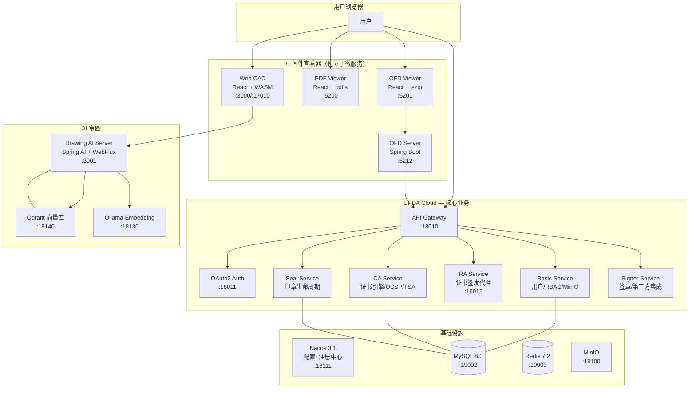

# 项目简介

> 面向新人的 UOCS 项目全景导览。读完本文你将理解：这个项目解决什么问题、整体怎么设计的、代码怎么组织的。

## UOCS 解决什么问题？

想象一家建筑设计公司，日常工作涉及大量电子文档：

- **图纸** — 建筑师用 [[AutoCAD]] 画的 DWG/DXF 文件
- **PDF** — 施工说明、审批文件
- **OFD** — 政务场景中使用的国家标准版式文档

这些文档需要被**查看、审批、签名、盖章**，而且要符合中国国密标准（SM2/SM3）。过去这需要多个独立软件，用户体验碎片化。

**UOCS 的目标**：在一个统一的云平台上完成这些操作——CA 证书管理、电子印章、文件查看/编辑/AI 审图，全部通过浏览器完成。

## 高层架构



## 服务怎么通信？

UOCS 的服务间通信有三种模式：

### 1. 同步调用：Spring Cloud Gateway + Feign

最核心的调用模式。用户请求经过的路径：

```
浏览器 → Gateway(:18010)
  → AuthGlobalFilter 验证 JWT，注入 X-User-Id / X-User-Roles 头
  → Nacos 服务发现路由到目标微服务
  → UserInterceptor 存入 ThreadLocal
  → Controller → Service → Mapper(DB)
```

微服务之间用 **OpenFeign** 调用。例如 Seal 服务需要签证书时：

```
Seal → RaClient(Feign) → RA → CA(/internal/签发接口)
```

### 2. 服务发现：Nacos

所有微服务启动时注册到 Nacos。Gateway 通过 Nacos 找到目标服务的实例地址，无需硬编码 IP。

```
服务启动 → 注册到 Nacos → Gateway 查询 Nacos → 路由到实例
```

### 3. 配置管理：Nacos Config

每个服务的业务配置存在 Nacos，不在本地 `application.yml` 里。配置格式是 `{服务名}.yaml + {服务名}-{profile}.yaml`。

## 代码怎么组织的？

`upda-code/` 是工作区根目录，**不是 Git 仓库**。每个子项目是独立的 Git 仓库：

```
upda-code/                          ← 工作区根目录（不是 Git 仓库）
├── upda-cloud/
│   ├── upda-cloud-server/          ← 后端微服务（Git 仓库）
│   └── upda-cloud-client/          ← 管理前端（Git 仓库）
├── drawing-cad/
│   ├── drawing-web-app/            ← Web CAD 前端（Git 仓库）
│   ├── drawing-ai-server/          ← AI 审图后端（Git 仓库）
│   └── drawingweb/                 ← WASM C++ 源码（Git 仓库，无修改权限）
├── drawing-pdf/
│   └── drawing-pdf-app/            ← PDF 查看器（Git 仓库）
├── drawing-ofd/
│   ├── drawing-ofd-app/            ← OFD 查看器前端（Git 仓库）
│   └── drawing-ofd-server/         ← OFD 签章后端（Git 仓库）
├── docker-compose/                 ← Docker 部署配置（不纳入 Git，用 SVN 管理）
├── test-drawings/                  ← E2E 测试图纸（SVN 仓库）
└── docs/                           ← 项目文档
```

**关键规则**：

- 提交代码时必须 `cd` 到对应子仓库目录再 `git commit`
- `drawingweb/`（WASM 源码）无修改权限，需要修改时在 `docs/` 生成修改报告
- Docker 部署配置通过 SVN 管理同步到[[测试服务器]]

## 模块边界

理解模块边界能避免很多混乱：

| 边界 | 说明 |
|------|------|
| RA 不负责注册审批 | 注册编排已迁移到 Seal 服务，RA 只做身份核验和证书操作 |
| CA 内部接口隔离 | `/internal/**` 仅供 Feign 调用，Gateway 拦截外部访问 |
| 中间件查看器独立 | drawing-pdf/drawing-ofd/drawing-cad 与 upda-cloud 无代码依赖 |
| OFD 需要后端 | 与 PDF 不同，OFD 有独立的签章后端，通过 [[OAuth2]] 接入 UOCS |
| gmcore 是遗留系统 | 有独立用户体系，禁止与 UOCS 新功能耦合 |

## 下一步

读完本文后，根据你的工作方向选择：

- **做后端开发** → 读 [[架构总览]] 查看服务拓扑细节，然后进入 [[../upda-cloud/|upda-cloud]]
- **做 CAD 前端** → 进入 [[../drawing-cad/|drawing-cad]]，从 [[../drawing-cad/WebCAD前端/前端架构|前端架构]] 开始
- **做 AI 审图** → 进入 [[../drawing-cad/AI后端/Harness架构详解|Harness 架构详解]]
- **做部署运维** → 进入 [[../docker与部署/Docker部署架构|Docker 部署架构]]
- **写代码** → 必读 [[../开发实践/AI编码行为准则|AI 编码行为准则]] 和 [[../开发实践/编码规范|编码规范]]

## 相关笔记

- [[Docker 部署架构]]
- [[WebUACAD AI Agent 全面分析报告]]
- [[CAD AI Agent 改进计划]]
- [[规划审图 AI 智能体解决方案]]
- [[AI助手功能开发方向]]
- [[DrawingRibbon properties and layers optimization]]
- [[基于ODA的二维绘图项目参考]]
