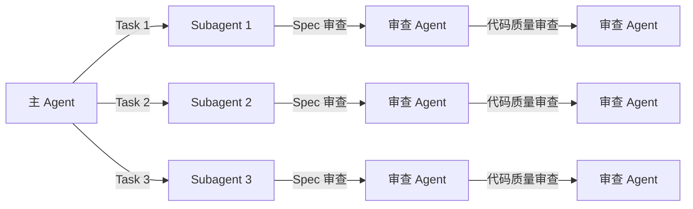
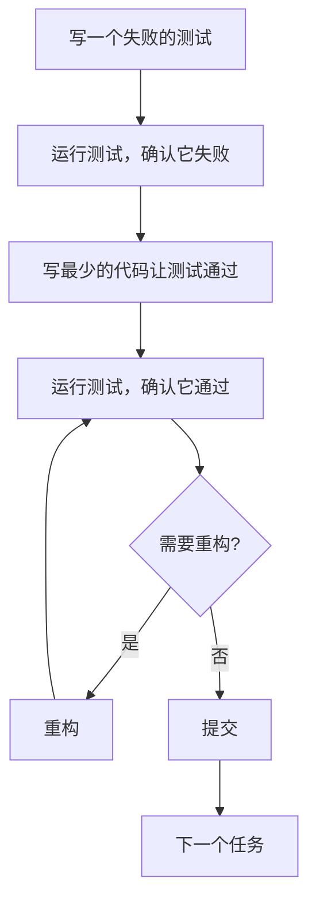

# Superpowers 使用手册与最佳实践 — 实施计划

> **For agentic workers:** REQUIRED SUB-SKILL: Use superpowers:subagent-driven-development (recommended) or superpowers:executing-plans to implement this plan task-by-task. Steps use checkbox (`- [ ]`) syntax for tracking.

**Goal:** 创建一篇面向技术社区的 Superpowers 使用手册，以虚拟场景驱动教学，覆盖核心工作流 6 个 skill 的深度讲解 + 4 个进阶 skill + 最佳实践。

**Architecture:** 单篇 MOC 式 [[Obsidian]] Markdown 长文，存放在 `topic/ai/好用的扩展/开发工作流/superpower/Superpowers 使用手册与最佳实践.md`。以"给 Next.js Todo 应用添加导出功能"为贯穿场景，每个核心 skill 采用四层教学结构（为什么 → 怎么运作 → 场景演示 → 最佳实践），进阶 skill 用紧凑格式。

**Tech Stack:** [[Obsidian]] Flavored Markdown（wikilinks、callouts、[[Mermaid]]、frontmatter）

---

## File Structure

| File | Action | Responsibility |
|------|--------|----------------|
| `topic/ai/好用的扩展/开发工作流/superpower/Superpowers 使用手册与最佳实践.md` | Create | 手册主体，~6000-8000 字 |

无其他文件需要创建或修改。已有 3 篇笔记保留不动，通过 wikilink 引用。

---

### Task 1: 创建文件，写引言 + 安装 + 场景设定

**Files:**
- Create: `topic/ai/好用的扩展/开发工作流/superpower/Superpowers 使用手册与最佳实践.md`

- [ ] **Step 1: 创建文件并写 frontmatter + 标题 + 引言**

创建文件，写入以下内容：

```markdown
---
title: "Superpowers 使用手册与最佳实践"
source: "https://github.com/obra/superpowers"
description: "一套面向编码 Agent 的可组合技能框架的完整使用手册，包含核心工作流教学、进阶技能指南和最佳实践。"
tags:
  - ai
  - 扩展
  - 开发工作流
---

## 引言：为什么需要方法论

你有没有经历过这样的场景：让 AI Agent 帮你写个功能，它二话不说直接开写，写到一半发现理解错了需求，删了重来；或者写完了才想起来没写测试，补测试的时候又改了实现逻辑；又或者在一个分支上同时改三个功能，最后 merge 的时候一团糟。

这些问题不是 Agent 的能力问题——是**方法论**的缺失。

Superpowers 是一套构建在编码 Agent 之上的**软件开发方法论**。它把 Jesse Vincent 多年的 Agent 协作经验提炼成 14 个可自动触发的 skill（技能），让 Agent 从"我说你做"变成一个有纪律的工程搭档。

核心理念用三句话概括：

- **流程优于猜测** — Agent 不会跳过设计直接写代码
- **证据优于断言** — 没有测试通过就不算完成
- **隔离优于混合** — 每个功能在独立工作区开发

> [!tip] 这篇手册适合谁？
> 已经会用 Claude Code（或其他编码 Agent），想通过 Superpowers 提升开发质量和效率的开发者。如果你还没用过编码 Agent，建议先熟悉基本操作再回来。

> 相关笔记：[[Superpowers：我在 2025 年 10 月如何使用编码代理]] — 了解 Superpowers 的诞生背景和设计哲学

## 安装与快速验证

> [!info] 完整安装步骤
> 本文只覆盖 Claude Code 平台。其他平台（Codex、Gemini CLI、Cursor 等）的安装方式请参考 [[Superpowers README]]。

在 Claude Code 中执行：

```bash
/plugin marketplace add obra/superpowers-marketplace
/plugin install superpowers@superpowers-marketplace
```

退出并重启 `claude`。

**验证安装成功：** 启动新会话后，你应该看到类似这样的注入提示：

```
<session-start-hook><EXTREMELY_IMPORTANT>
You have Superpowers.
```

也可以通过 `/plugins` 命令查看已安装插件列表，确认 Superpowers 处于启用状态。

> [!warning] 已废弃的用法
> 早期版本需要手动输入 `/superpowers:brainstorm` 等斜杠命令。现在 skill 会根据上下文自动触发，不需要手动调用。

## 场景：给 Todo 应用添加导出功能

接下来的六章，我们会跟随一个完整场景走完 Superpowers 的核心工作流。

**场景设定：** 你有一个 Next.js 写的 Todo 应用，用 Prisma + PostgreSQL 存储数据。你想加一个功能：用户可以把待办事项导出为 Markdown 文件。

为什么选这个场景？

- 简单到你能快速理解需求，不需要懂业务领域
- 涉及前后端（API 路由 + 下载按钮），能展示完整开发链路
- 有设计决策空间（导出全部还是筛选？即时下载还是生成后通知？），正好让 brainstorming skill 发挥作用

准备好了吗？出发。
```

- [ ] **Step 2: 检查文件已正确创建**

确认文件存在且 frontmatter 格式正确，wikilink 指向正确的已有笔记文件名。

- [ ] **Step 3: Commit**

```bash
git add "topic/ai/好用的扩展/开发工作流/superpower/Superpowers 使用手册与最佳实践.md"
git commit -m "docs(superpowers): 添加使用手册 — 引言、安装、场景设定"
```

---

### Task 2: 第 1 站 — 头脑风暴（brainstorming）

**Files:**
- Modify: `topic/ai/好用的扩展/开发工作流/superpower/Superpowers 使用手册与最佳实践.md`（在场景设定后追加）

- [ ] **Step 1: 写"第 1 站：头脑风暴"完整章节**

追加以下内容到文件末尾：

```markdown
## 第 1 站：头脑风暴（brainstorming）

### 为什么需要这一站

没有 Superpowers 的时候，你跟 Agent 说"加个导出功能"，它大概率直接开始写代码了。写完你一看，导出格式是 CSV 而不是 Markdown，而且没有处理空列表的情况。你让它改，它改了，但改的过程中又把别的地方弄坏了。

问题出在哪？**它跳过了最重要的步骤——搞清楚到底要做什么。**

brainstorming skill 强制 Agent 在写任何代码之前，先通过提问打磨需求，然后分段展示设计方案供你确认。它的硬性规则是：

> 你不能在获得设计批准之前写任何代码。无论项目看起来多简单。

### 怎么运作

```mermaid
graph TD
    A[你提出需求] --> B[Agent 主动提问]
    B --> C{你的回答引发新问题?}
    C -->|是| B
    C -->|否| D[Agent 提出 2-3 种方案]
    D --> E[你选择方案]
    E --> F[Agent 分段展示设计]
    F --> G{你确认每段?}
    G -->|有修改| F
    G -->|全部确认| H[保存[[设计文档]]]
    H --> I[进入下一站]
```

关键行为：

1. **一次只问一个问题** — 不会甩给你一屏十个问题
2. **提供选项而非开放问题** — 能用多选就不用问答
3. **提出 2-3 种方案** — 每种带权衡分析和推荐理由
4. **分段确认** — 每段设计短到你能真正读完
5. **保存设计文档** — 写入 `docs/superpowers/specs/` 目录

### 场景演示

> [!user] 你
> 我想给 Todo 应用加一个导出功能，用户可以把待办事项导出为 Markdown 文件

> [!agent] Agent
> 好主意。在我开始设计之前，有几个问题想确认：
>
> 导出的范围是什么？
> A) 全部待办事项
> B) 支持按状态筛选（仅已完成 / 仅待办）
> C) 支持按标签筛选
>
> 我推荐 B，因为"全部导出"可以看作筛选条件为空时的特例，实现成本几乎相同，但灵活性更高。

> [!user] 你
> B，按状态筛选就行

> [!agent] Agent
> 明白了。第二个问题：导出的触发方式？
>
> A) 点击按钮即时下载
> B) 后台生成，完成后通知用户下载
>
> 我推荐 A。Todo 应用的数据量通常不大，即时下载体验更好。如果未来数据量增长到需要后台生成，可以再迁移。

> [!user] 你
> A，即时下载

> [!agent] Agent
> 好的。基于以上确认，我准备设计这个功能。让我展示第一部分——API 设计：

**API 路由：** `GET /api/todos/export?status=all|completed|pending`

**响应格式：**
```
Content-Type: text/markdown
Content-Disposition: attachment; filename="todos-2026-05-12.md"
```

这部分看起来对吗？

> [!user] 你
> 没问题

> [!agent] Agent
> 第二部分——前端组件：

在 TodoList 页面的操作栏添加一个下拉按钮，包含三个选项：
- "导出全部"
- "导出已完成"
- "导出待办"

默认状态是禁用（列表为空时）。

> [!user] 你
> 可以

> [!agent] Agent
> 设计完成。我把完整 spec 保存到 `docs/superpowers/specs/2026-05-12-todo-export.md`，然后进入下一阶段。

### 最佳实践

> [!best-practice] 人类 Partner 的角色
> - **不要一次说完所有需求** — 让 Agent 逐个提问，这能帮你自己理清模糊的想法
> - **认真对待方案选择** — Agent 给出的 2-3 个选项通常有真实的权衡，不是随便列的
> - **逐段确认** — 每段设计都在 200 字以内，读完再确认，不要扫一眼就过

> [!caution] 常见陷阱
> - **跳过 brainstorming 直接让 Agent 写代码** — 这是 Superpowers 最常见的误用。即使需求很简单，brainstorming 也能发现你没考虑到的边界情况
> - **给模糊的回答** — "都行"、"你看着办" 会让 Agent 做出你意想不到的假设。如果真的没偏好，告诉它为什么没偏好
> - **在 design 还没确认时就说 "开始写代码"** — Agent 会遵守硬性规则拒绝你，但如果你坚持，它会退让。别这么做

> [!tip] 多大的项目需要 brainstorming？
> **所有项目。** Superpowers 明确指出："This is too simple to need a design" 是最大的反模式。即使是一行改动，brainstorming 也能确保理解正确。
```

- [ ] **Step 2: 检查内容连贯性**

确认场景从"你提出需求"自然过渡到设计完成，与 Task 1 的场景设定衔接。确认 callout 类型正确使用（`[!user]`、`[!agent]`、`[!best-practice]`、`[!caution]`、`[!tip]`）。

- [ ] **Step 3: Commit**

```bash
git add "topic/ai/好用的扩展/开发工作流/superpower/Superpowers 使用手册与最佳实践.md"
git commit -m "docs(superpowers): 添加第 1 站 — 头脑风暴"
```

---

### Task 3: 第 2 站 — 隔离工作区 + 第 3 站 — 编写实施计划

**Files:**
- Modify: `topic/ai/好用的扩展/开发工作流/superpower/Superpowers 使用手册与最佳实践.md`（追加两站）

- [ ] **Step 1: 写"第 2 站：隔离工作区"章节**

追加以下内容：

```markdown
## 第 2 站：隔离工作区（using-git-worktrees）

### 为什么需要这一站

想象你正在开发导出功能，写到一半，线上出了个紧急 bug 需要修。你的分支上已经改了十几个文件，这时候切回去修 bug 会非常混乱。

**git worktree** 解决这个问题——它在同一个仓库里创建一个独立的目录，每个目录对应不同的分支。你可以同时打开两个终端窗口，一个写新功能，一个修 bug，互不干扰。

### 怎么运作


Agent 会自动完成以下操作：

1. 检测你当前是否已在隔离环境中（已有 worktree 或 detached HEAD）
2. 创建新的 worktree，目录通常在 `.worktrees/` 下
3. 切换到新目录，后续所有工作都在这里进行
4. 自动检测并运行项目设置（如 `npm install`、数据库迁移）
5. 跑一遍测试套件，确认基线是干净的

### 场景演示

> [!agent] Agent
> 设计已确认。我现在创建一个 git worktree 来隔离开发工作。
>
> ```bash
> git worktree add .worktrees/todo-export feature/todo-export
> ```
>
> 已切换到 `.worktrees/todo-export/`。正在运行项目设置...
>
> ```bash
> npm install  # 安装依赖
> npx prisma migrate dev  # 运行数据库迁移
> npm test     # 验证测试基线
> ```
>
> ✅ 27 个测试全部通过，基线干净。可以开始实施计划了。

> [!user] 你
> （这一站基本不需要你做什么，Agent 全自动完成）

### 最佳实践

> [!best-practice] 什么时候需要手动干预
> - 如果项目设置脚本有交互式提示（如数据库连接配置），Agent 可能需要你提供信息
> - 如果测试基线本身就有失败用例，Agent 会报告并询问是否继续——通常应该先修好基线

> [!caution] 常见陷阱
> - **在 worktree 外操作** — 确保后续所有文件操作都在 worktree 目录中进行。Agent 会自动处理这一点
> - **忽略测试基线失败** — 如果基线测试就失败了，后续的 TDD 流程会无法判断是测试写错了还是实现写错了

> [!tip] 并行开发
> worktree 的真正威力在于并行。你可以在一个 worktree 里让 Agent 开发功能 A，同时开另一个 Claude 会话在不同的 worktree 里开发功能 B。
```

- [ ] **Step 2: 写"第 3 站：编写实施计划"章节**

继续追加以下内容：

```markdown
## 第 3 站：编写实施计划（writing-plans）

### 为什么需要这一站

设计文档告诉你"做什么"，但 Agent 还需要知道"每一步具体怎么做"。writing-plans skill 把设计拆成一系列 **2-5 分钟的微型任务**，每个任务包含精确的文件路径、完整代码和验证步骤。

为什么拆这么细？因为 subagent（执行任务的子 Agent）每次启动时是**全新上下文**——它不记得之前的对话。计划必须自包含到"一个热情有余、判断力不足的初级工程师都能跟着做"的程度。

### 怎么运作

好的计划长这样：

| 元素 | 要求 | 反例 |
|------|------|------|
| 文件路径 | 精确到行号 | "修改相关文件" |
| 代码 | 完整可运行 | "添加适当的错误处理" |
| 测试 | 先写测试再写实现 | "写完代码后补测试" |
| 命令 | 带预期输出 | "运行测试" |
| 禁止 | 不允许任何 TODO、TBD、占位符 | "后续再完善" |

### 场景演示

> [!agent] Agent
> 设计已确认，现在我把工作拆分成实施计划。以下是任务列表：
>
> **Task 1:** 创建 API 路由骨架
> - 文件：`app/api/todos/export/route.ts`
> - 测试：`__tests__/api/export.test.ts`
>
> **Task 2:** 实现 Markdown 格式化逻辑
> - 文件：`lib/export/markdown-formatter.ts`
> - 测试：`__tests__/lib/export/markdown-formatter.test.ts`
>
> **Task 3:** 连接数据库查询
> - 文件：修改 `app/api/todos/export/route.ts`
> - 测试：补充 `__tests__/api/export.test.ts`
>
> **Task 4:** 添加前端导出按钮组件
> - 文件：`components/TodoExportButton.tsx`
> - 测试：`__tests__/components/TodoExportButton.test.tsx`
>
> **Task 5:** 集成到 TodoList 页面
> - 文件：修改 `app/todos/page.tsx`
> - 测试：`__tests__/integration/export-flow.test.ts`
>
> **Task 6:** 处理边界情况（空列表、网络错误）
> - 文件：修改多处
> - 测试：补充各处测试
>
> 计划已保存到 `docs/superpowers/plans/2026-05-12-todo-export.md`。

### 最佳实践

> [!best-practice] 审查计划时要看什么
> - **任务粒度** — 每个任务应该小到 2-5 分钟能完成。如果一个任务超过 10 行代码，应该拆分
> - **测试先行** — 每个任务的第一步都是"写失败测试"，如果某个任务没有测试步骤，那就有问题
> - **依赖顺序** — 后面的任务用到的函数/组件，前面的任务应该已经定义好

> [!caution] 常见陷阱
> - **计划太粗糙** — "修改路由文件"这种描述对 subagent 毫无用处，它没有上下文。计划必须包含完整代码
> - **跳过计划审查** — 计划的质量直接决定最终代码的质量。花 5 分钟审查计划，能省 50 分钟调试
> - **计划里有占位符** — 任何 "TBD"、"TODO"、"后续完善" 都是计划失败。要么现在写清楚，要么这个任务不该出现在计划里
```

- [ ] **Step 3: 检查两站内容衔接**

确认第 2 站的结尾自然过渡到第 3 站（"基线干净，可以开始实施计划了" → "现在我把工作拆分成实施计划"）。确认场景叙事连贯。

- [ ] **Step 4: Commit**

```bash
git add "topic/ai/好用的扩展/开发工作流/superpower/Superpowers 使用手册与最佳实践.md"
git commit -m "docs(superpowers): 添加第 2 站和第 3 站 — worktree 和计划编写"
```

---

### Task 4: 执行方式选择 + 第 4 站 — TDD

**Files:**
- Modify: `topic/ai/好用的扩展/开发工作流/superpower/Superpowers 使用手册与最佳实践.md`（追加）

- [ ] **Step 1: 写"执行方式选择"章节**

追加以下内容：

```markdown
## 执行方式选择

计划就绪后，Agent 会问你一个关键问题：怎么执行？

### 方案 A：Subagent 驱动（推荐）



每个任务派给一个全新的 subagent，完成后经过**两阶段审查**：
1. **Spec 审查** — 是否按计划实现了
2. **代码质量审查** — 代码本身好不好

**优点：** 每个 subagent 是全新上下文，不会累积误解；两阶段审查漏检率低
**缺点：** 消耗更多 token

> [!tip] 什么时候选 Subagent 驱动
> 任务数 ≥ 3 个，或者任务之间比较独立。这是 Superpowers 作者推荐的方式。

### 方案 B：内联执行

在当前会话中按顺序执行任务，每完成一批后在检查点暂停，等你确认后继续。

**优点：** 省 token，你可以实时观察和干预
**缺点：** context window 会随着执行逐渐"腐化"，后面的任务质量可能下降

> [!tip] 什么时候选内联执行
> 任务数 ≤ 2 个，或者你的环境不支持 subagent。

### 场景演示

> [!agent] Agent
> 计划已就绪，共 6 个任务。你想怎么执行？
>
> A) Subagent 驱动（推荐）— 每个任务独立执行，两阶段审查
> B) 内联执行 — 在当前会话中批量执行，带检查点
>
> 我推荐 A。6 个任务数量适中，Subagent 驱动能保证每个任务的上下文干净。

> [!user] 你
> A

> [!agent] Agent
> 好的，启动 Subagent 驱动模式。开始执行 Task 1...
```

- [ ] **Step 2: 写"第 4 站：测试驱动开发"章节**

继续追加以下内容：

```markdown
## 第 4 站：测试驱动开发（test-driven-development）

### 为什么需要这一站

传统开发流程：写代码 → 写测试 → 测试过了就行。
TDD 流程：写测试 → 看着它失败 → 写最少代码 → 看着它通过 → 重构。

区别在哪？**传统流程中，测试是为已有代码量身定做的——它几乎不可能失败。** 而 TDD 要求测试**先于代码存在**，这迫使你在写实现之前就想清楚"正确的行为是什么"。

Superpowers 的 TDD skill 执行一个不可妥协的铁律：

> **没有失败的测试，就不允许写生产代码。** 先于测试编写的代码必须删除。

### 怎么运作



每个 subagent 在执行任务时，严格遵循 RED-GREEN-REFACTOR 循环：

1. **RED** — 写测试，运行，确认失败（证明测试有效）
2. **GREEN** — 写最少实现，运行，确认通过（不多写一行代码）
3. **REFACTOR** — 消除重复，改善命名，但保持测试通过

### 场景演示

> [!agent] Agent（Subagent 1 — 执行 Task 1: API 路由骨架）
>
> **RED 阶段：** 写失败测试
>
> ```typescript
> // __tests__/api/export.test.ts
> import { GET } from '@/app/api/todos/export/route';
>
> test('返回 200 和 markdown 内容类型', async () => {
>   const request = new Request('http://localhost/api/todos/export?status=all');
>   const response = await GET(request);
>   expect(response.status).toBe(200);
>   expect(response.headers.get('content-type')).toBe('text/markdown');
> });
> ```
>
> 运行测试... ❌ 失败：`Cannot find module '@/app/api/todos/export/route'`
>
> **GREEN 阶段：** 写最少实现
>
> ```typescript
> // app/api/todos/export/route.ts
> export async function GET(request: Request) {
>   return new Response('', {
>     headers: { 'content-type': 'text/markdown' }
>   });
> }
> ```
>
> 运行测试... ✅ 通过
>
> Task 1 完成，进入审查。

### 最佳实践

> [!best-practice] 人类 Partner 在 TDD 中做什么
> - **不要催 Agent 跳过 RED 阶段** — 看着测试失败是 TDD 的核心，它证明测试真的能捕获错误
> - **关注"最少的代码"** — 如果 GREEN 阶段写了超过 10 行代码，可能写多了。TDD 中的"最少"是真的最少——硬编码返回值也是合法的 GREEN 代码
> - **重构阶段才是写好代码的时候** — 不要在 GREEN 阶段追求优雅，先让它通过

> [!caution] 常见反模式
> - **先写实现再补测试** — 这是 Superpowers 最严厉禁止的行为。skill 中明确写道："先于测试编写的代码必须删除"
> - **测试实现细节而非行为** — 比如测试"函数调用了 3 次数据库"，而不是"返回了正确的结果"。这种测试一重构就碎
> - **跳过"看着测试失败"这一步** — 如果测试第一次跑就通过了，说明测试可能写错了（或者功能已经存在了）
> - **在 RED 阶段写太多代码** — 只写一个测试，不要一次写 5 个。一个 RED → 一个 GREEN → 下一个 RED

> [!tip] 更多 TDD 反模式
> 详细的测试反模式清单（如"测试 mock 行为而非真实行为"、"生产代码中添加仅供测试的方法"等），请参考 Superpowers 的 `testing-anti-patterns.md`。
```

- [ ] **Step 3: 检查内容衔接和场景连贯**

确认执行方式选择中的场景对话自然过渡到 TDD 站节的场景。确认 TDD 的代码示例与导出功能场景一致。

- [ ] **Step 4: Commit**

```bash
git add "topic/ai/好用的扩展/开发工作流/superpower/Superpowers 使用手册与最佳实践.md"
git commit -m "docs(superpowers): 添加执行方式选择和第 4 站 — TDD"
```

---

### Task 5: 第 5 站 — 代码审查 + 第 6 站 — 完成分支

**Files:**
- Modify: `topic/ai/好用的扩展/开发工作流/superpower/Superpowers 使用手册与最佳实践.md`（追加）

- [ ] **Step 1: 写"第 5 站：代码审查"章节**

追加以下内容：

```markdown
## 第 5 站：代码审查（requesting-code-review）

### 为什么需要这一站

即使有 TDD 和两阶段审查，全局性的问题仍然可能逃过检测——比如跨任务的 API 接口不一致，或者某个边界情况所有任务都以为另一个任务会处理。

requesting-code-review skill 在所有任务完成后触发一次全局审查，专门捕获这类"局部正确、全局错误"的问题。

### 怎么运作

审查 Agent 是一个全新的 subagent，它只看到：
- 计划文档
- git diff（所有变更）
- 相关源码文件

它**不会**看到整个会话的历史。这种隔离是刻意设计的——审查者不需要知道"为什么这么写"，只需要判断"这么写对不对"。

审查结果按三级严重程度报告：

| 级别 | 含义 | 处理方式 |
|------|------|----------|
| **Critical** | 会阻塞后续工作或导致生产问题 | **立即修复**，阻塞流程 |
| **Important** | 应该修复但不阻塞 | 在合并前修复 |
| **Minor** | 小问题 | 记录，后续处理 |

### 场景演示

> [!agent] Agent
> 6 个任务全部完成。现在触发全局代码审查...
>
> [审查 Agent 报告]
>
> **Critical (1):**
> - `route.ts:15` — 未验证 `status` 参数，传入非法值会导致数据库查询失败
>
> **Important (1):**
> - `TodoExportButton.tsx:8` — 列表为空时按钮没有禁用，与设计 spec 不一致
>
> **Minor (2):**
> - `markdown-formatter.ts:22` — 魔法字符串 `"\n## "` 建议提取为常量
> - `export.test.ts:45` — 测试描述可以更精确
>
> 正在分派 fix agent 修复 Critical 和 Important 问题...

> [!user] 你
> （审查过程全自动。如果 Critical 问题修复后仍有疑问，Agent 会暂停让你确认）

### 最佳实践

> [!best-practice] 人类 Partner 在审查中做什么
> - **关注 Critical 的修复方案** — Agent 修 Critical 问题时，看看修复方式是否合理，有没有引入新问题
> - **忽略 Minor** — 不要在审查阶段追求完美，Minor 问题可以之后处理
> - **如果审查没有 Critical** — 说明代码质量不错，可以放心进入下一站

> [!caution] 常见陷阱
> - **审查通过就觉得万事大吉** — 自动审查能捕获大部分问题，但不能替代人工测试。最后一步的手动冒烟测试仍然必要
> - **要求 Agent 修复所有 Minor** — 浪费时间，偏离 YAGNI 原则
```

- [ ] **Step 2: 写"第 6 站：完成分支"章节**

继续追加以下内容：

```markdown
## 第 6 站：完成分支（finishing-a-development-branch）

### 为什么需要这一站

开发完成了，但故事还没结束——代码还在 worktree 的独立分支上，需要合回主干。这一站帮你安全地完成收尾工作。

### 怎么运作

Agent 会运行一遍完整的验证（测试、类型检查），然后给你四个选项：

| 选项 | 什么时候选 |
|------|-----------|
| **合并到本地主分支** | 个人项目，不需要 PR 流程 |
| **推送并创建 Pull Request** | 团队项目，需要代码审查 |
| **保持现状** | 还不想合并，留作后续 |
| **丢弃** | 实验失败，不要了 |

### 场景演示

> [!agent] Agent
> 所有任务完成，审查问题已修复。最终验证：
>
> ```bash
> npm test      # ✅ 32 个测试全部通过（27 基线 + 5 新增）
> npx tsc       # ✅ 类型检查通过
> npm run lint  # ✅ 无 lint 错误
> ```
>
> 你想怎么处理这个分支？
>
> A) 合并到本地 main
> B) 推送并创建 Pull Request
> C) 保持现状
> D) 丢弃

> [!user] 你
> B，创建 PR

> [!agent] Agent
> ```bash
> git push -u origin feature/todo-export
> gh pr create --title "feat: 添加 Todo 导出为 Markdown 功能" --body "..."
> ```
>
> PR 已创建：`https://github.com/you/todo-app/pull/42`
>
> 清理 worktree...

### 最佳实践

> [!best-practice] 完成前的最后一道检查
> - **跑一遍冒烟测试** — Agent 的自动化验证通过了，但用浏览器实际点一下"导出"按钮，确认真的能用
> - **选择合适的合并方式** — 个人小项目直接 merge，团队项目走 PR
> - **让 Agent 自动清理 worktree** — 不要手动删除，Agent 知道哪些文件该清理

> [!tip] 恭喜！
> 到这里，你已经走完了 Superpowers 的完整核心工作流。从头脑风暴到代码合并，每一步都有明确的纪律保障。
>
> 接下来是进阶内容——当你需要调试、并行开发或自定义 skill 时，这些技能会让你更上一层楼。
```

- [ ] **Step 3: 检查场景完整性**

确认场景从第 1 站到第 6 站的叙事完整：提出需求 → 设计 → 隔离 → 计划 → TDD 实现 → 审查修复 → 创建 PR。确认每站的场景对话与前后站衔接。

- [ ] **Step 4: Commit**

```bash
git add "topic/ai/好用的扩展/开发工作流/superpower/Superpowers 使用手册与最佳实践.md"
git commit -m "docs(superpowers): 添加第 5 站和第 6 站 — 代码审查和完成分支"
```

---

### Task 6: 进阶篇 — 4 个高级 skill

**Files:**
- Modify: `topic/ai/好用的扩展/开发工作流/superpower/Superpowers 使用手册与最佳实践.md`（追加）

- [ ] **Step 1: 写"进阶篇"完整章节**

追加以下内容：

```markdown
## 进阶篇：超越核心流程

核心工作流覆盖了"从需求到上线"的主路径。但实际开发中你还会遇到调试、并行任务、自定义 skill 等场景。以下 4 个 skill 用更紧凑的格式介绍。

### 系统化调试（systematic-debugging）

**一句话：** 不是看到报错就猜原因，而是 4 阶段根因分析——调查 → 模式分析 → 假设验证 → 修复。

**触发时机：** 遇到 bug 或测试失败时自动启用。

**关键要点：**

- **禁止无调查就修复。** Agent 不会看到一个错误就立刻改代码。它先追溯调用栈、检查日志、收集证据，找到根因后再动手
- **3 次修复失败 = 停下来重新审视架构。** 如果同一个问题修了 3 次还没好，说明根因判断可能有误
- **人类信号词：** 如果你说"Stop guessing"或"Ultrathink this"，Agent 会切换到更深层的分析模式

> [!tip] 与 TDD 的配合
> 调试 skill 和 TDD skill 是天然的搭档。调试找到根因后，先写一个能复现 bug 的测试（RED），再修复让它通过（GREEN）。这确保 bug 不会复发。

### 并行 Agent（dispatching-parallel-agents）

**一句话：** 2 个以上独立任务可以同时派给不同 subagent 并发执行。

**触发时机：** 计划中有多个互不依赖的任务时。

**关键要点：**

- **一个 Agent 一个问题域。** 不要让一个 subagent 同时处理前端和后端
- **不适合的场景：** 任务之间有依赖（B 需要 A 的输出）、共享可变状态、探索性调试（需要灵活调整方向）
- **完成后做集成审查。** 并行 Agent 各自做完后，需要一个汇总审查确保拼在一起没问题

> [!tip] 实际例子
> "给 Todo 应用同时添加导出和导入功能"——这两个功能完全独立，可以并行开发。但"添加导出的 API"和"添加导出的前端按钮"不能并行，因为前端依赖 API 的接口定义。

### 完成前验证（verification-before-completion）

**一句话：** Agent 说"完成了"之前，必须提供新鲜的验证证据——不能说"应该能工作"。

**触发时机：** Agent 声称任何工作完成时。

**关键要点：**

- **禁止的表述：** "应该工作"、"应该没问题"、"看起来可以了"
- **必须提供：** 实际运行的命令和输出（测试结果、构建日志、截图）
- **适用于所有声明：** 不只是功能完成，连"我修复了这个 lint 错误"也需要验证

> [!caution] 常见陷阱
> Agent 修了一个问题后说"修好了"但没有重新跑测试。verification skill 要求它跑一遍并把输出展示出来——这经常发现修复引入了新问题。

### 接收审查反馈（receiving-code-review）

**一句话：** Agent 收到审查反馈后的应对规范——用技术推理回应，而不是盲目接受或礼貌性附和。

**触发时机：** 代码审查 Agent 返回反馈后。

**关键要点：**

- **禁止的回复：** "你说得对！"、"好建议！"、任何感恩表达。Agent 应该用技术分析来回应反馈
- **YAGNI 检查：** 审查者建议的"更专业"的实现方式不一定需要。Agent 会判断建议是否真的有价值
- **合理的反驳：** 如果审查者漏掉了上下文（比如某段代码看起来不好但有特殊原因），Agent 应该解释而不是照改

> [!tip] 设计哲学
> 这听起来像是给 Agent 加了"脾气"，但设计意图是防止两个问题：(1) Agent 无条件接受所有反馈导致过度修改；(2) Agent 表面同意但实际没理解。技术推理是确保真正消化反馈的方式。
```

- [ ] **Step 2: 检查进阶篇内容与核心章节的一致性**

确认进阶 skill 的描述与核心章节中提到的工作流一致（如 parallel-agents 的"不适合"场景与 subagent-driven-development 的描述不矛盾）。确认所有 skill 名称与仓库一致。

- [ ] **Step 3: Commit**

```bash
git add "topic/ai/好用的扩展/开发工作流/superpower/Superpowers 使用手册与最佳实践.md"
git commit -m "docs(superpowers): 添加进阶篇 — 调试、并行 Agent、验证、审查反馈"
```

---

### Task 7: 自定义 Skill + 最佳实践速查 + 附录

**Files:**
- Modify: `topic/ai/好用的扩展/开发工作流/superpower/Superpowers 使用手册与最佳实践.md`（追加）

- [ ] **Step 1: 写"自定义 Skill"章节**

追加以下内容：

```markdown
## 自定义 Skill

Superpowers 内置的 14 个 skill 覆盖了通用开发流程，但每个团队都有自己的最佳实践和约定。writing-skills skill 让你（和 Agent）能创建新的 skill。

### 一个 skill 长什么样

每个 skill 是一个目录，包含一个 `SKILL.md` 文件。最简结构：

```
skills/
  my-custom-skill/
    SKILL.md       # skill 的全部内容
```

`SKILL.md` 的核心结构：

```markdown
---
name: my-custom-skill
description: "当用户要求 X 时触发此 skill"  # 只写触发条件，不写工作流摘要
---

# Skill 标题

[具体的指令、步骤、检查清单]
```

### 关键设计原则

> [!best-practice] Description 字段只写触发条件
> 这是最容易被忽视的规则。`description` 应该只描述"什么时候用这个 skill"，而不是"这个 skill 做什么"。
>
> 为什么？因为 Agent 会用 description 来判断是否应该读取完整的 SKILL.md。如果 description 里已经概括了工作流，Agent 会直接执行概述，跳过详细指令。
>
> 反例：`description: "审查代码，报告 Critical/Important/Minor 问题"`
> 正例：`description: "完成编码任务后自动触发"`

> [!best-practice] 用说服原则增强纪律
> Superpowers 的 skill 在指令中使用了心理学说服原则（基于 Cialdini 研究，在 LLM 上实证有效）：
>
> | 原则 | 示例 |
> |------|------|
> | **权威**（最有效） | "YOU MUST"、"No exceptions" |
> | **承诺** | 要求 Agent 公告使用意图 |
> | **稀缺** | "每次"、"所有" |
> | **社会认同** | "每个 Agent 都会..." |
>
> 这不是在操纵 Agent——而是在用 Agent 容易"忽略"指令这个问题已被实验验证的方式，来增强指令的可靠性。

> [!tip] 完整的 Skill 编写指南
> 本文只覆盖了最基本的概念。完整的 skill 编写规范（包括 TDD 测试 skill、说服原则详解、CSO 优化），请参考 Superpowers 仓库中的 `skills/writing-skills/SKILL.md`。
```

- [ ] **Step 2: 写"最佳实践速查"章节**

继续追加以下内容：

```markdown
## 最佳实践速查

### 人类 Partner 的 10 条黄金法则

1. **让 Agent 先问再写** — 永远不要催 Agent 跳过 brainstorming
2. **逐段确认设计** — 每段设计都认真读，不要扫一眼就过
3. **审查实施计划** — 花 5 分钟审查计划，能省 50 分钟调试
4. **优先选择 Subagent 驱动** — 任务 ≥ 3 个就用 subagent
5. **尊重 RED 阶段** — 看着测试失败是 TDD 的核心，不要催
6. **关注"最少的代码"** — GREEN 阶段写多了就是浪费
7. **审查只看 Critical** — Important 和 Minor 可以后续处理
8. **完成后冒烟测试** — 自动化验证通过不代表功能真的能用
9. **给模糊回答时解释原因** — "都行"后面跟一句"因为这两个方案在我的场景下没区别"
10. **不要手动删除 worktree** — 让 Agent 清理，它知道该删什么

### Agent 的常见"合理化借口"

Superpowers 的 skill 内置了**合理化借口检测表**——当 Agent 试图绕过规则时，它会被自己的 skill 叫住。以下是几个最典型的：

| Agent 说的 | 它在做什么 | 正确做法 |
|-----------|----------|---------|
| "这个太简单了，不需要 brainstorming" | 跳过设计 | 没有例外，所有项目都走 brainstorming |
| "我先写个快速实现，再补测试" | 绕过 TDD | 先写测试，看着它失败，再写实现 |
| "测试通过了，应该没问题" | 跳过验证 | 提供实际运行输出作为证据 |
| "这个功能顺便也做了" | 范围蔓延 | YAGNI，只做计划中的事 |
| "我觉得可以同时处理这两个任务" | 不该并行时并行 | 有依赖的任务必须顺序执行 |
```

- [ ] **Step 3: 写"附录"章节**

继续追加以下内容：

```markdown
## 附录

### Skill 速查表

| Skill | 触发条件 | 一句话说明 |
|-------|---------|-----------|
| brainstorming | 启动新功能/项目 | 在写代码前通过提问打磨需求，设计获批后才动手 |
| using-git-worktrees | 设计确认后 | 在隔离的 worktree 中开发，支持并行 |
| writing-plans | 设计获批后 | 拆成 2-5 分钟微型任务，含完整代码和验证步骤 |
| subagent-driven-development | 计划就绪后（推荐） | 每个任务派新 subagent + 两阶段审查 |
| executing-plans | 计划就绪后（备选） | 当前会话中顺序执行，带检查点 |
| test-driven-development | 编写实现代码时 | RED-GREEN-REFACTOR，先写失败测试再写实现 |
| requesting-code-review | 任务之间 | 派审查 Agent 按 Critical/Important/Minor 分级 |
| receiving-code-review | 收到审查反馈 | 用技术推理回应，禁止盲目同意或礼貌性附和 |
| finishing-a-development-branch | 所有任务完成 | 验证 → 提供 merge/PR/保留/丢弃选项 |
| systematic-debugging | 遇到 bug | 4 阶段根因分析，禁止无调查就修复 |
| verification-before-completion | Agent 声称完成 | 必须提供新鲜验证证据，禁止"应该能工作" |
| dispatching-parallel-agents | 多个独立任务 | 并行派发 subagent，完成后集成审查 |
| writing-skills | 需要创建新 skill | TDD 方式编写 skill，包含说服原则和 CSO |
| using-superpowers | 会话启动时 | 引导 Agent 了解 skill 系统的入口 |

### 相关笔记

- [[Superpowers README]] — 完整安装步骤、平台支持、技能库概览
- [[Superpowers：我在 2025 年 10 月如何使用编码代理]] — Superpowers 的诞生背景、设计理念和心理说服原则的应用
- [[Superpowers 实战：用 TDD 工作流构建生产功能]] — Eric 在生产应用 Bookworm.ai 上的完整实战演示

### 参考链接

- Superpowers 仓库：https://github.com/obra/superpowers
- Superpowers 发布公告：https://blog.fsck.com/2025/10/09/superpowers/
- 社区 Discord：https://discord.gg/35wsABTejz
```

- [ ] **Step 4: 最终通读检查**

检查全文：
1. frontmatter 格式正确
2. 所有 wikilink 指向正确的已有笔记文件名（`[[Superpowers README]]`、`[[Superpowers：我在 2025 年 10 月如何使用编码代理]]`、`[[Superpowers 实战：用 TDD 工作流构建生产功能]]`）
3. callout 类型使用一致（`[!user]`、`[!agent]`、`[!tip]`、`[!warning]`、`[!info]`、`[!best-practice]`、`[!caution]`）
4. [[Mermaid]] 图语法正确
5. 场景叙事从第 1 站到第 6 站连贯完整
6. 总字数在 6000-8000 范围内

- [ ] **Step 5: Commit**

```bash
git add "topic/ai/好用的扩展/开发工作流/superpower/Superpowers 使用手册与最佳实践.md"
git commit -m "docs(superpowers): 完成使用手册 — 自定义 Skill、最佳实践速查、附录"
```

---

## Self-Review

### 1. Spec Coverage

| Spec 要求 | 对应任务 |
|-----------|---------|
| 引言 | Task 1 |
| 安装与验证 | Task 1 |
| 场景设定 | Task 1 |
| 第 1 站 brainstorming | Task 2 |
| 第 2 站 worktree | Task 3 |
| 第 3 站 writing-plans | Task 3 |
| 执行方式选择 | Task 4 |
| 第 4 站 TDD | Task 4 |
| 第 5 站 code-review | Task 5 |
| 第 6 站 finishing | Task 5 |
| 进阶篇 4 个 skill | Task 6 |
| 自定义 Skill | Task 7 |
| 最佳实践速查 | Task 7 |
| 附录 | Task 7 |

所有 spec 章节都有对应任务。无遗漏。

### 2. Placeholder Scan

无 TBD、TODO、"后续完善"、"添加适当的"等占位符。所有步骤包含实际内容。

### 3. Consistency

- 场景（Todo 应用导出功能）贯穿 Task 2-5，Task 6-7 转为紧凑格式，与 spec 一致
- callout 类型在各任务中使用一致
- skill 名称与仓库一致
- wikilink 指向的文件名与实际文件名匹配
