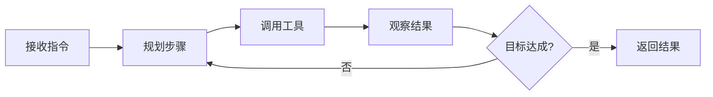

# Claude Code

Claude Code 是 Anthropic 推出的命令行 AI 编程助手，能在你的终端中直接操作文件系统和执行 Shell 命令，支持代码理解与生成、文件读写、命令执行、Git 操作、CI/CD 集成和代码审查。

与代码补全工具不同，Claude Code 是一个 **Agentic AI**——它能独立规划和执行多步任务，而不仅仅是在光标处补全单行代码。

## 安装与快速入门

### 安装

**推荐方式（npm）**：

```bash
npm install -g @anthropic-ai/claude-code
```

**Linux / macOS 快速安装**：

```bash
curl -fsSL https://claude.ai/install.sh | sh
```

**Windows**：通过 WSL 安装，或在 PowerShell 中使用 npm（需 Node.js 18+）。

安装完成后运行 `claude` 即可进入交互式 REPL，首次启动会引导完成 Anthropic 账号认证（支持 API Key 或 OAuth）。

### 基本操作

```bash
claude                   # 进入交互式会话
claude "实现一个二分查找"    # 单次指令模式
claude -p "分析代码" --no-interactive  # 无交互（Headless）模式
claude --continue        # 恢复上次会话
claude --resume          # 从历史会话中选择恢复
```

**常用斜杠命令**：

| 命令 | 说明 |
|------|------|
| `/init` | 分析代码库，自动生成 `CLAUDE.md` |
| `/clear` | 清除当前会话上下文 |
| `/compact` | 压缩上下文，保留关键信息 |
| `/cost` | 查看当前会话的 Token 消耗 |
| `/context` | 查看上下文空间占用分布 |
| `/doctor` | 诊断配置和环境问题 |
| `/rewind` | 回退到指定的历史节点 |
| `/rename` | 重命名当前会话 |
| `/effort <level>` | 设置思考深度（low/medium/high/xhigh/max） |
| `/focus` | 进入专注模式，只显示最终结果 |
| `/btw <问题>` | 在任务执行中插入旁问，不中断主流程 |

**交互快捷键**：
- `!` 前缀：直接执行 Shell 命令（如 `!git status`）
- `#` 前缀：将内容追加到 `CLAUDE.md`
- `@` 前缀：引用 MCP 资源
- `Shift+Tab`：循环切换 Ask / Plan / Auto 三种交互模式

## 工作原理

### Agentic Loop

Claude Code 以循环方式工作：



每一轮循环中，Claude 可以调用多个内置工具，工具执行结果会作为下一步推理的输入。

### 内置工具

| 类别 | 工具 | 用途 |
|------|------|------|
| 文件系统 | `read_file`、`write_file`、`list_directory` | 读写文件和目录 |
| 终端 | `bash`、`exec` | 执行 Shell 命令 |
| 搜索 | `grep`、`find`、`glob` | 代码和文件搜索 |
| 网络 | `web_fetch` | 读取 URL 内容 |
| Git | `git` | 版本控制操作 |

### 上下文窗口与 Checkpoint

Claude Code 支持最高 **1M tokens** 上下文窗口，但并非全部可用——固定开销（系统指令、CLAUDE.md、MCP 工具定义、Skill 描述符）会占用 15–30K tokens。

**Checkpoint（检查点）** 是 Claude Code 的快照机制，每次你确认操作后会自动创建检查点。使用 `/rewind` 可以回退到任意历史节点，无需担心误操作。

## 配置体系

### 五层优先级

配置从低到高的优先级：

```
Managed（管理器注入）> CLI 参数 > Local 本地配置 > Project 项目配置 > User 用户配置
```

优先级高的配置会覆盖低优先级的同名项。**Managed** 是企业管理员通过策略文件强制注入的，用户无法覆盖。

![[Claude Code 配置优先级]]

**配置文件路径**：

| 层级 | 路径 | 适用范围 |
|------|------|---------|
| User | `~/.claude/settings.json` | 所有项目 |
| Project | `.claude/settings.json` | 当前项目（提交到 Git） |
| Local | `.claude/settings.local.json` | 仅本机（加入 .gitignore） |

### CLAUDE.md 记忆文件

CLAUDE.md 是 Claude Code 的「长期记忆」——每次对话开始时自动加载，相当于给 Claude 写的「项目规范速查卡」。

**四个作用域**：

| 作用域 | 路径 | 共享范围 |
|--------|------|---------|
| Managed | 管理器注入 | 组织全员，不可覆盖 |
| User（全局） | `~/.claude/CLAUDE.md` | 仅本人，适用所有项目 |
| Project（项目） | `CLAUDE.md`（项目根目录） | 团队全员，提交 Git |
| Local（本地） | `.claude/CLAUDE.md` | 仅本机，不提交 |

规则较多时，用 `.claude/rules/` 目录组织，Claude Code 会自动读取目录下所有 Markdown 文件。

**高质量 CLAUDE.md 模板**：

```markdown
## Build & Test
- Install: `pnpm install`
- Test: `pnpm test`
- Typecheck: `pnpm typecheck`

## Architecture Boundaries
- HTTP handlers live in `src/http/handlers/`
- Domain logic lives in `src/domain/`
- Do not put persistence logic in handlers

## NEVER
- Modify `.env` or lockfiles without explicit approval
- Remove feature flags without searching all call sites
- Commit without running tests

## Compact Instructions
When compressing, preserve in priority order:
1. Architecture decisions
2. Modified files and key changes
3. Current test pass/fail status
4. Open risks and TODOs
```

> [!tip] 只放「每次会话都必须成立的指令」
> 避免放大段项目介绍、完整 API 文档或空泛原则（如"写高质量代码"）。这些内容徒耗 Token，模糊指令等于没有指令。

**自动记忆**：Claude 在对话中发现值得记住的信息时，会自动追加到 `~/.claude/CLAUDE.md`。如需关闭：

```bash
export CLAUDE_CODE_DISABLE_AUTO_MEMORY=1
```

### Settings.json 权限配置

```json
{
  "permissions": {
    "allow": ["Bash(git:*)", "Read(**/*.ts)"],
    "deny": ["Bash(rm -rf *)"]
  },
  "env": {
    "CLAUDE_CODE_DISABLE_AUTO_MEMORY": "1"
  }
}
```

权限模式支持精细控制：`allow`（白名单）、`deny`（黑名单）、`ask`（每次询问）。

### 模型选择

通过 `CLAUDE_MODEL` 环境变量或 `--model` 参数指定：

| 别名 | 说明 |
|------|------|
| `sonnet` | 速度与质量均衡（默认） |
| `opus` | 最高质量，适合复杂推理 |
| `haiku` | 最快响应，适合简单任务 |

**思考深度**（在指令末尾添加关键词）：

- `think` → 中等推理
- `think hard` → 深度推理
- `ultrathink` → 最高强度推理（Opus 4.7）

## 扩展机制

Claude Code 提供六种扩展方式，适合不同场景：

| 机制 | 上下文成本 | 适用场景 | 执行方式 |
|------|-----------|---------|---------|
| **CLAUDE.md** | 常驻（2-5K tokens） | 全局约束、构建命令 | 每次自动加载 |
| **Skills** | description 常驻，内容按需加载 | 可复用工作流、领域知识 | 自动匹配或 `/skill-name` |
| **Hooks** | 几乎为零 | 确定性自动化（格式化、校验、拦截） | 生命周期事件触发 |
| **MCP** | 工具定义（5-25K tokens） | 连接外部服务（DB、GitHub、Slack） | Claude 按需调用 |
| **Sub-agents** | 主上下文只含摘要 | 并行研究、隔离探索 | 独立上下文运行 |
| **插件** | 取决于插件内容 | 打包分发可复用 Skill+Hooks 组合 | 市场安装 |

### Hooks：确定性自动化

Hooks 是在特定生命周期节点注册的脚本，**必然执行**，不依赖模型判断：

**五种触发时机**：`PreToolUse`（工具调用前）、`PostToolUse`（工具调用后）、`Stop`（Claude 准备停止前）、`SubagentStop`、`WorktreeCreate`

```json
{
  "hooks": {
    "PostToolUse": [
      {
        "matcher": "Write",
        "hooks": [
          {
            "type": "command",
            "command": "prettier --write $FILE"
          }
        ]
      }
    ],
    "PreToolUse": [
      {
        "matcher": "Bash",
        "hooks": [
          {
            "type": "command",
            "command": "echo \"$CLAUDE_TOOL_INPUT\" | grep -q 'rm -rf' && echo '{\"decision\": \"block\"}' || echo '{\"decision\": \"allow\"}'"
          }
        ]
      }
    ]
  }
}
```

Hook 脚本通过 exit code 和 stdout JSON 控制行为：`{"decision": "allow"}` 放行，`{"decision": "block", "reason": "原因"}` 阻断。

除 `command` 外，还支持 `http`（转发给外部服务）、`prompt`（让 LLM 做判断）、`agent`（多轮子代理验证）、`mcp_tool` 类型。

### MCP：连接外部服务

MCP（Model Context Protocol）是开源标准，让 Claude 与外部工具、数据库、API 进行标准化通信。

**三种传输方式**：

```bash
# HTTP（推荐，云端服务）
claude mcp add --transport http notion https://mcp.notion.com/mcp

# stdio（本地进程）
claude mcp add filesystem -- npx -y @modelcontextprotocol/server-filesystem /path

# 带认证的 HTTP
claude mcp add --transport http github https://api.github.mcp.com \
  --header "Authorization: Bearer $GITHUB_TOKEN"
```

MCP 工具在 Claude 中以 `mcp__服务器名__工具名` 形式调用。使用 `defer_loading: true` 配置可延迟加载工具定义，降低上下文固定开销。

> [!warning] 安全提示
> 使用第三方 MCP 服务器时，Anthropic 不验证其安全性。接入可能获取不受信任内容的服务器，需防范提示注入攻击。

### Skills：可复用工作流

Skills 是按需加载的「SOP 手册」，分为两种：

**参考型**（Claude 自动匹配）：

```markdown
---
name: api-conventions
description: 本项目的 API 设计规范。编写或审查 API 接口时自动加载
---

编写 API 接口时，遵循以下约定：
- 使用 RESTful 命名风格：资源用名词复数
- 统一错误响应格式：`{ "code": "ERROR_CODE", "message": "描述" }`
```

**动作型**（手动触发）：

```markdown
---
name: deploy
description: 将应用部署到生产环境
disable-model-invocation: true
---

部署 $ARGUMENTS 到生产环境，依次执行：
1. 运行完整测试套件
2. 执行生产构建
3. 推送到部署目标并验证
```

通过 `/deploy staging` 手动触发，`$ARGUMENTS` 接收参数。

Skills 存放位置：`.claude/skills/` 目录（项目级）或 `~/.claude/skills/`（用户全局级）。

### Sub-agents：上下文隔离

Sub-agents 在独立的上下文中运行子任务，只把结果摘要返回主对话——适合需要大量文件探索的场景：

```
你：分析整个项目的 API 接口设计模式，整理成报告
Claude：[启动 Sub-agent 扫描 30 个 Controller 文件，主对话只收到摘要报告]
```

使用 **Agent Teams** 可以并行启动多个 Sub-agents，适合相互独立的并行任务（如同时分析前端和后端代码）。

## 自动化与 CI/CD

### GitHub Actions

```yaml
name: Claude Code Review
on:
  pull_request:
    types: [opened, synchronize]

jobs:
  review:
    runs-on: ubuntu-latest
    steps:
      - uses: actions/checkout@v4
      - uses: anthropics/claude-code-action@v1
        with:
          anthropic_api_key: ${{ secrets.ANTHROPIC_API_KEY }}
          trigger_phrase: "@claude"
          task: "Review this PR for bugs and security issues"
```

支持使用 AWS Bedrock 或 Google Vertex AI 替代直连 Anthropic API（适合企业网络环境）：

```yaml
- uses: anthropics/claude-code-action@v1
  with:
    use_bedrock: "true"
    aws_region: us-east-1
```

### GitLab CI/CD

```yaml
claude-review:
  image: node:20
  before_script:
    - npm install -g @anthropic-ai/claude-code
  script:
    - claude -p "Review the changes in this MR" --no-interactive
  variables:
    ANTHROPIC_API_KEY: $ANTHROPIC_API_KEY
```

### 第三方 LLM 提供商

| 提供商 | 配置方式 |
|--------|---------|
| AWS Bedrock | `CLAUDE_CODE_USE_BEDROCK=1`，配合 AWS 凭证 |
| Google Vertex AI | `CLAUDE_CODE_USE_VERTEX=1`，配合 GCP 凭证 |
| Azure AI Foundry | 设置 `ANTHROPIC_BASE_URL` 指向 Azure 端点 |
| 自建代理 | `ANTHROPIC_BASE_URL=https://your-proxy.example.com` |

## 多平台支持

| 平台 | 使用方式 |
|------|---------|
| **命令行（CLI）** | 主力使用方式，全功能支持 |
| **VS Code** | 安装 Claude Code 扩展，在编辑器内对话 |
| **JetBrains IDE** | 安装插件，支持 IDEA/WebStorm/PyCharm 等 |
| **Claude Desktop** | GUI 模式，适合非开发者 |
| **Headless** | `claude -p "指令"` 脚本化和 CI 集成 |
| **DevContainer** | Docker 环境内集成，策略集中管理 |
| **Chrome 扩展** | 浏览器内辅助开发 |

**Headless 模式示例**：

```bash
# 批量处理
claude -p "为所有没有单元测试的函数添加测试" --no-interactive

# 管道集成
echo "$(cat error.log)" | claude -p "分析错误原因并给出修复建议" --no-interactive
```

## 企业功能

### Admin 控制台

通过 `managed-settings.json` 或 Admin Dashboard 集中管理：

- **SSO/SCIM**：与 Okta、Microsoft Entra 等集成，统一身份管理
- **托管策略**：强制覆盖用户配置（权限白名单/黑名单、模型限制、审计日志）
- **用量监控**：按团队和项目统计 Token 消耗

### 零数据保留（ZDR）

面向 **API** 用户：Anthropic 默认不存储 API 请求中的提示词和输出（零数据保留）。企业用户可签署 BAA（商业伙伴协议）满足 HIPAA 等合规需求。

> [!note] 区分账号类型
> - **Claude.ai 订阅用户**（Max/Teams/Enterprise）：通过 OAuth 认证，数据受用户订阅协议约束
> - **API 用户**：通过 API Key 认证，享有零数据保留保障

### Channels：事件推送

通过 MCP 服务器将 Claude Code 的事件推送到外部消息平台：

```bash
# 配置 Telegram 通知
claude mcp add --transport stdio telegram -- npx @claude-code/channels telegram

# 任务完成时推送
claude -p "部署完成后通过 Telegram 通知我"
```

支持 Telegram、Discord、iMessage 等渠道。

## 最佳实践

### 写高效指令

给出**改哪里、改成什么样、不改什么**三要素：

```
❌ 优化这个模块的性能
✅ 优化 src/service/OrderService.java 的 queryOrders() 方法：
   1. 将 N+1 查询改为 IN 条件批量查询
   2. 不要修改方法签名
   3. 不要改动同文件其他方法
```

### 三种核心工作流

**功能开发**：
1. `Shift+Tab` 进入 Plan Mode → 和 Claude 对齐需求和实现方案
2. 确认后切换 Ask 模式逐步执行，每步验证
3. 用 `git diff` 审查改动，运行测试确认

**Bug 修复**：
1. 先写能复现 Bug 的测试
2. Plan Mode 分析可能的根因范围
3. 最小化修改，再验证测试通过

**代码审查**：
1. 提供 PR diff（`gh pr diff 123`）给 Claude 分析
2. 要求按严重程度排序问题
3. 要求给出具体修复建议而非泛泛描述

### 上下文工程

上下文不是容量问题，是**噪声问题**——有用的信息不能被大量无关内容淹没。

**上下文分层策略**：

| 层级 | 方式 | 存放内容 |
|------|------|---------|
| 始终常驻 | `CLAUDE.md` | 项目契约、构建命令、禁止事项 |
| 按路径加载 | `.claude/rules/` | 语言/目录特定规则 |
| 按需加载 | Skills | 工作流、领域知识 |
| 隔离运行 | Sub-agents | 大量文件探索、并行研究 |
| 零上下文 | Hooks | 格式化、拦截、审计脚本 |

**实用技巧**：
- 上下文变长时用 `/compact` 压缩，在 `CLAUDE.md` 的 `Compact Instructions` 部分声明压缩时必须保留的信息
- 跨会话传递进度：让 Claude 在会话结束前写 `HANDOFF.md`，记录进展、尝试过的路径和下一步计划
- 接 MCP 服务器时加 `defer_loading: true`，避免工具定义占用过多固定上下文
- 用 `/context` 实时查看上下文占用，定位空间浪费来源

### 成本管理

| 策略 | 效果 |
|------|------|
| 保持 `CLAUDE.md` 精简 | 高，每次加载都省 |
| 用 `.claudeignore` 排除 `node_modules` 等 | 高 |
| Sub-agent 处理文件密集型任务 | 高 |
| 指定精确文件路径而非泛化描述 | 中 |
| 定期 `/compact` 压缩对话 | 中 |
| 任务分割到多个会话 | 中 |

用 `/cost` 命令随时查看当前会话消耗；启用 Prompt Caching 可将重复读取相同文件的成本降低 80% 以上（自动启用）。

### 反模式清单

| ❌ 反模式 | ✅ 正确做法 |
|----------|-----------|
| 把不相关任务混在一个会话 | 一个会话只做一件事 |
| 指令模糊，让 Claude 猜意图 | 明确三要素：改哪里/改成什么/不改什么 |
| 修了 Bug 不写测试覆盖 | 先写复现测试，再修 Bug |
| 盲目信任 Claude 输出，不验证 | 跑测试 + git diff + 关键逻辑人工走查 |
| CLAUDE.md 堆砌大量文档 | 只放每次会话都必须成立的约束 |
| 让主上下文读取大量文件 | 用 Sub-agent 做文件探索 |

## 故障排除速查

### 诊断命令

```bash
claude doctor              # 全面环境检查
claude config list         # 查看当前生效的配置
claude --log-level debug   # 开启详细调试日志
```

### 常见问题

**安装问题**：

| 问题 | 解决方案 |
|------|---------|
| `command not found: claude` | 检查 npm global bin 是否在 PATH：`npm bin -g` |
| Windows 安装失败 | 使用 WSL，或确认 Node.js ≥ 18 |
| 网络超时 | 设置 `HTTPS_PROXY=http://proxy:port` |

**认证错误**：

| 错误 | 原因 | 解决方案 |
|------|------|---------|
| `Invalid API key` | API Key 格式错误或失效 | 检查 `ANTHROPIC_API_KEY` 是否以 `sk-ant-` 开头 |
| `OAuth token expired` | 登录会话过期 | 运行 `claude auth login` 重新认证 |
| `Permission denied` | 账号权限不足 | 检查 Claude.ai 订阅计划 |

**服务端错误**：

| 错误码 | 含义 | 处理 |
|--------|------|------|
| `429 Too Many Requests` | 速率限制 | 等待后重试，或切换到 Bedrock/Vertex |
| `529 Overloaded` | 服务过载 | 稍后重试，或切换备用模型 |
| `Context window exceeded` | 上下文超限 | 使用 `/compact` 或开启新会话 |

**配置不生效**：
1. 运行 `claude config list` 确认配置已被读取
2. 检查文件路径是否正确（注意 Local 和 Project 的区别）
3. 确认 JSON 格式无误（`managed-settings.json` 优先级最高，会覆盖所有用户配置）

## 相关资源

- [官方文档](https://docs.anthropic.com/en/docs/claude-code)
- [GitHub 仓库](https://github.com/anthropics/claude-code)
- [MCP 协议规范](https://modelcontextprotocol.io)
- [Agent Skills 开放标准](https://github.com/anthropics/agent-skills)
- [官方插件目录](https://docs.anthropic.com/en/docs/claude-code/plugins)（33 个内置插件 + 15 个外部集成）
