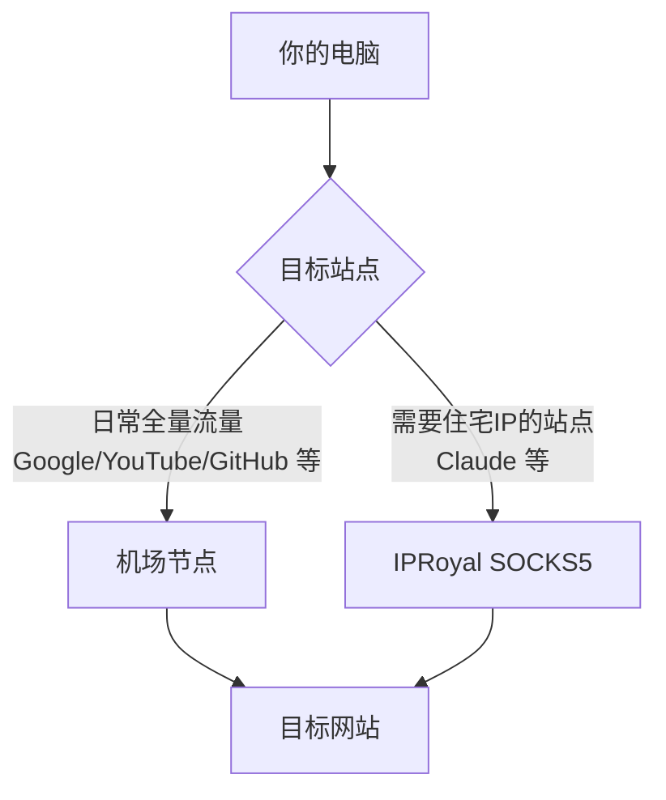

---

## 一、核心结论

| 问题 | 结论 |
|------|------|
| 是否需要链式代理？ | **不需要**，IPRoyal 可直连 |
| Ping 不通是否代表代理不可用？ | **不代表**，ICMP 被屏蔽是行业常规 |
| 能否完全替代机场？ | **不建议**，成本高、稳定性差、覆盖不全 |
| 最优方案？ | **机场为主力 + IPRoyal 专供特定站点** |

---

## 二、方案架构



---

## 三、关键知识点

### 3.1 为什么不需要链式代理

- 你的网络环境可直连 IPRoyal SOCKS5 端口
- 链式代理 = 多一跳 = 多延迟 + 多故障点，无任何收益
- **判断标准：直连通了就不加链**

### 3.2 Ping 超时 ≠ 代理不可用

| 协议 | 用途 | IPRoyal 是否响应 |
|------|------|-----------------|
| ICMP（Ping） | 网络探测 | ❌ 被服务商屏蔽 |
| TCP（SOCKS5 端口） | 代理流量 | ✅ 正常通行 |

- **验证方法**：`Test-NetConnection <IP> -Port <端口>` 测 TCP 连通性，而非 Ping

### 3.3 全量走 IPRoyal 的四大风险

| 风险 | 说明 |
|------|------|
| 💰 **成本** | 按流量计费，日常使用轻松 ¥200+/月，机场仅 ¥15–50/月不限流量 |
| 🔀 **IP 轮换** | 住宅代理 IP 会变 → 登录态丢失、触发风控 |
| 🕳️ **覆盖盲区** | 不支持全局接管，部分程序裸连泄漏真实 IP |
| 📡 **DNS 泄漏** | SOCKS5 不自动接管 DNS，请求可能走国内运营商 |

---

## 四、推荐配置方案

### 4.1 系统级：机场（主力）

- 开启全局模式 / 规则模式
- 负责所有日常翻墙流量
- 成本低、节点冗余、自动切换

### 4.2 站点级：IPRoyal SOCKS5（专项）

**方式一：环境变量（终端/CLI 工具）**

```bash
# PowerShell 临时设置
$env:HTTPS_PROXY="socks5://用户名:密码@IPRoyal地址:端口"
$env:ALL_PROXY="socks5://用户名:密码@IPRoyal地址:端口"

# Linux/macOS
export HTTPS_PROXY="socks5://用户名:密码@IPRoyal地址:端口"
export ALL_PROXY="socks5://用户名:密码@IPRoyal地址:端口"
```

**方式二：浏览器分流（SwitchyOmega 插件）**

```
情景模式设置：
  ├── 默认 → 机场代理（socks5://127.0.0.1:机场本地端口）
  └── Claude 等特定域名 → IPRoyal（socks5://IPRoyal地址:端口）
```

**方式三：软件内置代理设置**

直接在支持代理配置的软件中填入 IPRoyal SOCKS5 地址和端口。

---

## 五、异常应对清单

| 现象 | 可能原因 | 应对措施 |
|------|---------|---------|
| IPRoyal 直连突然超时 | IP 被标记/封禁 | 改用链式代理（机场 → IPRoyal） |
| 速度明显变慢 | 运营商 QoS | 加机场节点做中转 |
| 目标站封号/风控 | IP 轮换导致身份不一致 | 切换为 Sticky Session（粘性会话）保持 IP |
| DNS 解析异常 | DNS 泄漏到国内 | 在代理客户端中开启「远程 DNS 解析」 |

---

## 六、一句话总结

> **机场扛流量，IPRoyal 扛身份。能直连就不加链，Ping 不通不等于不能用，全量走住宅代理既贵又不稳。**