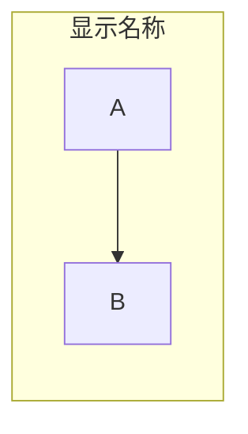
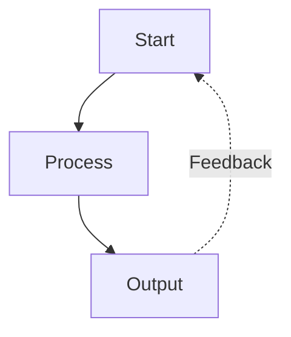
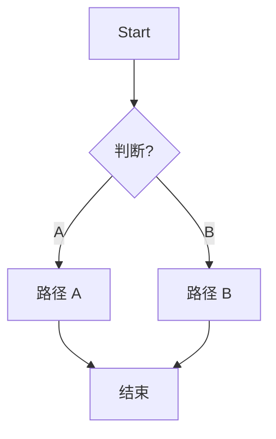
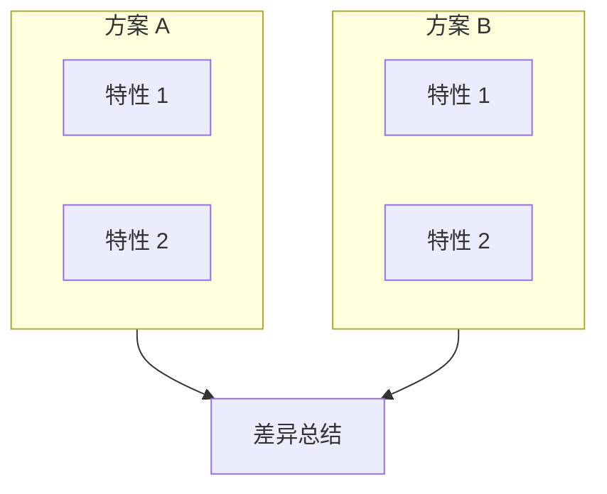

# Mermaid 语法规则参考

> [!note] 来源
> 整理自 [axton-obsidian-visual-skills/references/syntax-rules.md](https://github.com/axtonliu/axton-obsidian-visual-skills/blob/master/mermaid-visualizer/references/syntax-rules.md)

## 关键错误预防

### 列表语法冲突（最常见）

Mermaid 将 `number. space` 解释为 Markdown 有序列表，报错：`Unsupported markdown: list`

```
❌ [1. Perception]
✅ [1.Perception]        # 去掉空格
✅ [① Perception]        # 圆圈数字
✅ [(1) Perception]      # 圆括号
✅ [Step 1: Perception]  # Step 前缀
✅ [Step 1 - Perception] # 破折号
```

圆圈数字参考：①②③④⑤⑥⑦⑧⑨⑩⑪⑫⑬⑭⑮⑯⑰⑱⑲⑳

### 子图命名

```mermaid
❌ subgraph Core Process          # 空格未用引号
✅ subgraph core["Core Process"]  # ID + 显示名
✅ subgraph core_process          # 简单 ID
```

引用时必须用 ID：
```
❌ Title --> Core Process    # 不能用显示名
✅ Title --> core            # 必须用 ID
```

### 特殊字符

| 原字符 | 替换为 | 说明 |
|--------|--------|------|
| `"` | `『』` | 双引号 |
| `()` | `「」` | 圆括号 |
| 空格 | 加引号 `["Text"]` | 节点文本含空格时 |

## 节点语法

### 节点形状

```
A[矩形]            # 默认
B(圆角矩形)         # Rounded
C([体育场形])       # Stadium
D((圆形))           # Circle（支持 <br/> 换行）
E>右箭头形]         # Asymmetric
F{菱形}             # Decision
G{{六边形}}          # Hexagon
H[/平行四边形/]      # Parallelogram
I[(数据库)]          # Cylinder
J[/梯形\]           # Trapezoid
```

### 文本规则

- `<br/>` 仅在圆节点中生效：`((Text<br/>Break))`
- 节点文本控制在 50 字符以内
- 超长内容拆分为多个节点

## 箭头类型

```
A --> B       # 实线箭头
A -.-> B      # 虚线箭头（可选路径、支撑系统）
A ==> B       # 粗线箭头（强调）
A ~~~ B       # 不可见连接（仅布局用）
```

### 带标签

```
A -->|标签| B
A -.->|可选| B
```

### 多目标连接

```
A --> B & C & D        # 一对多
A & B & C --> D        # 多对一
A --> B --> C --> D    # 链式
```

### 双向

```
A <--> B      # 双向实线
A <-.-> B     # 双向虚线
```

## 子图



嵌套最多 2 层。

## 样式

```mermaid
style NodeID fill:#d3f9d8,stroke:#2f9e44,stroke-width:2px
style A,B,C fill:#d3f9d8,stroke:#2f9e44,stroke-width:2px  # 多节点
```

### 常用样式模式

| 效果 | style |
|------|-------|
| 专业感 | `fill:#d3f9d8,stroke:#2f9e44,stroke-width:2px` |
| 强调 | `fill:#ffe3e3,stroke:#c92a2a,stroke-width:3px` |
| 次要 | `fill:#f8f9fa,stroke:#dee2e6,stroke-width:1px` |
| 标题 | `fill:#1971c2,stroke:#1971c2,stroke-width:3px,color:#ffffff` |

## 高级模式

### 反馈循环



### 决策树



### 对比布局



## 平台差异

| 平台 | 说明 |
|------|------|
| **[[Obsidian]]** | 较老版本 Mermaid，解析更严格；`<br/>` 仅圆节点支持 |
| **GitHub** | 支持良好，渲染大部分现代语法 |
| **Mermaid Live Editor** | 最新解析器，可测试新语法 |

## 验证清单

- [ ] 无 `number. space` 模式
- [ ] 子图用 `id["显示名"]` 格式
- [ ] 节点引用用 ID
- [ ] 箭头语法正确
- [ ] 样式声明有效
- [ ] 方向已指定
- [ ] 无未转义特殊字符

---

→ 返回 [[mermaid-visualizer skill]] | [[axton-obsidian-visual-skills 套装总览]]
