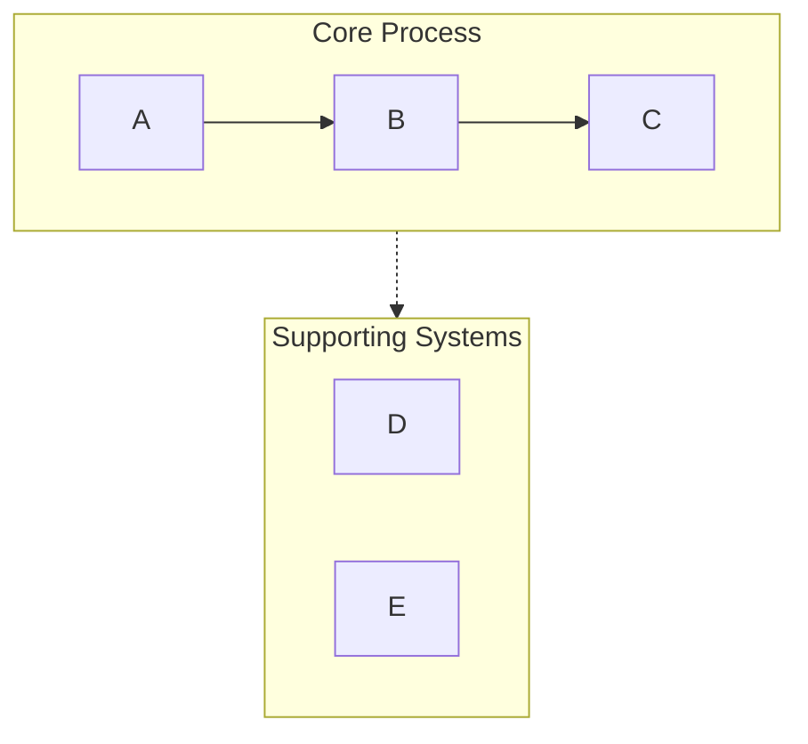
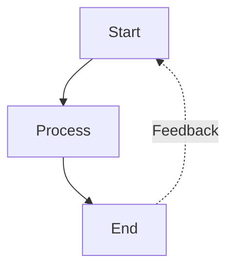
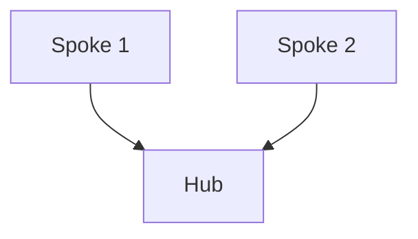

# mermaid-visualizer

> [!summary]
> 将[[文本内容]]转换为专业的 [[Mermaid]] 图表，内置语法错误预防机制，兼容 [[Obsidian]]、GitHub 等渲染器。

**触发词**：`Mermaid`、`可视化`、`流程图`、`时序图`、`visualize`

## 支持的图表类型

| 类型 | 关键字 | 适用场景 |
|------|--------|---------|
| **流程图** | `graph TB/LR` | 工作流、决策树、AI Agent 架构 |
| **循环图** | 圆形布局 | 迭代过程、反馈循环、持续改进 |
| **对比图** | 平行路径 | 前后对比、A vs B 分析 |
| **思维导图** | `mindmap` | 层级概念、知识组织 |
| **时序图** | `sequenceDiagram` | 组件交互、API 调用、消息流 |
| **状态图** | `stateDiagram` | 系统状态、状态转换、生命周期 |

## 配置选项

### 布局方向

| 方向 | 代码 | 适用 |
|------|------|------|
| 垂直（默认） | `TB` | 顺序流程、层级 |
| 水平 | `LR` | 时间线、宽屏 |
| 从下到上 | `BT` | 反向追溯 |
| 从右到左 | `RL` | RTL 语言 |

### 详细度

| 级别 | 说明 |
|------|------|
| `simple` | 核心元素，最少标签 |
| `standard`（默认） | 关键描述 |
| `detailed` | 完整注释和元数据 |
| `presentation` | 演示优化，大字体 |

### 风格

| 风格 | 说明 |
|------|------|
| `minimal` | 单色，简洁线条 |
| `professional`（默认） | 语义配色，清晰层级 |
| `colorful` | 高对比度鲜明颜色 |
| `academic` | 论文/文档正式风格 |

## 语法错误预防（关键规则）

> [!danger] 最[[常见错误]]：列表语法冲突
> [[Mermaid]] 会将 `number. space` 解释为 Markdown 有序列表，导致 `Parse error: Unsupported markdown: list`

```
❌ [1. Perception]
✅ [1.Perception]         # 去掉空格
✅ [① Perception]         # 圆圈数字 ①②③④⑤⑥⑦⑧⑨⑩
✅ [(1) Perception]       # 圆括号
✅ [Step 1: Perception]   # Step 前缀
```

### 子图命名

```mermaid
❌ subgraph AI Agent Core
✅ subgraph agent["AI Agent Core"]   # ID + 显示名
```

### 节点引用

```
❌ Title --> AI Agent Core    # 不能用显示名
✅ Title --> agent            # 必须用 ID
```

### 特殊字符处理

| 原字符 | 替换为 |
|--------|--------|
| `"` | `『』` |
| `()` | `「」` |
| 空格文本 | 用引号 `["Text with spaces"]` |

## 配色方案

| 颜色 | Hex 对 | 语义 |
|------|--------|------|
| 绿色 | `#d3f9d8` / `#2f9e44` | 输入、感知、起始状态 |
| 红色 | `#ffe3e3` / `#c92a2a` | 规划、决策点 |
| 紫色 | `#e5dbff` / `#5f3dc4` | 处理、推理 |
| 橙色 | `#ffe8cc` / `#d9480f` | 动作、工具调用 |
| 青色 | `#c5f6fa` / `#0c8599` | 输出、执行结果 |
| 黄色 | `#fff4e6` / `#e67700` | 存储、记忆、数据 |
| 粉色 | `#f3d9fa` / `#862e9c` | 学习、优化 |
| 蓝色 | `#e7f5ff` / `#1971c2` | 元数据、定义、标题 |
| 灰色 | `#f8f9fa` / `#868e96` | 中性元素 |

## 常用模式

### 泳道模式



### 反馈循环



### 中心辐射



## 箭头类型

| 语法 | 样式 | 用途 |
|------|------|------|
| `-->` | 实线箭头 | 标准连接 |
| `-.->` | 虚线箭头 | 可选路径、支撑系统 |
| `==>` | 粗线箭头 | 强调 |
| `~~~` | 不可见连接 | 仅用于布局 |

## 质量检查清单

- [ ] 节点文本无 `number. space` 模式
- [ ] 所有子图使用 `id["显示名"]` 格式
- [ ] 箭头语法正确（`-->`、`-.->`）
- [ ] 颜色一致应用
- [ ] 方向已指定
- [ ] 样式声明完整
- [ ] 节点引用使用 ID 而非显示名
- [ ] 兼容 [[Obsidian]]/GitHub 渲染

## 更多参考

- [[Mermaid 语法规则参考]] — 完整语法规则和[[故障排除]]
- [[axton-obsidian-visual-skills 套装总览]] — 返回项目总览

## 相关笔记

- [[axton-obsidian-visual-skills 套件总览]]
- [[excalidraw-diagram skill]]
- [[obsidian-canvas-creator skill]]
- [[Canvas 布局算法参考]]
- [[Canvas 规范参考]]
- [[Excalidraw JSON Schema 参考]]
- [[obsidian-skills 套件总览]]
