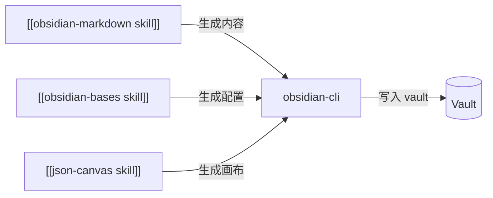

# obsidian-cli

> [!summary]
> 通过命令行工具直接与**运行中的 [[Obsidian]]** 交互：读写笔记、管理 properties、执行 JavaScript、调试插件/主题、截图。是 [[Obsidian]] 自动化和插件开发的核心工具。

**触发词**：`Obsidian CLI`、`操作 vault`、`插件开发`、`主题开发`、`执行 JS`、`截图 Obsidian`、`批量处理笔记`

> [!warning] 前提条件
> 1. [[Obsidian]] 应用正在运行
> 2. 已安装 [Obsidian CLI 插件](https://github.com/kepano/obsidian-cli)
> 3. CLI 工具已在系统 PATH 中

## 笔记管理

```bash
obsidian read "笔记/项目.md"                        # 读取
obsidian create "笔记/新笔记.md" --content "内容"    # 创建
obsidian append "日记/today.md" --content "追加"     # 追加
obsidian write "笔记/项目.md" --content "覆盖"       # 覆盖
obsidian delete "笔记/废弃.md"                      # 删除
obsidian rename "旧路径/旧名.md" "新路径/新名.md"     # 重命名/移动
```

## 搜索

```bash
obsidian search "关键词"                    # 全文搜索
obsidian search "关键词" --json             # JSON 输出
obsidian search --tag "项目"                # 按标签
obsidian search --modified-after "2024-01-01"  # 按时间
```

## Properties 管理

```bash
obsidian properties "笔记/项目.md"                             # 读取
obsidian properties "笔记/项目.md" --set status "完成"         # 设置单个
obsidian properties "笔记/项目.md" --set-json '{"status":"完成","rating":5}'  # 批量
```

## 任务管理

```bash
obsidian tasks                              # 所有未完成任务
obsidian tasks "项目/任务列表.md"            # 特定笔记的任务
obsidian task-complete "项目/任务.md" --line 15  # 完成任务
```

## 插件与主题开发

```bash
# 插件
obsidian plugins                           # 列出插件
obsidian plugins --json                    # JSON 详情
obsidian reload-plugin "my-plugin"         # 重载单个
obsidian reload-plugins                    # 重载全部
obsidian enable-plugin "dataview"          # 启用
obsidian disable-plugin "dataview"         # 禁用

# 主题
obsidian reload-theme                      # 重载 CSS
obsidian theme "Minimal"                   # 切换主题
```

### 执行 JavaScript

直接在 [[Obsidian]] 上下文中运行 JS——最强大的功能：

```bash
obsidian eval "app.vault.getName()"        # 简单命令
obsidian eval --file script.js             # 从文件
echo "return app.workspace.activeLeaf?.view?.file?.path" | obsidian eval  # 管道
```

**常用 JS 片段**：

```javascript
app.vault.getName()                                    // vault 名称
app.vault.getMarkdownFiles().length                    // md 文件数
app.workspace.activeLeaf?.view?.file?.path             // 当前笔记路径
app.plugins.plugins['dataview']?.settings              // 插件设置
app.commands.executeCommandById('editor:toggle-bold')  // 执行命令
app.workspace.openLinkText('笔记名称', '', false)       // 打开笔记
```

### 错误捕获

```bash
obsidian console-errors                    # 捕获错误
obsidian console-errors --watch            # 实时监听
obsidian console-clear                     # 清空日志
```

### 截图

```bash
obsidian screenshot --output "截图.png"                # 当前视图
obsidian screenshot --file "笔记/项目.md" --output "预览.png"  # 指定笔记
obsidian screenshot --width 1200 --output "宽屏.png"    # 指定宽度
```

## 典型场景

### 插件开发调试循环

```bash
npm run build                              # 编译
obsidian reload-plugin "my-plugin"         # 重载
obsidian console-errors                    # 检查错误
```

### 批量更新 properties

```bash
obsidian search --tag "草稿" --json        # 搜索目标
obsidian properties "笔记/草稿1.md" --set status "draft"  # 逐个更新
```

### 主题热重载

```bash
obsidian reload-theme
obsidian screenshot --output "preview.png"
```

## 协作关系

本 skill 是**执行层**——其他 skill 生成内容后的最后一步：



## 参考链接

- [Obsidian CLI 文档](https://help.obsidian.md/cli)
- [Obsidian API 参考](https://docs.obsidian.md/Reference/TypeScript+API)

---

→ 返回 [[obsidian-skills 套件总览]]
