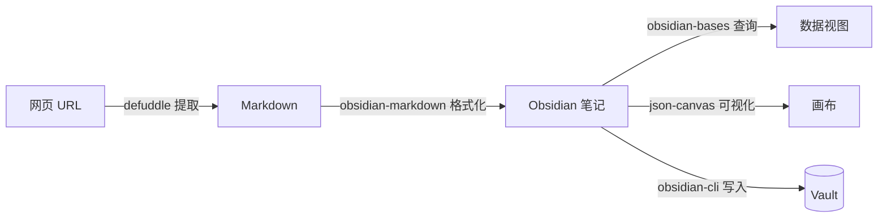

# obsidian-skills

> [!info] 项目信息
> - **仓库**：[kepano/obsidian-skills](https://github.com/kepano/obsidian-skills)
> - **作者**：Stephan Ango（kepano），[[Obsidian]] 创始人
> - **规范**：遵循 [Agent Skills 规范](https://agentskills.io/specification)
> - **兼容**：[[Claude Code]]、Codex CLI、OpenCode

为 [[Obsidian]] 提供 Agent [[Skills]]，让 AI Agent 能创建和编辑 [[Obsidian]] 原生格式文件。

## 包含的 Skill

| Skill | 输出格式 | 核心能力 | 详见 |
|-------|---------|---------|------|
| [[obsidian-markdown skill]] | `.md` | Wikilinks、Callout、Properties、嵌入、块引用 | [[Obsidian]] 专属 Markdown 语法 |
| [[obsidian-bases skill]] | `.base` | 表格/看板/画廊视图、过滤器、公式、汇总 | 结构化数据查询视图 |
| [[json-canvas skill]] | `.canvas` | 节点、边、分组、样式 | 无限画布可视化 |
| [[obsidian-cli skill]] | CLI 命令 | 读写笔记、JS 执行、插件调试、截图 | 与运行中的 [[Obsidian]] 交互 |
| [[defuddle skill]] | Markdown | 网页提取、Token 节省（80-95%） | 从 URL 获取干净内容 |

## 安装

### 通过市场（推荐）

```
/plugin marketplace add kepano/obsidian-skills
/plugin install obsidian@obsidian-skills
```

### 通过 npx skills

```bash
npx skills add git@github.com:kepano/obsidian-skills.git
# 或 HTTPS
npx skills add https://github.com/kepano/obsidian-skills
```

### 手动安装

**[[Claude Code]]**：将仓库内容添加到 vault 根目录的 `/.claude` 文件夹。

**Codex CLI**：复制 `skills/` 目录到 `~/.codex/skills`。

**OpenCode**：克隆到 `~/.opencode/skills/obsidian-skills`（必须保留完整目录结构）。

> [!warning] OpenCode 注意事项
> 不要只复制内部的 `skills/` 文件夹，必须确保路径为 `~/.opencode/skills/obsidian-skills/skills/<skill-name>/SKILL.md`。

## Skill 协作关系



- 先用 [[defuddle skill]] 提取网页，再用 [[obsidian-markdown skill]] 格式化
- 笔记的 properties 被 [[obsidian-bases skill]] 读取和过滤
- 所有生成内容通过 [[obsidian-cli skill]] 写入 vault

## 相关资源

- [[axton-obsidian-visual-skills 套装总览]] — 第三方增强可视化 [[Skills]]（Excalidraw/[[Mermaid]]/[[Canvas]]）
- [Agent Skills 规范](https://agentskills.io/specification)
- [Claude Skills 官方文档](https://platform.claude.com/docs/en/agents-and-tools/agent-skills/overview)

## 相关笔记

- [[axton-obsidian-visual-skills 套件总览]]
- [[mermaid-visualizer skill]]
- [[obsidian-canvas-creator skill]]
