## 各管一半，缺一不可

[[Superpowers]] 和 [[gstack]] 不是二选一的关系。它们覆盖的是软件交付的不同半程：

- **Superpowers** 管"怎么开发"——需求澄清、设计打磨、TDD 循环、子 Agent 编排、代码审查
- **gstack** 管"怎么交付"——产品挑战、架构锁定、浏览器 QA、安全审计、发布上线

单独用 [[Superpowers]]，你可能写出漂亮的代码但跳过了产品验证；单独用 [[gstack]]，你的 Sprint 流程完整但缺乏 TDD 纪律。两者结合，从想法到上线形成一条无断点的流水线。

> [!tip] 前置阅读
> 本文假设你已分别安装并了解两个工具的基本操作。如果还没有，先读 [[Superpowers 使用手册与最佳实践]] 和 [[gstack 使用手册与最佳实践]]。

## 一眼看清分工

| 维度 | [[Superpowers]] | [[gstack]] |
|------|----------------|-----------|
| **核心关注** | 代码质量和开发纪律 | 交付节奏和产品验证 |
| **设计阶段** | `/brainstorming` 苏格拉底式提问 | `/office-hours` YC 风格产品挑战 |
| **计划阶段** | `/writing-plans` 任务拆解 | `/plan-ceo-review` + `/plan-eng-review` 多角色审查 |
| **编码阶段** | `/test-driven-development` RED-GREEN-REFACTOR | `/careful` + `/freeze` 安全护栏 |
| **审查阶段** | `/requesting-code-review` 子 Agent 审查 | `/review` + `/codex` 双模型审查 |
| **验证阶段** | 依赖测试框架 | `/qa` 真实浏览器测试 |
| **发布阶段** | `/finishing-a-development-branch` | `/ship` → `/land-and-deploy` → `/canary` |
| **适用平台** | Claude Code、Codex、Gemini CLI 等 | Claude Code、Codex、Cursor 等 |

## 联合工作流全景

```mermaid
flowchart LR
    subgraph gstack["gstack 交付半程"]
        OH["/office-hours\n产品挑战"]
        CEO["/plan-ceo-review\nCEO 审查"]
        ENG["/plan-eng-review\n工程审查"]
    end

    subgraph superpowers["Superpowers 开发半程"]
        BS["/brainstorming\n设计打磨"]
        WK["worktree\n隔离工作区"]
        WP["/writing-plans\n任务拆解"]
        TDD["/test-driven-development\nTDD 循环"]
        CR["/requesting-code-review\n代码审查"]
        FB["/finishing-a-development-branch\n收尾分支"]
    end

    subgraph gstack2["gstack 交付验证"]
        QA["/qa\n浏览器 QA"]
        CSO["/cso\n安全审计"]
        SHIP["/ship\n发布"]
    end

    OH --> CEO --> ENG --> BS
    BS --> WK --> WP --> TDD --> CR --> FB
    FB --> QA --> CSO --> SHIP
```



**关键交接点**在三个位置：

1. **gstack → Superpowers**：工程审查通过后，设计文档自动传递给 `brainstorming`，进入开发半程
2. **Superpowers → gstack**：分支收尾后，代码交给 `/qa` 进行浏览器级验收
3. **gstack 内部闭环**：QA 通过后经安全审计到发布，形成完整 Sprint

## 场景演示：从想法到上线

**场景设定：** 你有一个 Next.js 的 Todo 应用（Prisma + PostgreSQL），想加一个功能——用户可以把待办事项导出为 Markdown 文件。

### 第 1 站：产品挑战（gstack）

先用 [[gstack]] 的 `/office-hours` 从产品角度审视这个想法：

```
你: /office-hours
你: 我想给 Todo 应用加一个 Markdown 导出功能

Claude: 让我先理解痛点。你目前是怎么把待办事项分享给别人的？
        有没有具体的场景——不是假设的，是你自己遇到过的？
```

> [!important] 为什么从 gstack 开始而不是 Superpowers？
> `/brainstorming` 擅长打磨**技术设计**，但不会挑战你的**产品前提**。先让 `/office-hours` 验证"这个功能值不值得做"，再让 `/brainstorming` 决定"怎么做"——避免精心设计了一个没人要的功能。

### 第 2 站：多角色审查（gstack）

想法通过产品验证后，用 `/autoplan` 一键跑完 CEO → 设计 → 工程三轮审查：

```
你: /autoplan
Claude: [自动运行 CEO 审查 → 发现"导出"可以扩展为"多格式分享"]
        [自动运行设计审查 → 确认 Markdown 格式优先]
        [自动运行工程审查 → ASCII 架构图、数据流、测试矩阵]
        需要你确认的品味决策：
        1. 是否支持 PDF 导出（当前 Sprint 还是后续）？
        2. 导出按钮放在列表页还是详情页？
```

**产出：** 一份经过多角色审查的[[设计文档]]，存放在 `docs/superpowers/specs/` 目录。

> [!tip] autoplan 的"自动决策"原则
> `/autoplan` 内置 6 条决策原则，对明确的方向自动推进，只把"品味"层面的选择呈交给你。这比逐一运行三个审查命令节省大量时间。

### 第 3 站：设计打磨（Superpowers）

审查产出的[[设计文档]]自动传递给 [[Superpowers]] 的 `brainstorming`。此时它读取已有文档，做**技术层面的精细打磨**：

```
Claude: 我读了工程审查的输出。有几个技术决策需要确认：
        1. 导出是实时生成还是异步任务？
           - 实时生成：简单，但列表超 1000 条时可能超时
           - 异步任务：需要引入队列，但支持大规模导出
```

**产出：** 最终设计文档，包含所有技术决策和约束。

### 第 4 站：隔离工作区（Superpowers）

确认设计后，[[Superpowers]] 自动触发 `using-git-worktrees`：

```
Claude: 创建隔离工作区 feature/markdown-export
        分支基于 main，测试基线验证通过：42 tests, 0 failures
```

> [!note] 为什么不用 gstack 的 freeze？
> `/freeze` 是调试时的应急手段——临时限制编辑范围。`worktree` 是正式开发的结构化隔离——独立分支、独立目录、独立测试基线。**开发用 worktree，调试用 freeze。**

### 第 5 站：任务拆解（Superpowers）

`/writing-plans` 将设计文档拆成 2-5 分钟的小任务：

```
Claude: 实施计划已生成（8 个任务）：

        Task 1: 添加 ExportFormat 枚举到 schema.prisma
        验证: npx prisma validate 通过

        Task 2: 编写 exportService.test.ts（RED 阶段）
        验证: 测试按预期失败

        Task 3: 实现 exportService.ts（GREEN 阶段）
        验证: 所有测试通过
        ...
```

每个任务都有精确的文件路径、完整代码和验证步骤——"清晰到连初级工程师都能跟着做"。

### 第 6 站：TDD 循环（Superpowers）

这是 [[Superpowers]] 的核心纪律。以 Task 2 为例：

```
Claude: [RED] 编写 exportService.test.ts
        测试用例：空列表、单条、多条、特殊字符、超长列表
        运行测试 → 5 failed, 0 passed ✓ (预期失败)

        [GREEN] 实现 exportService.ts
        运行测试 → 0 failed, 5 passed ✓

        [REFACTOR] 提取格式化逻辑为独立函数
        运行测试 → 0 failed, 5 passed ✓ (行为不变)
```

> [!warning] Superpowers 的强制规则
> 如果 Agent 发现在测试之前写了代码，它**会删除代码**。这不是建议，是纪律。

### 第 7 站：代码审查（Superpowers + gstack）

[[Superpowers]] 的 `/requesting-code-review` 在每个任务之间自动运行：

```
Claude: [审查 Task 3]
        ✅ exportService.ts 符合设计规格
        ⚠️ HIGH: 文件流未关闭，大文件可能内存泄漏
        → 已自动修复
```

**全部任务完成后**，再用 [[gstack]] 的 `/review` 做一轮 Staff Engineer 级别的全局审查，并可选 `/codex` 获取 OpenAI 模型的第二意见：

```
你: /review
Claude: [AUTO-FIXED] 3 个问题
        [ASK] Task 5 的竞态条件 → 你确认修复方案

你: /codex
Claude: OpenAI Codex 审查完成
        与 Claude 审查重叠: 2/5 发现一致
        Codex 独有发现: 未处理并发导出限制
```

> [!tip] 双模型审查的价值
> `/review`（Claude）和 `/codex`（OpenAI）各自有不同的盲区。两者都跑一遍，重叠的发现更可信，独有的发现值得特别关注。

### 第 8 站：浏览器 QA（gstack）

代码审查通过后，切换回 [[gstack]] 做真实环境验证：

```
你: /qa https://staging.myapp.com
Claude: [打开真实 Chromium 浏览器]
        [点击"导出"按钮] → 下载了 export.md
        [打开导出文件] → 发现 checkbox 状态未保留
        [修复 bug] → [编写回归测试] → [验证修复]
        Bug 已修复并验证 ✓
```

> [!important] 为什么 QA 用 gstack 而不是 Superpowers？
> [[Superpowers]] 的审查基于**代码静态分析**——读代码找问题。[[gstack]] 的 `/qa` 基于**真实浏览器操作**——点击、截图、看实际效果。两者互补，不能互相替代。

### 第 9 站：发布上线（gstack）

最后三个命令完成发布闭环：

```
你: /cso
Claude: OWASP Top 10 + STRIDE 威模型审查完成
        0 个 Critical, 1 个 Medium (建议添加导出频率限制)

你: /ship
Claude: 同步 main → 运行测试 (42 → 51, +9 新测试)
        覆盖率审计: 87% → 92%
        PR 已创建: github.com/you/app/pull/42

你: /land-and-deploy
Claude: PR 已合并 → CI 通过 → 部署完成 → 生产环境健康 ✓
```

## 选修路线：什么时候可以跳过

上面的完整流程适合**重要功能**。实际工作中，不是每个改动都需要走全流程：

| 改动类型 | 推荐流程 | 跳过什么 |
|---------|---------|---------|
| **拼写修复 / 配置调整** | 直接改 → `/ship` | 跳过全部 |
| **小 bug 修复** | `/investigate` → 修复 → `/review` → `/ship` | 跳过设计阶段 |
| **新功能（小）** | `/brainstorming` → worktree → TDD → `/review` → `/ship` | 跳过 `/office-hours` 和 `/autoplan` |
| **新功能（大）** | 完整 9 站流程 | 不跳过 |
| **重构** | `/brainstorming` → worktree → TDD → `/review` → `/ship` | 跳过产品阶段和 QA |

> [!note] 一条经验法则
> 如果你的改动**改变了用户能看到的东西**，跑 `/qa`；如果**只改变了内部实现**，`/review` 通常够用。

## 常见误区

### 误区 1："我先想好再告诉 Agent 怎么做"

❌ 你一个人想方案，Agent 只管执行 → 浪费了 `/office-hours` 和 `/brainstorming` 的质疑能力

✅ 给 Agent 一个粗略方向，让它通过提问帮你发现盲点

### 误区 2："两个工具的审查是重复的"

❌ `/requesting-code-review`（Superpowers）和 `/review`（gstack）做的是同一件事

✅ Superpowers 审查关注**任务粒度**（每个小任务是否正确），gstack 审查关注**全局质量**（跨任务的一致性、生产环境风险）。先细后粗，不重复。

### 误区 3："TDD 太慢了，先写完代码再补测试"

❌ 跳过 TDD 直接写代码，事后补测试

✅ [[Superpowers]] 会**删除先于测试编写的代码**。这不是惩罚，是因为先写测试能帮你在写代码前想清楚接口设计。

### 误区 4："我用 gstack 的 brainstorm 替代 Superpowers 的"

❌ [[gstack]] 没有独立的 brainstorming skill，它的 `/office-hours` 做的是**产品验证**而非**技术设计**

✅ 两者互补：`/office-hours` 问"要不要做"，`/brainstorming` 问"怎么做"

## 相关笔记

- [[Superpowers README]] — 工具概览与安装
- [[gstack]] — 工具概览与安装
- [[Superpowers 使用手册与最佳实践]] — Superpowers 完整教学
- [[gstack 使用手册与最佳实践]] — gstack 完整教学
- [[Superpowers 实战：用 TDD 工作流构建生产功能]] — TDD 深度实战
