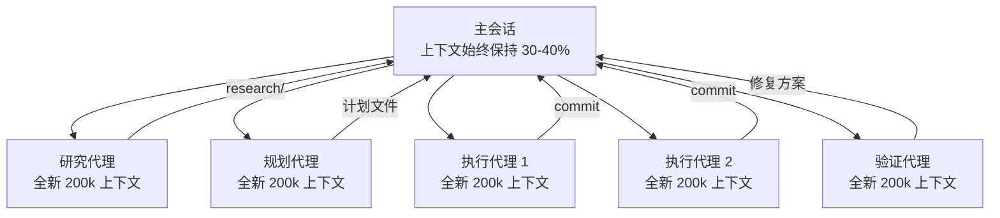
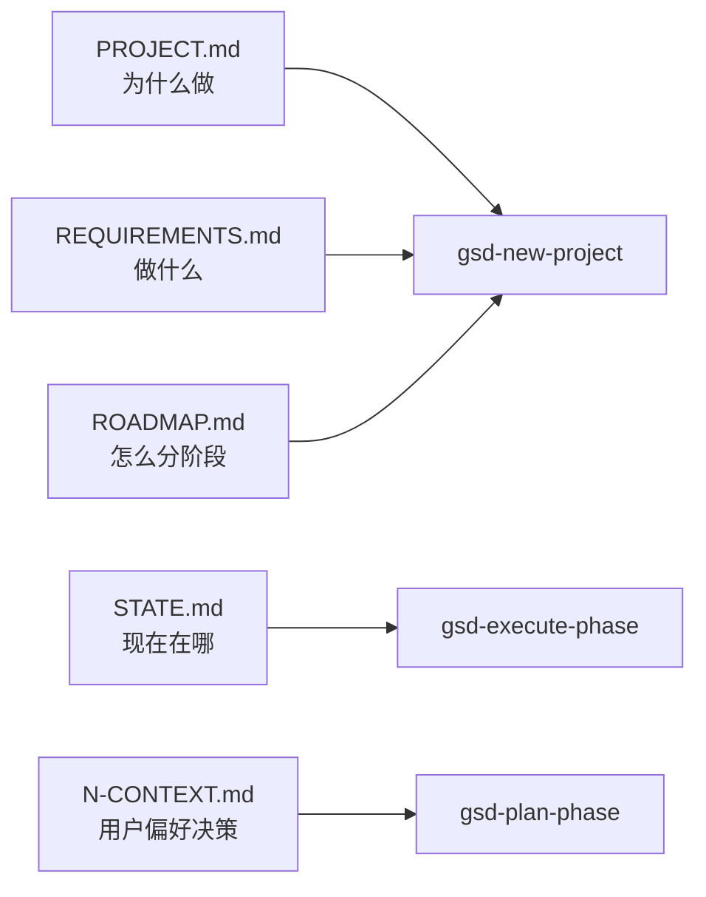

# GSD 架构原理

> [!abstract]
> GSD 的核心技术是**多代理编排 + 上下文工程**。理解这两点是用好 GSD 的关键。

## 为什么 AI 编程质量会劣化

当一个 AI 会话持续时间过长：

1. 上下文窗口逐渐填满
2. 早期内容被截断或降权
3. 模型"忘记"早期约定、规范、架构决策
4. 输出质量下降、代码风格不一致、Bug 增多

这就是 **context rot（上下文腐化）**。

## GSD 的解法：隔离上下文



- **主会话**：只做编排，不做重活
- **各子代理**：各自拥有全新上下文，携带刚好够用的信息
- **制品文件**：跨代理、跨会话传递状态

## 子代理类型

| 代理 | 职责 |
|------|------|
| **Researcher** | 调研领域知识、技术选型、实现模式 |
| **Planner** | 将需求分解为原子化可执行任务 |
| **Plan Verifier** | 检查计划的完整性、可行性、依赖关系 |
| **Executor** | 在全新上下文中执行单个计划 |
| **Verifier** | 验收测试，诊断失败，生成修复方案 |
| **Debug Agent** | 专门处理执行失败，生成修复计划 |

## 上下文工程技术

GSD 在幕后使用的关键技术：

### XML 结构化提示

计划文件使用 XML 格式，而非普通 Markdown：

```xml
<task id="1" type="implementation">
  <description>实现用户认证模块</description>
  <files>src/auth/</files>
  <depends_on>[]</depends_on>
  <commit_message>feat: add JWT authentication</commit_message>
</task>
```

XML 让模型对结构边界更清晰，减少解析歧义。

### 最小化上下文注入

每个子代理只获取它需要的信息：
- 执行代理：当前任务计划 + 相关文件 + 架构约定
- 研究代理：当前阶段描述 + CONTEXT.md 中的用户决策
- 验证代理：已完成工作 + 原始需求 + 测试标准

### 状态机式进度追踪

`STATE.md` 记录：
- 当前所处阶段
- 每个计划的完成状态
- 关键架构决策（避免下一个代理重复决策）
- 已知风险和阻塞项

## 并行执行 Wave

执行阶段将任务按依赖关系分组：

```
Wave 1（无依赖）：[任务A, 任务B, 任务C]  → 并行
Wave 2（依赖 Wave 1）：[任务D, 任务E]    → 并行
Wave 3（依赖 Wave 2）：[任务F]           → 串行
```

每个 Wave 内的任务完全并行，Wave 之间串行。每个任务产生独立的原子 commit，保证 git 历史干净。

## 制品文件的作用

跨会话状态管理的核心：



新会话开始时，GSD 自动加载这些文件，无需重新解释项目背景。

## 与其他工具的对比

| 工具 | 定位 | GSD 的差异 |
|------|------|-----------|
| BMAD | 企业级规格驱动 | GSD 更轻量，无需仪式流程 |
| Taskmaster | 任务分解 | GSD 包含研究、规划、执行、验证全链路 |
| SpecKit | 规格生成 | GSD 额外解决 context rot 问题 |

## 参考

- [[get-shit-done 概览]]
- [Architecture 文档](https://github.com/gsd-build/get-shit-done/blob/main/docs/ARCHITECTURE.md)
- [Agents 文档](https://github.com/gsd-build/get-shit-done/blob/main/docs/AGENTS.md)
