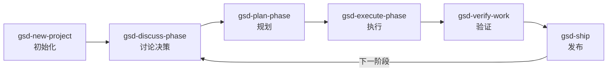

# get-shit-done（GSD）

> [!abstract] 定位
> 一套轻量但强大的**元提示 + 上下文工程 + 规格驱动开发系统**。
> 支持 Claude Code、Copilot、Gemini CLI、Cursor、Windsurf、Codex、OpenCode 等主流 AI 编程工具。
> 
> 核心问题：解决 **context rot**（上下文腐化）—— 随着 AI 上下文窗口被填满，输出质量逐步劣化的问题。

## 核心思想

传统 AI 编程的三大缺陷：

| 问题                       | GSD 的解法                                 |
| ------------------------ | --------------------------------------- |
| **Context 膨胀**：会话越长，质量越差 | 子代理在全新 200k token 上下文中执行任务，主窗口保持 30-40% |
| **无共享记忆**：每次新会话忘记一切      | 维护结构化制品文件，跨会话保持状态                       |
| **缺乏验证**：代码能跑不等于能用       | 专用验证步骤 + 诊断代理生成修复方案                     |

## 安装

```bash
npx get-shit-done-cc@latest
```

> [!tip] 推荐启动方式
> ```bash
> claude --dangerously-skip-permissions
> ```
> GSD 设计目标是无摩擦自动化，需要跳过权限确认。

### 指定运行时安装

```bash
# Claude Code（全局）
npx get-shit-done-cc --claude --global

# GitHub Copilot
npx get-shit-done-cc --copilot --global

# Cursor
npx get-shit-done-cc --cursor --global

# 所有运行时
npx get-shit-done-cc --all --global
```

### 极简模式

```bash
npx get-shit-done-cc --minimal
```

仅安装 6 个核心命令，跳过子代理。冷启动 token 从 ~12k 降至 ~700（减少 94%+），适合本地 LLM 或按 token 计费场景。

## 核心工作流（六步循环）



### 初始化项目

```
/gsd-new-project
```

已有代码库时先运行：
```
/gsd-map-codebase
```

**流程**：提问 → 研究 → 需求梳理 → 路线图审核

**生成文件**：
- `PROJECT.md` — 项目愿景
- `REQUIREMENTS.md` — 功能范围
- `ROADMAP.md` — 阶段规划
- `STATE.md` — 当前进度与决策
- `.planning/research/` — 研究成果

### 讨论阶段

```
/gsd-discuss-phase 1
```

在规划前**收集你的实现偏好**，明确灰色地带：
- 视觉类：布局、信息密度、交互、空状态
- API/CLI：返回格式、错误处理
- 内容系统：结构、语气

**生成文件**：`{phase_num}-CONTEXT.md`

> [!note]
> 这是塑造实现方式的关键步骤。跳过则使用合理默认值，认真填写则获得你脑中的那个方案。

### 规划阶段

```
/gsd-plan-phase 1
```

**流程**：研究 → 创建原子化任务计划（XML 结构）→ 验证器检查 → 循环直到通过

每个计划小到可以在全新上下文窗口中独立完成。

### 执行阶段

```
/gsd-execute-phase 1
```

- 计划按**并行 wave** 运行
- 每个执行器获得全新 200k token 上下文
- 每个任务产生独立的原子 commit
- 主上下文窗口保持在 30-40%

### 验证

```
/gsd-verify-work 1
```

逐一检查已构建内容。发现问题 → 专用调试代理诊断 → 生成修复计划 → 重新执行。

### 发布与迭代

```bash
/gsd-ship 1            # 从已验证的阶段工作创建 PR
/gsd-complete-milestone # 归档里程碑，打 tag
/gsd-new-milestone      # 开始下一个版本
```

## 完整命令表

| 命令 | 用途 |
|------|------|
| `/gsd-new-project` | 问答 → 研究 → 需求 → 路线图 |
| `/gsd-map-codebase` | 分析现有代码库的架构、约定、风险 |
| `/gsd-discuss-phase [N]` | 在规划前收集实现决策 |
| `/gsd-plan-phase [N]` | 研究 + 规划 + 验证 |
| `/gsd-execute-phase <N>` | 并行 wave 执行计划 |
| `/gsd-verify-work [N]` | 手动验收测试 |
| `/gsd-ship [N]` | 从已验证阶段创建 PR |
| `/gsd-progress --next` | 自动检测并执行下一步 |
| `/gsd-complete-milestone` | 归档里程碑，打 release tag |
| `/gsd-new-milestone` | 开始下一个版本 |
| `/gsd-settings` | 修改配置 |
| `/gsd-help` | 显示帮助 |
| `/gsd-update` | 更新 GSD |

## 配置

配置文件：`.planning/config.json`（通过 `/gsd-new-project` 或 `/gsd-settings` 创建）

| 配置项 | 说明 |
|--------|------|
| `mode` | `interactive`（每步确认）或 `yolo`（自动批准） |
| 模型档位 | `quality` / `balanced` / `budget`，控制各代理使用的模型 |
| `workflow.research` | 是否启用研究代理（消耗更多 token，但质量更高） |
| `workflow.plan_check` | 是否启用计划验证器 |
| `workflow.verifier` | 是否启用验证代理 |
| `parallelization.enabled` | 是否并行执行独立计划 |

## 维护的制品文件

GSD 在 `.planning/` 目录维护跨会话状态：

```
.planning/
├── config.json          # 配置
├── research/            # 研究成果
PROJECT.md               # 项目愿景
REQUIREMENTS.md          # 功能范围（v1/v2/超出范围）
ROADMAP.md               # 阶段规划
STATE.md                 # 当前进度与关键决策
{N}-CONTEXT.md           # 各阶段实现决策
```

## 相关链接

- [GitHub 仓库](https://github.com/gsd-build/get-shit-done)
- [npm 包](https://www.npmjs.com/package/get-shit-done-cc)
- [Discord 社区](https://discord.gg/mYgfVNfA2r)
- [[GSD 架构原理]]
