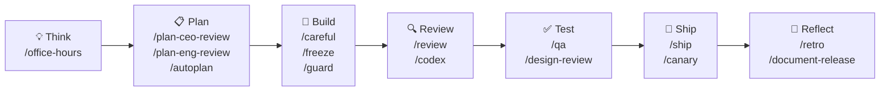

---
tags:
  - claude-code
  - gstack
  - 开发工作流
  - 最佳实践
created: 2026-05-12
aliases:
  - gstack手册
  - gstack最佳实践
---

# gstack 使用手册与最佳实践

## 前言

### gstack 是什么

gstack 是由 Garry Tan（Y Combinator President，拥有 20 年产品构建经验）设计的 Claude Code 工作流扩展套件。它提供 30+ 个专属 Skills，覆盖 CEO 决策、工程实现、设计评审、发布管理、QA 验收等多个角色视角，旨在将软件交付的各个环节标准化、可复用化。

与其他 Claude Code 扩展不同，gstack 的核心理念是**工作流编排**：它不只是给 AI 赋予角色扮演能力，而是为整个功能交付周期提供一套结构化的 Sprint 框架，让每一步操作都有明确的入口和退出条件。

### Sprint 方法论

gstack 将一次完整的功能交付抽象为七个阶段，形成一个可重复执行的 Sprint 循环：

| 阶段 | 目标 | 核心 Skills |
|------|------|-------------|
| **Think** | 产品需求对齐，澄清方向 | `/office-hours` |
| **Plan** | 多视角规划，生成任务清单 | `/plan-ceo-review`、`/plan-eng-review`、`/autoplan` |
| **Build** | 安全编码，防止意外破坏 | `/careful`、`/freeze`、`/guard` |
| **Review** | 代码审查，发现潜在问题 | `/review`、`/codex` |
| **Test** | 质量验收，覆盖功能与设计 | `/qa`、`/design-review` |
| **Ship** | 安全发布，支持灰度上线 | `/ship`、`/canary` |
| **Reflect** | 复盘闭环，沉淀经验 | `/retro`、`/document-release` |

每个阶段都有专属 Skill 作为入口，确保 AI 在正确的上下文与约束下工作，而不是随意发散。

### 与 Superpowers 的定位差异

市面上常见的两套 Claude Code 增强方案定位有所不同：

- **Superpowers** 偏向 **AI 角色扮演**：通过多 Agent 协作（Planner、Architect、TDD Guide、Code Reviewer 等），让不同"专家角色"分工完成任务，适合需要细粒度 Agent 编排的场景。
- **gstack** 偏向 **工作流编排**：以标准化 Sprint 流程为主线，每个 Skill 对应交付周期中的一个具体站点，适合追求交付节奏一致性的团队或个人。

两套工具各有侧重，并不互斥。可参考 [[Superpowers 使用手册与最佳实践]] 对照阅读，根据实际需求组合使用。

### 安装方式

一行命令即可完成安装，详见 [[gstack]]。

> [!tip] 建议先阅读 Sprint 总览
> 在深入各章节之前，建议先通过下方流程图理解七站 Sprint 的整体结构，再按需跳转到对应章节。

### Sprint 总览

---

## 核心旅程：七站 Sprint

### 第一站：/office-hours — 产品需求对齐

**一句话总结：写代码之前先做产品论证，/office-hours 充当 CEO 视角，帮你确认这个功能是否真的值得做。**

#### 为什么需要它

许多功能在动手实现后才发现"需求不清晰"或"用户不需要"，此时返工成本极高。`/office-hours` 的价值在于把这个澄清过程前置——在任何一行代码产生之前，先从产品角度回答：这个功能解决了什么真实问题？优先级在哪里？有没有更简单的替代方案？它模拟一位经验丰富的产品负责人，通过一系列结构化追问，帮你暴露需求中隐藏的盲点，避免"勤奋地做了错误的事"。

#### 怎么运作

在终端输入 `/office-hours` 即可触发。AI 会以产品负责人身份进入对话模式，围绕三个核心维度追问：

- **用户故事**：谁会用这个功能？他们的真实场景是什么？
- **优先级**：与现有需求相比，这个功能的紧迫程度如何？
- **替代方案**：有没有代价更低、覆盖场景更广的做法？

整个过程像是一次快速的产品评审，输出通常是一份精炼的需求确认摘要，为后续规划阶段提供输入。

#### 场景演示

小李准备为 Next.js Todo 应用添加"将 Todo 列表导出为 Markdown 文件"的功能，在编码前先触发 `/office-hours`：

> [!user] 小李
> 我想为 Todo 应用添加一个"导出为 Markdown"的功能，让用户可以把当前的任务列表下载成 `.md` 文件。

> [!agent] gstack /office-hours
> 好的，让我们先做一轮产品对齐。
>
> **用户故事**：谁会触发这个导出操作？是需要把任务同步到笔记软件（如 Obsidian）的用户，还是要把进度汇报给团队的项目负责人？两者的导出格式需求差异较大。
>
> **替代方案**：当前应用是否已有复制到剪贴板的功能？如果有，允许用户直接复制 Markdown 格式内容是否已能覆盖 80% 的场景，从而推迟"文件下载"这个更重的实现？
>
> **优先级**：在你的用户反馈中，这是被明确提出的诉求，还是你预判用户会需要的功能？

> [!user] 小李
> 主要场景是同步到 Obsidian 的用户，且用户在 GitHub Issue 里明确提出过这个请求。"复制到剪贴板"不够，他们需要持久保存的文件。

> [!agent] gstack /office-hours
> 需求已对齐。目标用户明确（Obsidian 用户），场景有用户验证，文件下载比剪贴板更符合持久化诉求。建议进入规划阶段。
>
> **需求摘要**：为已登录用户提供"导出当前 Todo 列表为 `.md` 文件"的按钮，导出格式遵循标准 Markdown 任务列表语法（`- [ ]` / `- [x]`），文件名默认为 `todos-{日期}.md`。

> [!tip] 最佳实践
> **可以跳过**：内部工具、一次性脚本、需求已由团队明确定义并写入文档的迭代任务。
>
> **必须做**：面向外部用户的新功能、你自己"想当然"认为有价值的想法、需求来源模糊的场景。规则很简单——如果你不能在 30 秒内清晰描述"谁在什么情境下会使用这个功能"，就先过一遍 `/office-hours`。

### 第二站：/plan-ceo-review + /plan-eng-review — 双视角规划

**一句话总结：商业可行性与工程可行性双重验证，确保"想做的"和"能做的"在同一频道上。**

#### 为什么需要它

需求对齐之后，最常见的下一个陷阱是：方案在技术上可以实现，但投入产出比极低；或者业务方非常期待，但工程侧低估了架构风险。`/plan-ceo-review` 和 `/plan-eng-review` 分别扮演两个检查角色——前者从 ROI、用户价值和商业风险角度审查方案是否值得投入；后者从技术方案、架构影响和工时估算角度审查能否安全落地。两个视角叠加，能在编码开始前发现"想法很好但代价过高"或"技术可行但风险未被识别"的问题。

#### 怎么运作

有两种触发方式：

- **手动两步**：先 `/plan-ceo-review`，输出 ROI 摘要和风险清单；再 `/plan-eng-review`，输出技术方案、受影响模块和工时预估。两步结果可以交叉参照，发现分歧点。
- **自动模式**：用 `/autoplan` 一键触发，系统会根据需求复杂度自动选择合适的规划深度，并汇总 CEO 与工程两个视角的输出，适合时间紧张或不确定从哪个维度入手的场景。

如果功能涉及 UI/UX 改动，还可以叠加 `/plan-design-review`，补充设计可行性验证。

#### 场景演示

小李基于第一站的需求摘要，触发双视角规划：

> [!agent] gstack /plan-ceo-review
> **ROI 评估**：目标用户（Obsidian 重度用户）留存价值高，该功能在 GitHub Issue 中有明确诉求，开发成本预估低（纯前端，无需后端改动），边际价值正向。
>
> **风险**：导出格式若与 Obsidian 不兼容，会产生负面反馈。建议在发布说明中明确支持的 Markdown 规范（GFM 任务列表）。
>
> **结论**：建议实现，优先级 P1。

> [!agent] gstack /plan-eng-review
> **技术方案**：使用浏览器原生 `Blob` + `URL.createObjectURL` 实现客户端文件下载，无需服务端接口变更。
>
> **受影响模块**：`TodoList` 组件（新增导出按钮）、`utils/export.ts`（新建导出逻辑）。核心 CRUD 逻辑无需改动。
>
> **工时预估**：实现 1.5h，测试 0.5h，合计约 2h。
>
> **风险**：需处理空列表边界情况；移动端浏览器对 `download` 属性支持不一致，需测试 iOS Safari。

> [!tip] 最佳实践
> **何时叠加 `/plan-design-review`**：功能涉及新页面、新交互组件或视觉风格改动时，三审联用——CEO 审价值、工程审可行性、设计审体验一致性。
>
> **何时用 `/autoplan` 代替手动两步**：当你对功能范围有基本判断但不确定从哪个维度切入时，`/autoplan` 能自动编排合适的审查组合，减少决策摩擦。简单功能（如纯样式微调）可直接 `/autoplan`，复杂功能建议手动两步以便深入追问。

### 第三站：编码阶段 — /careful 守护实现

**一句话总结：实现新功能时最大的风险是改坏已有功能，/careful 模式让每次修改都先确认影响范围再动手。**

#### 为什么需要它

AI 辅助编码的最大隐患不是"写不出代码"，而是"顺手改了不该改的地方"。在添加导出功能时，如果 AI 在重构 `TodoList` 组件的过程中顺手调整了 CRUD 相关逻辑，即使导出功能本身正确，也可能引入回归 bug。`/careful` 模式通过让 AI 在每次修改前先声明"我将修改哪些文件、原因是什么、影响范围是什么"，强制建立变更审计链，让开发者在确认后再执行，从而把"不小心改坏"的概率降到最低。

#### 怎么运作

gstack 提供了一组配合使用的编码保护指令：

- **`/careful`**：启动谨慎模式，AI 在每次文件修改前会先输出变更说明，等待确认后再执行
- **`/freeze <文件路径>`**：将指定文件标记为只读，AI 在该会话内不会对其进行任何修改
- **`/guard`**：对当前会话中的关键逻辑加保护标记，AI 修改相关区域前会额外提示
- **`/unfreeze <文件路径>`**：解除指定文件的冻结状态，恢复正常编辑权限

这四个指令共同构成一道"编码安全网"，尤其适合在存量代码较多、改动牵连面广的项目中使用。

#### 场景演示

小李进入编码阶段，先用 `/freeze` 保护核心逻辑，再用 `/careful` 模式实现新功能：

> [!user] 小李
> `/freeze src/hooks/useTodos.ts`
> `/freeze src/components/TodoItem.tsx`
> `/careful`
> 现在帮我实现 Markdown 导出功能，在 TodoList 顶部添加"导出"按钮。

> [!agent] gstack /careful
> 已进入谨慎模式。`useTodos.ts` 和 `TodoItem.tsx` 已冻结，本次不会触碰。
>
> **计划变更如下，请确认后执行：**
>
> 1. **新建** `src/utils/exportMarkdown.ts`：包含 `exportTodosAsMarkdown(todos)` 函数，将 Todo 数组序列化为 GFM 任务列表格式并触发浏览器下载
> 2. **修改** `src/components/TodoList.tsx`：在列表顶部新增"导出为 Markdown"按钮，调用上述工具函数
>
> 涉及文件共 2 个，核心 CRUD 逻辑未受影响。是否确认执行？

> [!user] 小李
> 确认。

> [!agent] gstack /careful
> 正在创建 `exportMarkdown.ts`……完成。
> 正在修改 `TodoList.tsx`……完成。
> 两处变更已应用，冻结文件未被修改。

> [!warning] 什么情况必须使用 /freeze
> **必须冻结**：
> - 核心业务逻辑文件（如数据 CRUD、状态管理 hooks）
> - 认证与权限模块
> - 已通过完整测试、当前 Sprint 不打算改动的稳定模块
>
> **可以省略**：新建文件、单元测试文件、样式文件、一次性脚本。如果整个功能都在新文件中实现，存量代码完全不涉及，则 `/careful` 和 `/freeze` 均可跳过。

### 第四站：/review — 代码审查

**一句话总结：自己写的代码有盲点，/review 从逻辑、安全、性能、可读性四个维度做系统性扫描，/codex 提供独立的第二意见。**

#### 为什么需要它

即使是经验丰富的开发者，在完成一段代码后也容易对自己的实现产生"熟悉性盲点"——边界条件漏测、隐式假设未文档化、性能问题被忽略。`/review` 的价值在于以局外人视角对刚写完的代码进行系统性扫描，覆盖逻辑正确性、安全边界、性能隐患和代码可读性四个维度，逐条输出可操作的问题和改进建议，而不是泛泛的"代码风格不错"。

#### 怎么运作

编码完成后，在当前会话中输入 `/review` 即可触发。AI 会基于本次变更的 diff 进行审查，按严重程度（Critical / High / Medium / Low）分级输出问题清单。

如果想获得独立的第二个视角，可以额外触发 `/codex`——它会调用另一个 AI 实例对同一段代码进行独立分析，避免单一视角的系统性偏差。两份审查结果对照阅读，对于复杂逻辑尤为有价值。

审查完成后，Critical 和 High 级别的问题在合并前必须修复，Medium 及以下可以权衡处理。

#### 场景演示

小李完成导出功能的编码，触发 `/review`：

> [!agent] gstack /review
> 本次审查范围：`src/utils/exportMarkdown.ts`、`src/components/TodoList.tsx`。
>
> **[High] 边界条件未处理**
> `exportMarkdown.ts` 第 12 行：当 `todos` 数组为空时，函数仍会生成并下载一个空的 `.md` 文件，用户体验不佳且浪费操作。建议在函数入口处判断空数组，提前返回并给出提示。
>
> **[Medium] 性能隐患**
> `TodoList.tsx` 中导出按钮的点击处理函数每次渲染都会重新创建，建议用 `useCallback` 包裹，避免子组件不必要的重渲染。
>
> **[Low] 文件名格式**
> 当前文件名为 `todos-{timestamp}.md`，时间戳为 Unix 毫秒数，可读性差。建议改为 `todos-YYYY-MM-DD.md` 格式。
>
> 未发现安全问题。建议修复 High 级别问题后再合并。

> [!tip] 何时使用 /codex 获取第二意见
> `/codex` 的使用时机：
> - **复杂算法**：排序、搜索、数据转换逻辑，需要验证边界行为
> - **安全相关代码**：认证、权限校验、输入校验，单一审查容易遗漏攻击面
> - **你自己也不确定的实现**：当你对某个实现方案有疑虑但说不清问题在哪里时，第二个 AI 的独立分析往往能点出你感觉到但没意识到的问题
>
> 对于简单的工具函数或样式调整，`/review` 一次即可，无需叠加 `/codex`。

### 第五站：/qa + /design-review — 质量验收

**一句话总结：功能正确性和设计一致性是两个独立维度，/qa 负责验收行为，/design-review 负责验收视觉。**

#### 为什么需要它

"代码审查通过"不等于"功能可以发布"。代码层面的审查关注的是实现质量，但用户感知的是行为和界面——空列表时导出按钮是否给出友好提示？新按钮的样式是否与现有设计语言一致？这两个问题需要专门的验收环节。`/qa` 通过生成并执行测试用例来验证功能行为，重点覆盖边界条件；`/design-review` 则从视觉和交互一致性角度检查，确保新功能不破坏现有的设计系统。

#### 怎么运作

- **`/qa`**：触发后，AI 会基于功能需求生成测试用例矩阵（正常路径 + 边界路径 + 异常路径），逐一执行验收，输出通过 / 失败清单及修复建议
- **`/design-review`**：AI 以设计评审者视角检查 UI 变更，关注颜色、间距、字体、交互反馈是否与设计规范一致
- **`/qa-only`**：跳过设计审查，仅执行功能验收，适合快速回归

#### 场景演示

小李完成代码修复（修复了 /review 发现的空数组 bug），进入质量验收阶段：

> [!user] 小李
> `/qa`

> [!agent] gstack /qa
> **测试用例矩阵 — 导出为 Markdown 功能**
>
> | 用例 | 前置条件 | 期望行为 | 状态 |
> |------|---------|---------|------|
> | 正常导出 | Todo 列表有 3 条记录 | 下载 `todos-2026-05-12.md`，内容为 GFM 任务列表 | ✅ 通过 |
> | 空列表 | Todo 列表为空 | 按钮禁用或点击后提示"暂无任务可导出" | ✅ 通过（已修复）|
> | 特殊字符 | Todo 内容含 `|`、`[`、`\` | 导出文件中字符被正确转义 | ❌ 失败：`|` 未转义 |
> | iOS Safari | 移动端浏览器 | 触发文件下载或给出兼容性提示 | ⚠️ 待测试 |
>
> 发现 1 个失败用例，建议修复特殊字符转义后再进入发布阶段。

> [!agent] gstack /design-review
> 导出按钮位置（Todo 列表顶部右侧）与现有"添加 Todo"按钮对称，视觉层级合理。
>
> **发现 1 个不一致项**：按钮使用了 `variant="outline"`，但现有操作按钮均为 `variant="ghost"`，建议统一为 `ghost` 以保持设计系统一致性。

> [!tip] 何时使用 /qa-only
> `/qa-only` 适合以下场景：
> - **hotfix**：只修了一个已知 bug，不涉及 UI 变更，跳过设计审查直接验收功能
> - **小改动回归**：修改了某个工具函数，只需确认关联功能不受影响
> - **CI 流水线中的快速门**：在自动化流程中嵌入轻量级验收

### 第六站：/ship + /canary — 安全发布

**一句话总结：/ship 是发布前的最后检查清单，/canary 是灰度上线的安全网，两者结合把发布风险降到最低。**

#### 为什么需要它

功能通过 QA 并不意味着可以直接推到生产。发布是风险最集中的节点——环境变量配置错误、数据库迁移未执行、依赖版本不匹配，任何一个遗漏都可能导致线上故障。`/ship` 通过结构化检查清单强制覆盖这些容易遗漏的发布前置条件；`/canary` 在全量发布前先将变更推给小比例用户，观察关键指标（错误率、延迟、转化率）无异常后再全量，把潜在故障的影响面压缩到最小。

#### 怎么运作

- **`/ship`**：触发后输出发布检查清单，逐项确认：测试全部通过？环境变量已配置？数据库迁移脚本已准备？回滚方案是否明确？检查清单全部通过后，触发部署流程
- **`/canary`**：在 `/ship` 完成基础部署后，将变更路由到 5%–10% 的用户，设置观测窗口（通常 15–30 分钟），指标无异常则自动扩大到全量

#### 场景演示

小李修复完 QA 发现的特殊字符转义问题，准备发布：

> [!user] 小李
> `/ship`

> [!agent] gstack /ship
> **发布前检查清单**
>
> - [x] 所有测试通过（/qa 验收完成，特殊字符转义已修复）
> - [x] 代码审查通过（/review + /codex 均已完成）
> - [x] 环境变量检查：`NEXT_PUBLIC_*` 变量均已在 Vercel 配置
> - [x] 无数据库 schema 变更，无需迁移
> - [x] 回滚方案：Vercel 一键回滚到上一部署版本
> - [x] 版本号已更新（`package.json` v1.2.1）
>
> 所有检查项通过，可以发布。触发部署中……

> [!tip] 何时需要 /canary，何时可以直接 /ship
> **需要 /canary 的场景**：
> - 改动涉及数据库 schema 或数据迁移
> - 功能会影响高流量路径（首页、支付流程、登录）
> - 发布后无法快速回滚（如涉及第三方服务集成）
>
> **可以直接 /ship 的场景**：
> - 内部工具或低流量功能
> - 纯前端样式调整，无状态变更
> - 已在 staging 环境充分验证的小改动

### 第七站：/retro — 复盘闭环

**一句话总结：Sprint 的终点不是发布，而是复盘——/retro 把这次学到的固化成下次的起点，让每个 Sprint 都比上一个更顺。**

#### 为什么需要它

没有复盘的 Sprint 是孤立的，有复盘的 Sprint 是螺旋上升的。`/retro` 的价值不在于"检查做没做对"，而在于"把隐性知识显性化"——这次遇到的 iOS Safari 兼容问题，下次发布时应该在 QA 阶段提前测试；这次用 `/freeze` 保护了核心逻辑省去了很多麻烦，下次类似功能也应该默认 freeze。这些经验如果不显性化，就会在下一个 Sprint 中重新踩坑。

#### 怎么运作

Sprint 结束后输入 `/retro`，AI 会生成一份结构化复盘报告，格式为：

- **What went well**：本次 Sprint 中效果好的实践，值得保留和推广
- **What to improve**：暴露的问题或低效环节，下次需要改进
- **Action items**：具体的改进行动，带有明确的执行时机

配合 `/document-release` 使用，可以将发布决策（为什么选了 Blob 方案、为什么优先级定 P1）以结构化形式存档，方便日后回溯。

#### 场景演示

Markdown 导出功能上线后，小李运行 `/retro`：

> [!agent] gstack /retro
> **Sprint 复盘 — Markdown 导出功能（2026-05-12）**
>
> **What went well**
> - `/office-hours` 提前发现了"剪贴板 vs 文件下载"的方案权衡，避免了实现方向错误
> - `/freeze` 保护核心 CRUD 逻辑，整个 Sprint 零回归 bug
> - `/plan-eng-review` 提前识别了 iOS Safari 兼容风险（虽然本次未完全覆盖）
>
> **What to improve**
> - QA 阶段缺少移动端测试，iOS Safari 兼容性验收被标记为"待测试"
> - 特殊字符转义问题在 `/review` 阶段未被发现，直到 `/qa` 才暴露，说明 `/review` 的测试用例覆盖不够
>
> **Action items**
> - 下次 `/qa` 时默认添加"特殊字符"测试用例
> - 为项目建立移动端测试设备清单，纳入 `/qa` 标准检查项

> [!tip] 用复盘结果喂给下一个 Sprint
> `/retro` 的 Action items 不要只停留在文档里。下一个 Sprint 开始时，把上次复盘的改进项带入 `/office-hours` 的讨论——"上次我们发现 QA 缺少移动端测试，这次的功能需要覆盖吗？"让复盘真正形成闭环。

---

## 进阶篇

### 并行 Sprint：Conductor 模式

**Conductor 模式**是指同时开启 10-15 个独立的 Claude Code 会话，每个会话作为一个 Sprint 处理一个互不依赖的子任务，由你（或专职的 Conductor 会话）统一协调进度并合并结果。

**任务切分原则**：子任务之间必须没有代码依赖。理想的切分粒度是**不同功能模块**——例如，认证模块、支付模块、通知模块可以并行，但同一模块的前端和后端如果共享接口定义，则不应拆开并行。

**Conductor 角色职责**：

- 分发任务、追踪各 Sprint 进度
- 在各 Sprint 完成后合并代码分支
- 识别并解决潜在的合并冲突

> [!warning] 任务切分不当会导致大量合并冲突
> 如果两个并行 Sprint 修改了相同的文件或接口，合并时会产生大量冲突，反而降低效率。建议**先在单 Sprint 中熟练整套流程**，再尝试 Conductor 模式。

### 设计流水线

当功能涉及明显的 UI 变化时（新页面、新组件、视觉改版），建议走完整的**三段式设计流水线**：

| 阶段 | Skill | 目标 |
|------|-------|------|
| 发散 | `/design-shotgun` | 快速生成多个风格迥异的设计方案，避免过早锁定一个方向 |
| 原型 | `/design-html` | 将选定方案输出为可在浏览器中交互的 HTML 原型，便于提前验收视觉细节 |
| 审查 | `/design-review` | 多视角审查方案的可用性、一致性与实现可行性 |

**何时启动完整流水线**：功能需求中有"新增页面"、"重构组件"、"UI 改版"等关键词时，在进入 Build 阶段前先走一遍设计流水线，可以大幅减少返工。

> [!tip] 纯后端改动可跳过设计流水线
> 如果本次改动只涉及接口、数据库、定时任务等纯后端逻辑，无 UI 变化，直接从 `/careful` 开始 Build 阶段即可，无需启动设计流水线。

### GBrain 持久记忆

**GBrain** 是基于 MCP 的项目知识库，让 Claude Code 跨会话记住项目上下文——架构决策、代码约定、已知 Bug 和规避方式、团队偏好等信息在 Sprint 之间持久保存，不再因会话结束而丢失。

**初始化**：首次使用时运行 `/setup-gbrain`，完成 MCP 服务器连接与知识库创建。

**同步**：每次 Sprint 结束时运行 `/sync-gbrain`，将本次 Sprint 中产生的决策、约定、架构变更同步写入 GBrain。

**适合存入 GBrain 的内容**：

- 重要的架构决策及其背景原因
- 项目特有的代码约定（命名规范、目录结构等）
- 已知 Bug 及临时规避方式
- 团队或个人的技术偏好

> [!note] GBrain 需要额外配置 MCP 服务器
> 使用前请确认已完成 MCP 服务器配置，详见 [[gstack]]。

### /investigate 深度调查

`/investigate` 与 `/review` 的定位不同：**`/review` 是代码审查**，关注代码质量与潜在问题；**`/investigate` 是深度调查**，针对特定问题（性能瓶颈、神秘 Bug、复杂依赖链）进行专项分析，输出根因与改进建议。

**适合场景**：

- 某个接口响应变慢，但不知道瓶颈在哪
- 某个 Bug 复现概率低但影响大，需要系统性地追溯原因
- 依赖关系复杂，需要梳理调用链或数据流

> [!tip] 调查前先用 /freeze 锁定相关文件
> 在调查过程中，如果 Claude Code 同时修改被调查的代码，会干扰分析结果。建议在运行 `/investigate` 之前，用 `/freeze` 锁定相关文件，待调查结论出来后再解锁修改。

### /cso 安全审查

`/cso`（Chief Security Officer）让 Claude Code 以首席安全官视角对代码进行专项安全审查，重点识别高危漏洞与安全设计缺陷。

**触发时机**——以下场景出现时必须运行 `/cso`：

- 认证 / 授权逻辑变更
- 涉及用户隐私数据的处理
- 支付或金融交易相关代码
- 文件上传 / 下载功能
- 外部 API 调用与第三方集成

**与 `common/security` 规则配合**：`common/security` 规则在流程层面约束安全行为（如禁止硬编码密钥、强制输入校验），`/cso` 在代码层面做逐行审查，两者互补，不可替代。

> [!warning] 安全问题必须在 /ship 前解决
> `/cso` 发现的 HIGH 级及以上安全问题，必须在进入 `/ship` 发布阶段前全部修复。不允许携带已知高危安全漏洞发布代码。

### /learn 跨会话学习

`/learn` 将本次 Sprint 中 Claude Code 学到的内容——你的代码风格偏好、项目特有模式、反复出现的约定——写入长期记忆，使后续会话中 AI 的行为更贴合你的习惯。

**与 GBrain 的区别**：

- `/learn` 偏向 **AI 学习你的风格**：记录你偏好的代码组织方式、命名习惯、常用技术栈选择等个人风格信息。
- `/sync-gbrain` 偏向 **存储项目知识**：记录架构决策、接口约定、模块职责等客观的项目信息。

**最佳实践**：每次 Sprint 结束时，依次执行 `/learn` 和 `/sync-gbrain`，双重固化本次 Sprint 的学习成果，确保个人风格与项目知识都得到沉淀。

---

## 附录

### 技能速查

按 Sprint 阶段分组的完整技能速查：

```mermaid
flowchart TD
    subgraph Think["💡 Think"]
        A1["/office-hours\n产品需求对齐"]
    end
    subgraph Plan["📋 Plan"]
        B1["/plan-ceo-review\nCEO 视角审查"]
        B2["/plan-eng-review\n工程视角审查"]
        B3["/plan-design-review\n设计视角审查"]
        B4["/autoplan\n自动选择规划模式"]
    end
    subgraph Build["🔨 Build"]
        C1["/careful\n谨慎编码模式"]
        C2["/freeze\n锁定关键文件"]
        C3["/guard\n保护关键逻辑"]
        C4["/unfreeze\n解除锁定"]
    end
    subgraph Review["🔍 Review"]
        D1["/review\n代码审查"]
        D2["/codex\n第二意见"]
        D3["/investigate\n深度调查"]
        D4["/cso\n安全审查"]
    end
    subgraph Test["✅ Test"]
        E1["/qa\n功能验收"]
        E2["/qa-only\n快速回归"]
        E3["/design-review\n设计审查"]
        E4["/design-shotgun\n多方案发散"]
        E5["/design-html\nHTML 原型"]
    end
    subgraph Ship["🚀 Ship"]
        F1["/ship\n发布预检"]
        F2["/canary\n灰度上线"]
        F3["/land-and-deploy\n部署落地"]
        F4["/benchmark\n性能基准"]
    end
    subgraph Reflect["🔄 Reflect"]
        G1["/retro\nSprint 复盘"]
        G2["/document-release\n发布文档"]
        G3["/learn\n跨会话学习"]
        G4["/sync-gbrain\n同步知识库"]
    end
    Think --> Plan --> Build --> Review --> Test --> Ship --> Reflect
```

**辅助技能**（不属于特定 Sprint 阶段）：

| Skill | 用途 |
|-------|------|
| `/office-hours` | 任何时候需要产品视角时均可触发 |
| `/browse` | 需要浏览网页内容时使用 |
| `/setup-gbrain` | 首次初始化 GBrain 知识库 |
| `/gstack-upgrade` | 升级 gstack 到最新版本 |
| `/connect-chrome` | 连接本地 Chrome 实例 |

### 与 Superpowers 对照

| 维度 | gstack | Superpowers |
|------|--------|-------------|
| **核心理念** | 工作流编排（Sprint 流程标准化） | 角色扮演（多 Agent 专家协作） |
| **主要入口** | Sprint 阶段 Skills（/office-hours、/ship 等） | 专家角色 Skills（Planner、Architect、TDD Guide 等） |
| **适合场景** | 追求交付节奏一致性、需要标准化流程的团队 | 需要细粒度 Agent 编排、灵活组合专家角色的个人 |
| **并行能力** | Conductor 模式（10-15 个并行 Sprint） | 多 Agent 并行任务处理 |
| **知识持久化** | GBrain（MCP 知识库） + /learn | 依赖会话上下文，无内置持久化机制 |
| **安全保障** | /careful + /freeze + /guard + /cso | security-reviewer Agent |
| **学习曲线** | 较低（流程线性，按站点操作即可） | 中等（需理解各 Agent 职责与组合方式） |
| **场景对照** | 本手册：Next.js Todo + Markdown 导出 | 参见 [[Superpowers 使用手册与最佳实践]] |

> [!note] 两者并不互斥
> gstack 的 Sprint 框架与 Superpowers 的 Agent 角色可以组合使用——在 gstack 的 Build 阶段引入 Superpowers 的 TDD Guide Agent，在 /review 阶段引入 Code Reviewer Agent，能获得更细粒度的辅助。

### FAQ

**Q：每次 Sprint 都必须走完所有七站吗？**

不必要。七站是完整流程，实际操作时可以根据改动规模裁剪。以下是常见的裁剪策略：

- **小改动（bug fix、样式微调）**：跳过 /office-hours 和规划阶段，直接 /careful → /review → /qa-only → /ship
- **内部工具迭代**：可省略 /canary，直接 /ship
- **紧急 hotfix**：/careful → /review → /ship，/retro 事后补做

**Q：/careful 会让编码速度变慢吗？**

会有轻微影响——每次变更前多一个确认步骤。但这个开销在存量代码较多的项目中是值得的，因为回归 bug 的修复成本远高于每次多点一次确认。对于全新文件（无存量代码影响），可以不启用 /careful。

**Q：GBrain 和 /learn 必须用吗？**

对于单人短期项目，非必须。GBrain 和 /learn 的价值在长期项目和多 Sprint 积累中逐渐显现——当项目持续数周、Sprint 数量超过 5 个后，跨会话记忆带来的效率提升会非常明显。

**Q：/investigate 和 /review 什么时候用哪个？**

- 刚写完代码，想系统性地检查质量 → **`/review`**
- 遇到具体问题（变慢了、某个 bug 找不到原因）→ **`/investigate`**

**Q：gstack 和 Claude Code 原生功能如何配合？**

gstack Skills 是对 Claude Code 原生能力的工作流封装，两者在同一个会话中无缝协作。在任何 Skill 执行过程中，你都可以直接输入自然语言指令，Claude Code 会保持当前 Skill 的上下文继续工作。

## 相关笔记

- [["gstack 深度解析：设计哲学与技术架构"]]
- [["gstack：Garry Tan 的 Claude Code 工作流"]]
- [[Superpowers + gstack 联合工作最佳实践]]
- [[gstack 使用手册设计规格]]
- [[最佳实践]]
