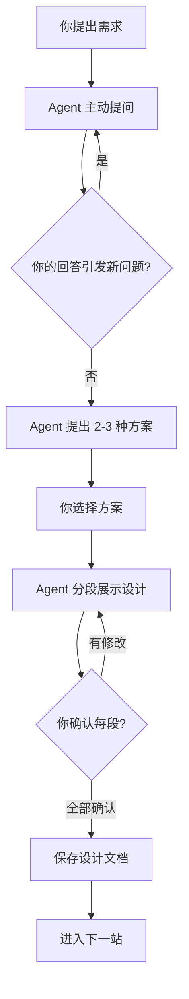

## 引言：为什么需要方法论

你有没有经历过这样的场景：让 AI Agent 帮你写个功能，它二话不说直接开写，写到一半发现理解错了需求，删了重来；或者写完了才想起来没写测试，补测试的时候又改了实现逻辑；又或者在一个分支上同时改三个功能，最后 merge 的时候一团糟。

这些问题不是 Agent 的能力问题——是**方法论**的缺失。

Superpowers 是一套构建在编码 Agent 之上的**软件开发方法论**。它把 Jesse Vincent 多年的 Agent 协作经验提炼成 14 个可自动触发的 skill（技能），让 Agent 从"我说你做"变成一个有纪律的工程搭档。

核心理念用三句话概括：

- **流程优于猜测** — Agent 不会跳过设计直接写代码
- **证据优于断言** — 没有测试通过就不算完成
- **隔离优于混合** — 每个功能在独立工作区开发

> [!tip] 这篇手册适合谁？
> 已经会用 Claude Code（或其他编码 Agent），想通过 Superpowers 提升开发质量和效率的开发者。如果你还没用过编码 Agent，建议先熟悉基本操作再回来。

> 相关笔记：[[Superpowers：我在 2025 年 10 月如何使用编码代理]] — 了解 Superpowers 的诞生背景和设计哲学

## 安装与快速验证

> [!info] 完整安装步骤
> 本文只覆盖 Claude Code 平台。其他平台（Codex、Gemini CLI、Cursor 等）的安装方式请参考 [[Superpowers README]]。

在 Claude Code 中执行：

```bash
/plugin marketplace add obra/superpowers-marketplace
/plugin install superpowers@superpowers-marketplace
```

退出并重启 `claude`。

**验证安装成功：** 启动新会话后，你应该看到类似这样的注入提示：

```
<session-start-hook><EXTREMELY_IMPORTANT>
You have Superpowers.
```

也可以通过 `/plugins` 命令查看已安装插件列表，确认 Superpowers 处于启用状态。

> [!warning] 已废弃的用法
> 早期版本需要手动输入 `/superpowers:brainstorm` 等斜杠命令。现在 skill 会根据上下文自动触发，不需要手动调用。

## 场景：给 Todo 应用添加导出功能

接下来的六章，我们会跟随一个完整场景走完 Superpowers 的核心工作流。

**场景设定：** 你有一个 Next.js 写的 Todo 应用，用 Prisma + PostgreSQL 存储数据。你想加一个功能：用户可以把待办事项导出为 Markdown 文件。

为什么选这个场景？

- 简单到你能快速理解需求，不需要懂业务领域
- 涉及前后端（API 路由 + 下载按钮），能展示完整开发链路
- 有设计决策空间（导出全部还是筛选？即时下载还是生成后通知？），正好让 brainstorming skill 发挥作用

准备好了吗？出发。

## 第 1 站：头脑风暴（brainstorming）

### 为什么需要这一站

没有 Superpowers 的时候，你跟 Agent 说"加个导出功能"，它大概率直接开始写代码了。写完你一看，导出格式是 CSV 而不是 Markdown，而且没有处理空列表的情况。你让它改，它改了，但改的过程中又把别的地方弄坏了。

问题出在哪？**它跳过了最重要的步骤——搞清楚到底要做什么。**

brainstorming skill 强制 Agent 在写任何代码之前，先通过提问打磨需求，然后分段展示设计方案供你确认。它的硬性规则是：

> 你不能在获得设计批准之前写任何代码。无论项目看起来多简单。

### 怎么运作



关键行为：

1. **一次只问一个问题** — 不会甩给你一屏十个问题
2. **提供选项而非开放问题** — 能用多选就不用问答
3. **提出 2-3 种方案** — 每种带权衡分析和推荐理由
4. **分段确认** — 每段设计短到你能真正读完
5. **保存设计文档** — 写入 `docs/superpowers/specs/` 目录

### 场景演示

> [!user] 你
> 我想给 Todo 应用加一个导出功能，用户可以把待办事项导出为 Markdown 文件

> [!agent] Agent
> 好主意。在我开始设计之前，有几个问题想确认：
>
> 导出的范围是什么？
> A) 全部待办事项
> B) 支持按状态筛选（仅已完成 / 仅待办）
> C) 支持按标签筛选
>
> 我推荐 B，因为"全部导出"可以看作筛选条件为空时的特例，实现成本几乎相同，但灵活性更高。

> [!user] 你
> B，按状态筛选就行

> [!agent] Agent
> 明白了。第二个问题：导出的触发方式？
>
> A) 点击按钮即时下载
> B) 后台生成，完成后通知用户下载
>
> 我推荐 A。Todo 应用的数据量通常不大，即时下载体验更好。如果未来数据量增长到需要后台生成，可以再迁移。

> [!user] 你
> A，即时下载

> [!agent] Agent
> 好的。基于以上确认，我准备设计这个功能。让我展示第一部分——API 设计：

**API 路由：** `GET /api/todos/export?status=all|completed|pending`

**响应格式：**
```
Content-Type: text/markdown
Content-Disposition: attachment; filename="todos-2026-05-12.md"
```

这部分看起来对吗？

> [!user] 你
> 没问题

> [!agent] Agent
> 第二部分——前端组件：

在 TodoList 页面的操作栏添加一个下拉按钮，包含三个选项：
- "导出全部"
- "导出已完成"
- "导出待办"

默认状态是禁用（列表为空时）。

> [!user] 你
> 可以

> [!agent] Agent
> 设计完成。我把完整 spec 保存到 `docs/superpowers/specs/2026-05-12-todo-export.md`，然后进入下一阶段。

### 最佳实践

> [!best-practice] 人类 Partner 的角色
> - **不要一次说完所有需求** — 让 Agent 逐个提问，这能帮你自己理清模糊的想法
> - **认真对待方案选择** — Agent 给出的 2-3 个选项通常有真实的权衡，不是随便列的
> - **逐段确认** — 每段设计都在 200 字以内，读完再确认，不要扫一眼就过

> [!caution] 常见陷阱
> - **跳过 brainstorming 直接让 Agent 写代码** — 这是 Superpowers 最常见的误用。即使需求很简单，brainstorming 也能发现你没考虑到的边界情况
> - **给模糊的回答** — "都行"、"你看着办" 会让 Agent 做出你意想不到的假设。如果真的没偏好，告诉它为什么没偏好
> - **在 design 还没确认时就说 "开始写代码"** — Agent 会遵守硬性规则拒绝你，但如果你坚持，它会退让。别这么做

> [!tip] 多大的项目需要 brainstorming？
> **所有项目。** Superpowers 明确指出："This is too simple to need a design" 是最大的反模式。即使是一行改动，brainstorming 也能确保理解正确。
