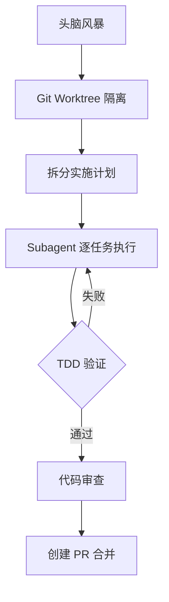

字数：1050

## 为什么选 Superpowers

与其他 spec-driven development 框架（GSD、SpecKit、BDD）相比，[[Superpowers]] 的最大卖点是 **TDD（测试驱动开发）**：

1. 先写测试，明确期望
2. 实现代码让测试通过
3. 重构优化，循环直到无需再改

> [!tip] 核心差异
> 先设定规则和期望，再动手实现。避免"写了半天不知道目标是啥"的窘境。

## 完整开发工作流



1. **头脑风暴** — 与 Agent 对话澄清需求，Agent 会主动提问、生成 UI mockup 供选择
2. **Git Worktree** — 将开发隔离到独立环境，支持同一项目并行多任务
3. **拆分计划** — 将 spec 转为具体任务列表，每个任务含测试文件和实现步骤
4. **Subagent 执行** — 每个任务分派给独立 subagent（避免 context rot），逐任务完成
5. **TDD 验证** — 每步先写失败测试 → 实现 → 测试通过 → 提交
6. **代码审查** — 全部任务完成后自动审查，发现 Critical/Important 问题并派 fix agent 修复
7. **PR 合并** — 审查通过后创建 Pull Request 合并到主分支

## 安装

在 [[Claude Code]] 中运行：

```bash
/plugin marketplace add obra/superpowers-marketplace
/plugin install superpowers@superpowers-marketplace
```

安装后通过 `plugins` 命令管理，可在 Install 标签页确认 [[Superpowers]] 已启用。

> [!warning] 已废弃命令
> `/superpowers:write-plan`、`/superpowers:brainstorm` 等斜杠命令已废弃，应直接触发 [[Superpowers]] 附带的 skills（如 brainstorm skill）。

## 实战演示：Bookworm.ai Google Drive 重新同步

### 需求

在已有应用 [Bookworm.ai](https://bookero.ai) 上添加功能：当用户向已连接的 Google Drive 文件夹添加新文件（银行对账单、收据）时，可以重新同步这些文件夹，自动导入新文件。

### 流程

1. **触发 brainstorm skill** — 粘贴 Jira ticket 链接，Agent 分析需求并探索现有架构
2. **UI 方案选择** — Agent 生成 HTML mockup 页面（三选一），作者选择"下拉分割按钮"方案
3. **生成 spec** — Agent 在 `docs/` 下创建完整规格文档，包含：
   - 上下文与设计决策
   - 架构布局（用户操作流程）
   - API 路由与查询参数
   - 新增组件列表
   - 边界情况与处理方式
   - 验收标准
4. **拆分[[实施计划]]** — 将 spec 转为 11 个任务，每个任务包含：
   - 要修改的文件
   - 测试用例（先写）
   - 实现步骤（后写）
   - 每步带 checkbox 可审查
5. **执行方式选择**：
   - **Subagent 驱动**（推荐）— 每个任务派给独立 subagent，任务间可审查
   - **内联执行** — 在当前会话中批量执行，带检查点
6. **自动代码审查** — 11 个任务全部完成后，触发 code-review skill 全局审查，发现并修复问题
7. **冒烟测试** — 手动验证：上传新文件到 Google Drive → 点击"同步已连接文件夹" → 6 个文件全部成功导入

## 关键设计点

| 设计 | 作用 |
|------|------|
| 每任务独立 subagent | 避免 context window 污染，提高准确性 |
| Git Worktree 隔离 | 支持同一项目并行开发，互不干扰 |
| 强制 TDD | 先测试后实现，保证代码质量和覆盖率 |
| 自动代码审查 | 实现后立即审查修复，减少人工审查负担 |

## 相关笔记

- [[Superpowers README]]
- [[Superpowers：我在 2025 年 10 月如何使用编码代理]]
